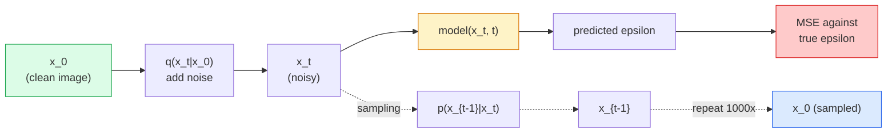

# 图像生成 —— 扩散模型

> 扩散模型学的是去噪。训练它从一张带噪图像里去掉一点点噪声,把这个过程倒着重放一千次,你就得到了一个图像生成器。

**类型:** 动手构建
**编程语言:** Python
**前置要求:** 第 4 阶段第 07 课(U-Net)、第 1 阶段第 06 课(概率)、第 3 阶段第 06 课(优化器)
**预计耗时:** 约 75 分钟

## 学习目标

- 推导前向加噪过程 `x_0 -> x_1 -> ... -> x_T`,并解释为什么对任意 t 都有闭式解 `q(x_t | x_0)`
- 实现 DDPM 风格的训练目标(回归每一步加入的噪声),以及一个从纯噪声走回图像的采样器
- 构建一个时间条件化的 U-Net(小到能在 CPU 上训练),预测任意时间步的噪声
- 解释 DDPM 与 DDIM 采样的区别及各自适用场景(第 23 课会深入讲 flow matching 和 rectified flow)

## 问题

GAN 的生成是一锤子买卖:噪声进,图像出,一次前向。快,但难训。扩散模型的生成是迭代式的:从纯噪声出发,一小步一小步去噪,图像逐渐浮现。慢,但好训。过去五年,后一个属性占据了统治地位:任何小团队都能训出一个扩散模型并拿到像样的样本;而 GAN 训练是一门要靠数年失败 run 才能练成的手艺。

除了训练稳定,扩散的迭代结构正是现代图像生成一切能力的来源:文本条件、局部重绘(inpainting)、图像编辑、超分辨率、可控风格。采样循环的每一步,都是一个可以注入新约束的钩子。这就是为什么 Stable Diffusion、Imagen、DALL-E 3、Midjourney,以及你将用到的每一个可控图像模型,全都基于扩散。

本课构建最小可用的 DDPM:前向加噪、反向去噪、训练循环。下一课(Stable Diffusion)会把它接入生产系统,配上 VAE、文本编码器和 classifier-free guidance。

## 概念

### 前向过程

取一张图像 `x_0`,加一点点高斯噪声得到 `x_1`,再加一点点得到 `x_2`。重复 T 步,直到 `x_T` 与纯高斯噪声几乎无法区分。

```
q(x_t | x_{t-1}) = N(x_t; sqrt(1 - beta_t) * x_{t-1},  beta_t * I)
```

`beta_t` 是一个很小的方差调度,通常在 T=1000 步内从 0.0001 线性增长到 0.02。每一步都轻微压缩信号、注入新噪声。

### 闭式跳转

一步加噪是一条马尔可夫链,但数学上可以直接折叠:从 `x_0` 一步采样出 `x_t`。

```
Define alpha_t = 1 - beta_t
Define alpha_bar_t = prod_{s=1..t} alpha_s

Then:
  q(x_t | x_0) = N(x_t; sqrt(alpha_bar_t) * x_0,  (1 - alpha_bar_t) * I)

Equivalently:
  x_t = sqrt(alpha_bar_t) * x_0 + sqrt(1 - alpha_bar_t) * epsilon
  where epsilon ~ N(0, I)
```

这一个等式,就是扩散模型实用的全部原因。训练时随机选一个 `t`,直接从 `x_0` 一步采出 `x_t` 来训练——完全不需要模拟整条马尔可夫链。

### 反向过程

前向过程是固定的。神经网络要学的是反向过程 `p(x_{t-1} | x_t)`。扩散模型并不直接预测 `x_{t-1}`,而是预测第 t 步加入的噪声 `epsilon`,再由数学推导出 `x_{t-1}`。



### 训练损失

每个训练步:

1. 采一张真实图像 `x_0`。
2. 从 [1, T] 均匀采一个时间步 `t`。
3. 采噪声 `epsilon ~ N(0, I)`。
4. 计算 `x_t = sqrt(alpha_bar_t) * x_0 + sqrt(1 - alpha_bar_t) * epsilon`。
5. 用网络预测 `epsilon_theta(x_t, t)`。
6. 最小化 `|| epsilon - epsilon_theta(x_t, t) ||^2`。

就这么多。神经网络学会预测任意时间步的噪声,损失是 MSE。没有对抗博弈,没有崩塌,没有振荡。

### 采样器(DDPM)

生成时:从 `x_T ~ N(0, I)` 出发,一步一步往回走。

```
for t = T, T-1, ..., 1:
    eps = model(x_t, t)
    x_{t-1} = (1 / sqrt(alpha_t)) * (x_t - (beta_t / sqrt(1 - alpha_bar_t)) * eps) + sqrt(beta_t) * z
    where z ~ N(0, I) if t > 1, else 0
return x_0
```

关键在于:虽然一般情况下反向条件分布没有闭式解,但对这种特定的高斯前向过程,它有。那些看着别扭的系数,正是贝叶斯公式给出的结果。

### 为什么是 1000 步

前向噪声调度的设计原则:每步加的噪声刚好让反向步近似高斯。步数太少,反向步就远离高斯,网络学不好;步数太多,采样变贵而收益递减。T=1000 加线性调度是 DDPM 的默认配置。

### DDIM:快 20 倍的采样

训练不变,采样变。DDIM(Song et al., 2020)定义了一个确定性的反向过程,不用重训就能跳过时间步。50 步 DDIM 采样就能接近 1000 步 DDPM 的质量。所有生产系统都在用 DDIM 或更快的变体(DPM-Solver、Euler ancestral)。

### 时间条件化

网络 `epsilon_theta(x_t, t)` 需要知道自己在给哪个时间步去噪。现代扩散模型通过正弦时间嵌入注入 `t`(与 Transformer 的位置编码同理),加到 U-Net 每一层的特征图上。

```
t_embedding = sinusoidal(t)
feature_map += MLP(t_embedding)
```

不做时间条件化,网络就得从图像本身猜噪声水平——也行,但样本效率低得多。

```figure
cv-diffusion-image
```

## 动手构建

### 第 1 步:噪声调度

```python
import torch

def linear_beta_schedule(T=1000, beta_start=1e-4, beta_end=2e-2):
    return torch.linspace(beta_start, beta_end, T)


def precompute_schedule(betas):
    alphas = 1.0 - betas
    alphas_cumprod = torch.cumprod(alphas, dim=0)
    return {
        "betas": betas,
        "alphas": alphas,
        "alphas_cumprod": alphas_cumprod,
        "sqrt_alphas_cumprod": torch.sqrt(alphas_cumprod),
        "sqrt_one_minus_alphas_cumprod": torch.sqrt(1.0 - alphas_cumprod),
        "sqrt_recip_alphas": torch.sqrt(1.0 / alphas),
    }

schedule = precompute_schedule(linear_beta_schedule(T=1000))
```

预计算一次,训练和采样时按下标取用。

### 第 2 步:前向扩散(q_sample)

```python
def q_sample(x0, t, noise, schedule):
    sqrt_a = schedule["sqrt_alphas_cumprod"][t].view(-1, 1, 1, 1)
    sqrt_one_minus_a = schedule["sqrt_one_minus_alphas_cumprod"][t].view(-1, 1, 1, 1)
    return sqrt_a * x0 + sqrt_one_minus_a * noise
```

一行闭式解。`t` 是一批时间步,批次里每张图一个。

### 第 3 步:一个迷你时间条件 U-Net

```python
import torch.nn as nn
import torch.nn.functional as F
import math

def timestep_embedding(t, dim=64):
    half = dim // 2
    freqs = torch.exp(-math.log(10000) * torch.arange(half, device=t.device) / half)
    args = t[:, None].float() * freqs[None]
    emb = torch.cat([args.sin(), args.cos()], dim=-1)
    return emb


class TinyUNet(nn.Module):
    def __init__(self, img_channels=3, base=32, t_dim=64):
        super().__init__()
        self.t_mlp = nn.Sequential(
            nn.Linear(t_dim, base * 4),
            nn.SiLU(),
            nn.Linear(base * 4, base * 4),
        )
        self.t_dim = t_dim
        self.enc1 = nn.Conv2d(img_channels, base, 3, padding=1)
        self.enc2 = nn.Conv2d(base, base * 2, 4, stride=2, padding=1)
        self.mid = nn.Conv2d(base * 2, base * 2, 3, padding=1)
        self.dec1 = nn.ConvTranspose2d(base * 2, base, 4, stride=2, padding=1)
        self.dec2 = nn.Conv2d(base * 2, img_channels, 3, padding=1)
        self.time_proj = nn.Linear(base * 4, base * 2)

    def forward(self, x, t):
        t_emb = timestep_embedding(t, self.t_dim)
        t_emb = self.t_mlp(t_emb)
        t_proj = self.time_proj(t_emb)[:, :, None, None]

        h1 = F.silu(self.enc1(x))
        h2 = F.silu(self.enc2(h1)) + t_proj
        h3 = F.silu(self.mid(h2))
        d1 = F.silu(self.dec1(h3))
        d2 = torch.cat([d1, h1], dim=1)
        return self.dec2(d2)
```

两级 U-Net,时间条件注入在瓶颈处。真实图像任务就把深度和宽度加大。

### 第 4 步:训练循环

```python
def train_step(model, x0, schedule, optimizer, device, T=1000):
    model.train()
    x0 = x0.to(device)
    bs = x0.size(0)
    t = torch.randint(0, T, (bs,), device=device)
    noise = torch.randn_like(x0)
    x_t = q_sample(x0, t, noise, schedule)
    pred = model(x_t, t)
    loss = F.mse_loss(pred, noise)
    optimizer.zero_grad()
    loss.backward()
    optimizer.step()
    return loss.item()
```

这就是完整的训练循环。没有 GAN 博弈,没有特制损失,一次 MSE 调用。

### 第 5 步:采样器(DDPM)

```python
@torch.no_grad()
def sample(model, schedule, shape, T=1000, device="cpu"):
    model.eval()
    x = torch.randn(shape, device=device)
    betas = schedule["betas"].to(device)
    sqrt_one_minus_a = schedule["sqrt_one_minus_alphas_cumprod"].to(device)
    sqrt_recip_alphas = schedule["sqrt_recip_alphas"].to(device)

    for t in reversed(range(T)):
        t_batch = torch.full((shape[0],), t, dtype=torch.long, device=device)
        eps = model(x, t_batch)
        coef = betas[t] / sqrt_one_minus_a[t]
        mean = sqrt_recip_alphas[t] * (x - coef * eps)
        if t > 0:
            x = mean + torch.sqrt(betas[t]) * torch.randn_like(x)
        else:
            x = mean
    return x
```

产出一批样本要跑 1000 次前向。实际代码里你会换成 50 步的 DDIM 采样器。

### 第 6 步:DDIM 采样器(确定性,约快 20 倍)

```python
@torch.no_grad()
def sample_ddim(model, schedule, shape, steps=50, T=1000, device="cpu", eta=0.0):
    model.eval()
    x = torch.randn(shape, device=device)
    alphas_cumprod = schedule["alphas_cumprod"].to(device)

    ts = torch.linspace(T - 1, 0, steps + 1).long()
    for i in range(steps):
        t = ts[i]
        t_prev = ts[i + 1]
        t_batch = torch.full((shape[0],), t, dtype=torch.long, device=device)
        eps = model(x, t_batch)
        a_t = alphas_cumprod[t]
        a_prev = alphas_cumprod[t_prev] if t_prev >= 0 else torch.tensor(1.0, device=device)
        x0_pred = (x - torch.sqrt(1 - a_t) * eps) / torch.sqrt(a_t)
        sigma = eta * torch.sqrt((1 - a_prev) / (1 - a_t) * (1 - a_t / a_prev))
        dir_xt = torch.sqrt(1 - a_prev - sigma ** 2) * eps
        noise = sigma * torch.randn_like(x) if eta > 0 else 0
        x = torch.sqrt(a_prev) * x0_pred + dir_xt + noise
    return x
```

`eta=0` 完全确定(同样的噪声输入永远产出同样的输出),`eta=1` 退化为 DDPM。

## 投入使用

生产环境用 `diffusers`:

```python
from diffusers import DDPMScheduler, UNet2DModel

unet = UNet2DModel(sample_size=32, in_channels=3, out_channels=3, layers_per_block=2)
scheduler = DDPMScheduler(num_train_timesteps=1000)
```

这个库自带现成调度器(DDPM、DDIM、DPM-Solver、Euler、Heun)、可配置 U-Net、文生图和图生图流水线,以及 LoRA 微调工具。

做研究的话,`k-diffusion`(Katherine Crowson)有最忠实的参考实现和最好的采样变体。

## 交付

本课产出:

- `outputs/prompt-diffusion-sampler-picker.md` — 一个提示词:按质量目标、延迟预算和条件类型,在 DDPM / DDIM / DPM-Solver / Euler 中做选择。
- `outputs/skill-noise-schedule-designer.md` — 一个技能:给定 T 和目标腐蚀程度,产出线性、余弦或 sigmoid beta 调度,外加信噪比随时间变化的诊断图。

## 练习

1. **(易)** 可视化前向过程:取一张图,画出 `t in [0, 100, 250, 500, 750, 1000]` 处的 `x_t`。验证 `x_1000` 看起来像纯高斯噪声。
2. **(中)** 在合成圆形数据集上训练 TinyUNet 20 个 epoch,采样 16 个圆。对比 DDPM(1000 步)和 DDIM(50 步)采样——同样的噪声种子下,它们产出的图像相似吗?
3. **(难)** 实现余弦噪声调度(Nichol & Dhariwal, 2021):`alpha_bar_t = cos^2((t/T + s) / (1 + s) * pi / 2)`。用线性调度和余弦调度各训一遍同一个模型,证明余弦调度在步数少时样本更好。

## 关键术语

| 术语 | 人们常说的是 | 实际含义是 |
|------|----------------|----------------------|
| 前向过程 | "随时间加噪" | 固定的马尔可夫链,T 步内把图像腐蚀成高斯噪声 |
| 反向过程 | "一步步去噪" | 学习到的分布,从噪声一路走回图像 |
| epsilon 预测 | "预测噪声" | 训练目标:`epsilon_theta(x_t, t)` 预测第 t 步加入的噪声 |
| beta 调度 | "噪声量" | T 个小方差组成的序列,定义每步注入多少噪声 |
| alpha_bar_t | "累计保留因子" | (1 - beta_s) 到时刻 t 的连乘积;t 越大,信号剩得越少 |
| DDPM 采样器 | "祖先式、随机" | 从条件高斯中逐个采样 x_{t-1};1000 步 |
| DDIM 采样器 | "确定性、快" | 把采样重写为确定性 ODE;20–100 步达到相近质量 |
| 时间条件化 | "告诉模型是哪个 t" | 把 t 的正弦嵌入注入 U-Net,让它知道噪声水平 |

## 延伸阅读

- [Denoising Diffusion Probabilistic Models (Ho et al., 2020)](https://arxiv.org/abs/2006.11239) — 让扩散实用化、并在 FID 上击败 GAN 的论文
- [Improved DDPM (Nichol & Dhariwal, 2021)](https://arxiv.org/abs/2102.09672) — 余弦调度与 v 参数化
- [DDIM (Song, Meng, Ermon, 2020)](https://arxiv.org/abs/2010.02502) — 让实时推理成为可能的确定性采样器
- [Elucidating the Design Space of Diffusion (Karras et al., 2022)](https://arxiv.org/abs/2206.00364) — 统一视角看遍所有扩散设计选择,当前最佳参考文献
