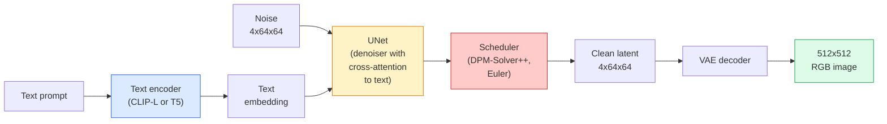

# Stable Diffusion —— 架构与微调

> Stable Diffusion 就是一个 DDPM:它跑在预训练 VAE 的潜在空间里,通过交叉注意力接受文本条件,用快速确定性 ODE 求解器采样,并由 classifier-free guidance 掌舵。

**类型:** 学习 + 使用
**编程语言:** Python
**前置要求:** 第 4 阶段第 10 课(扩散模型)、第 7 阶段第 02 课(自注意力)
**预计耗时:** 约 75 分钟

## 学习目标

- 讲清 Stable Diffusion 流水线的五个部件:VAE、文本编码器、U-Net、调度器、安全检查器——以及每个部件到底干什么
- 解释潜在扩散:为什么在 4x64x64 潜在空间(而不是 3x512x512 图像)里训练,能把算力需求降 48 倍且不损失质量
- 用 `diffusers` 生成图像,跑图生图、局部重绘和 ControlNet 引导生成
- 在小型自定义数据集上用 LoRA 微调 Stable Diffusion,并在推理时加载 LoRA 适配器

## 问题

直接在 512x512 RGB 图像上训 DDPM,代价高昂。每个训练步都要反向传播穿过一个看到 3x512x512 = 786,432 个输入值的 U-Net,采样又要在同一个 U-Net 上跑 50 多次前向。按 Stable Diffusion 1.5(2022 年发布)的质量水平,像素空间扩散大约需要 256 个 GPU·月的训练量,在消费级 GPU 上每张图要 10–30 秒。

让开源权重文生图实用化的技巧,是**潜在扩散**(latent diffusion,Rombach et al., CVPR 2022)。先训一个 VAE,把 3x512x512 图像映射到 4x64x64 潜在张量再映射回来,然后在这个潜在空间里做扩散。算力下降 `(3*512*512)/(4*64*64) = 48` 倍。同一块 GPU 上,采样从几十秒降到两秒以内。

几乎所有现代图像生成模型——SDXL、SD3、FLUX、HunyuanDiT、Wan-Video——都是潜在扩散模型,区别只在自编码器、去噪器(U-Net 或 DiT)和文本条件化方式。学会 Stable Diffusion,你就学会了这套模板。

## 概念

### 流水线



- **VAE** — 冻结的自编码器。编码器把图像变成潜在表示(img2img 和训练时用),解码器把潜在表示变回图像。
- **文本编码器** — CLIP 文本编码器(SD 1.x/2.x)、CLIP-L + CLIP-G(SDXL)或 T5-XXL(SD3/FLUX)。产出一串 token 嵌入。
- **U-Net** — 去噪器。带交叉注意力层,在每个分辨率级别上,潜在表示都会去"注意"文本嵌入。
- **调度器** — 采样算法(DDIM、Euler、DPM-Solver++)。决定 sigma 序列,把预测的噪声混合回潜在表示。
- **安全检查器** — 可选的 NSFW / 违法内容输出过滤器。

### Classifier-free guidance(CFG)

普通文本条件学习的是对每个提示词 `c` 的 `epsilon_theta(x_t, t, c)`。CFG 训练时以 10% 的概率丢掉 `c`(替换成空嵌入),让同一个模型既能预测条件噪声、也能预测无条件噪声。推理时:

```
eps = eps_uncond + w * (eps_cond - eps_uncond)
```

`w` 是引导强度。`w=0` 是无条件,`w=1` 是普通条件,`w>1` 把输出推向"更受提示词约束",代价是牺牲多样性。SD 默认 `w=7.5`。

CFG 是文生图能达到生产质量的原因。没有它,提示词对输出的影响很弱;有了它,提示词主导输出。

### 潜在空间的几何

VAE 的 4 通道潜在表示不只是压缩图像。它是一个流形:上面的算术运算大致对应语义编辑(提示词工程和插值都活在这里),扩散 U-Net 的全部建模预算也都花在了这里。但随机解码一个 4x64x64 潜在张量,得到的不是"随机样子的图像",而是垃圾——因为只有潜在空间中的某个特定子流形,才能解码出有效图像。

两个推论:

1. **Img2img** = 把图像编码成潜在表示,加部分噪声,跑去噪器,解码。图像结构得以保留,因为编码近似可逆;内容则按提示词改变。
2. **局部重绘(Inpainting)** = 与 img2img 相同,但去噪器只更新掩码区域;未掩码区域保持编码后的潜在表示不动。

### U-Net 架构

SD 的 U-Net 就是第 10 课 TinyUNet 的放大版,外加三样东西:

- 每个空间分辨率上的 **Transformer 块**,内含自注意力 + 对文本嵌入的交叉注意力。
- 由正弦编码经 MLP 得到的**时间嵌入**。
- 编码器与解码器之间同分辨率的**跳跃连接**。

参数量:SD 1.5 约 8.6 亿,SDXL 约 26 亿,FLUX 约 120 亿。参数增长主要发生在注意力层。

### LoRA 微调

全量微调 Stable Diffusion 需要 20+ GB 显存,要更新 8.6 亿参数。LoRA(低秩适配)冻结基座模型,只往注意力层注入小的低秩分解矩阵。一个 SD 的 LoRA 适配器通常 10–50 MB,单张消费级 GPU 上 10–60 分钟训完,推理时即插即用。

```
Original: W_q : (d_in, d_out)   frozen
LoRA:     W_q + alpha * (A @ B)   where A : (d_in, r), B : (r, d_out)

r is typically 4-32.
```

社区微调几乎全部以 LoRA 形式分发。CivitAI 和 Hugging Face 上托管着数以百万计的 LoRA。

### 你会见到的调度器

- **DDIM** — 确定性,约 50 步,简单。
- **Euler ancestral** — 随机性,30–50 步,样本略更有创造性。
- **DPM-Solver++ 2M Karras** — 确定性,20–30 步,生产默认。
- **LCM / TCD / Turbo** — 一致性模型及其蒸馏变体;1–4 步,牺牲一些质量。

换调度器在 `diffusers` 里是一行改动,有时不重训就能修好样本问题。

```figure
cv3-latent-compression
```

## 动手构建

本课端到端使用 `diffusers`,而不是从零重建 Stable Diffusion。需要重建的部件(VAE、文本编码器、U-Net、调度器)各有专门课程;本课目标是熟练掌握生产 API。

### 第 1 步:文生图

```python
import torch
from diffusers import StableDiffusionPipeline

pipe = StableDiffusionPipeline.from_pretrained(
    "runwayml/stable-diffusion-v1-5",
    torch_dtype=torch.float16,
).to("cuda")

image = pipe(
    prompt="a dog riding a skateboard in tokyo, studio ghibli style",
    guidance_scale=7.5,
    num_inference_steps=25,
    generator=torch.Generator("cuda").manual_seed(42),
).images[0]
image.save("dog.png")
```

`float16` 把显存减半且质量无可见损失。`num_inference_steps=25` 配默认的 DPM-Solver++,效果相当于 DDIM 的 `num_inference_steps=50`。

### 第 2 步:换调度器

```python
from diffusers import DPMSolverMultistepScheduler, EulerAncestralDiscreteScheduler

pipe.scheduler = DPMSolverMultistepScheduler.from_config(pipe.scheduler.config)
pipe.scheduler = EulerAncestralDiscreteScheduler.from_config(pipe.scheduler.config)
```

调度器状态与 U-Net 权重是解耦的。用 DDPM 训练的模型,可以用任何调度器采样。

### 第 3 步:图生图

```python
from diffusers import StableDiffusionImg2ImgPipeline
from PIL import Image

img2img = StableDiffusionImg2ImgPipeline.from_pretrained(
    "runwayml/stable-diffusion-v1-5",
    torch_dtype=torch.float16,
).to("cuda")

init_image = Image.open("dog.png").convert("RGB").resize((512, 512))
out = img2img(
    prompt="a dog riding a skateboard, oil painting",
    image=init_image,
    strength=0.6,
    guidance_scale=7.5,
).images[0]
```

`strength` 是去噪前加多少噪声(0.0 = 不变,1.0 = 完全重新生成)。风格迁移的常用区间是 0.5–0.7。

### 第 4 步:局部重绘

```python
from diffusers import StableDiffusionInpaintPipeline

inpaint = StableDiffusionInpaintPipeline.from_pretrained(
    "runwayml/stable-diffusion-inpainting",
    torch_dtype=torch.float16,
).to("cuda")

image = Image.open("dog.png").convert("RGB").resize((512, 512))
mask = Image.open("dog_mask.png").convert("L").resize((512, 512))

out = inpaint(
    prompt="a cat",
    image=image,
    mask_image=mask,
    guidance_scale=7.5,
).images[0]
```

掩码中白色像素是要重新生成的区域,黑色像素保持原样。

### 第 5 步:加载 LoRA

```python
pipe.load_lora_weights("sayakpaul/sd-lora-ghibli")
pipe.fuse_lora(lora_scale=0.8)

image = pipe(prompt="a village square in ghibli style").images[0]
```

`lora_scale` 控制强度:0.0 = 无效果,1.0 = 全效果。`fuse_lora` 把适配器直接熔进权重以提速,但此后不能再换。要加载别的适配器,先调用 `pipe.unfuse_lora()`。

### 第 6 步:LoRA 训练(梗概)

真正的 LoRA 训练在 `peft` 或 `diffusers.training` 里。流程如下:

```python
# Pseudocode
for step, batch in enumerate(dataloader):
    images, prompts = batch
    latents = vae.encode(images).latent_dist.sample() * 0.18215

    t = torch.randint(0, num_train_timesteps, (batch_size,))
    noise = torch.randn_like(latents)
    noisy_latents = scheduler.add_noise(latents, noise, t)

    text_emb = text_encoder(tokenizer(prompts))

    pred_noise = unet(noisy_latents, t, text_emb)  # LoRA weights injected here

    loss = F.mse_loss(pred_noise, noise)
    loss.backward()
    optimizer.step()
```

只有 LoRA 矩阵接收梯度;基座 U-Net、VAE 和文本编码器全部冻结。批次为 1 加梯度检查点,8 GB 显存就能跑。

## 投入使用

生产环境中,你真正要做的决策:

- **模型家族**:SD 1.5 用于开源社区微调生态,SDXL 追求更高保真,SD3 / FLUX 追 SOTA 或有严格授权要求时。
- **调度器**:20–30 步用 DPM-Solver++ 2M Karras,延迟要求 1 秒以内用 LCM-LoRA。
- **精度**:4080/4090 上用 `float16`,A100 及更新卡上用 `bfloat16`,显存紧张时用 `int8`(经 `bitsandbytes` 或 `compel`)。
- **条件化**:纯文本即可;需要更强控制时,在基础流水线上叠加 ControlNet(canny 边缘、深度、姿态)。

批量生成用社区工具 `AUTO1111` / `ComfyUI`;生产 API 用 `diffusers` + `accelerate`,或 `optimum-nvidia` 配 TensorRT 编译。

## 交付

本课产出:

- `outputs/prompt-sd-pipeline-planner.md` — 一个提示词:给定延迟预算、保真目标和授权约束,在 SD 1.5 / SDXL / SD3 / FLUX 中选型,并给出调度器和精度。
- `outputs/skill-lora-training-setup.md` — 一个技能:为自定义数据集写出完整 LoRA 训练配置,包括标注文本、秩、批次大小和学习率。

## 练习

1. **(易)** 用同一个提示词,分别以 `[1, 3, 5, 7.5, 10, 15]` 的 `guidance_scale` 生成。描述图像如何变化。引导值到多少时开始出现伪影?
2. **(中)** 任取一张真实照片,用 `StableDiffusionImg2ImgPipeline` 分别以 `[0.2, 0.4, 0.6, 0.8, 1.0]` 的 `strength` 处理。哪个强度能在保留构图的同时改变风格?为什么 1.0 会完全无视输入?
3. **(难)** 用 10–20 张同一主体(宠物、logo、角色)的图训练一个 LoRA,生成包含该主体的新场景。报告在不过拟合输入图像的前提下,身份保持最好的 LoRA 秩和训练步数。

## 关键术语

| 术语 | 人们常说的是 | 实际含义是 |
|------|----------------|----------------------|
| 潜在扩散 | "在潜在空间里扩散" | 整个 DDPM 跑在 VAE 潜在空间(4x64x64)而非像素空间(3x512x512);省 48 倍算力 |
| VAE 缩放因子 | "0.18215" | 把 VAE 原始潜在表示缩放到接近单位方差的常数;每个 SD 流水线里都写死了 |
| Classifier-free guidance | "CFG" | 混合条件与无条件噪声预测;推理时影响力最大的单个旋钮 |
| 调度器 | "采样器" | 把噪声 + 模型预测变成去噪轨迹的算法 |
| LoRA | "低秩适配器" | 微调注意力层的小低秩分解矩阵,不动基座权重 |
| 交叉注意力 | "文图注意力" | 潜在 token 对文本 token 的注意力;在 U-Net 每一层注入提示词信息 |
| ControlNet | "结构条件" | 单独训练的适配器,用额外输入(canny、深度、姿态、分割)引导 SD |
| DPM-Solver++ | "默认调度器" | 二阶确定性 ODE 求解器;2026 年低步数(20–30)下质量最佳 |

## 延伸阅读

- [High-Resolution Image Synthesis with Latent Diffusion (Rombach et al., 2022)](https://arxiv.org/abs/2112.10752) — Stable Diffusion 论文,包含支撑其设计的全部消融实验
- [Classifier-Free Diffusion Guidance (Ho & Salimans, 2022)](https://arxiv.org/abs/2207.12598) — CFG 论文
- [LoRA: Low-Rank Adaptation of Large Language Models (Hu et al., 2021)](https://arxiv.org/abs/2106.09685) — LoRA 源于 NLP,几乎原样迁移到了 SD
- [diffusers documentation](https://huggingface.co/docs/diffusers) — 所有 SD / SDXL / SD3 / FLUX 流水线的参考文档
