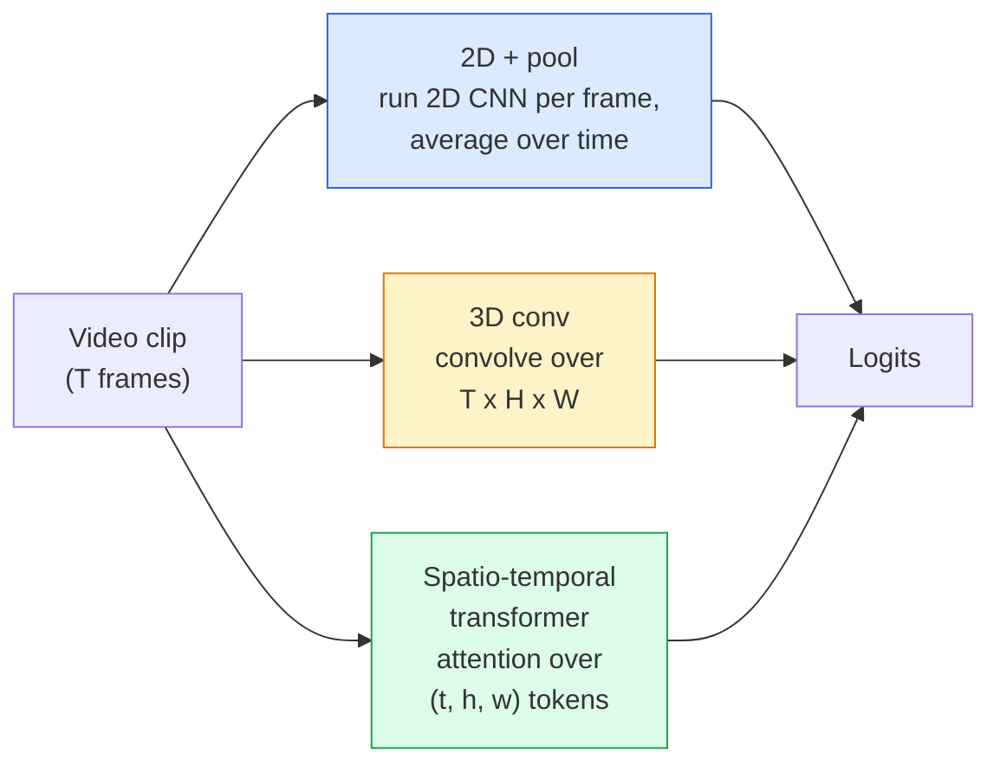

# 视频理解 —— 时序建模

> 视频 = 一串图像 + 把它们串起来的物理规律。每个视频模型,对时间的处理不外乎三种:当作额外的一根轴(3D 卷积)、当作要 attend 的序列(Transformer),或者当作提取一次再池化的特征(2D+池化)。

**类型:** 学习 + 动手构建
**编程语言:** Python
**前置要求:** 第 4 阶段第 03 课(CNN)、第 4 阶段第 04 课(图像分类)
**预计耗时:** 约 45 分钟

## 学习目标

- 区分三大视频建模路线(2D+池化、3D 卷积、时空 Transformer),并预判它们在算力与准确率上的取舍
- 用 PyTorch 实现帧采样、时序池化和一个 2D+池化基线分类器
- 解释为什么 I3D 的"膨胀"3D 卷积核能很好地从 ImageNet 权重迁移,以及分解式 (2+1)D 卷积有何不同
- 读懂主流动作识别数据集与指标:Kinetics-400/600、UCF101、Something-Something V2;片段级与视频级的 top-1 准确率

## 问题

一段 30 秒、30 fps 的视频就是 900 张图。最朴素的做法:视频分类 = 图像分类跑 900 遍再聚合。当动作几乎在每一帧都可见时(体育、烹饪、健身视频),这招有效;但当动作由运动本身定义时,就惨败——"把东西从左推到右"在每一帧里看起来都只是两个静止的物体。

每个视频架构的核心问题是:时序结构在何时、以何种方式被建模?答案决定其余一切——算力成本、预训练策略、能否复用 ImageNet 权重、在什么数据集上训练。

本课有意比静态图像那几课短。图像的核心机制已经就位,视频理解主要讲时序这条线:采样、建模、聚合。

## 概念

### 三大架构家族



### 2D + 池化

拿一个 2D CNN(ResNet、EfficientNet、ViT),在每个采样帧上独立运行,把逐帧嵌入做平均(或最大池化、注意力池化),池化后的向量喂给分类器。

优点:

- ImageNet 预训练直接迁移。
- 实现最简单。
- 便宜:T 帧 × 单图推理成本。

缺点:

- 无法对运动建模。动作 = 外观的聚合。
- 时序池化与顺序无关;"开门"和"关门"看起来一样。

适用场景:外观主导的任务、小视频数据集上的迁移学习、初始基线。

### 3D 卷积

把 2D 的 (H, W) 卷积核换成 3D 的 (T, H, W) 卷积核,网络同时在空间和时间上卷积。早期家族:C3D、I3D、SlowFast。

I3D 技巧:取一个预训练好的 2D ImageNet 模型,把每个 2D 卷积核沿新增的时间轴复制"膨胀"。3x3 的 2D 卷积变成 3x3x3 的 3D 卷积。这样 3D 模型就有了强大的预训练权重,不必从零训练。

优点:

- 直接对运动建模。
- I3D 膨胀等于免费的迁移学习。

缺点:

- 比对应 2D 模型贵 T/8 倍 FLOPs(时间核为 3、堆叠三次时)。
- 时间核很小;长程运动需要金字塔或双流结构。

适用场景:运动本身就是信号的动作识别(Something-Something V2、Kinetics 中运动密集的类别)。

### 时空 Transformer

把视频切成时空 patch 网格,对所有 patch 做注意力。TimeSformer、ViViT、Video Swin、VideoMAE。

关键的注意力模式:

- **联合式(joint)** — 对全部 (t, h, w) 做一次大注意力。复杂度是 `T*H*W` 的平方,贵。
- **分离式(divided)** — 每个 block 两次注意力:一次沿时间,一次沿空间。接近线性增长。
- **分解式(factorised)** — 时间注意力与空间注意力在不同 block 间交替。

优点:

- 所有主要基准上的 SOTA 准确率。
- 可通过 patch 膨胀从图像 Transformer(ViT)迁移。
- 借助稀疏注意力支持长上下文视频。

缺点:

- 吃算力。
- 注意力模式选不好,运行时间就会爆炸。

适用场景:大数据集、高保真视频理解、视频+文本多模态任务。

### 帧采样

10 秒、30 fps 的片段有 300 帧,全喂给任何模型都是浪费。标准策略:

- **均匀采样** — 在片段上均匀取 T 帧。2D+池化的默认选择。
- **密集采样** — 随机取连续 T 帧窗口。3D 卷积常用,因为运动需要相邻帧。
- **多片段(multi-clip)** — 从同一视频采多个 T 帧窗口,各自分类,测试时平均预测。

T 通常取 8、16、32 或 64。T 越大,时序信号越多,算力越贵。

### 评估

两个级别:

- **片段级准确率(clip-level)** — 模型看一个 T 帧片段,报 top-k。
- **视频级准确率(video-level)** — 同一视频多个片段的预测取平均;更高、更稳。

两个都要报。一个 78% 片段级 / 82% 视频级的模型,高度依赖测试时平均;80% / 81% 的模型单片段鲁棒性更强。

### 你会遇到的数据集

- **Kinetics-400 / 600 / 700** — 通用动作数据集。40 万片段;YouTube 链接(很多已失效)。
- **Something-Something V2** — 由运动定义的动作("把 X 从左移到右")。2D+池化做不了。
- **UCF-101**、**HMDB-51** — 更老、更小,仍有人报。
- **AVA** — 时空中的动作*定位*,比分类难。

```figure
v4-video-temporal
```

## 动手构建

### 第 1 步:帧采样器

均匀采样和密集采样,适用于帧列表(或视频张量)。

```python
import numpy as np

def sample_uniform(num_frames_total, T):
    if num_frames_total <= T:
        return list(range(num_frames_total)) + [num_frames_total - 1] * (T - num_frames_total)
    step = num_frames_total / T
    return [int(i * step) for i in range(T)]


def sample_dense(num_frames_total, T, rng=None):
    rng = rng or np.random.default_rng()
    if num_frames_total <= T:
        return list(range(num_frames_total)) + [num_frames_total - 1] * (T - num_frames_total)
    start = int(rng.integers(0, num_frames_total - T + 1))
    return list(range(start, start + T))
```

两者都返回 `T` 个下标,用来切视频张量。

### 第 2 步:2D+池化基线

对每帧跑 2D ResNet-18,特征做平均池化,分类。

```python
import torch
import torch.nn as nn
from torchvision.models import resnet18, ResNet18_Weights

class FramePool(nn.Module):
    def __init__(self, num_classes=400, pretrained=True):
        super().__init__()
        weights = ResNet18_Weights.IMAGENET1K_V1 if pretrained else None
        backbone = resnet18(weights=weights)
        self.features = nn.Sequential(*(list(backbone.children())[:-1]))  # global avg pool kept
        self.head = nn.Linear(512, num_classes)

    def forward(self, x):
        # x: (N, T, 3, H, W)
        N, T = x.shape[:2]
        x = x.view(N * T, *x.shape[2:])
        feats = self.features(x).view(N, T, -1)
        pooled = feats.mean(dim=1)
        return self.head(pooled)

model = FramePool(num_classes=10)
x = torch.randn(2, 8, 3, 224, 224)
print(f"output: {model(x).shape}")
print(f"params: {sum(p.numel() for p in model.parameters()):,}")
```

一千一百万参数,ImageNet 预训练,逐帧跑,取平均,分类。在外观主导的任务上,这个基线与正经 3D 模型往往只差 5–10 个点——有时还更好,因为它复用了更强的 ImageNet 骨干。

### 第 3 步:I3D 式膨胀 3D 卷积

沿新的时间轴重复权重,把单个 2D 卷积变成 3D 卷积。

```python
def inflate_2d_to_3d(conv2d, time_kernel=3):
    out_c, in_c, kh, kw = conv2d.weight.shape
    weight_3d = conv2d.weight.data.unsqueeze(2)  # (out, in, 1, kh, kw)
    weight_3d = weight_3d.repeat(1, 1, time_kernel, 1, 1) / time_kernel
    conv3d = nn.Conv3d(in_c, out_c, kernel_size=(time_kernel, kh, kw),
                        padding=(time_kernel // 2, conv2d.padding[0], conv2d.padding[1]),
                        stride=(1, conv2d.stride[0], conv2d.stride[1]),
                        bias=False)
    conv3d.weight.data = weight_3d
    return conv3d

conv2d = nn.Conv2d(3, 64, kernel_size=3, padding=1, bias=False)
conv3d = inflate_2d_to_3d(conv2d, time_kernel=3)
print(f"2D weight shape:  {tuple(conv2d.weight.shape)}")
print(f"3D weight shape:  {tuple(conv3d.weight.shape)}")
x = torch.randn(1, 3, 8, 56, 56)
print(f"3D output shape:  {tuple(conv3d(x).shape)}")
```

除以 `time_kernel` 是为了让激活幅度大致不变——不然第一轮前向就会打乱批归一化的统计量。

### 第 4 步:分解式 (2+1)D 卷积

把 3D 卷积拆成一个 2D(空间)卷积和一个 1D(时间)卷积。感受野相同,参数更少,某些基准上准确率还更高。

```python
class Conv2Plus1D(nn.Module):
    def __init__(self, in_c, out_c, kernel_size=3):
        super().__init__()
        mid_c = (in_c * out_c * kernel_size * kernel_size * kernel_size) \
                // (in_c * kernel_size * kernel_size + out_c * kernel_size)
        self.spatial = nn.Conv3d(in_c, mid_c, kernel_size=(1, kernel_size, kernel_size),
                                 padding=(0, kernel_size // 2, kernel_size // 2), bias=False)
        self.bn = nn.BatchNorm3d(mid_c)
        self.act = nn.ReLU(inplace=True)
        self.temporal = nn.Conv3d(mid_c, out_c, kernel_size=(kernel_size, 1, 1),
                                  padding=(kernel_size // 2, 0, 0), bias=False)

    def forward(self, x):
        return self.temporal(self.act(self.bn(self.spatial(x))))

c = Conv2Plus1D(3, 64)
x = torch.randn(1, 3, 8, 56, 56)
print(f"(2+1)D output: {tuple(c(x).shape)}")
```

完整的 R(2+1)D 网络,就是把 ResNet-18 里每个 3x3 卷积都换成 `Conv2Plus1D`。

## 投入使用

两个库覆盖生产级视频工作:

- `torchvision.models.video` — R(2+1)D、MViT、Swin3D,带 Kinetics 预训练权重,API 与图像模型一致。
- `pytorchvideo`(Meta)— 模型动物园,Kinetics / SSv2 / AVA 的数据加载器和标准变换。

视觉-语言视频模型(视频描述、视频问答)用 `transformers`(`VideoMAE`、`VideoLLaMA`、`InternVideo`)。

## 交付

本课产出:

- `outputs/prompt-video-architecture-picker.md` — 一个提示词:按外观主导还是运动主导、数据集规模和算力预算,在 2D+池化 / I3D / (2+1)D / Transformer 中做选择。
- `outputs/skill-frame-sampler-auditor.md` — 一个技能:检查视频流水线的采样器,标记常见 bug:差一错误、`num_frames < T` 时采样不均、缺少保宽高比裁剪等。

## 练习

1. **(易)** 估算 T=8 的 FramePool 与 T=8 的 I3D 式 3D ResNet 的 FLOPs。论证为什么 2D+池化便宜 3–5 倍。
2. **(中)** 生成一个合成视频数据集:随机小球沿随机方向运动,按运动方向打标签("从左到右"、"从右到左"、"斜向上")。在上面训练 FramePool,证明它的准确率接近随机——说明仅靠外观无法完成运动任务。
3. **(难)** 把 ResNet-18 中每个 Conv2d 换成 `Conv2Plus1D`,搭一个 R(2+1)D-18。第一个卷积的权重从 ImageNet 预训练的 ResNet-18 膨胀而来。在练习 2 的运动数据集上训练,击败 FramePool。

## 关键术语

| 术语 | 人们常说的是 | 实际含义是 |
|------|----------------|----------------------|
| 2D + 池化 | "逐帧分类器" | 每个采样帧过 2D CNN,特征沿时间平均池化,再分类 |
| 3D 卷积 | "时空卷积核" | 在 (T, H, W) 上卷积的卷积核;原生建模运动 |
| 膨胀(inflation) | "把 2D 权重抬到 3D" | 沿新增时间轴重复 2D 卷积权重来初始化 3D 卷积,再除以 kernel_T 保持激活尺度 |
| (2+1)D | "分解卷积" | 把 3D 拆成 2D 空间 + 1D 时间;参数更少,中间多一次非线性 |
| 分离式注意力 | "先时间后空间" | 每层两次注意力的 Transformer block:一次对同帧 token,一次对同位置 token |
| 片段(clip) | "T 帧窗口" | 采样出的 T 帧子序列;视频模型消费的基本单位 |
| 片段级 vs 视频级准确率 | "两种评估设定" | 片段级 = 每视频一个样本;视频级 = 多个采样片段的预测取平均 |
| Kinetics | "视频界的 ImageNet" | 400–700 个动作类别、30 万+ YouTube 片段,标准视频预训练语料 |

## 延伸阅读

- [I3D: Quo Vadis, Action Recognition (Carreira & Zisserman, 2017)](https://arxiv.org/abs/1705.07750) — 提出膨胀技巧与 Kinetics 数据集
- [R(2+1)D: A Closer Look at Spatiotemporal Convolutions (Tran et al., 2018)](https://arxiv.org/abs/1711.11248) — 分解卷积,至今仍是强基线
- [TimeSformer: Is Space-Time Attention All You Need? (Bertasius et al., 2021)](https://arxiv.org/abs/2102.05095) — 第一个强大的视频 Transformer
- [VideoMAE (Tong et al., 2022)](https://arxiv.org/abs/2203.12602) — 视频的掩码自编码器预训练;当前主流预训练配方
