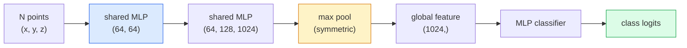

# 3D 视觉 —— 点云与 NeRF

> 3D 视觉有两种风味:点云是传感器的原始输出,NeRF 是学习出来的体辐射场。两者回答的都是同一个问题:"空间里什么在哪里。"

**类型:** 学习 + 动手构建
**编程语言:** Python
**前置要求:** 第 4 阶段第 03 课(CNN)、第 1 阶段第 12 课(张量运算)
**预计耗时:** 约 45 分钟

## 学习目标

- 区分显式(点云、网格、体素)与隐式(有符号距离场、NeRF)3D 表示,以及各自的使用场景
- 理解 PointNet 的对称函数技巧:让神经网络对无序点集置换不变
- 走通一次 NeRF 前向:光线投射、体渲染、位置编码、MLP 密度+颜色头
- 用 `nerfstudio` 或 `instant-ngp`,从少量带位姿的照片做预训练 3D 重建

## 问题

相机产出 2D 图像;激光雷达产出一堆无序的 3D 点;运动恢复结构(SfM)流水线产出稀疏的 3D 关键点云;NeRF 则从一小组带位姿的照片重建出整个 3D 场景。这些都叫"视觉",但没有一样长得像 CNN 想要的那种稠密张量。

3D 视觉重要,是因为几乎所有高价值机器人任务都跑在 3D 里:抓取、避障、导航、AR 遮挡、3D 内容采集。只懂 2D 图像的视觉工程师,会被挡在这个领域增长最快的一块之外(AR/VR 内容、机器人、自动驾驶栈、面向房产或建筑的 NeRF 3D 重建)。

两种表示各占山头,原因不同:点云是传感器免费给你的;NeRF 及其后继者(3D 高斯泼溅、神经 SDF)则是让神经网络去学一个场景时得到的东西。

## 概念

### 点云

点云是 R^3 中 N 个点的无序集合,每个点可选地带特征(颜色、强度、法向)。

```
cloud = [
  (x1, y1, z1, r1, g1, b1),
  (x2, y2, z2, r2, g2, b2),
  ...
  (xN, yN, zN, rN, gN, bN),
]
```

没有网格,没有连接关系。两个性质让神经网络难以下嘴:

- **置换不变性** — 输出不得依赖点的顺序。
- **N 可变** — 同一个模型必须处理不同大小的点云。

PointNet(Qi et al., 2017)用一个想法同时解决两者:对每个点施加同一个共享 MLP,再用对称函数(最大池化)聚合。结果是一个与顺序无关的定长向量。

```
f(P) = max_{p in P} MLP(p)
```

这就是 PointNet 的全部核心。更深的变体(PointNet++、Point Transformer)加了层级采样和局部聚合,但对称函数技巧原封不动。

### PointNet 架构



"共享 MLP"的意思是同一个 MLP 独立地跑在每个点上。实现上用 1x1 卷积沿点维度计算,效率更高。

### 神经辐射场(NeRF)

NeRF(Mildenhall et al., 2020)面对的问题是"能不能用 N 张照片重建 3D 场景",它给出的答案是:用一个神经网络来"当"这个场景。网络把 `(x, y, z, 观察方向)` 映射到 `(密度, 颜色)`。渲染新视角,就是在这个网络上跑光线投射循环。

```
NeRF MLP:  (x, y, z, theta, phi) -> (sigma, r, g, b)

To render a pixel (u, v) of a new view:
  1. Cast a ray from the camera through pixel (u, v)
  2. Sample points along the ray at distances t_1, t_2, ..., t_N
  3. Query the MLP at each point
  4. Composite the colours weighted by (1 - exp(-sigma * dt))
  5. The sum is the rendered pixel colour
```

损失比较渲染像素与训练照片中的真实像素,反向传播穿过渲染步骤更新 MLP。没有 3D 真值,没有显式几何——场景存在 MLP 的权重里。

### NeRF 中的位置编码

直接吃 `(x, y, z)` 的朴素 MLP 表示不了高频细节,因为 MLP 在频谱上偏向低频。NeRF 的修法:进 MLP 之前,先把每个坐标编码成傅里叶特征向量:

```
gamma(p) = (sin(2^0 pi p), cos(2^0 pi p), sin(2^1 pi p), cos(2^1 pi p), ...)
```

最多 L=10 个频率级别。这和 Transformer 处理位置的技巧相同,扩散模型的时间条件化也是它(第 10 课)。没有它,NeRF 渲染出来一片模糊。

### 体渲染

```
C(r) = sum_i T_i * (1 - exp(-sigma_i * delta_i)) * c_i

T_i  = exp(- sum_{j<i} sigma_j * delta_j)
delta_i = t_{i+1} - t_i
```

`T_i` 是透射率——光能"活"到第 i 点的比例。`(1 - exp(-sigma_i * delta_i))` 是第 i 点的不透明度。`c_i` 是颜色。最终像素是沿光线的加权和。

### NeRF 的后继者

纯 NeRF 训练慢(几小时)、渲染慢(每张图几秒)。此后的演进:

- **Instant-NGP**(2022)— 哈希网格编码取代 MLP 的位置输入;几秒训完。
- **Mip-NeRF 360** — 处理无界场景和抗锯齿。
- **3D 高斯泼溅**(2023)— 用数百万个 3D 高斯取代体辐射场;几分钟训完,实时渲染。当前生产默认。

2026 年,几乎所有实际落地的"NeRF 产品"其实都是 3D 高斯泼溅。但心智模型仍然是 NeRF。

### 数据集与基准

- **ShapeNet** — 3D CAD 模型点云的分类与分割。
- **ScanNet** — 真实室内扫描,用于分割。
- **KITTI** — 户外激光雷达点云,面向自动驾驶。
- **NeRF Synthetic** / **Blended MVS** — 带位姿图像数据集,用于视角合成。
- **Mip-NeRF 360** 数据集 — 无界真实场景。

```figure
nerf-rays
```

## 动手构建

### 第 1 步:PointNet 分类器

```python
import torch
import torch.nn as nn

class PointNet(nn.Module):
    def __init__(self, num_classes=10):
        super().__init__()
        self.mlp1 = nn.Sequential(
            nn.Conv1d(3, 64, 1),    nn.BatchNorm1d(64),   nn.ReLU(inplace=True),
            nn.Conv1d(64, 64, 1),   nn.BatchNorm1d(64),   nn.ReLU(inplace=True),
        )
        self.mlp2 = nn.Sequential(
            nn.Conv1d(64, 128, 1),  nn.BatchNorm1d(128),  nn.ReLU(inplace=True),
            nn.Conv1d(128, 1024, 1), nn.BatchNorm1d(1024), nn.ReLU(inplace=True),
        )
        self.head = nn.Sequential(
            nn.Linear(1024, 512),   nn.BatchNorm1d(512),  nn.ReLU(inplace=True),
            nn.Dropout(0.3),
            nn.Linear(512, 256),    nn.BatchNorm1d(256),  nn.ReLU(inplace=True),
            nn.Dropout(0.3),
            nn.Linear(256, num_classes),
        )

    def forward(self, x):
        # x: (N, 3, num_points) — transposed for Conv1d
        x = self.mlp1(x)
        x = self.mlp2(x)
        x = torch.max(x, dim=-1)[0]       # (N, 1024)
        return self.head(x)

pts = torch.randn(4, 3, 1024)
net = PointNet(num_classes=10)
print(f"output: {net(pts).shape}")
print(f"params: {sum(p.numel() for p in net.parameters()):,}")
```

约 160 万参数,每个点云处理 1,024 个点。

### 第 2 步:位置编码

```python
def positional_encoding(x, L=10):
    """
    x: (..., D) -> (..., D * 2 * L)
    """
    freqs = 2.0 ** torch.arange(L, dtype=x.dtype, device=x.device)
    args = x.unsqueeze(-1) * freqs * 3.141592653589793
    sinc = torch.cat([args.sin(), args.cos()], dim=-1)
    return sinc.reshape(*x.shape[:-1], -1)

x = torch.randn(5, 3)
y = positional_encoding(x, L=10)
print(f"input:  {x.shape}")
print(f"encoded: {y.shape}     # (5, 60)")
```

乘以 `2^l * pi` 得到逐级升高的频率。

### 第 3 步:迷你 NeRF MLP

```python
class TinyNeRF(nn.Module):
    def __init__(self, L_pos=10, L_dir=4, hidden=128):
        super().__init__()
        self.L_pos = L_pos
        self.L_dir = L_dir
        pos_dim = 3 * 2 * L_pos
        dir_dim = 3 * 2 * L_dir
        self.trunk = nn.Sequential(
            nn.Linear(pos_dim, hidden), nn.ReLU(inplace=True),
            nn.Linear(hidden, hidden),  nn.ReLU(inplace=True),
            nn.Linear(hidden, hidden),  nn.ReLU(inplace=True),
            nn.Linear(hidden, hidden),  nn.ReLU(inplace=True),
        )
        self.sigma = nn.Linear(hidden, 1)
        self.color = nn.Sequential(
            nn.Linear(hidden + dir_dim, hidden // 2), nn.ReLU(inplace=True),
            nn.Linear(hidden // 2, 3), nn.Sigmoid(),
        )

    def forward(self, x, d):
        x_enc = positional_encoding(x, self.L_pos)
        d_enc = positional_encoding(d, self.L_dir)
        h = self.trunk(x_enc)
        sigma = torch.relu(self.sigma(h)).squeeze(-1)
        rgb = self.color(torch.cat([h, d_enc], dim=-1))
        return sigma, rgb

nerf = TinyNeRF()
x = torch.randn(128, 3)
d = torch.randn(128, 3)
s, c = nerf(x, d)
print(f"sigma: {s.shape}   rgb: {c.shape}")
```

相比原始 NeRF(有两条深度为 8 的 MLP 主干)算是迷你,但足以演示架构。

### 第 4 步:沿光线的体渲染

```python
def volumetric_render(sigma, rgb, t_vals):
    """
    sigma: (..., N_samples)
    rgb:   (..., N_samples, 3)
    t_vals: (N_samples,) distances along the ray
    """
    delta = torch.cat([t_vals[1:] - t_vals[:-1], torch.full_like(t_vals[:1], 1e10)])
    alpha = 1.0 - torch.exp(-sigma * delta)
    trans = torch.cumprod(torch.cat([torch.ones_like(alpha[..., :1]), 1.0 - alpha + 1e-10], dim=-1), dim=-1)[..., :-1]
    weights = alpha * trans
    rendered = (weights.unsqueeze(-1) * rgb).sum(dim=-2)
    depth = (weights * t_vals).sum(dim=-1)
    return rendered, depth, weights


N = 64
t_vals = torch.linspace(2.0, 6.0, N)
sigma = torch.rand(N) * 0.5
rgb = torch.rand(N, 3)
rendered, depth, weights = volumetric_render(sigma, rgb, t_vals)
print(f"rendered colour: {rendered.tolist()}")
print(f"depth:           {depth.item():.2f}")
```

一条光线,64 个采样点,合成一个 RGB 像素和一个深度值。

## 投入使用

实际工作:

- `nerfstudio`(Tancik et al.)— NeRF / Instant-NGP / 高斯泼溅的当前参考库。命令行 + Web 查看器。
- `pytorch3d`(Meta)— 可微渲染、点云工具、网格操作。
- `open3d` — 点云处理、配准、可视化。

部署上,3D 高斯泼溅已基本取代纯 NeRF,因为渲染快 100 倍,重建质量相当。

## 交付

本课产出:

- `outputs/prompt-3d-task-router.md` — 一个提示词:按任务与输入数据,路由到正确的 3D 表示(点云、网格、体素、NeRF、高斯泼溅)。
- `outputs/skill-point-cloud-loader.md` — 一个技能:为 .ply / .pcd / .xyz 文件编写 PyTorch `Dataset`,含正确的归一化、居中和点采样。

## 练习

1. **(易)** 证明 PointNet 置换不变:同一个点云跑两次,一次打乱点的顺序。验证输出在浮点噪声范围内完全一致。
2. **(中)** 实现一个最小的光线生成函数:给定相机内参和位姿,为 H x W 图像的每个像素产出光线原点与方向。
3. **(难)** 在合成数据集上训练 TinyNeRF:数据是一个彩色立方体的渲染多视角图(用可微渲染或简单光线追踪生成)。报告第 1、10、100 个 epoch 的渲染损失。到第几个 epoch,模型能产出可辨认的视角?

## 关键术语

| 术语 | 人们常说的是 | 实际含义是 |
|------|----------------|----------------------|
| 点云 | "激光雷达给的 3D 点" | 无序的 (x, y, z) 集合,每个点可选带特征 |
| PointNet | "第一个吃点云的神经网络" | 每点共享 MLP + 对称(最大)池化;构造上天然置换不变 |
| NeRF | "本身就是场景的 MLP" | 把 (x, y, z, 方向) 映射到 (密度, 颜色) 的网络;用光线投射渲染 |
| 位置编码 | "傅里叶特征" | 把每个坐标编码成多频率的 sin/cos,克服 MLP 的低频偏置 |
| 体渲染 | "沿光线积分" | 用透射率和 alpha 把光线上的采样点合成一个像素 |
| Instant-NGP | "哈希网格 NeRF" | 用多分辨率哈希网格取代 NeRF 的坐标 MLP;快 100–1000 倍 |
| 3D 高斯泼溅 | "几百万个高斯" | 场景 = 3D 高斯的集合;实时渲染,几分钟训完 |
| SDF | "有符号距离场" | 返回到最近表面带符号距离的函数;另一种隐式表示 |

## 延伸阅读

- [PointNet (Qi et al., 2017)](https://arxiv.org/abs/1612.00593) — 置换不变的分类器
- [NeRF (Mildenhall et al., 2020)](https://arxiv.org/abs/2003.08934) — 把照片 3D 重建变成神经网络问题的论文
- [Instant-NGP (Müller et al., 2022)](https://arxiv.org/abs/2201.05989) — 哈希网格,1000 倍提速
- [3D Gaussian Splatting (Kerbl et al., 2023)](https://arxiv.org/abs/2308.04079) — 在生产中取代 NeRF 的架构
