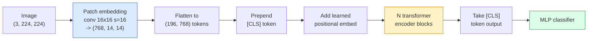

# 视觉 Transformer(ViT)

> 把图像切成 patch,把每个 patch 当一个词,跑一个标准 Transformer。然后别回头。

**类型:** 动手构建
**编程语言:** Python
**前置要求:** 第 7 阶段第 02 课(自注意力)、第 4 阶段第 04 课(图像分类)
**预计耗时:** 约 45 分钟

## 学习目标

- 从零实现 patch 嵌入、可学习位置嵌入、类别 token 和 Transformer 编码器块,构建最小 ViT
- 解释为什么人们曾认为 ViT 需要海量预训练数据,直到 DeiT 和 MAE 证明并非如此
- 从架构先验角度比较 ViT、Swin 和 ConvNeXt(无先验、局部窗口注意力、卷积骨干)
- 用 `timm` 和标准的 linear-probe / 微调配方,在小数据集上微调预训练 ViT

## 问题

十年间,卷积就是计算机视觉的同义词。CNN 拥有强大的归纳偏置——局部性、平移等变性——没人觉得这些东西可以被替代。直到 Dosovitskiy et al.(2020)证明:把朴素 Transformer 直接用在展平的图像 patch 上,不带任何卷积机制,规模够大时就能追平甚至击败最好的 CNN。

关键在于"规模够大"。ViT 直接在 ImageNet-1k 上训练,输给 ResNet;先在 ImageNet-21k 或 JFT-300M 上预训练、再到 ImageNet-1k 上微调,就赢了。当时的结论是:Transformer 缺少有用的先验,但能从足够多的数据里把先验学出来。后续工作(DeiT、MAE、DINO)表明:只要训练配方对——强数据增强、自监督预训练、蒸馏——ViT 在小数据上同样训得好。

到 2026 年,纯 CNN 在边缘设备上仍有竞争力(ConvNeXt 最强),但其余一切都被 Transformer 统治:分割(Mask2Former、SegFormer)、检测(DETR、RT-DETR)、多模态(CLIP、SigLIP)、视频(VideoMAE、VJEPA)。ViT 的块结构是必须掌握的那一个。

## 概念

### 流水线



七步:patch -> token -> 注意力 -> 分类器。每个变体(DeiT、Swin、ConvNeXt、MAE 预训练)都只改动其中一两步,其余原样保留。

### Patch 嵌入

第一个卷积是秘密所在。卷积核 16、步幅 16,一张 224x224 图像变成 14x14 的 16x16 patch 网格,每个 patch 投影成 768 维嵌入。这一个卷积同时完成了切 patch 和线性投影两件事。

```
Input:  (3, 224, 224)
Conv (3 -> 768, k=16, s=16, no padding):
Output: (768, 14, 14)
Flatten spatial: (196, 768)
```

196 个 patch = 196 个 token。每个 token 的特征维度:768(ViT-B)、1024(ViT-L)或 1280(ViT-H)。

### 类别 token

一个可学习向量,拼在序列最前面:

```
tokens = [CLS; patch_1; patch_2; ...; patch_196]   shape (197, 768)
```

经过 N 个 Transformer 块之后,`[CLS]` 的输出就是全局图像表示。分类头只读这一个向量。

### 位置嵌入

Transformer 本身没有空间位置的概念。给每个 token 加一个可学习向量:

```
tokens = tokens + learned_pos_embedding   (also shape (197, 768))
```

这个嵌入是模型参数,梯度训练会让它适配 2D 图像结构。2D 正弦版本的替代方案存在,但实践中很少用。

### Transformer 编码器块

标准件:多头自注意力、MLP、残差连接、前置 LayerNorm。

```
x = x + MSA(LN(x))
x = x + MLP(LN(x))

MLP is two-layer with GELU: Linear(d -> 4d) -> GELU -> Linear(4d -> d)
```

ViT-B/16 堆叠 12 个这样的块,每块 12 个注意力头,共 8600 万参数。

### 为什么是 pre-LN

早期 Transformer 用 post-LN(`x = LN(x + sublayer(x))`),不做 warmup 很难训过 6–8 层。pre-LN(`x = x + sublayer(LN(x))`)不用 warmup 也能稳定训练更深的网络。所有 ViT 和所有现代 LLM 都用 pre-LN。

### Patch 尺寸的取舍

- 16x16 patch -> 196 个 token,标准。
- 32x32 patch -> 49 个 token,更快但分辨率更低。
- 8x8 patch -> 784 个 token,更精细,但 O(n^2) 的注意力开销吃不消。

patch 越大 = token 越少 = 越快,但空间细节越少。SwinV2 在层级窗口里用 4x4 patch。

### DeiT 在 ImageNet-1k 上训练 ViT 的配方

原始 ViT 要靠 JFT-300M 才能击败 CNN。DeiT(Touvron et al., 2020)只用 ImageNet-1k 就把 ViT-B 训到了 81.8% top-1,靠四个改动:

1. 重数据增强:RandAugment、Mixup、CutMix、Random Erasing。
2. 随机深度(训练时随机丢掉整个 block)。
3. 重复增强(同一张图每个批次采样 3 次)。
4. 从 CNN 教师模型蒸馏(可选,进一步提精度)。

所有现代 ViT 训练配方都是 DeiT 的后代。

### Swin vs ConvNeXt

- **Swin**(Liu et al., 2021)— 窗口注意力。每个 block 只在局部窗口内做注意力;相邻 block 把窗口错位,让信息跨窗口流动。在保留注意力算子的同时,请回了 CNN 式的局部性先验。
- **ConvNeXt**(Liu et al., 2022)— 重新设计的 CNN,对齐 Swin 的架构选择(深度卷积、LayerNorm、GELU、倒置瓶颈)。它证明差距不在"注意力 vs 卷积",而在"现代训练配方 + 架构"。

2026 年,ConvNeXt-V2 和 Swin-V2 都是生产级;选哪个取决于你的推理栈(ConvNeXt 面向边缘编译更好)和预训练语料。

### MAE 预训练

掩码自编码器(He et al., 2022):随机遮住 75% 的 patch,编码器只处理可见的 25%,再用一个小解码器从编码器输出重建被遮住的 patch。预训练结束后,扔掉解码器,微调编码器。

MAE 让 ViT 只用 ImageNet-1k 也能训好,达到 SOTA,是当前默认的自监督配方。

```figure
batchnorm-inference
```

## 动手构建

### 第 1 步:Patch 嵌入

```python
import torch
import torch.nn as nn

class PatchEmbedding(nn.Module):
    def __init__(self, in_channels=3, patch_size=16, dim=192, image_size=64):
        super().__init__()
        assert image_size % patch_size == 0
        self.proj = nn.Conv2d(in_channels, dim, kernel_size=patch_size, stride=patch_size)
        num_patches = (image_size // patch_size) ** 2
        self.num_patches = num_patches

    def forward(self, x):
        x = self.proj(x)
        return x.flatten(2).transpose(1, 2)
```

一次卷积,一次展平,一次转置。图像到 token 的全部过程就这么多。

### 第 2 步:Transformer 块

Pre-LN、多头自注意力、带 GELU 的 MLP、残差连接。

```python
class Block(nn.Module):
    def __init__(self, dim, num_heads, mlp_ratio=4, dropout=0.0):
        super().__init__()
        self.ln1 = nn.LayerNorm(dim)
        self.attn = nn.MultiheadAttention(dim, num_heads, dropout=dropout, batch_first=True)
        self.ln2 = nn.LayerNorm(dim)
        self.mlp = nn.Sequential(
            nn.Linear(dim, dim * mlp_ratio),
            nn.GELU(),
            nn.Dropout(dropout),
            nn.Linear(dim * mlp_ratio, dim),
            nn.Dropout(dropout),
        )

    def forward(self, x):
        a, _ = self.attn(self.ln1(x), self.ln1(x), self.ln1(x), need_weights=False)
        x = x + a
        x = x + self.mlp(self.ln2(x))
        return x
```

`nn.MultiheadAttention` 负责分头、缩放点积和输出投影。`batch_first=True` 让形状保持 `(N, seq, dim)`。

### 第 3 步:ViT 本体

```python
class ViT(nn.Module):
    def __init__(self, image_size=64, patch_size=16, in_channels=3,
                 num_classes=10, dim=192, depth=6, num_heads=3, mlp_ratio=4):
        super().__init__()
        self.patch = PatchEmbedding(in_channels, patch_size, dim, image_size)
        num_patches = self.patch.num_patches
        self.cls_token = nn.Parameter(torch.zeros(1, 1, dim))
        self.pos_embed = nn.Parameter(torch.zeros(1, num_patches + 1, dim))
        self.blocks = nn.ModuleList([
            Block(dim, num_heads, mlp_ratio) for _ in range(depth)
        ])
        self.ln = nn.LayerNorm(dim)
        self.head = nn.Linear(dim, num_classes)
        nn.init.trunc_normal_(self.pos_embed, std=0.02)
        nn.init.trunc_normal_(self.cls_token, std=0.02)

    def forward(self, x):
        x = self.patch(x)
        cls = self.cls_token.expand(x.size(0), -1, -1)
        x = torch.cat([cls, x], dim=1)
        x = x + self.pos_embed
        for blk in self.blocks:
            x = blk(x)
        x = self.ln(x[:, 0])
        return self.head(x)

vit = ViT(image_size=64, patch_size=16, num_classes=10, dim=192, depth=6, num_heads=3)
x = torch.randn(2, 3, 64, 64)
print(f"output: {vit(x).shape}")
print(f"params: {sum(p.numel() for p in vit.parameters()):,}")
```

约 280 万参数——CPU 上跑得动的迷你 ViT。真正的 ViT-B 是 8600 万参数;类定义完全相同,换成 `dim=768, depth=12, num_heads=12` 即可。

### 第 4 步:健全性检查 —— 单图推理

```python
logits = vit(torch.randn(1, 3, 64, 64))
print(f"logits: {logits}")
print(f"probs:  {logits.softmax(-1)}")
```

应能无错运行,概率和为 1。

## 投入使用

`timm` 提供所有 ViT 变体及 ImageNet 预训练权重,一行搞定:

```python
import timm

model = timm.create_model("vit_base_patch16_224", pretrained=True, num_classes=10)
```

`timm` 是 2026 年视觉 Transformer 的生产默认。同一套 API 下支持 ViT、DeiT、Swin、Swin-V2、ConvNeXt、ConvNeXt-V2、MaxViT、MViT、EfficientFormer 等数十种模型。

多模态工作(图像 + 文本)用 `transformers` 里的 CLIP、SigLIP、BLIP-2、LLaVA。它们的图像编码器全都是 ViT 变体。

## 交付

本课产出:

- `outputs/prompt-vit-vs-cnn-picker.md` — 一个提示词:按数据集规模、算力和推理栈,在 ViT、ConvNeXt、Swin 中做选择。
- `outputs/skill-vit-patch-and-pos-embed-inspector.md` — 一个技能:校验 ViT 的 patch 嵌入与位置嵌入形状是否匹配模型期望的序列长度,抓住最常见的移植 bug。

## 练习

1. **(易)** 打印上面迷你 ViT 一次前向中所有中间张量的形状。确认:输入 `(N, 3, 64, 64)` -> patch `(N, 16, 192)` -> 加 CLS `(N, 17, 192)` -> 分类器输入 `(N, 192)` -> 输出 `(N, num_classes)`。
2. **(中)** 在第 4 课的合成 CIFAR 数据集上微调预训练的 `timm` ViT-S/16,与同样数据上微调的 ResNet-18 对比。报告训练时长和最终准确率。
3. **(难)** 为迷你 ViT 实现 MAE 预训练:遮住 75% 的 patch,训练编码器 + 小解码器重建被遮 patch。在合成数据上评估预训练前后的 linear-probe 准确率。

## 关键术语

| 术语 | 人们常说的是 | 实际含义是 |
|------|----------------|----------------------|
| Patch 嵌入 | "第一个卷积" | 卷积核 = 步幅 = patch 尺寸的卷积;把图像变成 token 嵌入网格 |
| 类别 token | "[CLS]" | 拼在 token 序列开头的可学习向量;它的最终输出就是全局图像表示 |
| 位置嵌入 | "可学习位置" | 加到每个 token 上的可学习向量,让 Transformer 知道每个 patch 来自哪里 |
| Pre-LN | "先归一化再进子层" | 稳定的 Transformer 变体:`x + sublayer(LN(x))` 而非 `LN(x + sublayer(x))` |
| 多头注意力 | "并行注意力" | 标准 Transformer 注意力拆成 num_heads 个独立子空间,最后再拼接 |
| ViT-B/16 | "Base 尺寸,patch 16" | 标杆配置:dim=768,depth=12,heads=12,patch_size=16,image=224;约 8600 万参数 |
| DeiT | "数据高效的 ViT" | 只用 ImageNet-1k 加强增强训练的 ViT;证明超大数据集并非必需 |
| MAE | "掩码自编码器" | 自监督预训练:遮 75% patch 再重建;ViT 的主流预训练配方 |

## 延伸阅读

- [An Image is Worth 16x16 Words (Dosovitskiy et al., 2020)](https://arxiv.org/abs/2010.11929) — ViT 论文
- [DeiT: Data-efficient Image Transformers (Touvron et al., 2020)](https://arxiv.org/abs/2012.12877) — 如何只用 ImageNet-1k 训练 ViT
- [Masked Autoencoders are Scalable Vision Learners (He et al., 2022)](https://arxiv.org/abs/2111.06377) — MAE 预训练
- [timm documentation](https://huggingface.co/docs/timm) — 你在生产中会用到的每个视觉 Transformer 的参考文档
