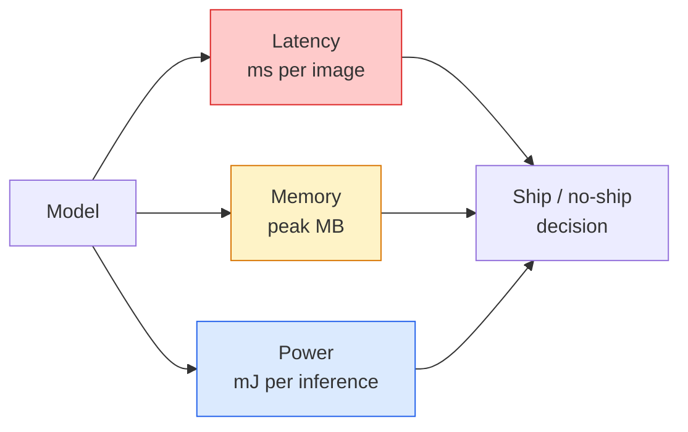

# 实时视觉 —— 边缘部署

> 边缘推理是这样一门手艺:让一个 90 分准确率的模型,在 2 GB 内存的设备上跑出 30 fps。每一个百分点的准确率,都要拿毫秒级的延迟去换。

**类型:** 学习 + 动手构建
**编程语言:** Python
**前置要求:** 第 4 阶段第 04 课(图像分类)、第 10 阶段第 11 课(量化)
**预计耗时:** 约 75 分钟

## 学习目标

- 测量任意 PyTorch 模型的推理延迟、峰值内存和吞吐,读懂 FLOPs / 参数量 / 延迟的三角关系
- 用 PyTorch 的训练后量化把视觉模型量化到 INT8,并验证准确率损失 < 1%
- 导出 ONNX 并用 ONNX Runtime 或 TensorRT 编译;说出三种最常见的导出失败及其修复
- 面对边缘约束时,知道何时选 MobileNetV3、EfficientNet-Lite、ConvNeXt-Tiny 或 MobileViT

## 问题

训练时的视觉模型是个浮点巨兽:1 亿参数、单次前向 10 GFLOPs、2 GB 显存。这些东西,手机放不下,车机放不下,工业相机放不下,无人机也放不下。交付一套视觉系统,意味着把同样的预测塞进一个小 100 倍的预算里。

三个旋钮解决大部分问题:模型选型(同样配方、更小架构)、量化(INT8 代替 FP32)、推理运行时(ONNX Runtime、TensorRT、Core ML、TFLite)。用对它们,就是"能在工作站上跑的 demo"与"能在 30 美元摄像头模组上发货的产品"之间的差别。

本课先建立测量纪律(测不了的东西优化不了),再依次拧这三个旋钮。目标不是学会每一个边缘运行时,而是知道有哪些杠杆,以及如何验证每个杠杆确实起了你以为的作用。

## 概念

### 三笔预算



- **延迟**:看 p50、p95、p99。只看 p50 会掩盖尾部行为,而实时系统恰恰最怕长尾。
- **峰值内存**:设备见过的最大值,不是稳态平均值。它重要,是因为嵌入式目标上 OOM 是致命的。
- **功耗/能量**:电池设备上每次推理的毫焦数。常用 CPU/GPU 利用率 × 时间来近似。

一张(模型, 延迟, 内存, 准确率)的表,就是边缘决策的依据。每个格子都必须在目标设备上实测,而不是工作站上。

### 测量纪律

每条边缘性能分析都该遵守的三条规则:

1. **预热**:测量前先用假数据跑 5–10 次前向。冷缓存和 JIT 编译会让第一组数字失真。
2. **同步**:GPU 负载在计时块前后各调用一次 `torch.cuda.synchronize()`。不做这一步,你测到的是内核派发,不是内核执行。
3. **固定输入尺寸**为生产分辨率。224x224 上的延迟,不等于 512x512 上的延迟。

### FLOPs 作为代理指标

FLOPs(每次推理的浮点运算数)是一个便宜、与设备无关的延迟代理指标。做架构对比时好用,当成绝对墙钟时间就误导了。一个 FLOPs 多 10% 的模型,实际可能快 2 倍——因为它用的是硬件友好的算子(深度卷积编译得好,大个的 7x7 卷积则不然)。

原则:架构搜索看 FLOPs,部署决策看设备实测延迟。

### 一段话讲清量化

把 FP32 的权重和激活换成 INT8:模型体积小 4 倍,内存带宽省 4 倍,在有 INT8 内核的硬件上算力省 2–4 倍(所有现代手机 SoC、所有带 Tensor Core 的 NVIDIA GPU)。视觉任务上,训练后静态量化的准确率损失通常只有 0.1–1 个百分点。

三种类型:

- **动态量化** — 权重量化到 INT8,激活仍用 FP 计算。简单,提速有限。
- **静态量化(训练后)** — 权重量化 + 在一个小校准集上校准激活范围。比动态快得多。
- **量化感知训练(QAT)** — 训练时模拟量化,让模型学着适应。准确率最好,需要标注数据。

视觉任务上,训练后静态量化能用 5% 的力气拿到 95% 的收益。只有当 PTQ 的准确率损失不可接受时,才上 QAT。

### 剪枝与蒸馏

- **剪枝** — 移除不重要的权重(按幅度)或通道(结构化)。对过参数化模型效果好;对本来就紧凑的架构用处有限。
- **蒸馏** — 训练一个小学生模型去模仿大教师的 logits。通常能挽回缩小模型损失的大部分准确率。生产边缘模型的标准做法。

### 推理运行时

- **PyTorch eager** — 慢,不用于部署。仅限开发。
- **TorchScript** — 过时。已被 `torch.compile` 和 ONNX 导出取代。
- **ONNX Runtime** — 中立运行时。CPU、CUDA、CoreML、TensorRT、OpenVINO 都有 ONNX provider。从这里起步。
- **TensorRT** — NVIDIA 的编译器。NVIDIA GPU(工作站和 Jetson)上延迟最佳。可与 ONNX Runtime 集成或独立使用。
- **Core ML** — Apple 的 iOS/macOS 运行时。需要 `.mlmodel` 或 `.mlpackage`。
- **TFLite** — Google 的 Android/ARM 运行时。需要 `.tflite`。
- **OpenVINO** — Intel 的 CPU/VPU 运行时。需要 `.xml` + `.bin`。

实践中的路径:PyTorch -> ONNX -> 按目标选运行时。ONNX 是通用语。

### 边缘架构选型

| 预算 | 模型 | 理由 |
|--------|-------|-----|
| < 3M 参数 | MobileNetV3-Small | 到处都能编译,不错的基线 |
| 3–10M | EfficientNet-Lite-B0 | TFLite 上单位参数准确率最高 |
| 10–20M | ConvNeXt-Tiny | 单位参数准确率最佳,CPU 友好 |
| 20–30M | MobileViT-S 或 EfficientViT | 有 ImageNet 级准确率的 Transformer |
| 30–80M | Swin-V2-Tiny | 如果你的栈支持窗口注意力 |

以上这些,除非有特殊理由,一律量化到 INT8。

```figure
cnn-param-count
```

## 动手构建

### 第 1 步:正确地测延迟

```python
import time
import torch

def measure_latency(model, input_shape, device="cpu", warmup=10, iters=50):
    model = model.to(device).eval()
    x = torch.randn(input_shape, device=device)
    with torch.no_grad():
        for _ in range(warmup):
            model(x)
        if device == "cuda":
            torch.cuda.synchronize()
        times = []
        for _ in range(iters):
            if device == "cuda":
                torch.cuda.synchronize()
            t0 = time.perf_counter()
            model(x)
            if device == "cuda":
                torch.cuda.synchronize()
            times.append((time.perf_counter() - t0) * 1000)
    times.sort()
    return {
        "p50_ms": times[len(times) // 2],
        "p95_ms": times[int(len(times) * 0.95)],
        "p99_ms": times[int(len(times) * 0.99)],
        "mean_ms": sum(times) / len(times),
    }
```

预热、同步、用 `time.perf_counter()`。报告百分位数,不要只报均值。

### 第 2 步:参数量与 FLOP 统计

```python
def parameter_count(model):
    return sum(p.numel() for p in model.parameters())

def flops_estimate(model, input_shape):
    """
    Rough FLOP count for a conv/linear-only model. For production use `fvcore` or `ptflops`.
    """
    total = 0
    def conv_hook(m, inp, out):
        nonlocal total
        c_out, c_in, kh, kw = m.weight.shape
        h, w = out.shape[-2:]
        total += 2 * c_in * c_out * kh * kw * h * w
    def linear_hook(m, inp, out):
        nonlocal total
        total += 2 * m.in_features * m.out_features
    hooks = []
    for m in model.modules():
        if isinstance(m, torch.nn.Conv2d):
            hooks.append(m.register_forward_hook(conv_hook))
        elif isinstance(m, torch.nn.Linear):
            hooks.append(m.register_forward_hook(linear_hook))
    model.eval()
    with torch.no_grad():
        model(torch.randn(input_shape))
    for h in hooks:
        h.remove()
    return total
```

真实项目用 `fvcore.nn.FlopCountAnalysis` 或 `ptflops`,它们能正确处理所有模块类型。

### 第 3 步:训练后静态量化

```python
def quantise_ptq(model, calibration_loader, backend="x86"):
    import torch.ao.quantization as tq
    model = model.eval().cpu()
    model.qconfig = tq.get_default_qconfig(backend)
    tq.prepare(model, inplace=True)
    with torch.no_grad():
        for x, _ in calibration_loader:
            model(x)
    tq.convert(model, inplace=True)
    return model
```

三步:配置、prepare(插入观察器)、用真实数据校准、convert(融合 + 量化)。前提是模型已融合(`Conv -> BN -> ReLU` -> `ConvBnReLU`),`torch.ao.quantization.fuse_modules` 负责这件事。

### 第 4 步:导出 ONNX

```python
def export_onnx(model, sample_input, path="model.onnx"):
    model = model.eval()
    torch.onnx.export(
        model,
        sample_input,
        path,
        input_names=["input"],
        output_names=["output"],
        dynamic_axes={"input": {0: "batch"}, "output": {0: "batch"}},
        opset_version=17,
    )
    return path
```

2026 年,`opset_version=17` 是安全默认。`dynamic_axes` 让 ONNX 模型支持任意批次大小。

### 第 5 步:基准对比各方案

```python
import torch.nn as nn
from torchvision.models import mobilenet_v3_small

def compare_regimes():
    model = mobilenet_v3_small(weights=None, num_classes=10)
    params = parameter_count(model)
    flops = flops_estimate(model, (1, 3, 224, 224))
    lat_fp32 = measure_latency(model, (1, 3, 224, 224), device="cpu")
    print(f"FP32 MobileNetV3-Small: {params:,} params  {flops/1e9:.2f} GFLOPs  "
          f"p50={lat_fp32['p50_ms']:.2f}ms  p95={lat_fp32['p95_ms']:.2f}ms")
```

对 `resnet50`、`efficientnet_v2_s`、`convnext_tiny` 跑同一个函数,你就有了做部署决策所需的对比表。

## 投入使用

生产栈收敛到三条路径之一:

- **Web / serverless**:PyTorch -> ONNX -> ONNX Runtime(CPU 或 CUDA provider)。最简单,对大多数人够用。
- **NVIDIA 边缘(Jetson、GPU 服务器)**:PyTorch -> ONNX -> TensorRT。延迟最好,工程量最大。
- **移动端**:PyTorch -> ONNX -> Core ML(iOS)或 TFLite(Android)。导出前先量化。

测量工具:`torch-tb-profiler`、`nvprof` / `nsys`、macOS 上的 Instruments,都能给出逐层分解。`benchmark_app`(OpenVINO)和 `trtexec`(TensorRT)提供独立 CLI 数字。

## 交付

本课产出:

- `outputs/prompt-edge-deployment-planner.md` — 一个提示词:给定目标设备和延迟 SLA,选定骨干网络、量化策略和运行时。
- `outputs/skill-latency-profiler.md` — 一个技能:写出完整的延迟基准脚本,含预热、同步、百分位统计和内存跟踪。

## 练习

1. **(易)** 在 CPU 上、224x224 输入下,测量 `resnet18`、`mobilenet_v3_small`、`efficientnet_v2_s`、`convnext_tiny` 的 p50 延迟。列表报告,并指出哪个架构的"准确率/毫秒"最优。
2. **(中)** 对 `mobilenet_v3_small` 做训练后静态量化。在 CIFAR-10(或类似数据集)的留出子集上,报告 FP32 vs INT8 的延迟与准确率损失。
3. **(难)** 把 `convnext_tiny` 导出成 ONNX,用 `onnxruntime` 的 `CPUExecutionProvider` 运行,与 PyTorch eager 基线对比延迟。找出 ONNX Runtime 开始变快的第一层,并解释原因。

## 关键术语

| 术语 | 人们常说的是 | 实际含义是 |
|------|----------------|----------------------|
| 延迟 | "有多快" | 从输入到输出的时间;看 p50/p95/p99 百分位,不看均值 |
| FLOPs | "模型大小" | 单次前向的浮点运算数;算力成本的粗略代理 |
| INT8 量化 | "8 位" | 用 8 位整数替换 FP32 权重/激活;体积约小 4 倍,速度快 2–4 倍 |
| PTQ | "训练后量化" | 不重训直接量化已训好的模型;简单,通常够用 |
| QAT | "量化感知训练" | 训练时模拟量化;准确率最好,需要标注数据 |
| ONNX | "中立格式" | 所有主流推理运行时都支持的模型交换格式 |
| TensorRT | "NVIDIA 编译器" | 把 ONNX 编译成针对 NVIDIA GPU 优化的引擎 |
| 蒸馏 | "教师到学生" | 训练小模型模仿大模型的 logits;挽回大部分损失的准确率 |

## 延伸阅读

- [EfficientNet (Tan & Le, 2019)](https://arxiv.org/abs/1905.11946) — 高效架构的复合缩放
- [MobileNetV3 (Howard et al., 2019)](https://arxiv.org/abs/1905.02244) — 移动优先架构,引入 h-swish 与 squeeze-excite
- [A Practical Guide to TensorRT Optimization (NVIDIA)](https://developer.nvidia.com/blog/accelerating-model-inference-with-tensorrt-tips-and-best-practices-for-pytorch-users/) — 如何真正拿到论文里的吞吐数字
- [ONNX Runtime docs](https://onnxruntime.ai/docs/) — 量化、图优化、provider 选择
