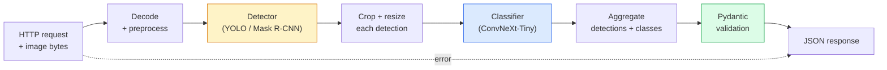

# 构建完整视觉流水线 —— 综合实战

> 生产级视觉系统,是一串模型和规则用数据契约缝合起来的链条。零件在本阶段都已经备好;这次综合实战把它们端到端接起来。

**类型:** 动手构建
**编程语言:** Python
**前置要求:** 第 4 阶段第 01–15 课
**预计耗时:** 约 120 分钟

## 学习目标

- 设计一条生产视觉流水线:检测物体、分类物体、输出结构化 JSON——每条失败路径都有处理
- 把检测器(Mask R-CNN 或 YOLO)、分类器(ConvNeXt-Tiny)和数据契约(Pydantic)插进同一个服务
- 给端到端流水线做基准测试,找出第一个瓶颈(通常是预处理,然后是检测器)
- 交付一个最小 FastAPI 服务:接收图片上传、跑流水线、返回带分类结果的检测

## 问题

单个视觉模型有用;视觉产品是一串模型的链。零售货架审计 = 检测器 + 商品分类器 + 价格 OCR 流水线。自动驾驶 = 2D 检测器 + 3D 检测器 + 分割器 + 跟踪器 + 规划器。医疗预筛 = 分割器 + 区域分类器 + 医生界面。

把这些链条接起来,正是 ML 原型与产品之间的分水岭。模型之间的每个接口,都是 bug 的新窝点;每一次坐标变换、每一次归一化、每一次掩码缩放,都可能悄悄出错。一条流水线的强度,取决于它最弱的接口。

本次实战搭一条最小可行流水线:检测 + 分类 + 结构化输出 + 服务层。第 4 阶段的其他内容都能插进这副骨架:Mask R-CNN 换成 YOLOv8、加一个 OCR 头、加一条分割分支、加一个跟踪器。架构稳定,零件可插拔。

## 概念

### 流水线



七个阶段。两个模型阶段最贵;另外五个阶段,是 bug 的栖息地。

### 用 Pydantic 定义数据契约

每个模型边界都变成一个带类型的对象。这能把沉默的失败变成响亮的报错。

```
Detection(
    box: tuple[float, float, float, float],   # (x1, y1, x2, y2), absolute pixels
    score: float,                              # [0, 1]
    class_id: int,                             # from detector's label map
    mask: Optional[list[list[int]]],           # RLE-encoded if present
)

PipelineResult(
    image_id: str,
    detections: list[Detection],
    classifications: list[Classification],
    inference_ms: float,
)
```

当检测器返回的是 `(cx, cy, w, h)` 而不是 `(x1, y1, x2, y2)` 时,Pydantic 校验会在边界处直接失败,你立刻就能发现——而不是等下游裁剪悄悄返回空区域之后再去调试。

### 延迟花在哪儿

几乎每条视觉流水线都有三条铁律:

1. **预处理往往是最大的单块。** 解码 JPEG、转色彩空间、缩放——全是 CPU 活,还容易被忘记。
2. **检测器吃掉 GPU 时间的大头。** 70–90% 的 GPU 时间花在检测前向上。
3. **后处理(NMS、RLE 编解码)GPU 上便宜,CPU 上贵。** 永远在实际目标设备上 profiling。

知道了时间分布,优化才能排成优先级清单。

### 失败模式

- **空检测** — 返回空列表,别崩。记日志。
- **越界框** — 裁剪前先钳制到图像范围内。
- **过小裁剪块** — 小于分类器最小输入的框,跳过分类。
- **上传损坏** — 返回 400 加具体错误码,不是 500。
- **模型加载失败** — 在服务启动时失败,别拖到第一个请求。

生产流水线处理每一种情况,但不用笼统的 `try/except` 把失败藏起来。每种失败都有一个命名的错误码和对应的响应。

### 批处理

生产服务要同时服务多个客户端。跨请求对检测和分类做批处理,吞吐能成倍提升。代价:等批次凑满会引入额外延迟。典型配置:最多等 20ms 收请求,攒成一批,处理,分发响应。`torchserve` 和 `triton` 原生支持;负载可预期的小服务也可以自己写微型批处理器。

```figure
v4-vision-pipeline
```

## 动手构建

### 第 1 步:数据契约

```python
from pydantic import BaseModel, Field
from typing import List, Optional, Tuple

class Detection(BaseModel):
    box: Tuple[float, float, float, float]
    score: float = Field(ge=0, le=1)
    class_id: int = Field(ge=0)
    mask_rle: Optional[str] = None


class Classification(BaseModel):
    detection_index: int
    class_id: int
    class_name: str
    score: float = Field(ge=0, le=1)


class PipelineResult(BaseModel):
    image_id: str
    detections: List[Detection]
    classifications: List[Classification]
    inference_ms: float
```

五秒钟的代码,在任何正经流水线上都能省一小时调试。

### 第 2 步:最小 Pipeline 类

```python
import time
import numpy as np
import torch
from PIL import Image

class VisionPipeline:
    def __init__(self, detector, classifier, class_names,
                 device="cpu", min_crop=32):
        self.detector = detector.to(device).eval()
        self.classifier = classifier.to(device).eval()
        self.class_names = class_names
        self.device = device
        self.min_crop = min_crop

    def preprocess(self, image):
        """
        image: PIL.Image or np.ndarray (H, W, 3) uint8
        returns: CHW float tensor on device
        """
        if isinstance(image, Image.Image):
            image = np.asarray(image.convert("RGB"))
        tensor = torch.from_numpy(image).permute(2, 0, 1).float() / 255.0
        return tensor.to(self.device)

    @torch.no_grad()
    def detect(self, image_tensor):
        return self.detector([image_tensor])[0]

    @torch.no_grad()
    def classify(self, crops):
        if len(crops) == 0:
            return []
        batch = torch.stack(crops).to(self.device)
        logits = self.classifier(batch)
        probs = logits.softmax(-1)
        scores, cls = probs.max(-1)
        return list(zip(cls.tolist(), scores.tolist()))

    def run(self, image, image_id="anonymous"):
        t0 = time.perf_counter()
        tensor = self.preprocess(image)
        det = self.detect(tensor)

        crops = []
        detections = []
        valid_indices = []
        for i, (box, score, cls) in enumerate(zip(det["boxes"], det["scores"], det["labels"])):
            x1, y1, x2, y2 = [max(0, int(b)) for b in box.tolist()]
            x2 = min(x2, tensor.shape[-1])
            y2 = min(y2, tensor.shape[-2])
            detections.append(Detection(
                box=(x1, y1, x2, y2),
                score=float(score),
                class_id=int(cls),
            ))
            if (x2 - x1) < self.min_crop or (y2 - y1) < self.min_crop:
                continue
            crop = tensor[:, y1:y2, x1:x2]
            crop = torch.nn.functional.interpolate(
                crop.unsqueeze(0),
                size=(224, 224),
                mode="bilinear",
                align_corners=False,
            )[0]
            crops.append(crop)
            valid_indices.append(i)

        class_preds = self.classify(crops)

        classifications = []
        for valid_idx, (cls_id, cls_score) in zip(valid_indices, class_preds):
            classifications.append(Classification(
                detection_index=valid_idx,
                class_id=int(cls_id),
                class_name=self.class_names[cls_id],
                score=float(cls_score),
            ))

        return PipelineResult(
            image_id=image_id,
            detections=detections,
            classifications=classifications,
            inference_ms=(time.perf_counter() - t0) * 1000,
        )
```

每个接口都有类型。每条失败路径都有明确的处理决策。

### 第 3 步:接入检测器和分类器

```python
from torchvision.models.detection import maskrcnn_resnet50_fpn_v2
from torchvision.models import convnext_tiny

# Use ImageNet-pretrained weights for a realistic pipeline without training
detector = maskrcnn_resnet50_fpn_v2(weights="DEFAULT")
classifier = convnext_tiny(weights="DEFAULT")
class_names = [f"imagenet_class_{i}" for i in range(1000)]

pipe = VisionPipeline(detector, classifier, class_names)

# Smoke test with a synthetic image
test_image = (np.random.rand(400, 600, 3) * 255).astype(np.uint8)
result = pipe.run(test_image, image_id="demo")
print(result.model_dump_json(indent=2)[:500])
```

### 第 4 步:FastAPI 服务

```python
from fastapi import FastAPI, UploadFile, HTTPException
from io import BytesIO

app = FastAPI()
pipe = None  # initialised on startup

@app.on_event("startup")
def load():
    global pipe
    detector = maskrcnn_resnet50_fpn_v2(weights="DEFAULT").eval()
    classifier = convnext_tiny(weights="DEFAULT").eval()
    pipe = VisionPipeline(detector, classifier, class_names=[f"c{i}" for i in range(1000)])

@app.post("/detect")
async def detect_endpoint(file: UploadFile):
    if file.content_type not in {"image/jpeg", "image/png", "image/webp"}:
        raise HTTPException(status_code=400, detail="unsupported image type")
    data = await file.read()
    try:
        img = Image.open(BytesIO(data)).convert("RGB")
    except Exception:
        raise HTTPException(status_code=400, detail="cannot decode image")
    result = pipe.run(img, image_id=file.filename or "upload")
    return result.model_dump()
```

用 `uvicorn main:app --host 0.0.0.0 --port 8000` 启动。用 `curl -F 'file=@dog.jpg' http://localhost:8000/detect` 测试。

### 第 5 步:给流水线做基准

```python
import time

def benchmark(pipe, num_runs=20, image_size=(400, 600)):
    img = (np.random.rand(*image_size, 3) * 255).astype(np.uint8)
    pipe.run(img)  # warm up

    stages = {"preprocess": [], "detect": [], "classify": [], "total": []}
    for _ in range(num_runs):
        t0 = time.perf_counter()
        tensor = pipe.preprocess(img)
        t1 = time.perf_counter()
        det = pipe.detect(tensor)
        t2 = time.perf_counter()
        crops = []
        for box in det["boxes"]:
            x1, y1, x2, y2 = [max(0, int(b)) for b in box.tolist()]
            x2 = min(x2, tensor.shape[-1])
            y2 = min(y2, tensor.shape[-2])
            if (x2 - x1) >= pipe.min_crop and (y2 - y1) >= pipe.min_crop:
                crop = tensor[:, y1:y2, x1:x2]
                crop = torch.nn.functional.interpolate(
                    crop.unsqueeze(0), size=(224, 224), mode="bilinear", align_corners=False
                )[0]
                crops.append(crop)
        pipe.classify(crops)
        t3 = time.perf_counter()
        stages["preprocess"].append((t1 - t0) * 1000)
        stages["detect"].append((t2 - t1) * 1000)
        stages["classify"].append((t3 - t2) * 1000)
        stages["total"].append((t3 - t0) * 1000)

    for stage, times in stages.items():
        times.sort()
        print(f"{stage:12s}  p50={times[len(times)//2]:7.1f} ms  p95={times[int(len(times)*0.95)]:7.1f} ms")
```

CPU 上的典型输出:预处理约 3 ms,检测 300–500 ms,分类 20–40 ms,总计 350–550 ms。GPU 上检测只要 20–40 ms,预处理 + 分类的相对占比就开始显眼了。

## 投入使用

生产模板收敛到同一个结构,外加:

- **模型版本管理** — 响应中永远记录模型名称和权重哈希。
- **每请求 trace ID** — 每个请求在每个阶段的耗时都记日志,慢响应才能回溯到具体阶段。
- **兜底路径** — 分类器超时时,返回不带分类的检测结果,而不是让整个请求失败。
- **安全过滤器** — NSFW / PII 过滤在分类之后、响应离开服务之前运行。
- **批量端点** — `/detect_batch` 接收图片 URL 列表,做批量处理。

生产服务框架:`torchserve`、`Triton Inference Server` 和 `BentoML` 开箱提供批处理、版本管理、指标和健康检查。直接跑 `FastAPI` 适合原型和小规模产品。

## 交付

本课产出:

- `outputs/prompt-vision-service-shape-reviewer.md` — 一个提示词:审查视觉服务代码中的契约/响应结构违规,并指出第一个会引发故障的 bug。
- `outputs/skill-pipeline-budget-planner.md` — 一个技能:给定目标延迟与吞吐,为流水线每个阶段分配时间预算,并标记哪个阶段会最先超支。

## 练习

1. **(易)** 在任意开放数据集的 10 张图上跑这条流水线。报告每阶段平均耗时,以及每张图检测数量的分布。
2. **(中)** 给 `Detection` 加 mask 输出字段,用 RLE 编码。验证即使一张图有 10 个物体,JSON 也能控制在 1MB 以内。
3. **(难)** 在分类器前加一个微型批处理器:最多等 10ms 收集裁剪块,一次 GPU 调用全部分类,按请求分发结果。测量每秒 5 个并发请求下的吞吐提升和新增延迟。

## 关键术语

| 术语 | 人们常说的是 | 实际含义是 |
|------|----------------|----------------------|
| 流水线 | "那套系统" | 预处理、推理、后处理组成的有序链条,相邻环节之间是带类型的接口 |
| 数据契约 | "那个 schema" | 每个阶段输入输出都必须遵守的 Pydantic / dataclass 定义;在边界处抓住集成 bug |
| 预处理 | "进模型之前" | 解码、色彩转换、缩放、归一化;通常是最大的 CPU 时间黑洞 |
| 后处理 | "出模型之后" | NMS、掩码缩放、阈值、RLE 编码;GPU 上便宜,CPU 上贵 |
| 微型批处理器 | "攒够再前向" | 在固定时间窗内收集多个请求,合并成单批次做一次前向的聚合器 |
| Trace ID | "请求 id" | 每个请求的标识,在每个阶段记日志,慢请求才能端到端回溯 |
| 失败码 | "命名的错误" | 每类失败一个具体错误码,而不是笼统的 500;让客户端能做重试逻辑 |
| 健康检查 | "就绪探针" | 报告服务能否应答的廉价端点;负载均衡器依赖它 |

## 延伸阅读

- [Full Stack Deep Learning — Deploying Models](https://fullstackdeeplearning.com/course/2022/lecture-5-deployment/) — 生产 ML 部署的经典总览
- [BentoML docs](https://docs.bentoml.com) — 带批处理、版本管理和指标的服务框架
- [torchserve docs](https://pytorch.org/serve/) — PyTorch 官方服务库
- [NVIDIA Triton Inference Server](https://developer.nvidia.com/triton-inference-server) — 高吞吐服务,带批处理与多模型支持
