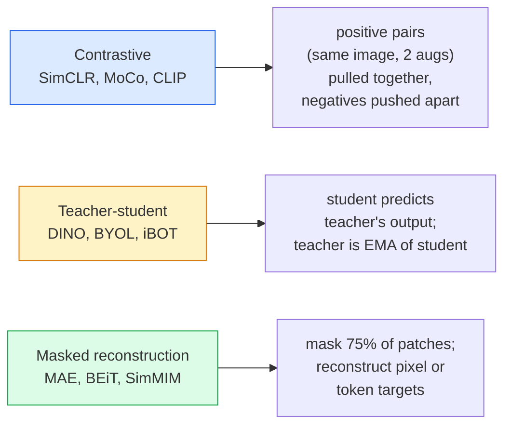

# 自监督视觉 —— SimCLR、DINO、MAE

> 标签是监督式视觉的瓶颈。自监督预训练把标签拿掉:在 1 亿张无标注图像上学视觉特征,再在 1 万张有标注图像上微调。

**类型:** 学习 + 动手构建
**编程语言:** Python
**前置要求:** 第 4 阶段第 04 课(图像分类)、第 4 阶段第 14 课(ViT)
**预计耗时:** 约 75 分钟

## 学习目标

- 讲清三大自监督家族——对比学习(SimCLR)、师生蒸馏(DINO)、掩码重建(MAE)——以及各自在优化什么
- 从零实现 InfoNCE 损失,并解释为什么 512 的批次有效、32 的批次失败
- 解释为什么 MAE 的 75% 掩码率不是拍脑袋,以及它与 BERT 文本 15% 掩码率的区别
- 用 DINOv2 或 MAE 的 ImageNet 检查点做 linear probing 和零样本检索

## 问题

监督版 ImageNet 有 130 万张标注图像,标注成本估计 1000 万美元。医疗和工业数据集更小、标注更贵。每个视觉团队都在问:能不能先在便宜的无标注数据上预训练——YouTube 帧、网络爬图、监控录像、卫星扫描——再在小规模标注集上微调?

自监督学习就是答案。在 LAION 或 JFT 上训练的现代自监督 ViT,微调后能追平甚至击败监督版 ImageNet 准确率,而且在下游任务(检测、分割、深度估计)上的迁移效果好于监督预训练。DINOv2(Meta, 2023)和 MAE(Meta, 2022)是当前可迁移视觉特征的生产默认。

观念上的转变在于:代理任务(pretext task)——模型被训练去做的那件事——不必就是下游任务。重要的是它能逼模型学到有用的特征。预测灰度图的颜色、把图像旋转后让模型分类旋转角度、遮住 patch 再重建——都管用。真正能规模化的三条路线是:对比学习、师生蒸馏、掩码重建。

## 概念

### 三大流派



### 对比学习(SimCLR)

取一张图,做两次随机增强,得到两个视图。两个视图过同一个编码器加一个投影头。最小化这样一个损失:"这两个嵌入应该靠近","这个嵌入应该远离批次里其他所有图像的嵌入"。

```
Loss for positive pair (z_i, z_j) among 2N views per batch:

   L_ij = -log( exp(sim(z_i, z_j) / tau) / sum_k in batch \ {i} exp(sim(z_i, z_k) / tau) )

sim = cosine similarity
tau = temperature (0.1 standard)
```

这就是 InfoNCE 损失。它要求每个正样本配大量负样本,所以批次大小很关键——SimCLR 需要 512–8192。MoCo 引入了历史批次的动量队列,把负样本数量与批次大小解耦。

### 师生蒸馏(DINO)

两个架构相同的网络:学生和教师。教师是学生权重的指数滑动平均(EMA)。两者都看图像的增强视图,训练学生的输出逼近教师的输出——不需要显式负样本。

```
loss = CE( student_output(view_1),  teacher_output(view_2) )
     + CE( student_output(view_2),  teacher_output(view_1) )

teacher_weights = m * teacher_weights + (1 - m) * student_weights   (m ≈ 0.996)
```

为什么不会坍缩成"永远输出常数":教师输出做了中心化(减去逐维度均值)和锐化(除以小温度)。中心化防止某个维度独大,锐化防止输出坍缩成均匀分布。

DINO 正是 DINOv2 在 1.42 亿张精选图像上放大的方法。产出的特征,是当前零样本视觉检索和稠密预测的 SOTA。

### 掩码重建(MAE)

把 ViT 输入 75% 的 patch 遮掉,只让可见的 25% 过编码器。一个小解码器拿到编码器输出,加上遮罩位置的 mask token,训练目标是重建被遮 patch 的像素。

```
Encoder:  visible 25% of patches -> features
Decoder:  features + mask tokens at masked positions -> reconstructed pixels
Loss:     MSE between reconstructed and original pixels on masked patches only
```

让 MAE 成立的关键设计:

- **75% 掩码率** —— 很高。逼编码器学语义特征;只遮 25% 就近乎白送(相邻像素相关性太强,CNN 都能轻松搞定)。
- **非对称编码器/解码器** —— 大 ViT 编码器只看得见 patch;小解码器(8 层、512 维)负责重建。预训练比朴素 BEiT 快 3 倍。
- **像素级重建目标** —— 比 BEiT 的 token 化目标更简单,在 ViT 上效果也更好。

预训练结束后,扔掉解码器,编码器就是特征提取器。

### 为什么是 75% 而不是 15%

BERT 遮 15% 的 token,MAE 遮 75%。差别在信息密度。

- 自然语言每个 token 的熵很高。遮 15% 依然很难,因为每个被遮位置都有多种合理补全。
- 图像 patch 的熵很低——未遮的邻域往往几乎完全决定了被遮 patch 的像素。想让预测必须依赖语义理解,就得下重手遮。

75% 高到让简单的空间外推解不了题,编码器必须真正表示图像内容。

### Linear-probe 评估

自监督预训练之后,标准评估是 **linear probe**:冻结编码器,只在其上用 ImageNet 标签训一个线性分类器,报 top-1 准确率。

- SimCLR ResNet-50:约 71%(2020)
- DINO ViT-S/16:约 77%(2021)
- MAE ViT-L/16:约 76%(2022)
- DINOv2 ViT-g/14:约 86%(2023)

Linear probe 是特征质量的纯净度量;微调通常再加 2–5 个点,但混入了头部重训的影响。

```figure
data-augmentation
```

## 动手构建

### 第 1 步:双视图增强流水线

```python
import torch
import torchvision.transforms as T

two_view_train = lambda: T.Compose([
    T.RandomResizedCrop(96, scale=(0.2, 1.0)),
    T.RandomHorizontalFlip(),
    T.ColorJitter(0.4, 0.4, 0.4, 0.1),
    T.RandomGrayscale(p=0.2),
    T.ToTensor(),
])


class TwoViewDataset(torch.utils.data.Dataset):
    def __init__(self, base):
        self.base = base
        self.aug = two_view_train()

    def __len__(self):
        return len(self.base)

    def __getitem__(self, i):
        img, _ = self.base[i]
        v1 = self.aug(img)
        v2 = self.aug(img)
        return v1, v2
```

每次 __getitem__ 返回同一图像的两个增强视图,不需要标签。

### 第 2 步:InfoNCE 损失

```python
import torch.nn.functional as F

def info_nce(z1, z2, tau=0.1):
    """
    z1, z2: (N, D) L2-normalised embeddings of paired views
    """
    N, D = z1.shape
    z = torch.cat([z1, z2], dim=0)  # (2N, D)
    sim = z @ z.T / tau              # (2N, 2N)

    mask = torch.eye(2 * N, dtype=torch.bool, device=z.device)
    sim = sim.masked_fill(mask, float("-inf"))

    targets = torch.cat([torch.arange(N, 2 * N), torch.arange(0, N)]).to(z.device)
    return F.cross_entropy(sim, targets)
```

调用前先把嵌入 L2 归一化。`tau=0.1` 是 SimCLR 默认;更低的温度让损失更尖锐,需要更多负样本。

### 第 3 步:InfoNCE 健全性检查

```python
z1 = F.normalize(torch.randn(16, 32), dim=-1)
z2 = z1.clone()
loss_same = info_nce(z1, z2, tau=0.1).item()
z2_random = F.normalize(torch.randn(16, 32), dim=-1)
loss_random = info_nce(z1, z2_random, tau=0.1).item()
print(f"InfoNCE with identical pairs:  {loss_same:.3f}")
print(f"InfoNCE with random pairs:     {loss_random:.3f}")
```

完全相同的配对应给出很低的损失(大批次加低温度时接近 0)。随机配对在 16 对批次下应给出 log(2N-1) ≈ log(31) ≈ 3.4。

### 第 4 步:MAE 式掩码

```python
def random_mask_indices(num_patches, mask_ratio=0.75, seed=0):
    g = torch.Generator().manual_seed(seed)
    n_keep = int(num_patches * (1 - mask_ratio))
    perm = torch.randperm(num_patches, generator=g)
    visible = perm[:n_keep]
    masked = perm[n_keep:]
    return visible.sort().values, masked.sort().values


num_patches = 196
visible, masked = random_mask_indices(num_patches, mask_ratio=0.75)
print(f"visible: {len(visible)} / {num_patches}")
print(f"masked:  {len(masked)} / {num_patches}")
```

简单、快速,给定种子结果确定。真正的 MAE 实现会批量化,并保持每个样本各自的掩码。

## 投入使用

DINOv2 是 2026 年的生产标准:

```python
import torch
from transformers import AutoImageProcessor, AutoModel

processor = AutoImageProcessor.from_pretrained("facebook/dinov2-base")
model = AutoModel.from_pretrained("facebook/dinov2-base")
model.eval()

# Per-image embeddings for zero-shot retrieval
with torch.no_grad():
    inputs = processor(images=[pil_image], return_tensors="pt")
    outputs = model(**inputs)
    embedding = outputs.last_hidden_state[:, 0]  # CLS token
```

得到的 768 维嵌入,是现代图像检索、稠密对应和零样本迁移流水线的骨干。下游任务微调,往往一个线性头就够。

图文嵌入的对应物是 SigLIP 或 OpenCLIP;MAE 式微调的所有检查点在 `timm` 仓库里都有。

## 交付

本课产出:

- `outputs/prompt-ssl-pretraining-picker.md` — 一个提示词:按数据集规模、算力和下游任务,在 SimCLR / MAE / DINOv2 中做选择。
- `outputs/skill-linear-probe-runner.md` — 一个技能:为任意冻结编码器 + 标注数据集写出 linear-probe 评估代码。

## 练习

1. **(易)** 验证:对于对齐良好的嵌入,降低温度时 InfoNCE 损失下降;对于随机嵌入,降低温度时损失上升。画出 `tau in [0.05, 0.1, 0.2, 0.5]` 与损失的关系图。
2. **(中)** 实现 DINO 式的中心化缓冲。证明不做中心化,学生会在几个 epoch 内坍缩成常数向量。
3. **(难)** 用第 10 课的 TinyUNet 作骨干,在 CIFAR-100 上训练 MAE。报告第 10、50、200 个 epoch 的 linear-probe 准确率。证明在同一个 1,000 图子集上,MAE 预训练的 linear probe 击败从零监督训练的 linear probe。

## 关键术语

| 术语 | 人们常说的是 | 实际含义是 |
|------|----------------|----------------------|
| 自监督 | "不要标签" | 从无标注数据产出有用表示的代理任务 |
| 代理任务 | "那个假任务" | SSL 训练时用的目标(重建 patch、匹配视图);预训练后即弃用 |
| Linear probe | "冻结编码器 + 线性头" | 标准 SSL 评估:只在冻结特征上训一个线性分类器 |
| InfoNCE | "对比损失" | 对余弦相似度做 softmax;正样本对是目标类,其余全是负样本 |
| EMA 教师 | "滑动平均教师" | 权重为学生指数滑动平均的教师;BYOL、MoCo、DINO 都在用 |
| 掩码率 | "遮住多少 patch" | MAE 中被遮 patch 的比例;视觉 75%,文本 15% |
| 表示坍缩 | "输出变常数" | SSL 失败模式:编码器对一切输入输出同一个常向量;靠中心化、锐化或负样本预防 |
| DINOv2 | "生产级 SSL 骨干" | Meta 2023 年的自监督 ViT;2026 年最强的通用图像特征 |

## 延伸阅读

- [SimCLR (Chen et al., 2020)](https://arxiv.org/abs/2002.05709) — 对比学习参考文献
- [DINO (Caron et al., 2021)](https://arxiv.org/abs/2104.14294) — 动量师生框架,含中心化与锐化
- [MAE (He et al., 2022)](https://arxiv.org/abs/2111.06377) — ViT 的掩码自编码器预训练
- [DINOv2 (Oquab et al., 2023)](https://arxiv.org/abs/2304.07193) — 把自监督 ViT 放大成生产级特征
