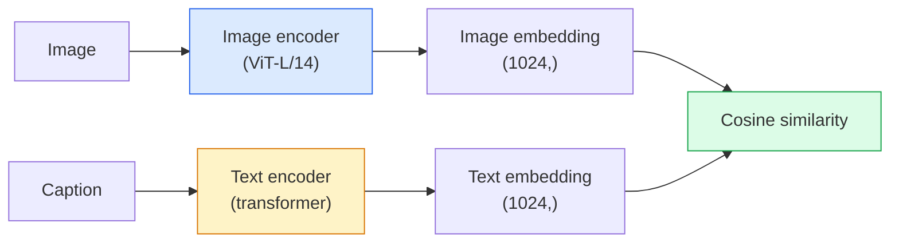

# 开放词表视觉 —— CLIP

> 把图像编码器和文本编码器放在一起训练,让匹配的(图像, 描述)对落到共享空间中的同一个点。全部戏法就这么多。

**类型:** 使用 + 动手构建
**编程语言:** Python
**前置要求:** 第 4 阶段第 14 课(ViT)、第 4 阶段第 17 课(自监督)
**预计耗时:** 约 45 分钟

## 学习目标

- 解释 CLIP 的双塔架构与对比训练目标
- 不做任何任务特定训练,直接用预训练 CLIP(或 SigLIP)做零样本分类
- 从零实现零样本分类:编码类别提示、算余弦相似度、取 argmax
- 分清 CLIP、SigLIP、OpenCLIP 与 LLaVA/LLaMA-vision 模型——2026 年各自做什么用

## 问题

传统分类器是封闭词表的:1000 类的 ImageNet 模型只能预测那 1000 个标签。每来一个新品类,就要标注数据、重训分类头。

CLIP(Radford et al., OpenAI 2021)证明:用从网上爬来的 4 亿(图像, 描述)对训练出的模型,推理时可以对任意类别集合做分类——类别完全用自然语言描述。你要给它一个新类,写一句话就行。

这种能力——零样本迁移——就是为什么每个现代视觉系统都以 CLIP 家族检查点起家:检测(Grounding DINO、OWL-ViT)、分割(CLIPSeg、SAM)、检索、内容审核、VLM,以及文生图,全都建立在 CLIP 式联合嵌入之上。

## 概念

### 双塔



两个编码器最后都是一个线性投影,投到同一嵌入维度(CLIP-B/32 是 512,CLIP-L/14 是 1024)。L2 归一化后算余弦相似度。

### 训练目标

给一批 N 个(图像, 描述)对,构建 NxN 相似度矩阵。训练两个编码器,让对角线(匹配对)相似度高、非对角线(不匹配)相似度低。

```
sim_matrix = image_embeddings @ text_embeddings.T / tau

loss_i2t = cross_entropy(sim_matrix,       targets=arange(N))
loss_t2i = cross_entropy(sim_matrix.T,     targets=arange(N))
loss = (loss_i2t + loss_t2i) / 2
```

对称，是因为图到文、文到图两个方向的检索都要成立。`tau`(温度)通常作为标量参数学习,初始化为 0.07。

### SigLIP:更好的损失

SigLIP(Zhai et al., 2023)把 softmax 换成了逐对 sigmoid:

```
loss = mean over pairs of log(1 + exp(-y_ij * sim_ij))
y_ij = +1 if matching, -1 otherwise
```

逐对损失去掉了 CLIP 必需的批次级归一化。SigLIP 在小批次下训练更好,同等数据量下追平或超过 CLIP。

### 零样本分类

拿到一个训好的 CLIP:

1. 为每个类组一句提示:"a photo of a {class}"。
2. 用文本编码器编码所有类别提示 -> `T`,形状 (C, d)。
3. 编码测试图像 -> `I`,形状 (1, d)。
4. 相似度 = `I @ T.T`,形状 (1, C)。
5. argmax -> 预测类别。

提示词工程很重要。OpenAI 为 ImageNet 发布了 80 个提示模板("a photo of a {}"、"a blurry photo of a {}"、"a sketch of a {}"……)。每个类把所有模板的嵌入平均,能再涨 1–3% top-1 准确率。

### 2026 年,CLIP 式模型用在哪儿

- **零样本分类** — 直接用。
- **图像检索** — 所有图像离线编码一次,推理时编码查询。
- **文本条件检测** — Grounding DINO、OWL-ViT 把 CLIP 文本塔包在检测器外面。
- **文本条件分割** — CLIPSeg;SAM 经由 CLIP 接受文本提示输入。
- **VLM** — LLaVA、Qwen-VL、InternVL 把 CLIP 家族视觉编码器接进 LLM。
- **文生图** — Stable Diffusion、DALL-E 3 以 CLIP 文本嵌入为条件。

有了共享嵌入空间,每一个视觉+语言任务都变成了距离计算。

```figure
clip-contrastive
```

## 动手构建

### 第 1 步:迷你双塔模型

真 CLIP 是 ViT + Transformer。本课为了让训练信号在 CPU 上可见,双塔用跑在预提取特征上的小 MLP。

```python
import torch
import torch.nn as nn
import torch.nn.functional as F


class TwoTower(nn.Module):
    def __init__(self, img_in=128, txt_in=64, emb=64):
        super().__init__()
        self.image_proj = nn.Sequential(nn.Linear(img_in, 128), nn.ReLU(), nn.Linear(128, emb))
        self.text_proj = nn.Sequential(nn.Linear(txt_in, 128), nn.ReLU(), nn.Linear(128, emb))
        self.logit_scale = nn.Parameter(torch.ones([]) * 2.6592)  # ln(1/0.07)

    def forward(self, img_feats, txt_feats):
        i = F.normalize(self.image_proj(img_feats), dim=-1)
        t = F.normalize(self.text_proj(txt_feats), dim=-1)
        return i, t, self.logit_scale.exp()
```

两个投影,同维输出,可学习温度。形状与真 CLIP API 一致。

### 第 2 步:对比损失

```python
def clip_loss(image_emb, text_emb, logit_scale):
    N = image_emb.size(0)
    sim = logit_scale * image_emb @ text_emb.T
    targets = torch.arange(N, device=sim.device)
    l_i = F.cross_entropy(sim, targets)
    l_t = F.cross_entropy(sim.T, targets)
    return (l_i + l_t) / 2
```

对称。logit_scale 越高,softmax 越尖锐,置信度越高,但有不稳定风险。

### 第 3 步:零样本分类器

```python
@torch.no_grad()
def zero_shot_classify(model, image_feats, class_text_feats, class_names):
    """
    image_feats:      (N, img_in)
    class_text_feats: (C, txt_in)   one averaged embedding per class
    """
    i = F.normalize(model.image_proj(image_feats), dim=-1)
    t = F.normalize(model.text_proj(class_text_feats), dim=-1)
    sim = i @ t.T
    pred = sim.argmax(dim=-1)
    return [class_names[p] for p in pred.tolist()]
```

每步一行。这就是生产 CLIP 检查点上用的那一套零样本流程,分毫不差。

### 第 4 步:健全性检查

```python
torch.manual_seed(0)
model = TwoTower()

img = torch.randn(8, 128)
txt = torch.randn(8, 64)
i, t, scale = model(img, txt)
loss = clip_loss(i, t, scale)
print(f"batch size: {i.size(0)}   loss: {loss.item():.3f}")
```

随机初始化的模型,损失应接近 `log(N) = log(8) = 2.08`——还没学到任何结构时,对称交叉熵的理论值。

## 投入使用

OpenCLIP 是 2026 年的社区默认:

```python
import open_clip
import torch
from PIL import Image

model, _, preprocess = open_clip.create_model_and_transforms("ViT-B-32", pretrained="laion2b_s34b_b79k")
tokenizer = open_clip.get_tokenizer("ViT-B-32")

image = preprocess(Image.open("dog.jpg")).unsqueeze(0)
text = tokenizer(["a photo of a dog", "a photo of a cat", "a photo of a car"])

with torch.no_grad():
    image_features = model.encode_image(image)
    text_features = model.encode_text(text)
    image_features = image_features / image_features.norm(dim=-1, keepdim=True)
    text_features = text_features / text_features.norm(dim=-1, keepdim=True)
    probs = (100.0 * image_features @ text_features.T).softmax(dim=-1)

print(probs)
```

SigLIP 更新、小批次下训得更好,新工作优先选它:`google/siglip-base-patch16-224`。Hugging Face 上两者都有。

## 交付

本课产出:

- `outputs/prompt-zero-shot-class-picker.md` — 一个提示词:给定类别列表和领域,为零样本 CLIP 设计类别模板。
- `outputs/skill-image-text-retriever.md` — 一个技能:用任意 CLIP 检查点构建图像嵌入索引,支持以文搜图和以图搜图。

## 练习

1. **(易)** 用预训练 OpenCLIP ViT-B/32,配 80 模板提示集,在 CIFAR-10 上做零样本分类。报告 top-1 准确率,应在 85–90% 左右。
2. **(中)** 在同一个 CIFAR-10 任务上,对比单模板("a photo of a {}")与 80 模板平均嵌入。量化差距并解释模板为什么有帮助。
3. **(难)** 构建零样本图像检索索引:用 CLIP 编码 1,000 张图,建 FAISS 索引,用自然语言描述查询。手写 20 个留出查询,报告检索 recall@5。

## 关键术语

| 术语 | 人们常说的是 | 实际含义是 |
|------|----------------|----------------------|
| 双塔 | "双编码器" | 独立的图像编码器与文本编码器,末端接同维投影头 |
| 零样本 | "不做任务训练" | 推理时对只用文本描述的类别做分类;不碰任何标签 |
| 温度 / logit_scale | "tau" | softmax 前缩放相似度矩阵的可学习标量 |
| 提示模板 | "A photo of a {}" | 包在类名外面的自然语言壳;多模板平均能提升零样本准确率 |
| CLIP | "图文模型" | OpenAI 2021 年的模型;2026 年整个领域的基本词汇 |
| SigLIP | "sigmoid 版 CLIP" | 把 softmax 换成逐对 sigmoid;小批次下训练更好 |
| OpenCLIP | "开源复现" | 社区在 LAION 上训练的 CLIP 变体;开源流水线的生产默认 |
| VLM | "视觉语言模型" | CLIP 家族编码器 + LLM,训练目标是回答关于图像的问题 |

## 延伸阅读

- [CLIP: Learning Transferable Visual Models from Natural Language Supervision (Radford et al., 2021)](https://arxiv.org/abs/2103.00020)
- [SigLIP: Sigmoid Loss for Language-Image Pre-Training (Zhai et al., 2023)](https://arxiv.org/abs/2303.15343)
- [OpenCLIP](https://github.com/mlfoundations/open_clip) — 社区代码库
- [DINOv2 vs CLIP vs MAE: a features comparison](https://huggingface.co/blog/dinov2) — HF 指南,含并排使用场景
