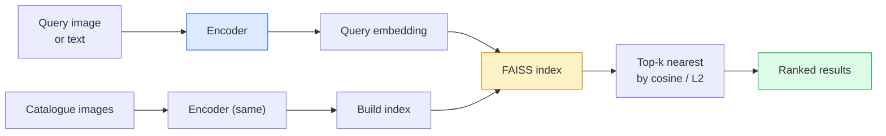

# 图像检索与度量学习

> 检索系统按嵌入空间中的距离给候选排序。度量学习这门手艺,就是塑造这个空间,让距离表达你想要的意义。

**类型:** 动手构建
**编程语言:** Python
**前置要求:** 第 4 阶段 第 14 课(ViT)、第 4 阶段 第 18 课(CLIP)
**预计耗时:** 约 45 分钟

## 学习目标

- 解释 triplet、contrastive 和基于代理(proxy)的度量学习损失,并为给定数据集选对损失
- 正确实现 L2 归一化与余弦相似度,并厘清"同一物品"检索与"同一类别"检索的区别
- 构建 FAISS 索引,按文本和按图像查询,并在留出查询集上报告 recall@K
- 把 DINOv2、CLIP、SigLIP 当作现成的嵌入骨干使用,知道各自何时胜出

## 问题

检索在生产级视觉系统里无处不在:查重、以图搜图、视觉搜索("找相似商品")、人脸再识别、安防场景的行人重识别(re-ID)、电商的实例级匹配。产品问题永远只有一个:"给定这张查询图,给我的商品库排个序。"

两个设计决策决定整个系统:嵌入——用什么模型产出向量;索引——如何大规模找最近邻。在 2026 年,两者都是现成商品(嵌入用 DINOv2,索引用 FAISS),这反而抬高了门槛:难的部分是为你的应用定义*什么算相似*,然后塑造嵌入空间,让距离与之匹配。

这种塑造就是度量学习。它是个小领域,但杠杆极高。

## 概念

### 检索一览



### 四大损失家族

| 损失 | 需要 | 优点 | 缺点 |
|------|----------|------|------|
| **Contrastive** | (anchor, positive)+ 负样本 | 简单,任何成对标注都能用 | 负样本不够多时收敛慢 |
| **Triplet** | (anchor, positive, negative) | 直观,直接控制间隔 | 难例三元组挖掘成本高 |
| **NT-Xent / InfoNCE** | 成对 + 批内挖掘负样本 | 可扩展到大批次 | 需要大批次或动量队列 |
| **Proxy 类(ProxyNCA)** | 只要类别标签 | 快、稳、无需挖掘 | 小数据集上可能对 proxy 过拟合 |

对大多数生产场景:先用预训练骨干,只有当现成嵌入在你的测试集上表现不佳时,才加度量学习微调。

### Triplet 损失的正式定义

```
L = max(0, ||f(a) - f(p)||^2 - ||f(a) - f(n)||^2 + margin)
```

把锚点 `a` 拉向正样本 `p`,推离负样本 `n`,`margin` 保证两者之间留出一个间隔。这种三图结构可以推广到任何相似度排序。

挖掘很关键:容易的三元组(`n` 已经离 `a` 很远)贡献零损失,只有难三元组在教网络。semi-hard 挖掘(`n` 比 `p` 远、但仍在 margin 之内)是 2016 年 FaceNet 的配方,至今仍占主流。

### 余弦相似度 vs L2

两种度量,两种惯例:

- **余弦:** 向量夹角。要求嵌入做 L2 归一化。
- **L2:** 欧氏距离。原始或归一化嵌入都能用,但通常搭配"L2 归一化 + 平方 L2"。

对大多数现代网络,两者等价:当 `||a|| = ||b|| = 1` 时 `||a - b||² = 2 − 2cos(a, b)`。选与你嵌入训练方式一致的惯例;混用会悄悄改变"最近"的含义。

### Recall@K

标准检索指标:

```
recall@K = fraction of queries where at least one correct match is in the top K results
```

recall@1、@5、@10 并排报告。recall@10 高于 0.95 而 recall@1 低于 0.5,说明嵌入空间结构对了但排序噪声大——试试更长的微调,或加一步重排序。

对查重场景,precision@K 更重要,因为每个误报都是用户可见的错误;对视觉搜索,recall@K 才是产品信号。

### 一段话讲清 FAISS

Facebook AI Similarity Search,最近邻搜索的事实标准库。三种索引选择:

- `IndexFlatIP` / `IndexFlatL2` —— 暴力精确搜索,无需训练。约 100 万向量以内用它。
- `IndexIVFFlat` —— 把空间划分成 K 个单元,只搜最近的几个单元。近似、快,需要训练数据。
- `IndexHNSW` —— 基于图,查询量大时最快,索引体积大。

10 万向量,用 `IndexFlatIP` 配余弦相似度;1000 万,用 `IndexIVFFlat`;1 亿以上,再加上乘积量化(`IndexIVFPQ`)。

### 实例级检索 vs 类别级检索

两个名字相同、实质迥异的问题:

- **类别级** —— "在我的商品库里找猫。"类条件相似;现成的 CLIP / DINOv2 嵌入就很好用。
- **实例级** —— "在我的商品库里找*这一个确切商品*。"需要对同类中视觉相似物体做细粒度区分;现成嵌入表现欠佳;度量学习微调才是关键。

选模型之前,先问清自己在解哪一个问题。

```figure
metric-embedding
```

## 动手构建

### 第 1 步:Triplet 损失

```python
import torch
import torch.nn.functional as F

def triplet_loss(anchor, positive, negative, margin=0.2):
    d_ap = F.pairwise_distance(anchor, positive, p=2)
    d_an = F.pairwise_distance(anchor, negative, p=2)
    return F.relu(d_ap - d_an + margin).mean()
```

一行搞定,对 L2 归一化或原始嵌入都适用。

### 第 2 步:Semi-hard 挖掘

给定一批嵌入和标签,为每个锚点找最难的 semi-hard 负样本。

```python
def semi_hard_negatives(emb, labels, margin=0.2):
    dist = torch.cdist(emb, emb)
    same_class = labels[:, None] == labels[None, :]
    diff_class = ~same_class
    N = emb.size(0)

    positives = dist.clone()
    positives[~same_class] = float("-inf")
    positives.fill_diagonal_(float("-inf"))
    pos_idx = positives.argmax(dim=1)

    semi_hard = dist.clone()
    semi_hard[same_class] = float("inf")
    d_ap = dist[torch.arange(N), pos_idx].unsqueeze(1)
    semi_hard[dist <= d_ap] = float("inf")
    neg_idx = semi_hard.argmin(dim=1)

    fallback_mask = semi_hard[torch.arange(N), neg_idx] == float("inf")
    if fallback_mask.any():
        hardest = dist.clone()
        hardest[same_class] = float("inf")
        neg_idx = torch.where(fallback_mask, hardest.argmin(dim=1), neg_idx)
    return pos_idx, neg_idx
```

每个锚点拿到同类中最难的正样本,以及一个比正样本远、但仍在 margin 之内的 semi-hard 负样本。

### 第 3 步:Recall@K

```python
def recall_at_k(query_emb, gallery_emb, query_labels, gallery_labels, k=1):
    sim = query_emb @ gallery_emb.T
    _, top_k = sim.topk(k, dim=-1)
    matches = (gallery_labels[top_k] == query_labels[:, None]).any(dim=-1)
    return matches.float().mean().item()
```

在 L2 归一化嵌入上按内积取 top-k,等价于按余弦取 top-k。报告"至少有一个正确邻居"的查询占比均值。

### 第 4 步:组合起来

```python
import torch
import torch.nn as nn
from torch.optim import Adam

class Encoder(nn.Module):
    def __init__(self, in_dim=128, emb_dim=64):
        super().__init__()
        self.net = nn.Sequential(
            nn.Linear(in_dim, 128), nn.ReLU(),
            nn.Linear(128, emb_dim),
        )

    def forward(self, x):
        return F.normalize(self.net(x), dim=-1)

torch.manual_seed(0)
num_classes = 6
protos = F.normalize(torch.randn(num_classes, 128), dim=-1)

def sample_batch(bs=32):
    labels = torch.randint(0, num_classes, (bs,))
    x = protos[labels] + 0.15 * torch.randn(bs, 128)
    return x, labels

enc = Encoder()
opt = Adam(enc.parameters(), lr=3e-3)

for step in range(200):
    x, y = sample_batch(32)
    emb = enc(x)
    pos_idx, neg_idx = semi_hard_negatives(emb, y)
    loss = triplet_loss(emb, emb[pos_idx], emb[neg_idx])
    opt.zero_grad(); loss.backward(); opt.step()
```

几百步之后,嵌入会形成每类一簇的结构。

## 投入使用

2026 年的生产组合:

- **DINOv2 + FAISS** —— 通用视觉检索,开箱即用。
- **CLIP + FAISS** —— 查询是文本时。
- **微调 DINOv2 + FAISS** —— 实例级检索、人脸 re-ID、时尚、电商。
- **Milvus / Weaviate / Qdrant** —— 托管向量数据库,底层包着 FAISS 或 HNSW。

SOTA 实例检索的配方:DINOv2 骨干,加一个嵌入头,在带实例标注的成对数据上用 triplet 或 InfoNCE 损失微调,索引进 FAISS。

## 交付

本课产出:

- `outputs/prompt-retrieval-loss-picker.md` —— 一个为给定检索问题挑选 triplet / InfoNCE / ProxyNCA 的提示词
- `outputs/skill-recall-at-k-runner.md` —— 一个编写 recall@K 评估框架的技能,含 train/val/gallery 划分和规范的数据契约

## 练习

1. **(易)** 跑上面的玩具示例。训练前后分别用 PCA 画出嵌入,观察六个簇如何成形。
2. **(中)** 实现一个 ProxyNCA 损失:每类学一个"proxy",在余弦相似度上做标准交叉熵。在玩具数据上对比它与 triplet 损失的收敛速度。
3. **(难)** 取 1,000 张 ImageNet 验证集图像,用 HuggingFace 的 DINOv2 取嵌入,建 FAISS flat 索引,报告 recall@{1, 5, 10}:(a) 用同一批图像当查询(应为 1.0);(b) 用留出划分当查询、以 ImageNet 标签为 ground truth。

## 关键术语

| 术语 | 人们常说的 | 实际含义 |
|------|----------------|----------------------|
| 度量学习 | "塑造空间" | 训练编码器,使其输出空间中的距离反映目标相似度 |
| Triplet 损失 | "一拉一推" | L = max(0, d(a, p) − d(a, n) + margin);度量学习的经典损失 |
| Semi-hard 挖掘 | "有用的负样本" | 比正样本离锚点更远、但仍在 margin 之内的负样本;实证上信息量最大 |
| Proxy 类损失 | "类别原型" | 每类学一个 proxy,在"与 proxy 的相似度"上做交叉熵;无需成对挖掘 |
| Recall@K | "Top-K 命中率" | 前 K 个结果中至少有一个正确的查询所占比例 |
| 实例检索 | "找到这个确切的东西" | 细粒度匹配;现成特征通常表现不佳 |
| FAISS | "那个最近邻库" | Facebook 的最近邻库,支持精确与近似索引 |
| HNSW | "图索引" | 分层可导航小世界图;快速的近似最近邻,内存开销小 |

## 延伸阅读

- [FaceNet:人脸识别统一嵌入(Schroff 等,2015)](https://arxiv.org/abs/1503.03832) —— triplet 损失 / semi-hard 挖掘的原始论文
- [为 Triplet 损失辩护:行人重识别(Hermans 等,2017)](https://arxiv.org/abs/1703.07737) —— triplet 微调的实践指南
- [FAISS 文档](https://github.com/facebookresearch/faiss/wiki) —— 每种索引、每种权衡
- [SMoT:度量学习分类法(Kim 等,2021)](https://arxiv.org/abs/2010.06927) —— 现代损失及其相互关系的综述
