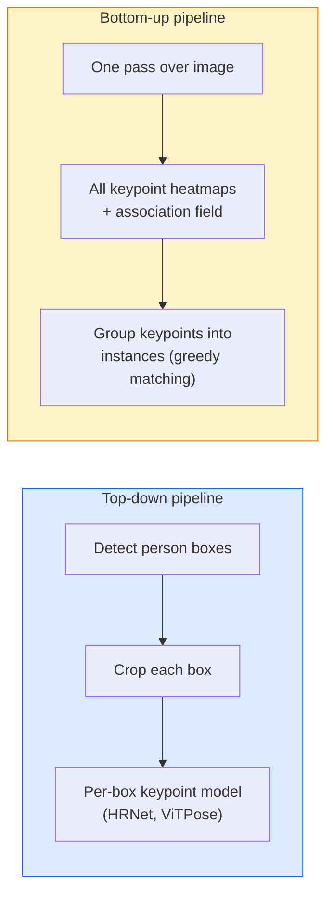

# 关键点检测与姿态估计

> 姿态就是一组有序关键点,关键点检测器就是一个热力图回归器,其余全是簿记工作。

**类型:** 动手构建
**编程语言:** Python
**前置要求:** 第 4 阶段 第 06 课(检测)、第 4 阶段 第 07 课(U-Net)
**预计耗时:** 约 45 分钟

## 学习目标

- 区分自顶向下(top-down)与自底向上(bottom-up)姿态估计,并说明各自适用场景
- 用"每个关键点一个高斯"的目标回归 K 个关键点的热力图,并在推理时提取关键点坐标
- 解释部件亲和场(PAF)以及自底向上流水线如何把关键点装配成实例
- 使用 MediaPipe Pose 或 MMPose 做生产级关键点估计,并理解它们的输出格式

## 问题

关键点任务有许多名字:人体姿态(17 个身体关节)、人脸特征点(68 或 478 个点)、手部(21 个点)、动物姿态、机器人物体姿态、医学解剖标志点。它们共享同一个结构:在物体上检测 K 个离散点,输出它们的 (x, y) 坐标。

姿态估计是动作捕捉、健身应用、体育分析、手势控制、动画、AR 试穿和机器人抓取的地基。2D 情形已经成熟;3D 姿态(从单目相机估计世界坐标下的关节位置)是当前的研究前沿。

工程问题在于规模。单图单人姿态是 20 毫秒的问题;30 fps 下人群中的多人姿态,则是另一个问题,需要另一套架构。

## 概念

### 自顶向下 vs 自底向上



- **自顶向下** —— 先检测人,再对每个裁剪框跑单人关键点模型。精度最高;耗时随人数线性增长。
- **自底向上** —— 一次前向传播预测所有关键点加一个关联场,再做分组。无论人群多大,耗时恒定。

自顶向下(HRNet、ViTPose)是精度之王;自底向上(OpenPose、HigherHRNet)是拥挤场景的吞吐之王。

### 热力图回归

不直接回归 `(x, y)`,而是为每个关键点预测一张 `H x W` 热力图,在真实位置处放一个高斯斑。

```
target[k, y, x] = exp(-((x - cx_k)^2 + (y - cy_k)^2) / (2 sigma^2))
```

推理时,每张热力图的 argmax 就是预测的关键点位置。

为什么热力图优于直接回归:网络的空间结构(卷积特征图)天然与空间输出对齐;高斯目标还自带正则化——小的定位误差产生小的损失,而不是直接归零。

### 亚像素定位

argmax 给出整数坐标。要亚像素精度,可以对 argmax 及其邻域拟合抛物线来细化,或者用那个著名的偏移方向 `(dx, dy) = 0.25 * (heatmap[y, x+1] - heatmap[y, x-1], ...)`。

### 部件亲和场(PAF)

OpenPose 为自底向上关联发明的技巧。对每对相连关键点(如左肩到左肘),预测一个双通道场,编码从一个关键点指向另一个的单位向量。要把肩和肘配成对,沿候选配对的连线对 PAF 做线积分,积分最高的那对就是匹配。

```
For each connection (limb):
  PAF channels: 2 (unit vector x, y)
  Line integral: sum over sample points of (PAF . line_direction)
  Higher integral = stronger match
```

做法优雅,且无需逐人裁剪即可扩展到任意人群规模。

### COCO 关键点

标准人体姿态数据集:每人 17 个关键点,指标为 PCK(正确关键点百分比)和 OKS(目标关键点相似度)。OKS 是关键点版的 IoU,COCO mAP@OKS 报告的就是它。

### 2D vs 3D

- **2D 姿态** —— 图像坐标;已达生产质量(MediaPipe、HRNet、ViTPose)。
- **3D 姿态** —— 世界/相机坐标;仍是活跃研究方向。常见路线:
  - 用小 MLP 把 2D 预测提升到 3D(VideoPose3D)。
  - 从图像直接回归 3D(PyMAF、MHFormer)。
  - 多视角采集(CMU Panoptic)提供 ground truth。

```figure
cv3-pose-heatmap
```

## 动手构建

### 第 1 步:高斯热力图目标

```python
import numpy as np
import torch

def gaussian_heatmap(size, cx, cy, sigma=2.0):
    yy, xx = np.meshgrid(np.arange(size), np.arange(size), indexing="ij")
    return np.exp(-((xx - cx) ** 2 + (yy - cy) ** 2) / (2 * sigma ** 2)).astype(np.float32)

hm = gaussian_heatmap(64, 32, 32, sigma=2.0)
print(f"peak: {hm.max():.3f} at ({hm.argmax() % 64}, {hm.argmax() // 64})")
```

每个关键点一张热力图,沿通道轴堆叠,就是完整的目标张量。

### 第 2 步:迷你关键点头

一个 U-Net 风格的模型,输出 K 个热力图通道。

```python
import torch.nn as nn
import torch.nn.functional as F

class TinyKeypointNet(nn.Module):
    def __init__(self, num_keypoints=4, base=16):
        super().__init__()
        self.down1 = nn.Sequential(nn.Conv2d(3, base, 3, 2, 1), nn.ReLU(inplace=True))
        self.down2 = nn.Sequential(nn.Conv2d(base, base * 2, 3, 2, 1), nn.ReLU(inplace=True))
        self.mid = nn.Sequential(nn.Conv2d(base * 2, base * 2, 3, 1, 1), nn.ReLU(inplace=True))
        self.up1 = nn.ConvTranspose2d(base * 2, base, 2, 2)
        self.up2 = nn.ConvTranspose2d(base, num_keypoints, 2, 2)

    def forward(self, x):
        h1 = self.down1(x)
        h2 = self.down2(h1)
        h3 = self.mid(h2)
        u1 = self.up1(h3)
        return self.up2(u1)
```

输入 `(N, 3, H, W)`,输出 `(N, K, H, W)`。损失是与高斯目标之间的逐像素 MSE。

### 第 3 步:推理——提取关键点坐标

```python
def heatmap_to_coords(heatmaps):
    """
    heatmaps: (N, K, H, W)
    returns:  (N, K, 2) float coordinates in image pixels
    """
    N, K, H, W = heatmaps.shape
    hm = heatmaps.reshape(N, K, -1)
    idx = hm.argmax(dim=-1)
    ys = (idx // W).float()
    xs = (idx % W).float()
    return torch.stack([xs, ys], dim=-1)

coords = heatmap_to_coords(torch.randn(2, 4, 32, 32))
print(f"coords: {coords.shape}")  # (2, 4, 2)
```

推理时就这一行。要亚像素细化,在 argmax 附近插值即可。

### 第 4 步:合成关键点数据集

简单的做法:在白色画布上画四个点,让模型学会预测它们。

```python
def make_synthetic_sample(size=64):
    img = np.ones((3, size, size), dtype=np.float32)
    rng = np.random.default_rng()
    kps = rng.integers(8, size - 8, size=(4, 2))
    for cx, cy in kps:
        img[:, cy - 2:cy + 2, cx - 2:cx + 2] = 0.0
    hms = np.stack([gaussian_heatmap(size, cx, cy) for cx, cy in kps])
    return img, hms, kps
```

简单到一个小模型一分钟就能学会。

### 第 5 步:训练

```python
model = TinyKeypointNet(num_keypoints=4)
opt = torch.optim.Adam(model.parameters(), lr=3e-3)

for step in range(200):
    batch = [make_synthetic_sample() for _ in range(16)]
    imgs = torch.from_numpy(np.stack([b[0] for b in batch]))
    hms = torch.from_numpy(np.stack([b[1] for b in batch]))
    pred = model(imgs)
    # Upsample pred to full resolution
    pred = F.interpolate(pred, size=hms.shape[-2:], mode="bilinear", align_corners=False)
    loss = F.mse_loss(pred, hms)
    opt.zero_grad(); loss.backward(); opt.step()
```

## 投入使用

- **MediaPipe Pose** —— Google 的生产级姿态估计器,附带 WebGL 和移动端运行时,延迟在 10ms 以内。
- **MMPose**(OpenMMLab)—— 全面的研究代码库,每个 SOTA 架构都带预训练权重。
- **YOLOv8-pose** —— 单次前向传播的实时多人姿态,速度最快。
- **transformers HumanDPT / PoseAnything** —— 更新的视觉-语言路线,做开放词汇姿态(任意物体、任意关键点集)。

## 交付

本课产出:

- `outputs/prompt-pose-stack-picker.md` —— 一个根据延迟、人群规模和 2D/3D 需求在 MediaPipe / YOLOv8-pose / HRNet / ViTPose 之间做选择的提示词
- `outputs/skill-heatmap-to-coords.md` —— 一个编写亚像素"热力图转坐标"例程的技能,每个生产级姿态模型都在用它

## 练习

1. **(易)** 在合成 4 点数据集上训练迷你关键点模型。报告 200 步后预测关键点与真实关键点之间的平均 L2 误差。
2. **(中)** 加亚像素细化:给定 argmax 位置,用相邻像素沿 x 和 y 各拟合一条一维抛物线。报告相对整数 argmax 的精度提升。
3. **(难)** 构建双人合成数据集:每张图含两个 4 关键点模式的实例。训练一条带 PAF 的自底向上流水线,预测每个关键点属于哪个实例,并用 OKS 评估。

## 关键术语

| 术语 | 人们常说的 | 实际含义 |
|------|----------------|----------------------|
| 关键点 | "一个标志点" | 物体上一个特定的有序点(关节、角点、特征点) |
| 姿态 | "骨架" | 属于同一实例的一组有序关键点 |
| 自顶向下 | "先检测再姿态" | 两段式流水线:行人检测器 + 逐裁剪框关键点模型;精度最高 |
| 自底向上 | "先姿态,后分组" | 单次前向预测全部关键点 + 分组;耗时与人群规模无关 |
| 热力图 | "高斯目标" | 每个关键点一张 H x W 张量,峰值在真实位置;首选的回归目标 |
| PAF | "部件亲和场" | 编码肢体方向的双通道单位向量场;用于把关键点分组成实例 |
| OKS | "关键点版 IoU" | 目标关键点相似度;COCO 的姿态指标 |
| HRNet | "高分辨率网络" | 主流的自顶向下关键点架构;全程保持高分辨率特征 |

## 延伸阅读

- [OpenPose(Cao 等,2017)](https://arxiv.org/abs/1812.08008) —— 带 PAF 的自底向上方法;至今仍是对该思路最好的阐述
- [HRNet(Sun 等,2019)](https://arxiv.org/abs/1902.09212) —— 自顶向下的参考架构
- [ViTPose(Xu 等,2022)](https://arxiv.org/abs/2204.12484) —— 朴素 ViT 作姿态骨干;当前多个基准上的 SOTA
- [MediaPipe Pose](https://developers.google.com/mediapipe/solutions/vision/pose_landmarker) —— 生产级实时姿态;2026 年部署最快的方案
