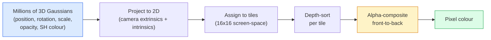

# 从零实现 3D 高斯泼溅

> 一个场景,就是数百万个 3D 高斯组成的点云。每个高斯有位置、朝向、缩放、不透明度,以及随观察方向变化的颜色。把它们光栅化,对光栅化过程反向传播,完事。

**类型:** 动手构建
**编程语言:** Python
**前置要求:** 第 4 阶段 第 13 课(3D 视觉与 NeRF)、第 1 阶段 第 12 课(张量运算)、第 4 阶段 第 10 课(扩散基础,可选)
**预计耗时:** 约 90 分钟

## 学习目标

- 解释为什么到 2026 年,3D 高斯泼溅(3DGS)已取代 NeRF,成为照片级 3D 重建的生产默认方案
- 说出每个高斯的六项参数(位置、旋转四元数、缩放、不透明度、球谐颜色、可选特征)及各自占多少浮点数
- 用 alpha 合成从零实现一个 2D 高斯泼溅光栅器,并说明 3D 情形如何投影到同一个循环上
- 使用 `nerfstudio`、`gsplat` 或 `SuperSplat` 从 20–50 张照片重建场景,并导出为 glTF 的 `KHR_gaussian_splatting` 扩展或 OpenUSD 26.03 的 `UsdVolParticleField3DGaussianSplat` schema

## 问题

NeRF 把场景存在一个 MLP 的权重里。渲染每个像素,都要沿一条射线查询 MLP 数百次。训练要几小时,渲染要几秒,而且权重没法编辑——想把场景里的椅子挪个位置,只能重训。

3D 高斯泼溅(Kerbl、Kopanas、Leimkühler、Drettakis,SIGGRAPH 2023)把这一切都换掉了:场景是一组显式的 3D 高斯;渲染是 GPU 光栅化,跑 100+ fps;训练只要几分钟;编辑是直接的——平移一组高斯,椅子就挪走了。到 2026 年,Khronos 已批准了 glTF 的高斯泼溅扩展,OpenUSD 26.03 内置了高斯泼溅 schema,Zillow 和 Apartments.com 用它们渲染房源,3D 重建领域的新研究论文也大多是核心 3DGS 思路的变体。

心智模型很简单,但数学的活动部件不少——大多数介绍直接从光栅化开讲,把投影和球谐一笔带过。本课把整套东西都搭出来:先做 2D 版,再扩展到 3D。

## 概念

### 一个高斯携带什么

一个 3D 高斯是空间中的参数化斑块,带这些属性:

```
position         mu         (3,)    centre in world coordinates
rotation         q          (4,)    unit quaternion encoding orientation
scale            s          (3,)    log-scales per axis (exponentiated at render time)
opacity          alpha      (1,)    post-sigmoid opacity [0, 1]
SH coefficients  c_lm       (3 * (L+1)^2,)   view-dependent colour
```

旋转 + 缩放构造出 3×3 协方差:`Sigma = R S S^T R^T`——这就是高斯在 3D 中的形状。球谐让颜色随观察方向变化——镜面高光、细腻的光泽、随视角变化的辉光——而无需存储逐视角纹理。球谐取 3 阶时,每个颜色通道有 16 个系数,单个高斯仅颜色就占 48 个浮点数。

一个场景通常有 100 万–500 万个高斯,每个存约 60 个浮点数(3 + 4 + 3 + 1 + 48 + 杂项)。500 万高斯的场景约 240 MB——远小于带逐点纹理的等效点云,也比高分辨率重渲染的 NeRF MLP 权重小一个数量级。

### 光栅化,而非射线步进



五步,全都对 GPU 友好,没有逐像素的 MLP 查询。一块 RTX 3080 Ti 渲染 600 万个泼溅能跑 147 fps。

### 投影这一步

位于世界坐标 `mu`、3D 协方差为 `Sigma` 的 3D 高斯,投影为屏幕位置 `mu'`、2D 协方差 `Sigma'` 的 2D 高斯:

```
mu' = project(mu)
Sigma' = J W Sigma W^T J^T          (2 x 2)

W = viewing transform (rotation + translation of camera)
J = Jacobian of the perspective projection at mu'
```

2D 高斯的足迹是一个椭圆,其轴是 `Sigma'` 的特征向量。椭圆内的每个像素都收到该高斯的贡献,权重为 `exp(-0.5 * (p - mu')^T Sigma'^-1 (p - mu'))`。

### alpha 合成规则

对一个像素,覆盖它的所有高斯按从后到前排序(或等价地从前到后用倒置公式)。颜色合成用的方程,和 1980 年代以来每个半透明光栅器用的是同一个:

```
C_pixel = sum_i alpha_i * T_i * c_i

T_i = prod_{j < i} (1 - alpha_j)       transmittance up to i
alpha_i = opacity_i * exp(-0.5 * d^T Sigma'^-1 d)   local contribution
c_i = eval_SH(SH_i, view_direction)    view-dependent colour
```

这**和 NeRF 的体渲染方程是同一个**,只是积分对象从射线上密集的采样点,换成了显式的稀疏高斯集合。渲染质量能追平 NeRF,正因为这个等价性——两者积分的是同一个辐射场方程。

### 为什么它可微

每一步——投影、瓦片分配、alpha 合成、球谐求值——对高斯参数都可微。给定 ground-truth 图像,计算渲染像素损失,穿过光栅器反向传播,用梯度下降更新所有 `(mu, q, s, alpha, c_lm)`。约 30,000 次迭代后,高斯们各自找到了正确的位置、缩放和颜色。

### 致密化与剪枝

固定数量的高斯覆盖不了复杂场景。训练包含两种自适应机制:

- **克隆(Clone):** 当一个高斯梯度大但缩放小时,在原位克隆它——这里的重建需要更多细节。
- **分裂(Split):** 当一个高斯梯度大且缩放也大时,把它劈成两个更小的高斯——一个大高斯太平滑,拟合不了这个区域。
- **剪枝(Prune):** 删掉不透明度低于阈值的高斯——它们没有贡献。

致密化每 N 次迭代跑一次。一个场景通常从约 10 万个初始高斯(由 SfM 点播种)长到训练结束时的 100 万–500 万。

### 一段话讲清球谐

视角相关颜色是单位球面上的函数 `c(direction)`。球谐就是球面上的傅里叶基。截断到 `L` 阶,每个通道有 `(L+1)^2` 个基函数。为新视角求颜色,就是学到的 SH 系数与在该观察方向上求值的基函数做点积。0 阶 = 1 个系数 = 恒定颜色;3 阶 = 16 个系数,足以捕捉朗伯 shading、镜面反射和轻微反射。3DGS 论文默认用 3 阶。

### 2026 年的生产工具栈

```
1. Capture         smartphone / DJI drone / handheld scanner
2. SfM / MVS       COLMAP or GLOMAP derives camera poses + sparse points
3. Train 3DGS      nerfstudio / gsplat / inria official / PostShot (~10-30 min on RTX 4090)
4. Edit            SuperSplat / SplatForge (clean floaters, segment)
5. Export          .ply -> glTF KHR_gaussian_splatting or .usd (OpenUSD 26.03)
6. View            Cesium / Unreal / Babylon.js / Three.js / Vision Pro
```

### 4D 与生成式变体

- **4D 高斯泼溅** —— 高斯是时间的函数,用于体积视频(《Superman》2026、A$AP Rocky 的《Helicopter》)。
- **生成式泼溅** —— 文本到泼溅模型(World Labs 的 Marble),凭空生成整个场景。
- **3D 高斯无迹变换** —— NVIDIA NuRec 的变体,用于自动驾驶仿真。

```figure
cv3-gaussian-splat
```

## 动手构建

### 第 1 步:一个 2D 高斯

我们先搭 2D 光栅器——3D 情形投影之后就归结为它。

```python
import torch
import torch.nn as nn
import torch.nn.functional as F


def eval_2d_gaussian(means, covs, points):
    """
    means:  (G, 2)      centres
    covs:   (G, 2, 2)   covariance matrices
    points: (H, W, 2)   pixel coordinates
    returns: (G, H, W)  density at every pixel for every Gaussian
    """
    G = means.size(0)
    H, W, _ = points.shape
    flat = points.view(-1, 2)
    inv = torch.linalg.inv(covs)
    diff = flat[None, :, :] - means[:, None, :]
    d = torch.einsum("gpi,gij,gpj->gp", diff, inv, diff)
    density = torch.exp(-0.5 * d)
    return density.view(G, H, W)
```

`einsum` 为每个(高斯, 像素)对计算二次型 `diff^T Sigma^-1 diff`。

### 第 2 步:2D 泼溅光栅器

从前到后做 alpha 合成。2D 里深度没有意义,所以用一个学习出来的逐高斯标量来排序。

```python
def rasterise_2d(means, covs, colours, opacities, depths, image_size):
    """
    means:     (G, 2)
    covs:      (G, 2, 2)
    colours:   (G, 3)
    opacities: (G,)     in [0, 1]
    depths:    (G,)     per-Gaussian scalar used for ordering
    image_size: (H, W)
    returns:   (H, W, 3) rendered image
    """
    H, W = image_size
    yy, xx = torch.meshgrid(
        torch.arange(H, dtype=torch.float32, device=means.device),
        torch.arange(W, dtype=torch.float32, device=means.device),
        indexing="ij",
    )
    points = torch.stack([xx, yy], dim=-1)

    densities = eval_2d_gaussian(means, covs, points)
    alphas = opacities[:, None, None] * densities
    alphas = alphas.clamp(0.0, 0.99)

    order = torch.argsort(depths)
    alphas = alphas[order]
    colours_sorted = colours[order]

    T = torch.ones(H, W, device=means.device)
    out = torch.zeros(H, W, 3, device=means.device)
    for i in range(means.size(0)):
        a = alphas[i]
        out += (T * a)[..., None] * colours_sorted[i][None, None, :]
        T = T * (1.0 - a)
    return out
```

不快——真实实现用基于瓦片的 CUDA 内核——但数学完全正确,且全程可微。

### 第 3 步:可训练的 2D 泼溅场景

```python
class Splats2D(nn.Module):
    def __init__(self, num_splats=128, image_size=64, seed=0):
        super().__init__()
        g = torch.Generator().manual_seed(seed)
        H, W = image_size, image_size
        self.means = nn.Parameter(torch.rand(num_splats, 2, generator=g) * torch.tensor([W, H]))
        self.log_scale = nn.Parameter(torch.ones(num_splats, 2) * math.log(2.0))
        self.rot = nn.Parameter(torch.zeros(num_splats))  # single angle in 2D
        self.colour_logits = nn.Parameter(torch.randn(num_splats, 3, generator=g) * 0.5)
        self.opacity_logit = nn.Parameter(torch.zeros(num_splats))
        self.depth = nn.Parameter(torch.rand(num_splats, generator=g))

    def covs(self):
        s = torch.exp(self.log_scale)
        c, si = torch.cos(self.rot), torch.sin(self.rot)
        R = torch.stack([
            torch.stack([c, -si], dim=-1),
            torch.stack([si, c], dim=-1),
        ], dim=-2)
        S = torch.diag_embed(s ** 2)
        return R @ S @ R.transpose(-1, -2)

    def forward(self, image_size):
        covs = self.covs()
        colours = torch.sigmoid(self.colour_logits)
        opacities = torch.sigmoid(self.opacity_logit)
        return rasterise_2d(self.means, covs, colours, opacities, self.depth, image_size)
```

`log_scale`、`opacity_logit`、`colour_logits` 都是无约束参数,渲染时经过相应激活函数映射。这是每个 3DGS 实现都遵循的标准模式。

### 第 4 步:让 2D 高斯拟合目标图像

```python
import math
import numpy as np

def make_target(size=64):
    yy, xx = np.meshgrid(np.arange(size), np.arange(size), indexing="ij")
    img = np.zeros((size, size, 3), dtype=np.float32)
    # Red circle
    mask = (xx - 20) ** 2 + (yy - 20) ** 2 < 10 ** 2
    img[mask] = [1.0, 0.2, 0.2]
    # Blue square
    mask = (np.abs(xx - 45) < 8) & (np.abs(yy - 40) < 8)
    img[mask] = [0.2, 0.3, 1.0]
    return torch.from_numpy(img)


target = make_target(64)
model = Splats2D(num_splats=64, image_size=64)
opt = torch.optim.Adam(model.parameters(), lr=0.05)

for step in range(200):
    pred = model((64, 64))
    loss = F.mse_loss(pred, target)
    opt.zero_grad(); loss.backward(); opt.step()
    if step % 40 == 0:
        print(f"step {step:3d}  mse {loss.item():.4f}")
```

200 步内,64 个高斯各就各位,覆盖住那两个形状。这就是全部思想——对显式几何图元做梯度下降。

### 第 5 步:从 2D 到 3D

3D 扩展保持同一个循环,要加的东西:

1. 逐高斯旋转用四元数,不再是单个角度。
2. 协方差是 `R S S^T R^T`,`R` 由四元数构建,`S = diag(exp(log_scale))`。
3. 投影 `(mu, Sigma) -> (mu', Sigma')` 使用相机外参和 `mu` 处透视投影的 Jacobian。
4. 颜色变成球谐展开,在观察方向上求值。
5. 深度排序用真实的相机空间 z,不再是学习出来的标量。

每个生产实现(`gsplat`、`inria/gaussian-splatting`、`nerfstudio`)在 GPU 上做的正是这件事,用的是基于瓦片的 CUDA 内核。

### 第 6 步:球谐求值

3 阶以内的 SH 基,每通道 16 项。求值:

```python
def eval_sh_degree_3(sh_coeffs, dirs):
    """
    sh_coeffs: (..., 16, 3)   last dim is RGB channels
    dirs:      (..., 3)       unit vectors
    returns:   (..., 3)
    """
    C0 = 0.282094791773878
    C1 = 0.488602511902920
    C2 = [1.092548430592079, 1.092548430592079,
          0.315391565252520, 1.092548430592079,
          0.546274215296039]
    x, y, z = dirs[..., 0], dirs[..., 1], dirs[..., 2]
    x2, y2, z2 = x * x, y * y, z * z
    xy, yz, xz = x * y, y * z, x * z

    result = C0 * sh_coeffs[..., 0, :]
    result = result - C1 * y[..., None] * sh_coeffs[..., 1, :]
    result = result + C1 * z[..., None] * sh_coeffs[..., 2, :]
    result = result - C1 * x[..., None] * sh_coeffs[..., 3, :]

    result = result + C2[0] * xy[..., None] * sh_coeffs[..., 4, :]
    result = result + C2[1] * yz[..., None] * sh_coeffs[..., 5, :]
    result = result + C2[2] * (2.0 * z2 - x2 - y2)[..., None] * sh_coeffs[..., 6, :]
    result = result + C2[3] * xz[..., None] * sh_coeffs[..., 7, :]
    result = result + C2[4] * (x2 - y2)[..., None] * sh_coeffs[..., 8, :]

    # degree 3 terms omitted here for brevity; full 16-coefficient version in the code file
    return result
```

学出来的 `sh_coeffs` 存着这个高斯"每个方向上的颜色"。渲染时对当前观察方向求值,得到一个 RGB 三维向量。

## 投入使用

真正的 3DGS 工作,用 `gsplat`(Meta)或 `nerfstudio`:

```bash
pip install nerfstudio gsplat
ns-download-data example
ns-train splatfacto --data path/to/data
```

`splatfacto` 是 nerfstudio 的 3DGS 训练器。RTX 4090 上,典型场景训练 10–30 分钟。

2026 年要紧的导出格式:

- `.ply` —— 原始高斯点云(便携,文件最大)。
- `.splat` —— PlayCanvas / SuperSplat 的量化格式。
- glTF `KHR_gaussian_splatting` —— Khronos 标准,跨查看器便携(2026 年 2 月 RC)。
- OpenUSD `UsdVolParticleField3DGaussianSplat` —— USD 原生,用于 NVIDIA Omniverse 和 Vision Pro 管线。

4D/动态场景方面,`4DGS` 和 `Deformable-3DGS` 用随时间变化的均值与不透明度扩展了同一套机制。

## 交付

本课产出:

- `outputs/prompt-3dgs-capture-planner.md` —— 一个为给定场景类型规划采集过程(照片数量、相机轨迹、光照)的提示词
- `outputs/skill-3dgs-export-router.md` —— 一个根据下游查看器或引擎选择导出格式(`.ply` / `.splat` / glTF / USD)的技能

## 练习

1. **(易)** 换一张合成图像,跑上面的 2D 泼溅训练器。让 `num_splats` 取 `[16, 64, 256]`,画出各自的 MSE 随步数变化曲线,找出收益递减的拐点。
2. **(中)** 扩展 2D 光栅器:让逐高斯 RGB 颜色通过一个 2 阶谐波依赖标量"观察角"。在一对目标图像上训练,验证模型能同时重建两者。
3. **(难)** 克隆 `nerfstudio`,用你自己拍的 20 张照片(桌面、植物、人脸、房间)训练 `splatfacto`。导出为 glTF `KHR_gaussian_splatting`,在查看器中打开(Three.js `GaussianSplats3D`、SuperSplat、Babylon.js V9)。报告训练时间、高斯数量和渲染 fps。

## 关键术语

| 术语 | 人们常说的 | 实际含义 |
|------|----------------|----------------------|
| 3DGS | "高斯泼溅" | 显式场景表示:数百万个 3D 高斯,各有位置、旋转、缩放、不透明度和 SH 颜色 |
| 协方差 | "高斯的形状" | `Sigma = R S S^T R^T`;一个高斯的朝向与各向异性缩放 |
| alpha 合成 | "从后到前混合" | 与 NeRF 体渲染同一个方程,只是换成显式稀疏集合 |
| 致密化 | "克隆与分裂" | 在重建欠拟合的位置自适应地增加新高斯 |
| 剪枝 | "删掉低不透明度" | 移除训练中坍缩到不透明度接近零的高斯 |
| 球谐 | "视角相关颜色" | 球面上的傅里叶基;把颜色存成观察方向的函数 |
| Splatfacto | "nerfstudio 的 3DGS" | 2026 年训练 3DGS 最省事的路径 |
| `KHR_gaussian_splatting` | "glTF 标准" | Khronos 2026 年扩展,让 3DGS 跨查看器和引擎便携 |

## 延伸阅读

- [《3D Gaussian Splatting for Real-Time Radiance Field Rendering》(Kerbl 等,SIGGRAPH 2023)](https://repo-sam.inria.fr/fungraph/3d-gaussian-splatting/) —— 原始论文
- [gsplat(Meta/nerfstudio)](https://github.com/nerfstudio-project/gsplat) —— 生产质量 CUDA 光栅器
- [nerfstudio Splatfacto](https://docs.nerf.studio/nerfology/methods/splat.html) —— 参考训练配方
- [Khronos KHR_gaussian_splatting 扩展](https://github.com/KhronosGroup/glTF/blob/main/extensions/2.0/Khronos/KHR_gaussian_splatting/README.md) —— 2026 年的便携格式
- [OpenUSD 26.03 发布说明](https://openusd.org/release/) —— `UsdVolParticleField3DGaussianSplat` schema
- [THE FUTURE 3D:2026 高斯泼溅现状](https://www.thefuture3d.com/blog-0/2026/4/4/state-of-gaussian-splatting-2026) —— 行业概览
