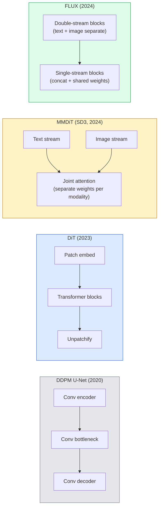

# 扩散 Transformer 与 Rectified Flow

> U-Net 不是扩散模型的秘密。把它换成 Transformer,把噪声日程换成一条直线流,你突然就得到了 SD3、FLUX,以及 2026 年的每一个文生图模型。

**类型:** 学习 + 动手构建
**编程语言:** Python
**前置要求:** 第 4 阶段 第 10 课(扩散 DDPM)、第 4 阶段 第 14 课(ViT)、第 7 阶段 第 02 课(自注意力)
**预计耗时:** 约 75 分钟

## 学习目标

- 梳理从 U-Net DDPM(第 10 课)到 Diffusion Transformer(DiT)、MMDiT(SD3)、单流+双流 DiT(FLUX)的演进脉络
- 解释 rectified flow:为什么噪声与数据之间的直线轨迹让模型用 20 步采样,而不是 1000 步
- 实现一个迷你 DiT 块和一个 rectified-flow 训练循环,各不超过 100 行
- 按架构、参数量和许可证区分各模型变体(SD3、FLUX.1-dev、FLUX.1-schnell、Z-Image、Qwen-Image)

## 问题

第 10 课用 U-Net 去噪器搭了一个 DDPM。这套配方统治了 2020–2023 年:U-Net + beta 日程 + 噪声预测损失,产出了 Stable Diffusion 1.5、2.1 和 DALL-E 2。

2026 年每一个 SOTA 文生图模型都已越过它:Stable Diffusion 3、FLUX、SD4、Z-Image、Qwen-Image、Hunyuan-Image——没有一个用 U-Net,全用 Diffusion Transformer(DiT)。SD3 和 FLUX 还把 DDPM 噪声日程换成了 rectified flow:它把噪声到数据的路径拉直,配合一致性或蒸馏变体,实现 1–4 步推理。

这场转变之所以重要,是因为它是扩散图像生成变得可控、贴题(SD3/SD4 解决了文字渲染)且快到能上生产的原因。理解 DiT + rectified flow,就是理解 2026 年的生成式图像技术栈。

## 概念

### 从 U-Net 到 Transformer



- **DiT**(Peebles 与 Xie,2023)—— 用在潜空间 patch 上运行的类 ViT Transformer 替换 U-Net。通过自适应层归一化(AdaLN)注入条件。
- **MMDiT**(SD3,Esser 等,2024)—— 文本 token 与图像 token 各走一条流、权重分开,但共享一次联合注意力。
- **FLUX**(Black Forest Labs,2024)—— 前 N 个块像 SD3 一样双流,后面的块把两流拼接、共享权重(单流),在更大深度下更高效。
- **Z-Image**(2025)—— 6B 参数的高效单流 DiT,挑战"不惜一切堆规模"的路线。

### 一段话讲清 rectified flow

DDPM 把前向过程定义为一个加噪 SDE,`x_t` 被逐渐污染;学出来的反向过程是另一个 SDE,要解 1000 个小步。

Rectified flow 在干净数据与纯噪声之间定义一条**直线**插值:

```
x_t = (1 - t) * x_0 + t * epsilon,     t in [0, 1]
```

训练网络预测速度 `v_theta(x_t, t) = epsilon - x_0`——沿从干净数据指向噪声的直线路径的前向方向(`dx_t/dt`)。采样时,把这个速度反向积分,从噪声一步步走回数据。这样得到的 ODE 更接近直线,采样所需的积分步数少得多。

SD3 把这叫做 **Rectified Flow Matching**。FLUX、Z-Image 和大多数 2026 年模型用的是同一个目标。典型推理:20–30 步 Euler(确定性),而旧 DDPM 体系下要 50+ 步 DDIM。蒸馏/turbo/schnell/LCM 变体把它压到 1–4 步。

### AdaLN 条件注入

DiT 通过**自适应层归一化**注入时间步和类别/文本条件:从条件向量预测 `scale` 和 `shift`,在 LayerNorm 之后施加。比 U-Net 里 FiLM 式的调制干净得多,是每个现代 DiT 的默认做法。

```
cond -> MLP -> (scale, shift, gate)
norm(x) * (1 + scale) + shift, then residual add * gate
```

### SD3 和 FLUX 的文本编码器

- **SD3** 用三个文本编码器:两个 CLIP + T5-XXL。嵌入拼接后作为文本条件喂给图像流。
- **FLUX** 用一个 CLIP-L + T5-XXL。
- **Qwen-Image / Z-Image** 变体用自家与基座 LLM 对齐的文本编码器。

文本编码器是 SD3/FLUX 对提示词的理解远胜 SD1.5 的重要原因。光 T5-XXL 自己就有 4.7B 参数。

### 无分类器引导(CFG)依然有效

Rectified flow 换的是采样器,不是条件机制。无分类器引导(训练时以 10% 概率丢弃文本,推理时混合有条件与无条件预测)在 rectified flow 下用法完全相同。2026 年的模型大多用引导系数 3.5–5——低于 SD1.5 的 7.5,因为 rectified-flow 模型默认就更贴提示词。

### Consistency、Turbo、Schnell、LCM

四个名字,同一个想法:把慢的多步模型蒸馏成快的少步模型。

- **LCM(潜一致性模型)** —— 训练一个学生模型,从任意中间 `x_t` 一步预测最终的 `x_0`。
- **SDXL Turbo / FLUX schnell** —— 用对抗扩散蒸馏训练的 1–4 步模型。
- **SD Turbo** —— OpenAI 式 Consistency Model 在潜扩散上的改编。

任何一个新模型的生产部署,都会同时发布"全质量"检查点和"turbo / schnell"变体。schnell(德语"快",Black Forest Labs 的命名惯例)跑 1–4 步,塞得进实时管线。

### 2026 年的模型版图

| 模型 | 规模 | 架构 | 许可证 |
|-------|------|--------------|---------|
| Stable Diffusion 3 Medium | 2B | MMDiT | SAI Community |
| Stable Diffusion 3.5 Large | 8B | MMDiT | SAI Community |
| FLUX.1-dev | 12B | 双流 + 单流 DiT | 非商用 |
| FLUX.1-schnell | 12B | 同上,蒸馏版 | Apache 2.0 |
| FLUX.2 | — | FLUX.1 迭代版 | 混合 |
| Z-Image | 6B | S3-DiT(可扩展单流) | 宽松许可 |
| Qwen-Image | ~20B | DiT + Qwen 文本塔 | Apache 2.0 |
| Hunyuan-Image-3.0 | ~80B | DiT | 研究用途 |
| SD4 Turbo | 3B | DiT + 蒸馏 | SAI Commercial |

FLUX.1-schnell 是 2026 年开源默认选择,Z-Image 是效率之王,FLUX.2 和 SD4 是当前的质量巅峰。

### 为什么这场范式转移重要

DDPM + U-Net 能用,DiT + rectified flow 则**更好、更快、扩展得更干净**。这次转变与 NLP 从 RNN 到 Transformer 的转变如出一辙:两种架构解的是同一个问题,但 Transformer 能扩展,于是一统天下。2026 年每一篇图像、视频、3D 生成论文,用的都是 DiT 形状的去噪器,通常配 rectified flow 目标。U-Net DDPM 如今主要是教学用具(第 10 课)。

```figure
cv3-rectified-flow
```

## 动手构建

### 第 1 步:带 AdaLN 的 DiT 块

```python
import torch
import torch.nn as nn


class AdaLNZero(nn.Module):
    """
    Adaptive LayerNorm with a gate. Predicts (scale, shift, gate) from the conditioning.
    Init such that the whole block starts as identity ("zero init").
    """

    def __init__(self, dim, cond_dim):
        super().__init__()
        self.norm = nn.LayerNorm(dim, elementwise_affine=False)
        self.mlp = nn.Linear(cond_dim, dim * 3)
        nn.init.zeros_(self.mlp.weight)
        nn.init.zeros_(self.mlp.bias)

    def forward(self, x, cond):
        scale, shift, gate = self.mlp(cond).chunk(3, dim=-1)
        h = self.norm(x) * (1 + scale.unsqueeze(1)) + shift.unsqueeze(1)
        return h, gate.unsqueeze(1)


class DiTBlock(nn.Module):
    def __init__(self, dim=192, heads=3, mlp_ratio=4, cond_dim=192):
        super().__init__()
        self.adaln1 = AdaLNZero(dim, cond_dim)
        self.attn = nn.MultiheadAttention(dim, heads, batch_first=True)
        self.adaln2 = AdaLNZero(dim, cond_dim)
        self.mlp = nn.Sequential(
            nn.Linear(dim, dim * mlp_ratio),
            nn.GELU(),
            nn.Linear(dim * mlp_ratio, dim),
        )

    def forward(self, x, cond):
        h, gate1 = self.adaln1(x, cond)
        a, _ = self.attn(h, h, h, need_weights=False)
        x = x + gate1 * a
        h, gate2 = self.adaln2(x, cond)
        x = x + gate2 * self.mlp(h)
        return x
```

`AdaLNZero` 初始时是恒等映射,因为它的 MLP 权重被初始化为零。训练把块慢慢推离恒等;这个设计让深层扩散 Transformer 的稳定性大幅改善。

### 第 2 步:迷你 DiT

```python
def timestep_embedding(t, dim):
    import math
    half = dim // 2
    freqs = torch.exp(-math.log(10000) * torch.arange(half, device=t.device) / half)
    args = t[:, None].float() * freqs[None]
    return torch.cat([args.sin(), args.cos()], dim=-1)


class TinyDiT(nn.Module):
    def __init__(self, image_size=16, patch_size=2, in_channels=3, dim=96, depth=4, heads=3):
        super().__init__()
        self.patch_size = patch_size
        self.num_patches = (image_size // patch_size) ** 2
        self.patch = nn.Conv2d(in_channels, dim, kernel_size=patch_size, stride=patch_size)
        self.pos = nn.Parameter(torch.zeros(1, self.num_patches, dim))
        self.time_mlp = nn.Sequential(
            nn.Linear(dim, dim * 2),
            nn.SiLU(),
            nn.Linear(dim * 2, dim),
        )
        self.blocks = nn.ModuleList([DiTBlock(dim, heads, cond_dim=dim) for _ in range(depth)])
        self.norm_out = nn.LayerNorm(dim, elementwise_affine=False)
        self.head = nn.Linear(dim, patch_size * patch_size * in_channels)

    def forward(self, x, t):
        n = x.size(0)
        x = self.patch(x)
        x = x.flatten(2).transpose(1, 2) + self.pos
        t_emb = self.time_mlp(timestep_embedding(t, self.pos.size(-1)))
        for blk in self.blocks:
            x = blk(x, t_emb)
        x = self.norm_out(x)
        x = self.head(x)
        return self._unpatchify(x, n)

    def _unpatchify(self, x, n):
        p = self.patch_size
        h = w = int(self.num_patches ** 0.5)
        x = x.view(n, h, w, p, p, -1).permute(0, 5, 1, 3, 2, 4).reshape(n, -1, h * p, w * p)
        return x
```

### 第 3 步:Rectified flow 训练

```python
import torch.nn.functional as F

def rectified_flow_train_step(model, x0, optimizer, device):
    model.train()
    x0 = x0.to(device)
    n = x0.size(0)
    t = torch.rand(n, device=device)
    epsilon = torch.randn_like(x0)
    x_t = (1 - t[:, None, None, None]) * x0 + t[:, None, None, None] * epsilon

    target_velocity = epsilon - x0
    pred_velocity = model(x_t, t)

    loss = F.mse_loss(pred_velocity, target_velocity)
    optimizer.zero_grad()
    loss.backward()
    optimizer.step()
    return loss.item()
```

与 DDPM 的噪声预测损失(第 10 课)对比:结构相同,目标不同。我们预测的不是噪声 `epsilon`,而是**速度** `epsilon - x_0`,它沿直线插值从数据指向噪声。

### 第 4 步:Euler 采样器

Rectified flow 是一个 ODE。Euler 法最简单;对一个训练良好的 rectified-flow 模型,20 步以上时它几乎和高阶求解器一样准。

```python
@torch.no_grad()
def rectified_flow_sample(model, shape, steps=20, device="cpu"):
    model.eval()
    x = torch.randn(shape, device=device)
    dt = 1.0 / steps
    t = torch.ones(shape[0], device=device)
    for _ in range(steps):
        v = model(x, t)
        x = x - dt * v
        t = t - dt
    return x
```

20 步。在训练好的模型上,采样质量媲美 1000 步 DDPM。

### 第 5 步:端到端冒烟测试

```python
import numpy as np

def synthetic_blobs(num=200, size=16, seed=0):
    rng = np.random.default_rng(seed)
    out = np.zeros((num, 3, size, size), dtype=np.float32)
    yy, xx = np.meshgrid(np.arange(size), np.arange(size), indexing="ij")
    for i in range(num):
        cx, cy = rng.uniform(4, size - 4, size=2)
        r = rng.uniform(2, 4)
        mask = (xx - cx) ** 2 + (yy - cy) ** 2 < r ** 2
        colour = rng.uniform(-1, 1, size=3)
        for c in range(3):
            out[i, c][mask] = colour[c]
    return torch.from_numpy(out)
```

在这份数据上用 rectified flow 训练 `TinyDiT`。500 步后,采样输出应该看起来像淡淡的彩色斑块。

## 投入使用

用 FLUX / SD3 / Z-Image 做真正的图像生成,`diffusers` 用统一 API 全都有:

```python
from diffusers import FluxPipeline, StableDiffusion3Pipeline
import torch

pipe = FluxPipeline.from_pretrained(
    "black-forest-labs/FLUX.1-schnell",
    torch_dtype=torch.bfloat16,
).to("cuda")

out = pipe(
    prompt="a golden retriever surfing a tsunami, hyperrealistic, studio lighting",
    guidance_scale=0.0,           # schnell was trained without CFG
    num_inference_steps=4,
    max_sequence_length=256,
).images[0]
out.save("surf.png")
```

三行代码,`FLUX.1-schnell` 四步出图。把模型 id 换成 `black-forest-labs/FLUX.1-dev`,可以在 20–30 步带 CFG 下获得更高质量。

SD3 的写法:

```python
pipe = StableDiffusion3Pipeline.from_pretrained(
    "stabilityai/stable-diffusion-3.5-large",
    torch_dtype=torch.bfloat16,
).to("cuda")
out = pipe(prompt, guidance_scale=3.5, num_inference_steps=28).images[0]
```

## 交付

本课产出:

- `outputs/prompt-dit-model-picker.md` —— 根据质量、延迟和许可证约束,在 SD3、FLUX.1-dev、FLUX.1-schnell、Z-Image、SD4 Turbo 之间做选择的提示词
- `outputs/skill-rectified-flow-trainer.md` —— 编写完整 rectified flow 训练循环(AdaLN DiT + Euler 采样)的技能

## 练习

1. **(易)** 在合成斑块数据集上训练上面的 TinyDiT 500 步。对比用 10、20、50 步 Euler 采样产出的样本。
2. **(中)** 加入文本条件:把一个学习到的类别嵌入拼到时间嵌入上(按颜色分 10 个斑块"类别")。分别用类别 0、5、9 采样,验证颜色吻合。
3. **(难)** 计算 rectified-flow 版与 DDPM 版同规模网络(同数据、同训练步数)生成样本之间的 Fréchet 距离(FID 代理)。报告哪个收敛更快。

## 关键术语

| 术语 | 人们常说的 | 实际含义 |
|------|----------------|----------------------|
| DiT | "扩散 Transformer" | 取代 U-Net 充当扩散去噪器的 Transformer;在 patch 化的潜变量上运行 |
| AdaLN | "自适应层归一化" | 通过在 LayerNorm 后施加学习出的 scale、shift、gate 注入时间步/文本条件;每个现代 DiT 的标配 |
| MMDiT | "多模态 DiT(SD3)" | 文本与图像 token 各用一套权重,但共享一次联合自注意力 |
| 单流/双流 | "FLUX 的技巧" | 前 N 个块双流(每模态独立权重),后续块单流(拼接 + 共享权重),换取效率 |
| Rectified flow | "噪声到数据的直线" | 数据与噪声之间的线性插值;网络预测速度;推理所需 ODE 步数大幅减少 |
| 速度目标 | "epsilon - x_0" | rectified flow 的回归目标;从干净数据指向噪声 |
| CFG 引导 | "无分类器引导" | 混合有条件与无条件预测;rectified-flow 模型中仍在使用 |
| Schnell / turbo / LCM | "1–4 步蒸馏" | 从全质量模型蒸馏出的少步变体;生产级实时 |

## 延伸阅读

- [《Scalable Diffusion Models with Transformers》(Peebles 与 Xie,2023)](https://arxiv.org/abs/2212.09748) —— DiT 论文
- [《Scaling Rectified Flow Transformers》(Esser 等,SD3 论文)](https://arxiv.org/abs/2403.03206) —— 规模化的 MMDiT 与 rectified flow
- [FLUX.1 模型卡与技术报告(Black Forest Labs)](https://huggingface.co/black-forest-labs/FLUX.1-dev) —— 双流 + 单流细节
- [《Z-Image:高效图像生成基础模型》(2025)](https://arxiv.org/html/2511.22699v1) —— 6B 单流 DiT
- [《Elucidating the Design Space of Diffusion》(Karras 等,2022)](https://arxiv.org/abs/2206.00364) —— 扩散设计权衡的参考之作
- [《Latent Consistency Models》(Luo 等,2023)](https://arxiv.org/abs/2310.04378) —— LCM-LoRA 如何实现 4 步推理
