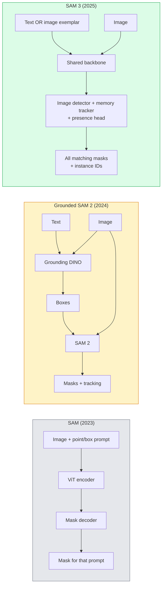

# SAM 3 与开放词汇分割

> 给模型一段文本提示和一张图,拿回每个匹配物体的掩码。SAM 3 把这件事变成了单次前向传播。

**类型:** 使用 + 动手构建
**编程语言:** Python
**前置要求:** 第 4 阶段 第 07 课(U-Net)、第 4 阶段 第 08 课(Mask R-CNN)、第 4 阶段 第 18 课(CLIP)
**预计耗时:** 约 60 分钟

## 学习目标

- 区分 SAM(仅视觉提示)、Grounded SAM / SAM 2(检测器 + SAM)与 SAM 3(通过可提示概念分割原生支持文本提示)
- 解释 SAM 3 架构:共享骨干 + 图像检测器 + 基于记忆的视频追踪器 + 存在头(presence head)+ 解耦的检测-追踪设计
- 使用 Hugging Face `transformers` 的 SAM 3 集成,做文本提示的检测、分割与视频追踪
- 根据延迟、概念复杂度和部署目标,在 SAM 3、Grounded SAM 2、YOLO-World 和 SAM-MI 之间做选择

## 问题

2023 年的 SAM 是个纯视觉提示模型:你点一个点或画一个框,它返回一个掩码。想要"给我这张照片里所有的橙子",你需要一个检测器(Grounding DINO)先产框,再用 SAM 逐个分割。Grounded SAM 把这套流程拼成了流水线,但它是两个冻结模型的级联,误差累积不可避免。

SAM 3(Meta,2025 年 11 月,ICLR 2026)把级联收拢了:它接受一个短名词短语或一个图像样例作为提示,单次前向传播返回所有匹配的掩码和实例 ID。这就是**可提示概念分割(Promptable Concept Segmentation,PCS)**。配合 2026 年 3 月的 Object Multiplex 更新(SAM 3.1),它还能在视频中高效追踪同一概念的多个实例。

本课讲的是这背后的结构性转变:2D 分割、检测和文图 grounding 已经合并进一个模型。生产问题不再是"我该把哪条流水线串起来",而是"哪个可提示模型能端到端搞定我的场景"。

## 概念

### 三代演进



### 可提示概念分割

"概念提示"是一个短名词短语(`"yellow school bus"`、`"striped red umbrella"`、`"hand holding a mug"`)或一个图像样例。模型返回图像中每个匹配该概念的实例的分割掩码,以及每个匹配的唯一实例 ID。

与经典视觉提示 SAM 的三点不同:

1. 无需逐实例提示——一条文本提示返回所有匹配。
2. 开放词汇——概念可以是任何自然语言能描述的东西。
3. 一次返回多个实例,而不是一个提示一个掩码。

### 关键架构部件

- **共享骨干** —— 单个 ViT 处理图像,检测头和基于记忆的追踪器都从它读取特征。
- **存在头(presence head)** —— 预测概念是否存在于图中,把"在不在"与"在哪里"解耦,减少概念缺席时的误报。
- **解耦的检测-追踪器** —— 图像级检测与视频级追踪各有独立的头,互不干扰。
- **记忆库** —— 跨帧存储逐实例特征,用于视频追踪(与 SAM 2 同一机制)。

### 规模化训练

SAM 3 在 **400 万个独立概念**上训练,这些概念由一台数据引擎生成——用 AI + 人工审核迭代标注和纠错。新的 **SA-CO 基准**包含 27 万个独立概念,是此前基准的 50 倍。SAM 3 在 SA-CO 上达到人类表现的 75–80%,在图像 + 视频 PCS 上比现有系统翻倍。

### SAM 3.1 Object Multiplex

2026 年 3 月更新:**Object Multiplex** 引入共享记忆机制,可同时联合追踪同一概念的多个实例。此前,追踪 N 个实例需要 N 个独立记忆库;Multiplex 把它们收拢成一个共享记忆 + 逐实例查询。结果:多目标追踪大幅提速,精度不降。

### 2026 年 Grounded SAM 仍有用武之地

- 需要换入特定开放词汇检测器时(DINO-X、Florence-2)。
- SAM 3 的许可证(HF 上需申请)构成阻碍时。
- 需要比 SAM 3 所提供的更精细的检测器阈值控制时。
- 针对检测器组件做研究/消融实验时。

模块化流水线仍有一席之地。但对大多数生产工作,SAM 3 是更简单的答案。

### YOLO-World vs SAM 3

- **YOLO-World** —— 只做开放词汇检测(无掩码),实时。需要高 fps 出框时选它。
- **SAM 3** —— 完整分割 + 追踪,更慢但输出更丰富。

生产上的分工:只要框、要快的场景(机器人导航、快速仪表盘)用 YOLO-World;需要掩码或追踪的场景用 SAM 3。

### SAM-MI 的效率优化

SAM-MI(2025–2026)针对 SAM 的解码器瓶颈,关键思路:

- **稀疏点提示** —— 用少量精选点代替密集提示,解码器调用减少 96%。
- **浅层掩码聚合** —— 把粗糙的掩码预测合并成一张更锐利的掩码。
- **解耦掩码注入** —— 解码器接收预计算的掩码特征,不再重复运行。

结果:在开放词汇基准上比 Grounded-SAM 快约 1.6 倍。

### 三个模型的输出格式

三者返回相同的总体结构(框 + 标签 + 分数 + 掩码 + ID)。这很方便——下游流水线不必为"跑的是哪个模型"写分支。

```figure
cv3-open-vocab
```

## 动手构建

### 第 1 步:构造提示

写一个辅助函数,把用户输入的句子变成 SAM 3 概念提示列表。这是"用户敲了什么"与"模型消费什么"之间的边界。

```python
def split_concepts(sentence):
    """
    Heuristic splitter for multi-concept prompts.
    Returns list of short noun phrases.
    """
    for sep in [",", ";", "and", "or", "&"]:
        if sep in sentence:
            parts = [p.strip() for p in sentence.replace("and ", ",").split(",")]
            return [p for p in parts if p]
    return [sentence.strip()]

print(split_concepts("cats, dogs and balloons"))
```

SAM 3 每次前向接受一个概念;多概念查询时循环或组批。

### 第 2 步:后处理辅助函数

把 SAM 3 的原始输出整理成干净的检测列表,与 第 4 阶段 第 16 课的流水线契约对齐。

```python
from dataclasses import dataclass
from typing import List

@dataclass
class ConceptDetection:
    concept: str
    instance_id: int
    box: tuple          # (x1, y1, x2, y2)
    score: float
    mask_rle: str       # run-length encoded


def rle_encode(binary_mask):
    flat = binary_mask.flatten().astype("uint8")
    runs = []
    prev, count = flat[0], 0
    for v in flat:
        if v == prev:
            count += 1
        else:
            runs.append((int(prev), count))
            prev, count = v, 1
    runs.append((int(prev), count))
    return ";".join(f"{v}x{c}" for v, c in runs)
```

RLE 让响应体即使装许多高分辨率掩码也够小。同一格式在 SAM 2、SAM 3、Grounded SAM 2 间通用。

### 第 3 步:统一的开放词汇分割接口

把手上任何后端(SAM 3、Grounded SAM 2、YOLO-World + SAM 2)包在同一个方法后面。后端换了,下游代码不用动。

```python
from abc import ABC, abstractmethod
import numpy as np

class OpenVocabSeg(ABC):
    @abstractmethod
    def detect(self, image: np.ndarray, concept: str) -> List[ConceptDetection]:
        ...


class StubOpenVocabSeg(OpenVocabSeg):
    """
    Deterministic stub used for pipeline testing when real models are not loaded.
    """
    def detect(self, image, concept):
        h, w = image.shape[:2]
        return [
            ConceptDetection(
                concept=concept,
                instance_id=0,
                box=(w * 0.2, h * 0.3, w * 0.5, h * 0.8),
                score=0.89,
                mask_rle="0x100;1x50;0x200",
            ),
            ConceptDetection(
                concept=concept,
                instance_id=1,
                box=(w * 0.55, h * 0.25, w * 0.85, h * 0.75),
                score=0.74,
                mask_rle="0x80;1x40;0x220",
            ),
        ]
```

真正的 `SAM3OpenVocabSeg` 子类会包装 `transformers.Sam3Model` 和 `Sam3Processor`。

### 第 4 步:Hugging Face SAM 3 用法(参考)

真实模型的 `transformers` 集成:

```python
from transformers import Sam3Processor, Sam3Model
import torch

processor = Sam3Processor.from_pretrained("facebook/sam3")
model = Sam3Model.from_pretrained("facebook/sam3").eval()

inputs = processor(images=pil_image, return_tensors="pt")
inputs = processor.set_text_prompt(inputs, "yellow school bus")

with torch.no_grad():
    outputs = model(**inputs)

masks = processor.post_process_masks(
    outputs.masks, inputs.original_sizes, inputs.reshaped_input_sizes
)
boxes = outputs.boxes
scores = outputs.scores
```

一条提示,一次调用,返回所有匹配。

### 第 5 步:量化 Grounded SAM 2 免费给你的东西

一个诚实的基准:在真实流水线里把 Grounded SAM 2 换成 SAM 3,会发生什么?

- 延迟:SAM 3 省掉一次前向传播(不需要独立检测器),但模型本身更重;通常持平或略快。
- 精度:SAM 3 在稀有或复合概念上明显更好("striped red umbrella");常见单词概念上两者相近。
- 灵活性:Grounded SAM 2 能换检测器(DINO-X、Florence-2、Grounding DINO 1.5);SAM 3 是一体的。

结论:SAM 3 是 2026 年开放词汇分割的默认选择;当你需要检测器灵活性或不同许可证条款时,Grounded SAM 2 仍是正确答案。

## 投入使用

生产部署模式:

- **实时标注** —— SAM 3 + CVAT 的"标签即文本提示"功能:标注员选中标签名,SAM 3 预标注每个匹配实例,人工复核修正。
- **视频分析** —— 用 SAM 3.1 Object Multiplex 做多目标追踪,把帧喂给基于记忆的追踪器。
- **机器人** —— SAM 3 做开放词汇操作("拿起红杯子"),作为规划原语运行。
- **医学影像** —— 在医学概念上微调 SAM 3;需要在 HF 上申请访问权限。

Ultralytics 把 SAM 3 包进了它的 Python 包:

```python
from ultralytics import SAM

model = SAM("sam3.pt")
results = model(image_path, prompts="yellow school bus")
```

接口与 YOLO、SAM 2 一致。

## 交付

本课产出:

- `outputs/prompt-open-vocab-stack-picker.md` —— 根据延迟、概念复杂度和许可证,在 SAM 3 / Grounded SAM 2 / YOLO-World / SAM-MI 之间做选择的提示词
- `outputs/skill-concept-prompt-designer.md` —— 把用户话语转成格式良好的 SAM 3 概念提示(拆分、消歧、兜底)的技能

## 练习

1. **(易)** 用你自选的概念提示在 10 张图上跑 SAM 3,与 SAM 2 + Grounding DINO 1.5 在同样图上对比。报告各模型漏掉了哪些概念。
2. **(中)** 在 SAM 3 之上搭一个"点击纳入 / 点击排除"的 UI:文本提示返回候选实例,用户点击决定哪些算正例。把最终概念集输出为 JSON。
3. **(难)** 在自定义概念集(如 5 类电子元件,每类 20 张标注图)上微调 SAM 3。与零样本 SAM 3 在同一测试集上对比,测量掩码 IoU 的提升。

## 关键术语

| 术语 | 人们常说的 | 实际含义 |
|------|----------------|----------------------|
| 开放词汇分割 | "按文本分割" | 为自然语言描述的物体生成掩码,不限于固定标签集 |
| PCS | "可提示概念分割" | SAM 3 的核心任务——给定名词短语或图像样例,分割所有匹配实例 |
| 概念提示 | "文本输入" | 短名词短语或图像样例;不是完整句子 |
| 存在头 | "在不在图里?" | SAM 3 的模块,在定位之前先判断概念是否存在于图中 |
| SA-CO | "SAM 3 基准" | 27 万概念的开放词汇分割基准;是此前开放词汇基准的 50 倍 |
| Object Multiplex | "SAM 3.1 更新" | 共享记忆的多目标追踪;多实例联合追踪,速度快 |
| Grounded SAM 2 | "模块化流水线" | 检测器 + SAM 2 级联;在需要更换检测器时仍然适用 |
| SAM-MI | "高效 SAM 变体" | 掩码注入,比 Grounded-SAM 快 1.6 倍 |

## 延伸阅读

- [SAM 3:Segment Anything with Concepts(arXiv 2511.16719)](https://arxiv.org/abs/2511.16719)
- [SAM 3.1 Object Multiplex(Meta AI,2026 年 3 月)](https://ai.meta.com/blog/segment-anything-model-3/)
- [Hugging Face 上的 SAM 3 模型页](https://huggingface.co/facebook/sam3)
- [Grounded SAM 2 教程(PyImageSearch)](https://pyimagesearch.com/2026/01/19/grounded-sam-2-from-open-set-detection-to-segmentation-and-tracking/)
- [Ultralytics SAM 3 文档](https://docs.ultralytics.com/models/sam-3/)
- [SAM3-I:指令感知 SAM(arXiv 2512.04585)](https://arxiv.org/abs/2512.04585)
