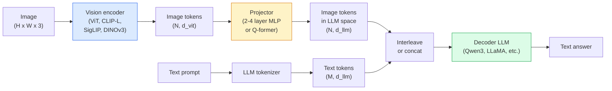

# 视觉-语言模型 —— ViT-MLP-LLM 模式

> 视觉编码器把图像变成 token,MLP 投影器把这些 token 映射进 LLM 的嵌入空间,语言模型完成剩下的事。这个模式——ViT-MLP-LLM——就是 2026 年每一个生产级 VLM。

**类型:** 学习 + 使用
**编程语言:** Python
**前置要求:** 第 4 阶段 第 14 课(ViT)、第 4 阶段 第 18 课(CLIP)、第 7 阶段 第 02 课(自注意力)
**预计耗时:** 约 75 分钟

## 学习目标

- 说出 ViT-MLP-LLM 架构,并解释三个组件各自的贡献
- 在参数量、上下文长度和基准表现上对比 Qwen3-VL、InternVL3.5、LLaVA-Next 和 GLM-4.6V
- 解释 DeepStack:为什么多层 ViT 特征比单用最后一层特征能让视觉-语言对齐更紧密
- 用跨模态错误率(CMER)度量生产环境中的 VLM 幻觉,并根据信号采取行动

## 问题

CLIP(第 4 阶段 第 18 课)给你图文共享的嵌入空间,够做零样本分类和检索。但它回答不了"这张图里有几辆红色汽车?"——CLIP 不生成文本,只给相似度打分。

视觉-语言模型(VLM)——Qwen3-VL、InternVL3.5、LLaVA-Next、GLM-4.6V——把一个 CLIP 家族的图像编码器接到一个完整的语言模型上。模型看到一张图加一个问题,生成一个答案。2026 年,开源 VLM 在多模态基准(MMMU、MMBench、DocVQA、ChartQA、MathVista、OSWorld)上已能比肩甚至击败 GPT-5 和 Gemini-2.5-Pro。

三件套的架构(ViT、投影器、LLM)是标准。各模型的区别在于:用哪个 ViT、哪个投影器、哪个 LLM,以及训练数据和对齐配方。理解了这个模式,更换任何组件都只是机械操作。

## 概念

### ViT-MLP-LLM 架构



1. **视觉编码器** —— 一个预训练 ViT(CLIP-L/14、SigLIP、DINOv3,或它们的微调变体),产出 patch token。
2. **投影器** —— 一个小模块(2–4 层 MLP,或 Q-former),把视觉 token 映射到 LLM 的嵌入维度。大部分微调都发生在这里。
3. **LLM** —— 一个 decoder-only 语言模型(Qwen3、Llama、Mistral、GLM、InternLM),按序列读入视觉 + 文本 token,生成文本。

三个部件原则上都可训练。实践中,视觉编码器和 LLM 基本冻结,只训投影器——花小钱办大事,几十亿参数的信号就这么接上了。

### DeepStack

朴素投影只用 ViT 的最后一层。DeepStack(Qwen3-VL)从 ViT 的多个深度采样特征并堆叠:深层携带高层语义,浅层携带细粒度的空间与纹理信息。两者一起喂给 LLM,弥合了"图里有什么"(语义)与"具体在哪里"(空间 grounding)之间的鸿沟。

### 三个训练阶段

现代 VLM 分阶段训练:

1. **对齐(Alignment)** —— 冻结 ViT 和 LLM,只在图文配对数据上训练投影器。教投影器把视觉空间映射进语言空间。
2. **预训练(Pre-training)** —— 全部解冻,在大规模交错图文数据(5 亿+ 对)上训练,构建模型的视觉知识。
3. **指令微调(Instruction tuning)** —— 在精选的(图像, 问题, 答案)三元组上微调,教对话行为和任务格式。正是这一步把"懂视觉的 LM"变成可用的助手。

大多数 LoRA 微调针对第 3 阶段,用小规模标注数据集。

### 模型家族对比(2026 年初)

| 模型 | 参数量 | 视觉编码器 | LLM | 上下文 | 长处 |
|-------|--------|----------------|-----|---------|-----------|
| Qwen3-VL-235B-A22B(MoE) | 235B(激活 22B) | 定制 ViT + DeepStack | Qwen3 | 256K | 综合 SOTA,GUI 智能体 |
| Qwen3-VL-30B-A3B(MoE) | 30B(激活 3B) | 定制 ViT + DeepStack | Qwen3 | 256K | 更小的 MoE 替代 |
| Qwen3-VL-8B(稠密) | 8B | 定制 ViT | Qwen3 | 128K | 生产稠密默认款 |
| InternVL3.5-38B | 38B | InternViT-6B | Qwen3 + GPT-OSS | 128K | MMBench / MMVet 强势 |
| InternVL3.5-241B-A28B | 241B(激活 28B) | InternViT-6B | Qwen3 | 128K | 可与 GPT-4o 竞争 |
| LLaVA-Next 72B | 72B | SigLIP | Llama-3 | 32K | 开放,易于微调 |
| GLM-4.6V | ~70B | 定制 | GLM | 64K | 开源,OCR 强 |
| MiniCPM-V-2.6 | 8B | SigLIP | MiniCPM | 32K | 适合边缘端 |

### 视觉智能体

Qwen3-VL-235B 在 OSWorld 上达到全球顶尖——这是一个**视觉智能体**基准,考察模型操作 GUI(桌面、移动、网页)的能力。模型看截图、理解 UI、输出动作(点击、输入、滚动)。配合工具,它能闭环完成常见桌面任务。2026 年大多数"AI PC"演示,底下跑的就是它。

### 智能体能力 + RoPE 变体

VLM 需要知道一帧在视频中的**时间位置**。Qwen3-VL 从 T-RoPE(时间旋转位置编码)演进到**基于文本的时间对齐**——把时间戳文本 token 显式地插进视频帧之间。模型看到"`<timestamp 00:32>` 帧,提示词",就能推理时间关系。

### 对齐问题

爬取的数据集中,12% 的图文对包含并未完全落在图像内容上的描述。在这种数据上训练的 VLM,会悄悄学会幻觉——编造物体、读错数字、虚构关系。生产中,这是最主要的失败模式。

Skywork.ai 提出**跨模态错误率(CMER)**来追踪它:

```
CMER = fraction of outputs where the text confidence is high but the image-text similarity (via a CLIP-family checker) is low
```

CMER 高,说明模型在自信地说一些图中没有依据的话。把 CMER 当作生产 KPI 监控,在他们的部署中把幻觉率降了约 35%。诀窍不是"修好模型",而是"把高 CMER 的输出路由给人工复核"。

### 用 LoRA / QLoRA 微调

70B VLM 的全量微调超出大多数团队的能力。在注意力 + 投影层上做 LoRA(rank 16–64),或基座权重 4-bit 的 QLoRA,单张 A100 / H100 就能跑。成本:5,000–50,000 条样本,100–5,000 美元算力,2–10 小时训练。

### 空间推理仍是弱项

当前 VLM 在空间推理基准上只有 50–60 分(上下、左右、计数、距离)。如果你的场景依赖"哪个物体在哪个上面",务必大量验证——通用 VLM 的表现低于人类。纯空间任务上有比 VLM 更好的选择:专用的关键点/姿态估计器、深度模型,或检测模型加包围框几何后处理。

```figure
v4-vlm-projector
```

## 动手构建

### 第 1 步:投影器

你最常训练的部件:2–4 层 MLP,配 GELU。

```python
import torch
import torch.nn as nn


class Projector(nn.Module):
    def __init__(self, vit_dim=768, llm_dim=4096, hidden=4096):
        super().__init__()
        self.net = nn.Sequential(
            nn.Linear(vit_dim, hidden),
            nn.GELU(),
            nn.Linear(hidden, llm_dim),
        )

    def forward(self, x):
        return self.net(x)
```

输入是 `(N_patches, d_vit)` 的 token 张量,输出是 `(N_patches, d_llm)`。LLM 把输出的每一行当作一个普通 token。

### 第 2 步:端到端组装 ViT-MLP-LLM

最小 VLM 前向传播的骨架。真实代码用 `transformers`,这里展示概念布局。

```python
class MinimalVLM(nn.Module):
    def __init__(self, vit, projector, llm, image_token_id):
        super().__init__()
        self.vit = vit
        self.projector = projector
        self.llm = llm
        self.image_token_id = image_token_id  # placeholder token in text prompt

    def forward(self, image, input_ids, attention_mask):
        # 1. vision features
        vision_tokens = self.vit(image)                     # (B, N_patches, d_vit)
        vision_embeds = self.projector(vision_tokens)       # (B, N_patches, d_llm)

        # 2. text embeddings
        text_embeds = self.llm.get_input_embeddings()(input_ids)  # (B, M, d_llm)

        # 3. replace image placeholder tokens with vision embeds
        merged = self._merge(text_embeds, vision_embeds, input_ids)

        # 4. run LLM
        return self.llm(inputs_embeds=merged, attention_mask=attention_mask)

    def _merge(self, text_embeds, vision_embeds, input_ids):
        out = text_embeds.clone()
        expected = vision_embeds.size(1)
        for b in range(input_ids.size(0)):
            positions = (input_ids[b] == self.image_token_id).nonzero(as_tuple=True)[0]
            if len(positions) != expected:
                raise ValueError(
                    f"batch item {b} has {len(positions)} image tokens but vision_embeds has {expected} patches."
                    " Every sample in the batch must be pre-padded to the same number of image placeholder tokens.")
            out[b, positions] = vision_embeds[b]
        return out
```

文本中的 `<image>` 占位 token 被替换成真实的图像嵌入——LLaVA、Qwen-VL、InternVL 用的都是这个模式。

### 第 3 步:CMER 计算

一个轻量的运行时检查。

```python
import torch.nn.functional as F


def cross_modal_error_rate(image_emb, text_emb, text_confidence, sim_threshold=0.25, conf_threshold=0.8):
    """
    image_emb, text_emb: embeddings of image and generated text (normalised internally)
    text_confidence:     mean per-token probability in [0, 1]
    Returns:             fraction of high-confidence outputs with low image-text alignment
    """
    image_emb = F.normalize(image_emb, dim=-1)
    text_emb = F.normalize(text_emb, dim=-1)
    sim = (image_emb * text_emb).sum(dim=-1)        # cosine similarity
    high_conf_low_sim = (text_confidence > conf_threshold) & (sim < sim_threshold)
    return high_conf_low_sim.float().mean().item()
```

把 CMER 当生产 KPI:按端点、按提示类型、按客户监控。CMER 上升,说明模型在某类输入分布上开始幻觉。

### 第 4 步:玩具 VLM 分类器(可运行)

演示投影器确实能训练:假的"ViT 特征"进去,一个迷你 LLM 风格的 token 预测类别。

```python
class ToyVLM(nn.Module):
    def __init__(self, vit_dim=32, llm_dim=64, num_classes=5):
        super().__init__()
        self.projector = Projector(vit_dim, llm_dim, hidden=64)
        self.head = nn.Linear(llm_dim, num_classes)

    def forward(self, vision_tokens):
        projected = self.projector(vision_tokens)
        pooled = projected.mean(dim=1)
        return self.head(pooled)
```

在合成的(特征, 类别)对上,200 步以内就能拟合——足以证明投影器模式行得通。

## 投入使用

2026 年生产团队用 VLM 的三条路:

- **托管 API** —— OpenAI Vision、Anthropic Claude Vision、Google Gemini Vision。零运维,但有供应商风险。
- **开源自托管** —— 通过 `transformers` 和 `vllm` 跑 Qwen3-VL 或 InternVL3.5。完全可控,前期投入更高。
- **领域微调** —— 加载 Qwen2.5-VL-7B 或 LLaVA-1.6-7B,用 5k–50k 条自定义样本做 LoRA,用 `vllm` 或 `TGI`  serving。

```python
from transformers import AutoProcessor, AutoModelForVision2Seq
import torch
from PIL import Image

model_id = "Qwen/Qwen3-VL-8B-Instruct"
processor = AutoProcessor.from_pretrained(model_id)
model = AutoModelForVision2Seq.from_pretrained(model_id, torch_dtype=torch.bfloat16, device_map="auto")

messages = [{
    "role": "user",
    "content": [
        {"type": "image", "image": Image.open("plot.png")},
        {"type": "text", "text": "What does this chart show?"},
    ],
}]
inputs = processor.apply_chat_template(messages, add_generation_prompt=True, tokenize=True, return_dict=True, return_tensors="pt").to("cuda")
generated = model.generate(**inputs, max_new_tokens=256)
answer = processor.decode(generated[0][inputs["input_ids"].shape[1]:], skip_special_tokens=True)
```

`apply_chat_template` 隐藏了 `<image>` 占位符的 tokenize 细节,合并工作由模型内部处理。

## 交付

本课产出:

- `outputs/prompt-vlm-selector.md` —— 根据精度、延迟、上下文长度和预算,在 Qwen3-VL / InternVL3.5 / LLaVA-Next / API 之间做选择的提示词
- `outputs/skill-cmer-monitor.md` —— 生成代码,为生产 VLM 端点接入跨模态错误率、分端点仪表盘和告警阈值

## 练习

1. **(易)** 任选开源 VLM,在 5 张图上跑三个提示("这是什么?"、"数一下物体"、"描述这个场景")。人工把每个答案标为正确 / 部分正确 / 幻觉,算一个简易版的 CMER 式比率。
2. **(中)** 用 LoRA(rank 16)在 500 张带描述的目标领域图像上微调 Qwen2.5-VL-3B 或 LLaVA-1.6-7B。对比零样本与微调后的 MMBench 式准确率。
3. **(难)** 把 VLM 的图像编码器换成 DINOv3(替代默认的 SigLIP/CLIP),只重训投影器(冻结 LLM + 冻结 DINOv3)。测量稠密预测类任务(计数、空间推理)是否提升。

## 关键术语

| 术语 | 人们常说的 | 实际含义 |
|------|----------------|----------------------|
| ViT-MLP-LLM | "VLM 模式" | 视觉编码器 + 投影器 + 语言模型;2026 年每一个 VLM |
| 投影器 | "桥梁" | 把视觉 token 映射进 LLM 嵌入空间的 2–4 层 MLP(或 Q-former) |
| DeepStack | "Qwen3-VL 的特征技巧" | 堆叠多层 ViT 特征,而非只用最后一层 |
| 图像 token | "&lt;image&gt; 占位符" | 文本流中的特殊 token,会被替换成投影后的视觉嵌入 |
| CMER | "幻觉 KPI" | 跨模态错误率;文本置信度高而图文相似度低时升高 |
| 视觉智能体 | "会点鼠标的 VLM" | 用工具调用操作 GUI(OSWorld、移动端、网页)的 VLM |
| Q-former | "定长 token 桥" | BLIP-2 式投影器,产出固定数量的视觉查询 token |
| 对齐 / 预训练 / 指令微调 | "三个阶段" | 标准的 VLM 训练流水线 |

## 延伸阅读

- [Qwen3-VL 技术报告(arXiv 2511.21631)](https://arxiv.org/abs/2511.21631)
- [InternVL3.5:推进开源多模态模型(arXiv 2508.18265)](https://arxiv.org/html/2508.18265v1)
- [LLaVA-Next 系列](https://llava-vl.github.io/blog/2024-05-10-llava-next-stronger-llms/)
- [BentoML:2026 最佳开源 VLM](https://www.bentoml.com/blog/multimodal-ai-a-guide-to-open-source-vision-language-models)
- [MMMU:多学科多模态理解基准](https://mmmu-benchmark.github.io/)
- [制造业中的 VLM(Robotics Tomorrow,2026 年 3 月)](https://www.roboticstomorrow.com/story/2026/03/when-machines-learn-to-see-like-experts-the-rise-of-vision-language-models-in-manufacturing/26335/)
