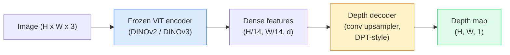

# 单目深度与几何估计

> 深度图是一张单通道图像,每个像素是它到相机的距离。用一帧 RGB 预测它,过去离开双目或 LiDAR 根本不可能;到了 2026 年,一个冻结的 ViT 编码器加一个轻量的头,就能把误差压到 ground truth 的几个百分点以内。

**类型:** 使用 + 动手构建
**编程语言:** Python
**前置要求:** 第 4 阶段 第 14 课(ViT)、第 4 阶段 第 17 课(自监督视觉)、第 4 阶段 第 07 课(U-Net)
**预计耗时:** 约 60 分钟

## 学习目标

- 区分相对深度与度量深度,并说清每个生产模型(MiDaS、Marigold、Depth Anything V3、ZoeDepth)解决的是哪一个
- 使用 Depth Anything V3(DINOv2 骨干)对任意单张图像预测深度,无需任何标定
- 解释单张图像为什么能出深度(透视线索、纹理梯度、学到的先验),以及它恢复不了什么(绝对尺度、被遮挡的几何)
- 用深度图和针孔相机内参,把 2D 检测提升到 3D 点

## 问题

深度是 2D 计算机视觉缺失的那根轴。只有 RGB,你知道东西出现在成像平面的哪里,却不知道它们有多远。深度传感器(双目、LiDAR、ToF)能直接解决这个问题,但昂贵、娇气、量程有限。

单目深度估计——从单帧 RGB 预测深度——过去的输出模糊、不可靠。到 2026 年,大规模预训练编码器改变了局面:Depth Anything V3 用冻结的 DINOv2 骨干,产出的深度图在室内、室外、医疗、卫星领域都能泛化;Marigold 把深度重构成条件扩散问题;ZoeDepth 直接回归真实的米制距离。

深度还是 2D 检测通往 3D 理解的桥:把检测框内的像素乘上深度,2D 物体就被抬升成 3D 点云。每个 AR 遮挡系统、每条避障流水线、每个"拿起杯子"的机器人,核心都是它。

## 概念

### 相对深度 vs 度量深度

- **相对深度** —— 有序的 `z` 值,不带真实世界单位。"像素 A 比像素 B 近,但距离之比并不锚定到米。"
- **度量深度** —— 以米为单位的绝对距离。要求模型学到图像线索与真实距离之间的统计关系。

MiDaS 和 Depth Anything V3 产出相对深度;Marigold 产出相对深度;ZoeDepth、UniDepth、Metric3D 产出度量深度。度量模型对相机内参敏感,相对模型不敏感。

### 编码器-解码器模式



Depth Anything V3 冻结编码器,只训练 DPT 风格的解码器:编码器提供丰富特征,解码器把它们插值回图像分辨率并回归深度。

### 单张图为什么能出深度

2D 图像里藏着许多与深度相关的单目线索:

- **透视** —— 3D 中的平行线在 2D 中汇聚。
- **纹理梯度** —— 远处表面的纹理更小、更密。
- **遮挡顺序** —— 近处物体挡住远处物体。
- **大小恒常性** —— 已知物体(汽车、人)给出大致尺度。
- **大气透视** —— 户外场景中,远处物体显得更朦胧、更偏蓝。

在数十亿图像上训练的 ViT 把这些线索内化了。数据够多、骨干够强,单目深度不需要任何显式 3D 监督就能达到合理精度。

### 单目深度做不到什么

- **没有内参或已知物体,就没有绝对米制尺度。** 网络能预测"杯子比勺子远一倍",却不知道杯子在 1 米还是 10 米外。
- **被遮挡的几何** —— 椅子的背面不可见,无法可靠推断。
- **真正无纹理/反光的表面** —— 镜子、玻璃、纯色墙面。网络会给出看似合理但错误的深度。

### 2026 年的 Depth Anything V3

- 朴素的 DINOv2 ViT-L/14 作编码器(冻结)。
- DPT 解码器。
- 在来自多种来源的带位姿图像对上训练(除光度一致性外无需显式深度监督)。
- 从**任意数量、有无已知相机位姿皆可的视觉输入**中预测空间一致的几何。
- 在单目深度、任意视角几何、视觉渲染、相机位姿估计上全面 SOTA。

2026 年需要深度时,直接调它。

### Marigold —— 用扩散做深度

Marigold(Ke 等,CVPR 2024)把深度估计重构成条件图到图扩散:条件是 RGB,目标是深度图,骨干用预训练 Stable Diffusion 2 U-Net。输出的深度图在物体边界处异常锐利。代价:推理比前馈模型慢(10–50 步去噪)。

### 内参与针孔相机

把像素 `(u, v)` 连同深度 `d` 提升到相机坐标下的 3D 点 `(X, Y, Z)`:

```
fx, fy, cx, cy = camera intrinsics
X = (u - cx) * d / fx
Y = (v - cy) * d / fy
Z = d
```

内参来自 EXIF 元数据、标定板,或单目内参估计器(Perspective Fields、UniDepth)。没有内参时,也可以假设 60–70° 视场角和居中主点来渲染点云——可视化够用,测量不行。

### 评估

两个标准指标:

- **AbsRel**(绝对相对误差):`mean(|d_pred - d_gt| / d_gt)`。越低越好,生产模型 0.05–0.1。
- **delta < 1.25**(阈值准确率):满足 `max(d_pred/d_gt, d_gt/d_pred) < 1.25` 的像素占比。越高越好,SOTA 在 0.9 以上。

对相对深度模型(Depth Anything V3、MiDaS),评估用这两个指标的"尺度-平移不变"版本。

```figure
depth-sweep
```

## 动手构建

### 第 1 步:深度指标

```python
import torch

def abs_rel_error(pred, target, mask=None):
    if mask is not None:
        pred = pred[mask]
        target = target[mask]
    return (torch.abs(pred - target) / target.clamp(min=1e-6)).mean().item()


def delta_accuracy(pred, target, threshold=1.25, mask=None):
    if mask is not None:
        pred = pred[mask]
        target = target[mask]
    ratio = torch.maximum(pred / target.clamp(min=1e-6), target / pred.clamp(min=1e-6))
    return (ratio < threshold).float().mean().item()
```

评估前记得屏蔽无效深度像素(零、NaN、饱和值)。

### 第 2 步:尺度-平移对齐

对相对深度模型,先把预测对齐到 ground truth 再算指标。对 `a * pred + b = target` 做最小二乘拟合:

```python
def align_scale_shift(pred, target, mask=None):
    if mask is not None:
        p = pred[mask]
        t = target[mask]
    else:
        p = pred.flatten()
        t = target.flatten()
    A = torch.stack([p, torch.ones_like(p)], dim=1)
    coeffs, *_ = torch.linalg.lstsq(A, t.unsqueeze(-1))
    a, b = coeffs[:2, 0]
    return a * pred + b
```

评估 MiDaS / Depth Anything 时,先跑 `align_scale_shift` 再算 `abs_rel_error`。

### 第 3 步:把深度提升为点云

```python
import numpy as np

def depth_to_point_cloud(depth, intrinsics):
    H, W = depth.shape
    fx, fy, cx, cy = intrinsics
    v, u = np.meshgrid(np.arange(H), np.arange(W), indexing="ij")
    z = depth
    x = (u - cx) * z / fx
    y = (v - cy) * z / fy
    return np.stack([x, y, z], axis=-1)


depth = np.random.uniform(0.5, 4.0, (240, 320))
intr = (320.0, 320.0, 160.0, 120.0)
pc = depth_to_point_cloud(depth, intr)
print(f"point cloud shape: {pc.shape}  (H, W, 3)")
```

一个函数,支撑所有 3D 提升应用。点云导出为 `.ply`,用 MeshLab 或 CloudCompare 打开。

### 第 4 步:用合成深度场景做冒烟测试

```python
def synthetic_depth(size=96):
    yy, xx = np.meshgrid(np.arange(size), np.arange(size), indexing="ij")
    # Floor: linear gradient from near (top) to far (bottom)
    depth = 1.0 + (yy / size) * 4.0
    # Box in the middle: closer
    mask = (np.abs(xx - size / 2) < size / 6) & (np.abs(yy - size * 0.6) < size / 6)
    depth[mask] = 2.0
    return depth.astype(np.float32)


gt = torch.from_numpy(synthetic_depth(96))
pred = gt + 0.3 * torch.randn_like(gt)  # simulated prediction
aligned = align_scale_shift(pred, gt)
print(f"before align  absRel = {abs_rel_error(pred, gt):.3f}")
print(f"after align   absRel = {abs_rel_error(aligned, gt):.3f}")
```

### 第 5 步:Depth Anything V3 用法(参考)

```python
import torch
from transformers import pipeline
from PIL import Image

pipe = pipeline(task="depth-estimation", model="LiheYoung/depth-anything-v2-large")

image = Image.open("street.jpg").convert("RGB")
out = pipe(image)
depth_np = np.array(out["depth"])
```

三行代码。`out["depth"]` 是 PIL 灰度图,转 numpy 后做数学运算。Depth Anything V3 正式发布后换掉模型 id 即可,API 不变。

## 投入使用

- **Depth Anything V3**(Meta AI / 字节,2024–2026)—— 相对深度的默认选择,ViT-large 骨干中最快的生产模型。
- **Marigold**(ETH,2024)—— 视觉质量最高,推理慢。
- **UniDepth**(ETH,2024)—— 度量深度,带相机内参估计。
- **ZoeDepth**(Intel,2023)—— 度量深度;较老,但仍可靠。
- **MiDaS v3.1** —— 老牌但稳定,适合做对比基线。

典型集成模式:

1. RGB 帧到达。
2. 深度模型产出深度图。
3. 检测器产出检测框。
4. 把框中心经深度提升到 3D;如有现成点云则融合。
5. 下游:AR 遮挡、路径规划、物体尺寸估计、双目替代。

实时场景下,Depth Anything V2 Small(INT8 量化)在消费级 GPU 上 518x518 分辨率能跑到约 30 fps。

## 交付

本课产出:

- `outputs/prompt-depth-model-picker.md` —— 根据延迟、度量 vs 相对深度需求和场景类型,在 Depth Anything V3、Marigold、UniDepth、MiDaS 之间做选择的提示词
- `outputs/skill-depth-to-pointcloud.md` —— 从深度图构建点云的技能,含正确的内参处理和 `.ply` 导出

## 练习

1. **(易)** 用 Depth Anything V2 跑 10 张你自己桌面的照片,深度存为灰度 PNG 并检查。找一个预测深度明显错误的物体,解释单目线索为什么在那里失效。
2. **(中)** 用 Depth Anything V2 的 RGB + 深度,提升到点云并用 `open3d` 渲染。对比两个场景(室内 / 室外),指出哪个更可信。
3. **(难)** 拍五对图像,差异仅在某个已知物体的位置(如瓶子挪近了 30 cm)。用 UniDepth 对两图预测度量深度,报告预测的距离差与真实 30 cm 的对比。

## 关键术语

| 术语 | 人们常说的 | 实际含义 |
|------|----------------|----------------------|
| 单目深度 | "单图深度" | 从单帧 RGB 估计深度,不用双目或 LiDAR |
| 相对深度 | "有序深度" | 有序的 z 值,不带真实世界单位 |
| 度量深度 | "绝对距离" | 以米为单位的深度;需要标定,或经度量监督训练的模型 |
| AbsRel | "绝对相对误差" | |d_pred − d_gt| / d_gt 的均值;标准深度指标 |
| Delta 准确率 | "delta < 1.25" | 预测值与真值相差不超过 25% 的像素占比 |
| 针孔相机 | "fx, fy, cx, cy" | 把 (u, v, d) 提升到 (X, Y, Z) 所用的相机模型 |
| DPT | "稠密预测 Transformer" | 架在冻结 ViT 编码器上做深度的卷积解码器 |
| DINOv2 骨干 | "它能成的原因" | 自监督特征,无需深度标注即可跨领域泛化 |

## 延伸阅读

- [Depth Anything V3 论文页](https://depth-anything.github.io/) —— DINOv2 编码器的 SOTA 单目深度
- [Marigold(Ke 等,CVPR 2024)](https://marigoldmonodepth.github.io/) —— 基于扩散的深度估计
- [UniDepth(Piccinelli 等,2024)](https://arxiv.org/abs/2403.18913) —— 带内参的度量深度
- [MiDaS v3.1(Intel ISL)](https://github.com/isl-org/MiDaS) —— 经典的相对深度基线
- [DINOv3 博客(Meta)](https://ai.meta.com/blog/dinov3-self-supervised-vision-model/) —— 拉高深度精度的编码器家族
