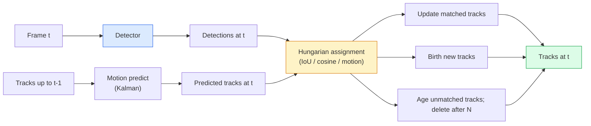

# 多目标跟踪与视频记忆

> 跟踪 = 检测 + 关联。每帧都做检测,把本帧的检测与上一帧的轨迹按 ID 对上。

**类型:** 动手构建
**编程语言:** Python
**前置要求:** 第 4 阶段 第 06 课(YOLO 检测)、第 4 阶段 第 08 课(Mask R-CNN)、第 4 阶段 第 24 课(SAM 3)
**预计耗时:** 约 60 分钟

## 学习目标

- 区分"基于检测的跟踪"与"基于查询的跟踪",说出各算法家族(SORT、DeepSORT、ByteTrack、BoT-SORT、SAM 2 记忆追踪器、SAM 3.1 Object Multiplex)
- 从零实现 IoU + 匈牙利算法指派,完成经典的基于检测的跟踪
- 解释 SAM 2 的记忆库,以及它为什么比基于 IoU 的关联更能应对遮挡
- 读懂三个跟踪指标(MOTA、IDF1、HOTA),并针对给定场景选出该看的那个

## 问题

检测器告诉你单帧里物体在哪里;跟踪器告诉你第 `t` 帧的哪个检测与第 `t-1` 帧的哪个检测是同一个物体。没有这一步,你没法数越过一条线的物体数,没法在遮挡中跟住一个球,也没法知道"4 号车已在这条车道上停了 8 秒"。

跟踪是每个视频类产品的地基:体育分析、安防监控、自动驾驶、医学视频分析、野生动物监测、标识计数。核心构件是共用的:逐帧检测器、运动模型(卡尔曼滤波或更强的模型)、关联步骤(在 IoU / 余弦 / 学习特征上跑匈牙利算法),以及轨迹生命周期(新生、更新、消亡)。

2026 年出现了两个新范式:**SAM 2 基于记忆的跟踪**(用特征记忆替代运动模型关联)和 **SAM 3.1 Object Multiplex**(同一概念的多个实例共享记忆)。本课先走经典技术栈,再讲基于记忆的方法。

## 概念

### 基于检测的跟踪



2026 年你遇到的每个跟踪器,都是这个循环的变体。区别在于:

- **SORT**(2016):卡尔曼滤波 + IoU 匈牙利指派。简单、快,无外观模型。
- **DeepSORT**(2017):SORT + 每条轨迹一个 CNN 外观特征(ReID 嵌入)。过交叉场景表现更好。
- **ByteTrack**(2021):把低置信度检测留作第二阶段再匹配;不需要外观特征,却是 MOT17 的头部选手。
- **BoT-SORT**(2022):Byte + 相机运动补偿 + ReID。
- **StrongSORT / OC-SORT** —— ByteTrack 的后代,运动与外观建模更强。

### 一段话讲清卡尔曼滤波

卡尔曼滤波为每条轨迹维护状态 `(x, y, w, h, dx, dy, dw, dh)` 及协方差。每帧先**预测**:用匀速模型推出状态;再**更新**:用匹配到的检测修正。预测不确定性高时,更新更信任检测。这带来平滑的轨迹,以及穿越短暂遮挡(1–5 帧)维持轨迹的能力。

每个经典跟踪器都在运动预测这一步用卡尔曼滤波。

### 匈牙利算法

给定 `M x N` 代价矩阵(轨迹 × 检测),找出使总代价最小的一对一指派。代价通常是 `1 - IoU(track_bbox, detection_bbox)`,或外观特征余弦相似度的负值。复杂度 O((M+N)³);M、N 到 ~1000 时,Python 里用 `scipy.optimize.linear_sum_assignment` 足够快。

### ByteTrack 的关键想法

标准跟踪器丢掉低置信度检测(< 0.5)。ByteTrack 把它们留作**第二阶段候选**:轨迹先与高置信度检测匹配,剩下的未匹配轨迹再用略宽松的 IoU 阈值去配低置信度检测。这能找回短暂遮挡,减少人群附近的 ID 切换。

### SAM 2 基于记忆的跟踪

SAM 2 处理视频靠的是**记忆库**:为每个实例存时空特征。在某一帧上给出提示(点、框、文本),它把该实例编码进记忆;后续帧上,记忆与新帧特征做交叉注意力,解码器产出新帧中同一实例的掩码。

没有卡尔曼滤波,没有匈牙利指派——关联隐含在记忆-注意力操作里。

优点:
- 抗大遮挡(记忆把实例身份带过很多帧)。
- 配合 SAM 3 的文本提示即可开放词汇。
- 不需要独立的运动模型。

缺点:
- 多目标场景比 ByteTrack 慢。
- 记忆库会增长,上下文窗口受限。

### SAM 3.1 Object Multiplex

此前的 SAM 2 / SAM 3 跟踪,每个实例各用一个记忆库:50 个物体,50 个记忆库。Object Multiplex(2026 年 3 月)把它们收拢成一个共享记忆,配**逐实例查询 token**,开销随实例数次线性增长。

Multiplex 是 2026 年人群跟踪的新默认:演唱会人群、仓库工人、交通路口。

### 必知的三个指标

- **MOTA(多目标跟踪准确率)** —— 1 − (FN + FP + ID 切换)/ GT。按错误类型加权;单一数字,但把检测失败和关联失败混在了一起。
- **IDF1(ID 的 F1)** —— ID 精确率与召回率的调和平均。专看每条 ground-truth 轨迹随时间保住自己 ID 的能力,对 ID 切换敏感的任务比 MOTA 更好。
- **HOTA(高阶跟踪准确率)** —— 分解为检测精度(DetA)与关联精度(AssA)。2020 年以来的社区标准,最全面。

安防(谁是谁):报告 IDF1。体育分析(数传球):HOTA。一般学术对比:HOTA。

```figure
cv3-track-assoc
```

## 动手构建

### 第 1 步:基于 IoU 的代价矩阵

```python
import numpy as np


def bbox_iou(a, b):
    """
    a, b: (N, 4) arrays of [x1, y1, x2, y2].
    Returns (N_a, N_b) IoU matrix.
    """
    ax1, ay1, ax2, ay2 = a[:, 0], a[:, 1], a[:, 2], a[:, 3]
    bx1, by1, bx2, by2 = b[:, 0], b[:, 1], b[:, 2], b[:, 3]
    inter_x1 = np.maximum(ax1[:, None], bx1[None, :])
    inter_y1 = np.maximum(ay1[:, None], by1[None, :])
    inter_x2 = np.minimum(ax2[:, None], bx2[None, :])
    inter_y2 = np.minimum(ay2[:, None], by2[None, :])
    inter = np.clip(inter_x2 - inter_x1, 0, None) * np.clip(inter_y2 - inter_y1, 0, None)
    area_a = (ax2 - ax1) * (ay2 - ay1)
    area_b = (bx2 - bx1) * (by2 - by1)
    union = area_a[:, None] + area_b[None, :] - inter
    return inter / np.clip(union, 1e-8, None)
```

### 第 2 步:极简 SORT 式跟踪器

为简洁省略了匀速卡尔曼预测——这里用简单的 IoU 关联;生产中卡尔曼预测必不可少,完整版见 `sort` Python 包。

```python
from scipy.optimize import linear_sum_assignment


class Track:
    def __init__(self, tid, bbox, frame):
        self.id = tid
        self.bbox = bbox
        self.last_frame = frame
        self.hits = 1

    def update(self, bbox, frame):
        self.bbox = bbox
        self.last_frame = frame
        self.hits += 1


class SimpleTracker:
    def __init__(self, iou_threshold=0.3, max_age=5):
        self.tracks = []
        self.next_id = 1
        self.iou_threshold = iou_threshold
        self.max_age = max_age

    def step(self, detections, frame):
        if not self.tracks:
            for d in detections:
                self.tracks.append(Track(self.next_id, d, frame))
                self.next_id += 1
            return [(t.id, t.bbox) for t in self.tracks]

        track_boxes = np.array([t.bbox for t in self.tracks])
        det_boxes = np.array(detections) if len(detections) else np.empty((0, 4))

        iou = bbox_iou(track_boxes, det_boxes) if len(det_boxes) else np.zeros((len(track_boxes), 0))
        cost = 1 - iou
        cost[iou < self.iou_threshold] = 1e6

        matched_track = set()
        matched_det = set()
        if cost.size > 0:
            row, col = linear_sum_assignment(cost)
            for r, c in zip(row, col):
                if cost[r, c] < 1.0:
                    self.tracks[r].update(det_boxes[c], frame)
                    matched_track.add(r); matched_det.add(c)

        for i, d in enumerate(det_boxes):
            if i not in matched_det:
                self.tracks.append(Track(self.next_id, d, frame))
                self.next_id += 1

        self.tracks = [t for t in self.tracks if frame - t.last_frame <= self.max_age]
        return [(t.id, t.bbox) for t in self.tracks]
```

60 行:吃进逐帧检测,吐出逐帧轨迹 ID。真实系统还要加卡尔曼预测、ByteTrack 的第二阶段重匹配和外观特征。

### 第 3 步:合成轨迹测试

```python
def synthetic_frames(num_frames=20, num_objects=3, H=240, W=320, seed=0):
    rng = np.random.default_rng(seed)
    starts = rng.uniform(20, 200, size=(num_objects, 2))
    velocities = rng.uniform(-5, 5, size=(num_objects, 2))
    frames = []
    for f in range(num_frames):
        dets = []
        for i in range(num_objects):
            cx, cy = starts[i] + f * velocities[i]
            dets.append([cx - 10, cy - 10, cx + 10, cy + 10])
        frames.append(dets)
    return frames


tracker = SimpleTracker()
for f, dets in enumerate(synthetic_frames()):
    tracks = tracker.step(dets, f)
```

三个匀速直线运动的物体,应在全部 20 帧里保住自己的 ID。

### 第 4 步:ID 切换指标

```python
def count_id_switches(tracks_per_frame, gt_per_frame):
    """
    tracks_per_frame:  list of list of (track_id, bbox)
    gt_per_frame:      list of list of (gt_id, bbox)
    Returns number of ID switches.
    """
    prev_assignment = {}
    switches = 0
    for tracks, gts in zip(tracks_per_frame, gt_per_frame):
        if not tracks or not gts:
            continue
        t_boxes = np.array([b for _, b in tracks])
        g_boxes = np.array([b for _, b in gts])
        iou = bbox_iou(g_boxes, t_boxes)
        for g_idx, (gt_id, _) in enumerate(gts):
            j = iou[g_idx].argmax()
            if iou[g_idx, j] > 0.5:
                t_id = tracks[j][0]
                if gt_id in prev_assignment and prev_assignment[gt_id] != t_id:
                    switches += 1
                prev_assignment[gt_id] = t_id
    return switches
```

这是一个简化的、类 IDF1 的指标:数 ground-truth 物体被换绑预测轨迹 ID 的次数。真正的 MOTA / IDF1 / HOTA 工具在 `py-motmetrics` 和 `TrackEval` 里。

## 投入使用

2026 年的生产跟踪器:

- `ultralytics` —— YOLOv8 内置 ByteTrack / BoT-SORT:`results = model.track(source, tracker="bytetrack.yaml")`。默认选择。
- `supervision`(Roboflow)—— ByteTrack 封装加标注工具。
- SAM 2 / SAM 3.1 —— 通过 `processor.track()` 做基于记忆的跟踪。
- 自定义栈:检测器(YOLOv8 / RT-DETR)+ `sort-tracker` / `OC-SORT` / `StrongSORT`。

怎么选:

- 行人 / 车辆 / 框、30+ fps:**ultralytics 的 ByteTrack**。
- 人群中同一类的许多实例:**SAM 3.1 Object Multiplex**。
- 重遮挡且外观可辨识:**DeepSORT / StrongSORT**(ReID 特征)。
- 体育 / 复杂交互:**BoT-SORT** 或学习型跟踪器(MOTRv3)。

## 交付

本课产出:

- `outputs/prompt-tracker-picker.md` —— 根据场景类型、遮挡模式和延迟预算,在 SORT / ByteTrack / BoT-SORT / SAM 2 / SAM 3.1 之间做选择的提示词
- `outputs/skill-mot-evaluator.md` —— 编写完整评估框架的技能,对照 ground-truth 轨迹计算 MOTA / IDF1 / HOTA

## 练习

1. **(易)** 用 3、10、30 个物体跑上面的合成跟踪器,报告各情形的 ID 切换次数。指出简单的纯 IoU 关联从哪里开始失效。
2. **(中)** 在关联之前加匀速卡尔曼预测步骤。证明短暂(2–3 帧)遮挡不再导致 ID 切换。
3. **(难)** 通过 `transformers` 集成 SAM 2 的记忆追踪器作为替代后端。在一段 30 秒的人群视频上同时跑 SimpleTracker 和 SAM 2,人工标注 5 个显眼人物的 ground-truth ID,对比两者的 ID 切换数。

## 关键术语

| 术语 | 人们常说的 | 实际含义 |
|------|----------------|----------------------|
| 基于检测的跟踪 | "先检测再关联" | 逐帧检测器 + 在 IoU / 外观上做匈牙利指派 |
| 卡尔曼滤波 | "运动预测" | 线性动力学 + 协方差,给出平滑的轨迹预测与遮挡处理 |
| 匈牙利算法 | "最优指派" | 求解最小代价二分图匹配;`scipy.optimize.linear_sum_assignment` |
| ByteTrack | "低置信度第二遍" | 未匹配轨迹再去配低置信度检测,找回短暂遮挡 |
| DeepSORT | "SORT + 外观" | 加入 ReID 特征做跨帧匹配;更有利于保住 ID |
| 记忆库 | "SAM 2 的技巧" | 跨帧存储的逐实例时空特征;交叉注意力取代显式关联 |
| Object Multiplex | "SAM 3.1 共享记忆" | 单个共享记忆 + 逐实例查询,多目标跟踪更快 |
| HOTA | "现代跟踪指标" | 分解为检测精度与关联精度;社区标准 |

## 延伸阅读

- [SORT(Bewley 等,2016)](https://arxiv.org/abs/1602.00763) —— 极简的基于检测的跟踪论文
- [DeepSORT(Wojke 等,2017)](https://arxiv.org/abs/1703.07402) —— 加入外观特征
- [ByteTrack(Zhang 等,2022)](https://arxiv.org/abs/2110.06864) —— 低置信度第二遍
- [BoT-SORT(Aharon 等,2022)](https://arxiv.org/abs/2206.14651) —— 相机运动补偿
- [HOTA(Luiten 等,2020)](https://arxiv.org/abs/2009.07736) —— 分解式跟踪指标
- [SAM 2 视频分割(Meta,2024)](https://ai.meta.com/sam2/) —— 基于记忆的追踪器
- [SAM 3.1 Object Multiplex(Meta,2026 年 3 月)](https://ai.meta.com/blog/segment-anything-model-3/)
