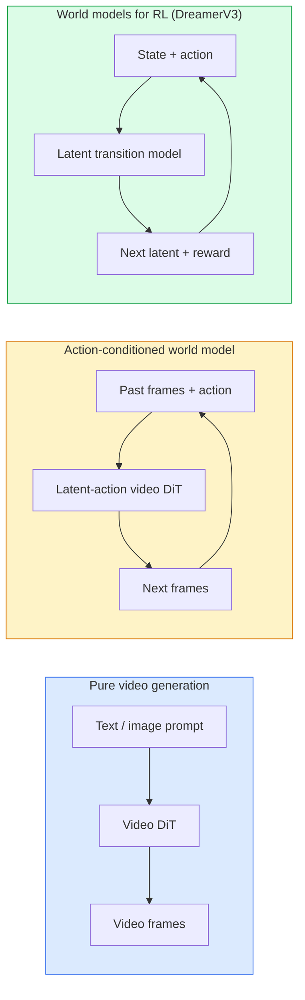

# 世界模型与视频扩散

> 一个能预测场景未来几秒的视频模型,就是一个世界模拟器。让这个预测以动作为条件,你就得到了一个学习出来的游戏引擎。

**类型:** 学习 + 动手构建
**编程语言:** Python
**前置要求:** 第 4 阶段 第 10 课(扩散)、第 4 阶段 第 12 课(视频理解)、第 4 阶段 第 23 课(DiT + Rectified Flow)
**预计耗时:** 约 75 分钟

## 学习目标

- 解释纯视频生成模型(Sora 2)与动作条件世界模型(Genie 3、DreamerV3)的区别
- 描述视频 DiT:时空 patch、3D 位置编码、跨 (T, H, W) token 的联合注意力
- 梳理世界模型如何接入机器人技术栈:VLM 规划 → 视频模型模拟 → 逆动力学输出动作
- 针对给定场景(创意视频、交互式模拟、自动驾驶合成),在 Sora 2、Genie 3、Runway GWM-1 Worlds、Wan-Video、HunyuanVideo 之间做选择

## 问题

2026 年,视频生成与世界建模合流了。一个能生成连贯一分钟视频的模型,某种意义上已经学会了世界如何运转:物体恒存、重力、因果、风格。如果再让这种预测以动作(向左走、开门)为条件,视频模型就变成了一个可学习的模拟器,可以替代游戏引擎、驾驶模拟器或机器人环境。

利害关系是实实在在的:Genie 3 能从单张图片生成可玩的环境;Runway GWM-1 Worlds 能合成无限可探索的场景;Sora 2 能产出带同步音频和物理建模的一分钟视频;NVIDIA Cosmos-Drive、Wayve Gaia-2、Tesla DrivingWorld 为自动驾驶训练数据生成逼真的驾驶视频。世界模型范式正在悄悄接管机器人领域的 sim-to-real。

本课是 第 4 阶段 的"大局观"课:把图像生成、视频理解和智能体推理,连成主流研究正在靠拢的那个架构模式。

## 概念

### 世界建模的三个家族



- **Sora 2** 是以提示词为条件的纯视频生成。没有动作接口,生成中途你无法"驾驶"它。
- **Genie 3**、**GWM-1 Worlds**、**Mirage / Magica** 是动作条件世界模型:从观测到的视频中推断潜动作,再以动作为条件预测未来帧。可交互——你按键或移动相机,场景会响应。
- **DreamerV3** 及经典 RL 世界模型家族,在潜空间中做带显式动作条件的预测,用奖励信号训练。视觉表现弱一些,但对样本高效的 RL 更有用。

### 视频 DiT 架构

```
Video latent:          (C, T, H, W)
Patchify (spatial):    grid of P_h x P_w patches per frame
Patchify (temporal):   group P_t frames into a temporal patch
Resulting tokens:      (T / P_t) * (H / P_h) * (W / P_w) tokens
```

位置编码是 3D 的:每个 (t, h, w) 坐标一个旋转或学习型嵌入。注意力可以是:

- **全联合** —— 所有 token 互相注意。N 个 token 时 O(N²),长视频上不可行。
- **分离式** —— 时间注意力(同一空间位置,跨时间:`(H*W) * T²`)与空间注意力(同一时间步,跨空间:`T * (H*W)²`)交替。TimeSformer 和大多数视频 DiT 用它。
- **窗口式** —— 在 (t, h, w) 上取局部窗口。Video Swin 用它。

2026 年每个视频扩散模型都用这三种模式之一,外加 AdaLN 条件注入(第 23 课)和 rectified flow。

### 以动作为条件:潜动作模型

Genie 通过判别式地预测相邻两帧之间发生的动作,为每帧学出一个**潜动作**。模型的解码器随后以推断出的潜动作为条件——而不是显式的按键。推理时,用户可以指定一个潜动作(或从新的先验中采一个),模型就生成与该动作一致的下一帧。

Sora 完全跳过了动作接口:它的解码器从过去的时空 token 预测下一个时空 token。提示词决定开局,生成中途没有任何东西能掌舵。

### 物理合理性

Sora 2 的 2026 年发布明确宣传**物理合理性**:重量、平衡、物体恒存、因果。团队用人工打分的合理性分数来衡量;相比 Sora 1,模型在下落物体、人物碰撞,以及"故意的失败"(没跳过去)上都有肉眼可见的进步。

合理性仍是最主要的失败模式。2024–2025 年那些"人吃面条""举杯喝水"的视频,暴露了模型缺乏持久的物体表征。2026 年的模型(Sora 2、Runway Gen-5、HunyuanVideo)减少了这类问题,但没有根除。

### 自动驾驶世界模型

驾驶世界模型以轨迹、包围框或导航地图为条件,生成逼真道路场景。用途:

- **Cosmos-Drive-Dreams**(NVIDIA)—— 为 RL 训练生成数分钟的驾驶视频。
- **Gaia-2**(Wayve)—— 轨迹条件的场景合成,用于策略评估。
- **DrivingWorld**(Tesla)—— 模拟多变的天气、时段和交通状况。
- **Vista**(字节跳动)—— 响应式驾驶场景合成。

它们替代了昂贵的真实世界边角案例采集——夜间乱穿马路的行人、结冰路口、罕见车型——否则这些需要数百万英里的真实驾驶。

### 机器人技术栈:VLM + 视频模型 + 逆动力学

正在成形的机器人三段式闭环:

1. **VLM** 解析目标("拿起红杯子"),规划高层动作序列。
2. **视频生成模型** 模拟执行每个动作后的样子——预测未来 N 帧的观测。
3. **逆动力学模型** 提取能产生这些观测的具体电机指令。

这取代了奖励塑形和吃样本的 RL:世界模型负责"想象",逆动力学负责在执行器上闭环。Genie Envisioner 是一个实例;许多研究团队正在向这个结构收敛。

### 评估

- **视觉质量** —— FVD(Fréchet 视频距离)、用户研究。
- **提示对齐** —— 逐帧 CLIPScore、VQA 式评估。
- **物理合理性** —— 在基准套件上人工评分(Sora 2 内部基准、VBench)。
- **可控性**(交互式世界模型)—— 动作 → 观测的一致性;能不能回到之前的状态?

### 2026 年的模型版图

| 模型 | 用途 | 参数量 | 输出 | 许可证 |
|-------|-----|------------|--------|---------|
| Sora 2 | 文生视频,带音频 | — | 1 分钟 1080p + 音频 | 仅 API |
| Runway Gen-5 | 文/图生视频 | — | 10 秒片段 | API |
| Runway GWM-1 Worlds | 交互式世界 | — | 无限 3D 展开 | API |
| Genie 3 | 从单图生成交互世界 | 11B+ | 可玩帧序列 | 研究预览 |
| Wan-Video 2.1 | 开源文生视频 | 14B | 高质量片段 | 非商用 |
| HunyuanVideo | 开源文生视频 | 13B | 10 秒片段 | 宽松许可 |
| Cosmos / Cosmos-Drive | 自动驾驶模拟 | 7–14B | 驾驶场景 | NVIDIA 开放 |
| Magica / Mirage 2 | AI 原生游戏引擎 | — | 可修改的世界 | 产品化 |

```figure
v4-world-rollout
```

## 动手构建

### 第 1 步:视频的 3D patchify

```python
import torch
import torch.nn as nn


class VideoPatch3D(nn.Module):
    def __init__(self, in_channels=4, dim=64, patch_t=2, patch_h=2, patch_w=2):
        super().__init__()
        self.proj = nn.Conv3d(
            in_channels, dim,
            kernel_size=(patch_t, patch_h, patch_w),
            stride=(patch_t, patch_h, patch_w),
        )
        self.patch_t = patch_t
        self.patch_h = patch_h
        self.patch_w = patch_w

    def forward(self, x):
        # x: (N, C, T, H, W)
        x = self.proj(x)
        n, c, t, h, w = x.shape
        tokens = x.reshape(n, c, t * h * w).transpose(1, 2)
        return tokens, (t, h, w)
```

步长等于卷积核的 3D 卷积,就是时空 patch 化器:`(T, H, W) -> (T/2, H/2, W/2)` 的 token 网格。

### 第 2 步:3D 旋转位置编码

旋转位置编码(RoPE)分别沿 `t`、`h`、`w` 轴施加:

```python
def rope_3d(tokens, t_dim, h_dim, w_dim, grid):
    """
    tokens: (N, T*H*W, D)
    grid: (T, H, W) sizes
    t_dim + h_dim + w_dim == D
    """
    T, H, W = grid
    n, seq, d = tokens.shape
    if t_dim + h_dim + w_dim != d:
        raise ValueError(f"t_dim+h_dim+w_dim ({t_dim}+{h_dim}+{w_dim}) must equal D={d}")
    assert seq == T * H * W
    t_idx = torch.arange(T, device=tokens.device).repeat_interleave(H * W)
    h_idx = torch.arange(H, device=tokens.device).repeat_interleave(W).repeat(T)
    w_idx = torch.arange(W, device=tokens.device).repeat(T * H)
    # Simplified: just scale channels by frequencies. Real RoPE rotates pairs.
    freqs_t = torch.exp(-torch.log(torch.tensor(10000.0)) * torch.arange(t_dim // 2, device=tokens.device) / (t_dim // 2))
    freqs_h = torch.exp(-torch.log(torch.tensor(10000.0)) * torch.arange(h_dim // 2, device=tokens.device) / (h_dim // 2))
    freqs_w = torch.exp(-torch.log(torch.tensor(10000.0)) * torch.arange(w_dim // 2, device=tokens.device) / (w_dim // 2))
    emb_t = torch.cat([torch.sin(t_idx[:, None] * freqs_t), torch.cos(t_idx[:, None] * freqs_t)], dim=-1)
    emb_h = torch.cat([torch.sin(h_idx[:, None] * freqs_h), torch.cos(h_idx[:, None] * freqs_h)], dim=-1)
    emb_w = torch.cat([torch.sin(w_idx[:, None] * freqs_w), torch.cos(w_idx[:, None] * freqs_w)], dim=-1)
    return tokens + torch.cat([emb_t, emb_h, emb_w], dim=-1)
```

这里是简化的加法形式。真实的 RoPE 按频率旋转成对的通道;位置信息是一样的。

### 第 3 步:分离式注意力块

```python
class DividedAttentionBlock(nn.Module):
    def __init__(self, dim=64, heads=2):
        super().__init__()
        self.time_attn = nn.MultiheadAttention(dim, heads, batch_first=True)
        self.space_attn = nn.MultiheadAttention(dim, heads, batch_first=True)
        self.ln1 = nn.LayerNorm(dim)
        self.ln2 = nn.LayerNorm(dim)
        self.ln3 = nn.LayerNorm(dim)
        self.mlp = nn.Sequential(nn.Linear(dim, 4 * dim), nn.GELU(), nn.Linear(4 * dim, dim))

    def forward(self, x, grid):
        T, H, W = grid
        n, seq, d = x.shape
        # time attention: same (h, w), across t
        xt = x.view(n, T, H * W, d).permute(0, 2, 1, 3).reshape(n * H * W, T, d)
        a, _ = self.time_attn(self.ln1(xt), self.ln1(xt), self.ln1(xt), need_weights=False)
        xt = (xt + a).reshape(n, H * W, T, d).permute(0, 2, 1, 3).reshape(n, seq, d)
        # space attention: same t, across (h, w)
        xs = xt.view(n, T, H * W, d).reshape(n * T, H * W, d)
        a, _ = self.space_attn(self.ln2(xs), self.ln2(xs), self.ln2(xs), need_weights=False)
        xs = (xs + a).reshape(n, T, H * W, d).reshape(n, seq, d)
        xs = xs + self.mlp(self.ln3(xs))
        return xs
```

时间注意力在每个空间位置内部跨时间做,空间注意力在每帧内部跨位置做。两次 O(T² + (HW)²) 操作,代替一次 O((THW)²)。这就是 TimeSformer 和每个现代视频 DiT 的核心。

### 第 4 步:组装迷你视频 DiT

```python
class TinyVideoDiT(nn.Module):
    def __init__(self, in_channels=4, dim=64, depth=2, heads=2):
        super().__init__()
        self.patch = VideoPatch3D(in_channels=in_channels, dim=dim, patch_t=2, patch_h=2, patch_w=2)
        self.blocks = nn.ModuleList([DividedAttentionBlock(dim, heads) for _ in range(depth)])
        self.out = nn.Linear(dim, in_channels * 2 * 2 * 2)

    def forward(self, x):
        tokens, grid = self.patch(x)
        for blk in self.blocks:
            tokens = blk(tokens, grid)
        return self.out(tokens), grid
```

这不是一个能出片的视频生成器,只是验证每个部件形状正确的结构演示。

### 第 5 步:检查形状

```python
vid = torch.randn(1, 4, 8, 16, 16)  # (N, C, T, H, W)
model = TinyVideoDiT()
out, grid = model(vid)
print(f"input  {tuple(vid.shape)}")
print(f"tokens grid {grid}")
print(f"output {tuple(out.shape)}")
```

预期 `grid = (4, 8, 8)`、patch 化后 `out = (1, 256, 32)`;输出头随后把每个 token 投回时空 patch,随时可以 unpatchify 还原成视频。

## 投入使用

2026 年的生产接入方式:

- **Sora 2 API**(OpenAI)—— 文生视频,同步音频。定价高端。
- **Runway Gen-5 / GWM-1**(Runway)—— 图生视频、交互式世界。
- **Wan-Video 2.1 / HunyuanVideo** —— 开源自托管。
- **Cosmos / Cosmos-Drive**(NVIDIA)—— 驾驶模拟,权重开放。
- **Genie 3** —— 研究预览,需申请。

想搭交互式世界模型 demo:用 Wan-Video 打底保质量,叠一层潜动作适配器实现交互。做自动驾驶模拟:Cosmos-Drive 是 2026 年的开源参考。

机器人领域的实际技术栈:

1. 语言目标 → VLM(Qwen3-VL)→ 高层规划。
2. 规划 → 潜动作视频模型 → 想象出的展开(rollout)。
3. 展开 → 逆动力学模型 → 低层动作。
4. 执行动作 → 观测反馈回第 1 步。

## 交付

本课产出:

- `outputs/prompt-video-model-picker.md` —— 根据任务、许可证和延迟,在 Sora 2 / Runway / Wan / HunyuanVideo / Cosmos 之间做选择的提示词
- `outputs/skill-physical-plausibility-checks.md` —— 一个定义自动化检查(物体恒存、重力、连续性)的技能,用于任何生成视频上线前的验证

## 练习

1. **(易)** 计算一段 5 秒 360p 视频在 patch-t=2、patch-h=8、patch-w=8 下的 token 数量,并推算这个规模下注意力的内存开销。
2. **(中)** 把上面的分离式注意力块换成全联合注意力块,测量形状和参数量。解释为什么真实视频模型必须用分离式注意力。
3. **(难)** 构建一个最小潜动作视频模型:取 (frame_t, action_t, frame_{t+1}) 三元组数据集(任何简单 2D 游戏均可),训练一个以动作嵌入为条件的迷你视频 DiT,展示不同动作产生不同的下一帧。

## 关键术语

| 术语 | 人们常说的 | 实际含义 |
|------|----------------|----------------------|
| 世界模型 | "学习出来的模拟器" | 给定状态和动作、预测未来观测的模型 |
| 视频 DiT | "时空 Transformer" | 带 3D patch 化和分离式注意力的扩散 Transformer |
| 潜动作 | "推断出的控制量" | 从相邻帧对中推断出的离散或连续动作潜变量,用于给下一帧生成加条件 |
| 分离式注意力 | "先时间后空间" | 每个块两次注意力——跨时间一次、跨空间一次——把 O(N²) 控制在可承受范围 |
| 物体恒存 | "东西不会凭空消失" | 视频模型必须学会的场景性质;在食物、玻璃器皿上是经典翻车点 |
| FVD | "Fréchet 视频距离" | FID 的视频版;首要的视觉质量指标 |
| 逆动力学模型 | "从观测到动作" | 给定(状态, 下一状态),输出连接两者的动作;闭合机器人闭环 |
| Cosmos-Drive | "NVIDIA 驾驶模拟" | 开放权重的自动驾驶世界模型,用于 RL 与评估 |

## 延伸阅读

- [Sora 技术报告(OpenAI)](https://openai.com/index/video-generation-models-as-world-simulators/)
- [Genie:生成式交互环境(Bruce 等,2024)](https://arxiv.org/abs/2402.15391) —— 潜动作世界模型
- [TimeSformer(Bertasius 等,2021)](https://arxiv.org/abs/2102.05095) —— 视频 Transformer 的分离式注意力
- [DreamerV3(Hafner 等,2023)](https://arxiv.org/abs/2301.04104) —— 面向 RL 的世界模型
- [Cosmos-Drive-Dreams(NVIDIA,2025)](https://research.nvidia.com/labs/toronto-ai/cosmos-drive-dreams/) —— 驾驶世界模型
- [2026 十大视频生成模型(DataCamp)](https://www.datacamp.com/blog/top-video-generation-models)
- [从视频生成到世界模型 —— 综述仓库](https://github.com/ziqihuangg/Awesome-From-Video-Generation-to-World-Model/)
