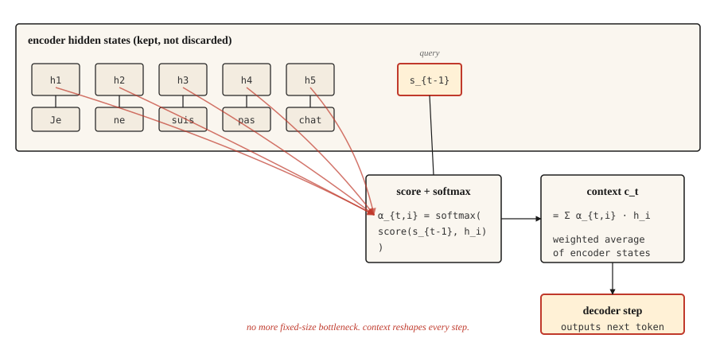

# 注意力机制——破局

> 解码器不再眯着眼看一份压缩摘要,而是直接看向整个源句。从此之后的一切,都是注意力加工程。

**类型:** 动手构建
**编程语言:** Python
**前置要求:** 第 5 阶段 · 09(序列到序列模型)
**预计耗时:** 约 45 分钟

## 问题

第 09 课以一次实测的失败收尾:GRU 编码器-解码器在玩具复制任务上,长度 5 时准确率 89%,长度 80 时接近随机水平。原因是结构性的,不是训练 bug:编码器挖掘出的每一点信息都必须塞进一个定长隐藏状态,而解码器除此之外什么也看不到。

Bahdanau、Cho 和 Bengio 在 2014 年发表了一个三行就能说清的修法:不要只给解码器最后一个编码器状态,而是保留所有编码器状态。解码器的每一步,对所有编码器状态算一个加权平均,权重的含义是"此刻解码器需要看编码器第 `i` 个位置多少"。这个加权平均就是上下文,而且它每步都在变。

全部思想就这么多。Transformer 扩展了它,自注意力把它用到单个序列上,多头注意力把它并行起来。但 2014 年那个版本已经打破了瓶颈——有了它之后,迈向 Transformer 是工程问题,不再是概念问题。

## 概念



在解码器的每一步 `t`:

1. 把前一个解码器隐藏状态 `s_{t-1}` 当作**查询(query)**。
2. 用它对每个编码器隐藏状态 `h_1, ..., h_T` 打分,每个编码器位置一个标量。
3. 对分数做 softmax,得到和为 1 的注意力权重 `α_{t,1}, ..., α_{t,T}`。
4. 上下文向量 `c_t = Σ α_{t,i} * h_i`,即编码器状态的加权平均。
5. 解码器接收 `c_t` 加上前一个输出 token,产生下一个 token。

加权平均是精髓:解码器要把 "Je" 翻成 "I" 时,把 "Je" 位置的编码器状态权重调高、其余调低;需要 "not" 时,把 "pas" 的权重调高。上下文向量每一步都重新塑形。

## 形状(让所有人栽跟头的地方)

每个注意力实现第一次写错,都错在这里。慢慢读。

| 对象 | 形状 | 备注 |
|-------|-------|-------|
| 编码器隐藏状态 `H` | `(T_enc, d_h)` | 若是 BiLSTM,`d_h = 2 * d_hidden` |
| 解码器隐藏状态 `s_{t-1}` | `(d_s,)` | 一个向量 |
| 注意力分数 `e_{t,i}` | 标量 | 每个编码器位置一个 |
| 注意力权重 `α_{t,i}` | 标量 | 对所有 `i` 做 softmax 之后 |
| 上下文向量 `c_t` | `(d_h,)` | 与单个编码器状态形状相同 |

**Bahdanau(加性)分数。** `e_{t,i} = v_α^T * tanh(W_a * s_{t-1} + U_a * h_i)`。

- `s_{t-1}` 形状 `(d_s,)`,`h_i` 形状 `(d_h,)`。
- `W_a` 形状 `(d_attn, d_s)`,`U_a` 形状 `(d_attn, d_h)`。
- tanh 内部的和形状为 `(d_attn,)`。
- `v_α` 形状 `(d_attn,)`,与 `v_α` 的内积把结果压成标量。**这就是 `v_α` 的作用**:它不是什么魔法,而是把注意力维向量投影成标量分数的那个投影。

**Luong(乘性)分数。** 三个变体:

- `dot`:`e_{t,i} = s_t^T * h_i`。要求 `d_s == d_h`,硬性约束。编码器是双向的就别用它。
- `general`:`e_{t,i} = s_t^T * W * h_i`,`W` 形状 `(d_s, d_h)`,解除等维约束。
- `concat`:本质就是 Bahdanau 形式,因前两个更省,现在很少用。

**一个值得点名的 Bahdanau / Luong 陷阱。** Bahdanau 用 `s_{t-1}`(生成当前词*之前*的解码器状态),Luong 用 `s_t`(*之后*的状态)。搞混两者会产生微妙错误的梯度,极难调试。选定一篇论文,死守它的约定。

```figure
attention-heatmap
```

## 动手构建

### 第 1 步:加性(Bahdanau)注意力

```python
import numpy as np


def additive_attention(decoder_state, encoder_states, W_a, U_a, v_a):
    projected_dec = W_a @ decoder_state
    projected_enc = encoder_states @ U_a.T
    combined = np.tanh(projected_enc + projected_dec)
    scores = combined @ v_a
    weights = softmax(scores)
    context = weights @ encoder_states
    return context, weights


def softmax(x):
    x = x - np.max(x)
    e = np.exp(x)
    return e / e.sum()
```

对照上表检查你的形状:`encoder_states` 形状 `(T_enc, d_h)`;`projected_enc` 形状 `(T_enc, d_attn)`;`projected_dec` 形状 `(d_attn,)`,广播相加;`combined` 形状 `(T_enc, d_attn)`;`scores` 形状 `(T_enc,)`;`weights` 形状 `(T_enc,)`;`context` 形状 `(d_h,)`。交付。

### 第 2 步:Luong dot 与 general

```python
def dot_attention(decoder_state, encoder_states):
    scores = encoder_states @ decoder_state
    weights = softmax(scores)
    return weights @ encoder_states, weights


def general_attention(decoder_state, encoder_states, W):
    projected = W.T @ decoder_state
    scores = encoder_states @ projected
    weights = softmax(scores)
    return weights @ encoder_states, weights
```

各三行。这就是 Luong 论文一炮而红的原因:大多数任务上准确率相同,代码却少得多。

### 第 3 步:一个算到底的数值例子

给定三个编码器状态(大致对应 "cat"、"sat"、"mat")和一个与第一个最对齐的解码器状态,注意力分布会集中在位置 0。把解码器状态改到与最后一个对齐,注意力就移到位置 2。上下文向量跟着走。

```python
H = np.array([
    [1.0, 0.0, 0.2],
    [0.5, 0.5, 0.1],
    [0.1, 0.9, 0.3],
])

s_close_to_cat = np.array([0.9, 0.1, 0.2])
ctx, w = dot_attention(s_close_to_cat, H)
print("weights:", w.round(3))
```

```
weights: [0.464 0.305 0.231]
```

第一行胜出。然后把解码器状态挪近第三个编码器状态,看权重如何移动。就是这样——注意力就是显式的对齐。

### 第 4 步:为什么说这是通往 Transformer 的桥

把上面的语言翻译成 Q/K/V:

- **Query(查询)** = 解码器状态 `s_{t-1}`
- **Key(键)** = 编码器状态(我们打分比较的对象)
- **Value(值)** = 编码器状态(我们加权求和的对象)

经典注意力里,键和值是同一个东西。自注意力把它们分开:你可以让一个序列对它自己做注意力,K 和 V 用不同的学习投影。多头注意力用不同的学习投影并行跑多套。Transformer 把整个阶段堆叠许多次,并彻底丢掉 RNN。

数学相同,形状相同。从 Bahdanau 注意力到缩放点积注意力,教学上的跨越 mostly 只是记号。

## 投入使用

PyTorch 和 TensorFlow 直接提供注意力。

```python
import torch
import torch.nn as nn

mha = nn.MultiheadAttention(embed_dim=128, num_heads=8, batch_first=True)
query = torch.randn(2, 5, 128)
key = torch.randn(2, 10, 128)
value = torch.randn(2, 10, 128)

output, weights = mha(query, key, value)
print(output.shape, weights.shape)
```

```
torch.Size([2, 5, 128]) torch.Size([2, 5, 10])
```

这就是一个 Transformer 注意力层:查询批 5 个位置,键/值批 10 个位置,各 128 维,8 个头。`output` 是融入上下文的新查询,`weights` 是 5x10 的对齐矩阵,可以画出来看。

### 经典注意力仍然要紧的地方

- 教学:单头、单层、基于 RNN 的版本让每个概念都清晰可见。
- Transformer 放不下的端上序列任务。
- 2014–2017 年的任何论文:不懂 Bahdanau 的约定你会误读它们。
- 机器翻译中的细粒度对齐分析:原始注意力权重即便在 Transformer 模型上也是可解释性工具,而读懂它们需要你首先知道它们是什么。

### "拿注意力权重当解释"的陷阱

注意力权重看起来可解释:它们在各位置上和为一,可以画出来,高就代表"看了这里"。审稿人爱它们。

它们并没有看上去那么可解释。Jain 和 Wallace(2019)证明:对某些任务,把注意力分布任意置换、替换成别的分布,模型预测可以纹丝不动。不做消融或反事实检验,永远不要把注意力权重当作模型推理过程的证据。

## 交付

保存为 `outputs/prompt-attention-shapes.md`:

```markdown
---
name: attention-shapes
description: Debug shape bugs in attention implementations.
phase: 5
lesson: 10
---

Given a broken attention implementation, you identify the shape mismatch. Output:

1. Which matrix has the wrong shape. Name the tensor.
2. What its shape should be, derived from (d_s, d_h, d_attn, T_enc, T_dec, batch_size).
3. One-line fix. Transpose, reshape, or project.
4. A test to catch regressions. Typically: assert `output.shape == (batch, T_dec, d_h)` and `weights.shape == (batch, T_dec, T_enc)` and `weights.sum(dim=-1) close to 1`.

Refuse to recommend fixes that silently broadcast. Broadcast-hiding bugs surface later as silent accuracy degradation, the worst kind of attention bug.

For Bahdanau confusion, insist the decoder input is `s_{t-1}` (pre-step state). For Luong, `s_t` (post-step state). For dot-product, flag dimension mismatch between query and key as the most common first-time error.
```

## 练习

1. **简单。** 给 softmax 加掩码,让编码器中 padding token 的注意力权重为零。在变长序列的批次上测试。
2. **中等。** 给 Luong `general` 形式加多头注意力:把 `d_h` 切成 `n_heads` 组,每头单独做注意力,再拼接。验证单头时与之前的实现结果一致。
3. **困难。** 在第 09 课的玩具复制任务上训练带 Bahdanau 注意力的 GRU 编码器-解码器,画出准确率随序列长度变化的曲线,与无注意力基线对比。你应该会看到差距随长度拉大——证实注意力解除了瓶颈。

## 关键术语

| 术语 | 别人的说法 | 实际含义 |
|------|-----------------|-----------------------|
| 注意力(Attention) | 看东西 | 对值序列做加权平均,权重由查询-键相似度算出 |
| Query、Key、Value | QKV | 三个投影:Q 发问,K 是被匹配的对象,V 是被返回的内容 |
| 加性注意力(Additive attention) | Bahdanau | 前馈打分:`v^T tanh(W q + U k)` |
| 乘性注意力(Multiplicative attention) | Luong dot / general | 分数是 `q^T k` 或 `q^T W k`,更省,多数任务上准确率相同 |
| 对齐矩阵(Alignment matrix) | 那张漂亮的图 | 排成 `(T_dec, T_enc)` 网格的注意力权重,读它就知道模型看了哪里 |

## 延伸阅读

- [Bahdanau, Cho, Bengio (2014). Neural Machine Translation by Jointly Learning to Align and Translate](https://arxiv.org/abs/1409.0473)——本尊论文
- [Luong, Pham, Manning (2015). Effective Approaches to Attention-based Neural Machine Translation](https://arxiv.org/abs/1508.04025)——三种打分变体及其对比
- [Jain and Wallace (2019). Attention is not Explanation](https://arxiv.org/abs/1902.10186)——可解释性警示
- [Dive into Deep Learning — Bahdanau Attention](https://d2l.ai/chapter_attention-mechanisms-and-transformers/bahdanau-attention.html)——可运行的 PyTorch 演练
