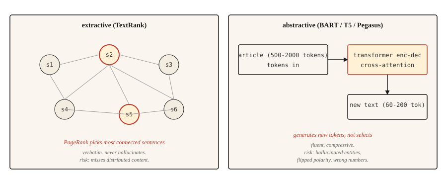

# 文本摘要

> 抽取式系统告诉你文档说了什么,生成式系统告诉你作者想说什么。不同的任务,不同的坑。

**类型:** 动手构建
**编程语言:** Python
**前置要求:** 第 5 阶段 · 02(词袋 + TF-IDF),第 5 阶段 · 11(机器翻译)
**预计耗时:** 约 75 分钟

## 问题

一篇 2000 词的新闻落到你的信息流里,你需要 120 词概括它。两条路:从文中挑出最重要的三句话(抽取式),或者用自己的话把内容重写一遍(生成式)。两者都叫摘要,却是完全不同的问题。

抽取式摘要是排序问题:给每个句子打分,返回前 `k` 名。输出永远合乎语法,因为逐字摘自原文。风险是漏掉散布在全文各处的内容。

生成式摘要是生成问题:Transformer 以输入为条件产出新文本。输出流畅、压缩率高,但可能幻觉出原文没有的事实。风险是言之凿凿的编造。

本课两者都构建,并点名各自专属的失效模式。

## 概念



**抽取式。** 把文章看成一张图:节点是句子,边是相似度。在图上跑 PageRank(或类似算法),按句子与其余部分的连接程度打分,得分最高的句子就是摘要。经典实现是 **TextRank**(Mihalcea 和 Tarau,2004)。

**生成式。** 在"文档-摘要"对上微调 Transformer 编码器-解码器(BART、T5、Pegasus)。推理时,模型读文档,通过交叉注意力逐 token 生成摘要。Pegasus 尤其值得一提:它的 gap-sentence 预训练目标,让它不需要多少微调就擅长摘要。

评估用 **ROUGE**(Recall-Oriented Understudy for Gisting Evaluation):ROUGE-1 和 ROUGE-2 评一元、二元组重合,ROUGE-L 评最长公共子序列。越高越好,40 的 ROUGE-L 算"不错",50 算"出色"。每篇论文三个都报。用 `rouge-score` 包。

```figure
summarize-collapse
```

## 动手构建

### 第 1 步:TextRank(抽取式)

```python
import math
import re
from collections import Counter


def sentence_split(text):
    return re.split(r"(?<=[.!?])\s+", text.strip())


def similarity(s1, s2):
    w1 = Counter(s1.lower().split())
    w2 = Counter(s2.lower().split())
    intersection = sum((w1 & w2).values())
    denom = math.log(len(w1) + 1) + math.log(len(w2) + 1)
    if denom == 0:
        return 0.0
    return intersection / denom


def textrank(text, top_k=3, damping=0.85, iterations=50, epsilon=1e-4):
    sentences = sentence_split(text)
    n = len(sentences)
    if n <= top_k:
        return sentences

    sim = [[0.0] * n for _ in range(n)]
    for i in range(n):
        for j in range(n):
            if i != j:
                sim[i][j] = similarity(sentences[i], sentences[j])

    scores = [1.0] * n
    for _ in range(iterations):
        new_scores = [1 - damping] * n
        for i in range(n):
            total_out = sum(sim[i]) or 1e-9
            for j in range(n):
                if sim[i][j] > 0:
                    new_scores[j] += damping * sim[i][j] / total_out * scores[i]
        if max(abs(s - ns) for s, ns in zip(scores, new_scores)) < epsilon:
            scores = new_scores
            break
        scores = new_scores

    ranked = sorted(range(n), key=lambda k: scores[k], reverse=True)[:top_k]
    ranked.sort()
    return [sentences[i] for i in ranked]
```

两件事值得点名:相似度函数用的是对数归一化的词重合——这是 TextRank 原始变体,TF-IDF 向量的余弦也行;阻尼因子 0.85 和迭代次数是 PageRank 的默认值。

### 第 2 步:用 BART 做生成式摘要

```python
from transformers import pipeline

summarizer = pipeline("summarization", model="facebook/bart-large-cnn")

article = """(long news article text)"""

summary = summarizer(article, max_length=120, min_length=60, do_sample=False)
print(summary[0]["summary_text"])
```

BART-large-CNN 在 CNN/DailyMail 语料上微调过,开箱就能产出新闻风格的摘要。其他领域(科学论文、对话、法律),用对应的 Pegasus 检查点,或在目标数据上微调。

### 第 3 步:ROUGE 评估

```python
from rouge_score import rouge_scorer

scorer = rouge_scorer.RougeScorer(["rouge1", "rouge2", "rougeL"], use_stemmer=True)
scores = scorer.score(reference_summary, generated_summary)
print({k: round(v.fmeasure, 3) for k, v in scores.items()})
```

永远开词干提取:不开的话,"running" 和 "run" 被算成不同的词,ROUGE 会低估。

### ROUGE 之外(2026 年的摘要评估)

ROUGE 统治了摘要评估二十年,但在 2026 年它单用已经不够。一项对 NLG 论文的大规模元分析显示:

- **BERTScore**(上下文嵌入相似度)在 2023 年前持续上升,如今大多数摘要论文把它与 ROUGE 一起报。
- **BARTScore** 把评估当作生成:看预训练 BART 给定源文时给摘要赋予多大概率。
- **MoverScore**(上下文嵌入上的推土机距离)在 2025 年的摘要基准上登顶,因为它比 ROUGE 更好地捕捉语义重合。
- **FactCC** 和**基于问答的忠实性评估**在 2021–2023 年常见,如今常被 **G-Eval** 取代(一条 GPT-4 提示链,用思维链推理给连贯性、一致性、流畅度、相关性打分)。
- **G-Eval** 及类似的 LLM 裁判方法,在评分细则设计良好时与人类判断吻合度约 80%。

生产建议:报 ROUGE-L 用于与历史结果对比,报 BERTScore 衡量语义重合,报 G-Eval 衡量连贯性与事实性。用 50–100 条人工标注的摘要做校准。

### 第 4 步:事实性问题

生成式摘要容易幻觉。抽取式摘要的幻觉风险低得多,因为输出逐字摘自原文——不过如果源句被抽离上下文、过时或顺序颠倒,仍然可能误导。这是生产系统至今为合规相关内容偏爱抽取式方法的最大单一原因。

值得点名的幻觉类型:

- **实体调包。** 原文说 "John Smith",摘要写成 "John Brown"。
- **数字漂移。** 原文说 "25,000",摘要写成 "25 million"。
- **极性翻转。** 原文说 "rejected the offer",摘要写成 "accepted the offer"。
- **凭空造事实。** 原文没提 CEO,摘要说 CEO 批准了。

有效的评估方法:

- **FactCC。** 在源句与摘要句之间的蕴含关系上训练的二分类器,预测"符合事实/不符合"。
- **基于问答的忠实性。** 用问答模型提一些答案在源文中的问题;如果摘要支持不同的答案,就标记。
- **实体级 F1。** 对比源文与摘要中的命名实体:只出现在摘要里的实体可疑。

对任何事实性要紧的面向用户内容(新闻、医疗、法律、金融),抽取式是更稳的默认;生成式则必须在环路里加一道事实性检查。

## 投入使用

2026 年的组合:

| 场景 | 推荐 |
|---------|-------------|
| 新闻,3–5 句摘要,英文 | `facebook/bart-large-cnn` |
| 科学论文 | `google/pegasus-pubmed` 或微调过的 T5 |
| 多文档、长文 | 任何 32k+ 上下文的 LLM,加提示词 |
| 对话摘要 | `philschmid/bart-large-cnn-samsum` |
| 抽取式,构造上低幻觉风险 | TextRank 或 `sumy` 的 LSA / LexRank |

2026 年,算力不受限时,长上下文 LLM 常常胜过专用模型。代价是成本和可复现性——专用模型的输出更稳定一致。

## 交付

保存为 `outputs/skill-summary-picker.md`:

```markdown
---
name: summary-picker
description: Pick extractive or abstractive, named library, factuality check.
version: 1.0.0
phase: 5
lesson: 12
tags: [nlp, summarization]
---

Given a task (document type, compliance requirement, length, compute budget), output:

1. Approach. Extractive or abstractive. Explain in one sentence why.
2. Starting model / library. Name it. `sumy.TextRankSummarizer`, `facebook/bart-large-cnn`, `google/pegasus-pubmed`, or an LLM prompt.
3. Evaluation plan. ROUGE-1, ROUGE-2, ROUGE-L (use rouge-score with stemming). Plus factuality check if abstractive.
4. One failure mode to probe. Entity swap is the most common in abstractive news summarization; flag samples where source entities do not appear in summary.

Refuse abstractive summarization for medical, legal, financial, or regulated content without a factuality gate. Flag input over the model's context window as needing chunked map-reduce summarization (not just truncation).
```

## 练习

1. **简单。** 在 5 篇新闻上跑 TextRank,把前 3 句与参考摘要对比,测 ROUGE-L。CNN/DailyMail 风格的文章上,你应该看到 30–45 的 ROUGE-L。
2. **中等。** 实现实体级事实性检查:用 spaCy 从源文和摘要中抽取命名实体,计算源实体在摘要中的召回率,以及摘要实体对源文的精确率。高精确低召回意味着安全但简略;低精确意味着幻觉实体。
3. **困难。** 在 50 篇 CNN/DailyMail 文章上对比 BART-large-CNN 与一个 LLM(Claude 或 GPT-4),报告 ROUGE-L、事实性(实体 F1)和每篇摘要的成本,记录各自胜出的地方。

## 关键术语

| 术语 | 别人的说法 | 实际含义 |
|------|-----------------|-----------------------|
| 抽取式(Extractive) | 挑句子 | 逐字返回源文中的句子,永不幻觉 |
| 生成式(Abstractive) | 重写 | 以源文为条件生成新文本,可能幻觉 |
| ROUGE | 摘要指标 | 系统输出与参考摘要之间的 n-gram / 最长公共子序列重合 |
| TextRank | 基于图的抽取 | 在句子相似度图上跑 PageRank |
| 事实性(Factuality) | 对不对 | 摘要中的断言是否有源文支持 |
| 幻觉(Hallucination) | 编造的内容 | 摘要中源文不支持的内容 |

## 延伸阅读

- [Mihalcea and Tarau (2004). TextRank: Bringing Order into Texts](https://aclanthology.org/W04-3252/)——抽取式经典论文
- [Lewis et al. (2019). BART: Denoising Sequence-to-Sequence Pre-training](https://arxiv.org/abs/1910.13461)——BART 论文
- [Zhang et al. (2019). PEGASUS: Pre-training with Extracted Gap-sentences](https://arxiv.org/abs/1912.08777)——Pegasus 与 gap-sentence 目标
- [Lin (2004). ROUGE: A Package for Automatic Evaluation of Summaries](https://aclanthology.org/W04-1013/)——ROUGE 论文
- [Maynez et al. (2020). On Faithfulness and Factuality in Abstractive Summarization](https://arxiv.org/abs/2005.00661)——事实性全景论文
