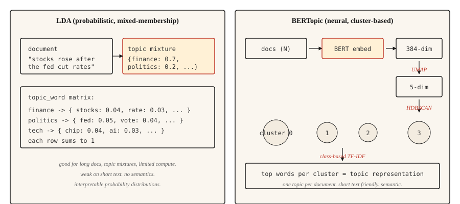

# 主题模型 —— LDA 与 BERTopic

> LDA:文档是主题的混合,主题是词上的分布。BERTopic:文档在嵌入空间里聚类,簇就是主题。目标相同,分解方式不同。

**类型:** 学习
**编程语言:** Python
**前置要求:** 第 5 阶段 · 02(BoW + TF-IDF),第 5 阶段 · 03(Word2Vec)
**预计耗时:** 约 45 分钟

## 问题

你手里有 1 万条客服工单、5 万篇新闻、或者 20 万条推文。你想知道这一堆东西在讲什么,但不想逐篇去读。你没有标注好的类别,甚至连有几类都不知道。

主题模型不需要监督就能回答这个问题。给它一个语料库,它还你一小组有内在一致性的主题,以及每篇文档在这些主题上的分布。

有两个算法家族占主导。LDA(2003)把每篇文档看作若干潜在主题的混合,把每个主题看作词上的分布,推断走贝叶斯路线。需要"文档属于多个主题"的混合成员归属、以及可解释的词级概率分布时,它至今仍在生产环境服役。

BERTopic(2020)用 BERT 编码文档,UMAP 降维,HDBSCAN 聚类,再用基于类别的 TF-IDF 提取主题词。它在短文本、社交媒体、以及一切"语义相似比词面重叠更重要"的场景中胜出。一篇文档只得一个主题,这对长文是个局限。

本课建立对两者的直觉,并讲清面对一个语料库该选哪个。

## 概念



**LDA 的生成故事。** 每个主题是词上的一个分布,每篇文档是主题的一个混合。要生成文档中的一个词,先从文档的主题混合里抽一个主题,再从该主题的词分布里抽一个词。推断是这个过程的逆运算:给定观察到的词,反推每篇文档的主题分布和每个主题的词分布。数学上靠坍缩吉布斯采样(collapsed Gibbs sampling)或变分贝叶斯完成。

LDA 的关键输出:

- `doc_topic`:矩阵 `(n_docs, n_topics)`,每行求和为 1(文档的主题混合)。
- `topic_word`:矩阵 `(n_topics, vocab_size)`,每行求和为 1(主题的词分布)。

**BERTopic 流水线。**

1. 用句子 Transformer(如 `all-MiniLM-L6-v2`)编码每篇文档,得到 384 维向量。
2. 用 UMAP 降到约 5 维。BERT 嵌入维度太高,直接聚类效果不好。
3. 用 HDBSCAN 聚类。基于密度,产生大小不均的簇,并给离群点打标签。
4. 对每个簇,在簇内文档上算基于类别的 TF-IDF,提取头部词。

输出是每篇文档一个主题(外加 -1 的离群标签)。也可以通过 HDBSCAN 的概率向量获得软成员归属。

```figure
topic-drift
```

## 动手构建

### 第 1 步:用 scikit-learn 跑 LDA

```python
from sklearn.feature_extraction.text import CountVectorizer
from sklearn.decomposition import LatentDirichletAllocation
import numpy as np


def fit_lda(documents, n_topics=5, max_features=1000):
    cv = CountVectorizer(
        max_features=max_features,
        stop_words="english",
        min_df=2,
        max_df=0.9,
    )
    X = cv.fit_transform(documents)
    lda = LatentDirichletAllocation(
        n_components=n_topics,
        random_state=42,
        max_iter=50,
        learning_method="online",
    )
    doc_topic = lda.fit_transform(X)
    feature_names = cv.get_feature_names_out()
    return lda, cv, doc_topic, feature_names


def print_top_words(lda, feature_names, n_top=10):
    for idx, topic in enumerate(lda.components_):
        top_idx = np.argsort(-topic)[:n_top]
        words = [feature_names[i] for i in top_idx]
        print(f"topic {idx}: {' '.join(words)}")
```

注意:停用词已移除;min_df 和 max_df 过滤掉太稀有和太泛滥的词;用的是 CountVectorizer 而不是 TfidfVectorizer,因为 LDA 要的是原始计数。

### 第 2 步:BERTopic(生产用法)

```python
from bertopic import BERTopic

topic_model = BERTopic(
    embedding_model="sentence-transformers/all-MiniLM-L6-v2",
    min_topic_size=15,
    verbose=True,
)

topics, probs = topic_model.fit_transform(documents)
info = topic_model.get_topic_info()
print(info.head(20))
valid_topics = info[info["Topic"] != -1]["Topic"].tolist()
for topic_id in valid_topics[:5]:
    print(f"topic {topic_id}: {topic_model.get_topic(topic_id)[:10]}")
```

`Topic != -1` 这个过滤是去掉 BERTopic 的离群桶(HDBSCAN 聚不进去的文档)。`min_topic_size` 控制 HDBSCAN 的最小簇大小;库默认是 10,本课示例按课程规模显式设为 15。文档超过 1 万的语料库,调到 50 或 100。

### 第 3 步:评估

两种方法都输出主题词。问题是这些词是否自洽。

- **主题一致性(c_v)。** 在滑动窗口上下文里计算头部词对的 NPMI(归一化逐点互信息),聚合成主题向量,再用余弦相似度比较这些向量。越高越好。用 `gensim.models.CoherenceModel`,`coherence="c_v"`。
- **主题多样性。** 所有主题头部词中不重复词的比例。越高越好(主题之间不重叠)。
- **人工检视。** 读每个主题的头部词:它们说的是不是一个真实存在的东西?人的判断仍是最后一道防线。

## 怎么选

| 场景 | 选择 |
|-----------|------|
| 短文本(推文、评论、标题) | BERTopic |
| 主题混杂的长文档 | LDA |
| 没有 GPU / 算力有限 | LDA 或 NMF |
| 需要文档级的多主题分布 | LDA |
| 要接 LLM 给主题起名字 | BERTopic(直接支持) |
| 资源受限的边缘部署 | LDA |
| 追求最高语义一致性 | BERTopic |

最实际的考量是文档长度。BERT 嵌入会截断,LDA 的计数对任意长度都适用。文档比嵌入模型的上下文还长时,要么切块再聚合,要么用 LDA。

## 投入使用

2026 年的技术栈:

- **BERTopic。** 短文本和一切语义重要的场景的默认选择。
- **`gensim.models.LdaModel`。** 经典 LDA,生产环境成熟稳定、久经考验。
- **`sklearn.decomposition.LatentDirichletAllocation`。** 做实验用的顺手 LDA。
- **NMF。** 非负矩阵分解,LDA 的快速替代品,短文本上质量相当。
- **Top2Vec。** 设计与 BERTopic 类似,社区小一些,但在某些基准上不错。
- **FASTopic。** 较新,超大语料上比 BERTopic 快。
- **LLM 标注。** 随便用什么方法聚类,然后让模型给每个簇起名字。

## 交付

保存为 `outputs/skill-topic-picker.md`:

```markdown
---
name: topic-picker
description: Pick LDA or BERTopic for a corpus. Specify library, knobs, evaluation.
version: 1.0.0
phase: 5
lesson: 15
tags: [nlp, topic-modeling]
---

Given a corpus description (document count, avg length, domain, language, compute budget), output:

1. Algorithm. LDA / NMF / BERTopic / Top2Vec / FASTopic. One-sentence reason.
2. Configuration. Number of topics: `recommended = max(5, round(sqrt(n_docs)))`, clamped to 200 for corpora under 40,000 docs; permit >200 only when the corpus is genuinely large (>40k) and note the increased compute cost. `min_df` / `max_df` filters and embedding model for neural approaches also belong here.
3. Evaluation. Topic coherence (c_v) via `gensim.models.CoherenceModel`, topic diversity, and a 20-sample human read.
4. Failure mode to probe. For LDA, "junk topics" absorbing stopwords and frequent terms. For BERTopic, the -1 outlier cluster swallowing ambiguous documents.

Refuse BERTopic on documents longer than the embedding model's context window without a chunking strategy. Refuse LDA on very short text (tweets, reviews under 10 tokens) as coherence collapses. Flag any n_topics choice below 5 as likely wrong; flag >200 on corpora under 40k docs as likely over-splitting.
```

## 练习

1. **入门。** 在 20 Newsgroups 数据集上用 5 个主题跑 LDA,打印每个主题的前 10 个词,手工给每个主题起名字。算法找到真实的类别了吗?
2. **进阶。** 在同一个 20 Newsgroups 子集上跑 BERTopic。对比主题数量、头部词和主观一致性。哪个方法更干净地呈现出真实类别?
3. **挑战。** 在你的语料库上分别为 LDA 和 BERTopic 计算 c_v 一致性。各用 5、10、20、50 个主题跑一遍,画出一致性随主题数变化的曲线,报告哪个方法在不同主题数下更稳定。

## 关键术语

| 术语 | 大家嘴里的说法 | 实际含义 |
|------|-----------------|-----------------------|
| 主题(Topic) | 语料讲的一个东西 | 词上的概率分布(LDA),或一簇相似文档(BERTopic) |
| 混合成员归属 | 一篇文档属于多个主题 | LDA 给每篇文档分配一个覆盖所有主题的分布 |
| UMAP | 降维 | 保持局部结构的流形学习,BERTopic 中用它 |
| HDBSCAN | 密度聚类 | 找出大小不均的簇,给离群点打"噪声"标签(-1) |
| c_v 一致性 | 主题质量指标 | 滑动窗口内主题头部词的平均逐点互信息 |

## 延伸阅读

- [Blei, Ng, Jordan (2003). Latent Dirichlet Allocation](https://www.jmlr.org/papers/volume3/blei03a/blei03a.pdf) —— LDA 原始论文
- [Grootendorst (2022). BERTopic: Neural topic modeling with a class-based TF-IDF procedure](https://arxiv.org/abs/2203.05794) —— BERTopic 论文
- [Röder, Both, Hinneburg (2015). Exploring the Space of Topic Coherence Measures](https://svn.aksw.org/papers/2015/WSDM_Topic_Evaluation/public.pdf) —— 提出 c_v 及同族指标的论文
- [BERTopic 文档](https://maartengr.github.io/BERTopic/) —— 生产参考,示例极佳
