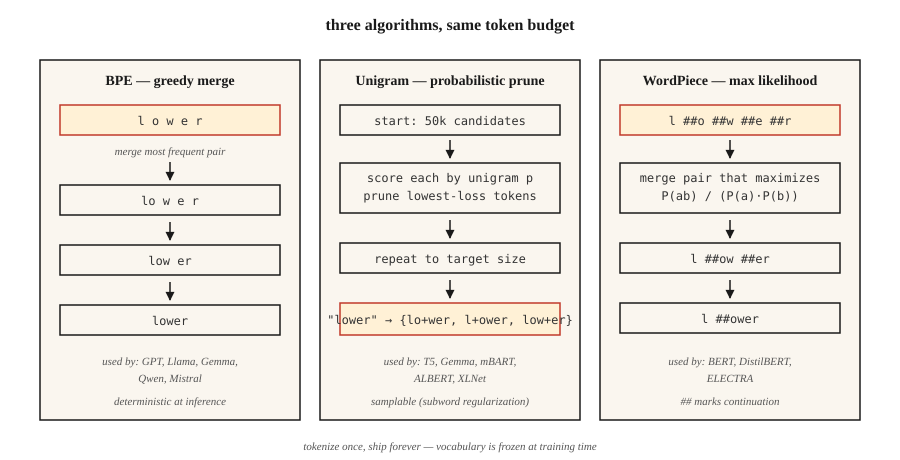

# 子词分词 —— BPE、WordPiece、Unigram、SentencePiece

> 按词分词,遇到生词就噎死;按字符分词,序列长度爆炸。子词分词取两者的中间点。今天每一个现代 LLM 都跑在其中一种上。

**类型:** 学习
**编程语言:** Python
**前置要求:** 第 5 阶段 · 01(文本处理),第 5 阶段 · 04(GloVe / FastText / 子词)
**预计耗时:** 约 60 分钟

## 问题

你的词表有 5 万个词。用户输入 "untokenizable",分词器返回 `[UNK]`——模型对这个词拿不到任何信号。更糟的是:你语料里第 90 百分位的文档含有 40 个生词,意味着每篇文档丢掉 40 比特的信息。

子词分词解决这个问题。常见词保持单 token;生词拆成有意义的片段:`untokenizable` → `un`、`token`、`izable`。训练数据天然覆盖一切,因为任何字符串归根结底都是一字节序列。

2026 年的每一个前沿 LLM,用的都是三种算法之一(BPE、Unigram、WordPiece),包在三个库之一里(tiktoken、SentencePiece、HF Tokenizers)。不选一个,你就发不了语言模型。

## 概念



**BPE(字节对编码)。** 从字符级词表开始,统计所有相邻对,把最高频的一对合并成新 token,重复到目标词表大小。统治地位的算法:GPT-2/3/4、Llama、Gemma、Qwen2、Mistral。

**字节级 BPE。** 同一个算法,但作用在原始字节(256 个基础 token)而不是 Unicode 字符上。保证零 `[UNK]`——任何字节序列都能编码。GPT-2 用词表 50,257(256 字节 + 50,000 次合并 + 1 个特殊 token)。

**Unigram。** 从一个巨大词表开始,给每个 token 一个一元概率,迭代地剪掉"删除后对语料对数似然损害最小"的 token。推理时是概率式的:可以采样分词结果(子词正则化做数据增强就靠这个)。T5、mBART、ALBERT、XLNet、Gemma 用它。

**WordPiece。** 合并时选能让训练语料似然最大的对,而不是原始频率最高的对。BERT、DistilBERT、ELECTRA 用它。

**SentencePiece 和 tiktoken 的分工。** SentencePiece 是*训练*词表的库(可训 BPE 或 Unigram),直接吃原始 Unicode 文本,把空格编码为 `▁`。tiktoken 是 OpenAI 的高速*编码器*,只对着预制词表做编码,不训练。

经验法则:

- **训练新词表:** SentencePiece(多语言、免预分词)或 HF Tokenizers。
- **对 GPT 词表做快速推理:** tiktoken(cl100k_base、o200k_base)。
- **两者都要:** HF Tokenizers——一个库,训练加服役全包。

```figure
bpe-merge
```

## 动手构建

### 第 1 步:从零实现 BPE

见 `code/main.py`。核心循环:

```python
def train_bpe(corpus, num_merges):
    vocab = {tuple(word) + ("</w>",): count for word, count in corpus.items()}
    merges = []
    for _ in range(num_merges):
        pairs = Counter()
        for symbols, freq in vocab.items():
            for a, b in zip(symbols, symbols[1:]):
                pairs[(a, b)] += freq
        if not pairs:
            break
        best = pairs.most_common(1)[0][0]
        merges.append(best)
        vocab = apply_merge(vocab, best)
    return merges
```

算法编码了三个事实。`</w>` 标记词尾,让词尾的 "low" 和词首的 "lower" 保持区分;按频率加权,高频对先赢;合并列表是有序的——推理时按训练顺序应用合并。

### 第 2 步:用学到的合并规则编码

```python
def encode_bpe(word, merges):
    symbols = list(word) + ["</w>"]
    for a, b in merges:
        i = 0
        while i < len(symbols) - 1:
            if symbols[i] == a and symbols[i + 1] == b:
                symbols = symbols[:i] + [a + b] + symbols[i + 2:]
            else:
                i += 1
    return symbols
```

朴素实现 O(n·|merges|)。生产实现(tiktoken、HF Tokenizers)用合并秩查表加优先队列,接近线性时间。

### 第 3 步:SentencePiece 实战

```python
import sentencepiece as spm

spm.SentencePieceTrainer.train(
    input="corpus.txt",
    model_prefix="my_tokenizer",
    vocab_size=8000,
    model_type="bpe",          # or "unigram"
    character_coverage=0.9995, # lower for CJK (e.g. 0.9995 for English, 0.995 for Japanese)
    normalization_rule_name="nmt_nfkc",
)

sp = spm.SentencePieceProcessor(model_file="my_tokenizer.model")
print(sp.encode("untokenizable", out_type=str))
# ['▁un', 'token', 'izable']
```

注意:不需要预分词;空格编码为 `▁`;`character_coverage` 控制稀有字符是被保留还是被映射到 `<unk>`。

### 第 4 步:用 tiktoken 对接 OpenAI 兼容词表

```python
import tiktoken
enc = tiktoken.get_encoding("o200k_base")
print(enc.encode("untokenizable"))        # [127340, 101028]
print(len(enc.encode("Hello, world!")))   # 4
```

只编码,速度快(Rust 后端)。和 GPT-4/5 的分词完全一致,用于数 token、估成本、规划上下文窗口预算。

## 2026 年仍在发货的坑

- **分词器漂移。** 训练用词表 A,部署用词表 B,token ID 对不上,模型输出垃圾。在 CI 里校验 `tokenizer.json` 的哈希。
- **空白歧义。** BPE 里 "hello" 和 " hello" 是不同的 token。永远显式指定 `add_special_tokens` 和 `add_prefix_space`。
- **多语言欠训。** 英语主导的语料训出的词表,会把非拉丁文字切成 5-10 倍的 token。同一个提示词,在 GPT-3.5 上用日语/阿拉伯语的成本是英语的 5-10 倍。o200k_base 部分修复了这个问题。
- **Emoji 切碎。** 一个 emoji 可能占 5 个 token。做上下文预算时记得检查 emoji 的处理。

## 投入使用

2026 年的技术栈:

| 场景 | 选择 |
|-----------|------|
| 从零训练单语模型 | HF Tokenizers(BPE) |
| 训练多语言模型 | SentencePiece(Unigram,`character_coverage=0.9995`) |
| 提供 OpenAI 兼容 API | tiktoken(GPT-4+ 用 `o200k_base`) |
| 领域专属词表(代码、数学、蛋白质) | 在领域语料上训自定义 BPE,再与基础词表合并 |
| 边缘推理、小模型 | Unigram(小词表效果更好) |

词表大小是一个规模决策,不是常数。粗略经验:<1B 参数用 32k,1-10B 用 50-100k,多语言/前沿模型用 200k+。

## 交付

保存为 `outputs/skill-bpe-vs-wordpiece.md`:

```markdown
---
name: tokenizer-picker
description: Pick tokenizer algorithm, vocab size, library for a given corpus and deployment target.
version: 1.0.0
phase: 5
lesson: 19
tags: [nlp, tokenization]
---

Given a corpus (size, languages, domain) and deployment target (training from scratch / fine-tuning / API-compatible inference), output:

1. Algorithm. BPE, Unigram, or WordPiece. One-sentence reason.
2. Library. SentencePiece, HF Tokenizers, or tiktoken. Reason.
3. Vocab size. Rounded to nearest 1k. Reason tied to model size and language coverage.
4. Coverage settings. `character_coverage`, `byte_fallback`, special-token list.
5. Validation plan. Average tokens-per-word on held-out set, OOV rate, compression ratio, round-trip decode equality.

Refuse to train a character-coverage <0.995 tokenizer on corpora with rare-script content. Refuse to ship a vocab without a frozen `tokenizer.json` hash check in CI. Flag any monolingual tokenizer under 16k vocab as likely under-spec.
```

## 练习

1. **入门。** 在 `code/main.py` 的小语料上训练 500 次合并的 BPE,编码三个训练外的词。恰好切成 1 个 token 的有几个?切成多个的有几个?
2. **进阶。** 在 100 个英文维基百科句子上,对比 `cl100k_base`、`o200k_base` 和你自己用 vocab=32k 训的 SentencePiece BPE 的 token 数,报告各自的压缩率。
3. **挑战。** 在同一语料上分别训练 BPE、Unigram、WordPiece,各接入一个小型情感分类器,测下游准确率。分词算法的选择能让 F1 移动超过 1 个点吗?

## 关键术语

| 术语 | 大家嘴里的说法 | 实际含义 |
|------|-----------------|-----------------------|
| BPE | 字节对编码 | 贪心合并最高频字符对,直到达到目标词表大小 |
| 字节级 BPE | 永远没有未知 token | 作用在 256 个原始字节上的 BPE,GPT-2 / Llama 用它 |
| Unigram | 概率式分词器 | 从大候选集出发,按对数似然剪枝,T5、Gemma 用它 |
| SentencePiece | "处理空格的那个" | 在原始文本上训练 BPE/Unigram 的库,空格编码为 `▁` |
| tiktoken | "快的那个" | OpenAI 的 Rust 后端 BPE 编码器,只对预制词表,不训练 |
| 合并列表 | "魔法数字" | 有序的 `(a, b) → ab` 合并列表,推理时按序应用 |
| 字符覆盖率 | "多稀有算太稀有?" | 分词器必须覆盖训练语料中字符的比例,典型值约 0.9995 |

## 延伸阅读

- [Sennrich, Haddow, Birch (2015). Neural Machine Translation of Rare Words with Subword Units](https://arxiv.org/abs/1508.07909) —— BPE 论文
- [Kudo (2018). Subword Regularization with Unigram Language Model](https://arxiv.org/abs/1804.10959) —— Unigram 论文
- [Kudo, Richardson (2018). SentencePiece: A simple and language independent subword tokenizer](https://arxiv.org/abs/1808.06226) —— 库的论文
- [Hugging Face — Summary of the tokenizers](https://huggingface.co/docs/transformers/tokenizer_summary) —— 简明参考
- [OpenAI tiktoken 仓库](https://github.com/openai/tiktoken) —— cookbook 与编码列表
