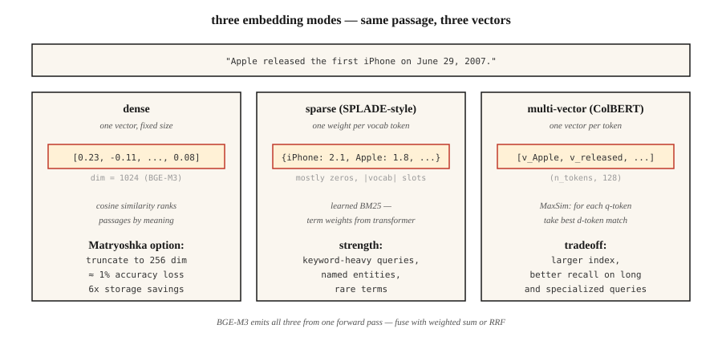

# 嵌入模型 —— 2026 深潜

> Word2Vec 给每个词一个向量;现代嵌入模型给每个段落一个向量,跨语言,还分稀疏、稠密、多向量三种视图,尺寸可按你的索引裁。选错了,你的 RAG 检索回来的就是错的东西。

**类型:** 学习
**编程语言:** Python
**前置要求:** 第 5 阶段 · 03(Word2Vec),第 5 阶段 · 14(信息检索)
**预计耗时:** 约 60 分钟

## 问题

你的 RAG 系统 40% 的时候检索回来的是错误段落。罪魁祸首很少是向量数据库,也很少是提示词——是嵌入模型。

2026 年选嵌入模型,要在五个轴上做决定:

1. **稠密、稀疏还是多向量。** 每个段落一个向量?每个 token 一个向量?还是一个带权的稀疏词袋?
2. **语言覆盖。** 纯英语场景,单语英文模型仍然最强;语料混杂时,多语言模型胜出。
3. **上下文长度。** 512 token、8,192 还是 32,768——而真实的有效容量往往只有标称上限的 60-70%。
4. **维度预算。** 3,072 个全精度浮点 = 每个向量 12 KB。一亿条向量,存储费每月 $1,300。Matryoshka 截断能砍 4 倍。
5. **开放还是托管。** 开放权重意味着你掌控技术栈和数据;托管意味着你拿控制权换"永远最新"。

本课讲清这些取舍,让你凭证据做选择,而不是凭上个季度的流行。

## 概念



**稠密嵌入。** 每个段落一个向量(通常 384-3,072 维),用余弦相似度按语义远近排名。OpenAI `text-embedding-3-large`、BGE-M3 稠密模式、Voyage-3。默认选择。

**稀疏嵌入。** SPLADE 路线:一个 Transformer 为词表里的每个 token 预测一个权重,再把大部分置零。结果是一个 |vocab| 大小的稀疏向量。像 BM25 一样抓词面匹配,但权重是学出来的。关键词重的查询上很强。

**多向量(迟交互)。** ColBERTv2、Jina-ColBERT:每个 token 一个向量。用 MaxSim 打分:对查询的每个 token,找文档里最相似的那个 token,把分数加起来。存储和打分都更贵,但在长查询和领域语料上更强。

**BGE-M3:三合一。** 单个模型同时输出稠密、稀疏、多向量三种表示。每种可以独立查询,分数按加权和融合。想用一个检查点换来灵活性,它是 2026 年的默认。

**Matryoshka 表示学习。** 训练时就让向量的前 N 维自身就是一个可用的嵌入。把 1,536 维的向量截到 256 维,只损失约 1% 的准确率,换 6 倍存储节省。OpenAI text-3、Cohere v4、Voyage-4、Jina v5、Gemini Embedding 2、Nomic v1.5+ 都支持。

### MTEB 排行榜只讲了一半的故事

Massive Text Embedding Benchmark:2022 年发布时是 8 类 56 个任务,MTEB v2 已扩到 100+ 任务。2026 年初,Gemini Embedding 2 在检索榜登顶(67.71 MTEB-R),Cohere embed-v4 领跑综合(65.2 MTEB),BGE-M3 是开源权重多语言第一(63.0)。排行榜是必要条件,不是充分条件——永远在你自己的领域数据上做基准。

### 三层模式

| 用途 | 模式 |
|----------|---------|
| 快速粗筛 | 稠密 bi-encoder(BGE-M3、text-3-small) |
| 召回增强 | 稀疏(SPLADE、BGE-M3 稀疏)+ RRF 融合 |
| 前 50 名的精度 | 多向量(ColBERTv2)或 cross-encoder 重排器 |

大多数生产技术栈三层全用。

```figure
gx-matryoshka
```

## 动手构建

### 第 1 步:基线 —— 用 Sentence-BERT 做稠密嵌入

```python
from sentence_transformers import SentenceTransformer
import numpy as np

encoder = SentenceTransformer("BAAI/bge-small-en-v1.5")
corpus = [
    "The first iPhone launched in 2007.",
    "Apple released the iPod in 2001.",
    "Android is an operating system from Google.",
]
emb = encoder.encode(corpus, normalize_embeddings=True)

query = "When was the iPhone released?"
q_emb = encoder.encode([query], normalize_embeddings=True)[0]
scores = emb @ q_emb
print(sorted(enumerate(scores), key=lambda x: -x[1]))
```

`normalize_embeddings=True` 让点积等于余弦相似度。永远开。

### 第 2 步:Matryoshka 截断

```python
def truncate(vectors, dim):
    out = vectors[:, :dim]
    return out / np.linalg.norm(out, axis=1, keepdims=True)

emb_256 = truncate(emb, 256)
emb_128 = truncate(emb, 128)
```

截断后要重新归一化。Nomic v1.5、OpenAI text-3、Voyage-4 训练时就保证前几档截断无损。非 Matryoshka 模型(原版 Sentence-BERT)截断后掉得厉害。

### 第 3 步:BGE-M3 多功能模式

```python
from FlagEmbedding import BGEM3FlagModel

model = BGEM3FlagModel("BAAI/bge-m3", use_fp16=True)

output = model.encode(
    corpus,
    return_dense=True,
    return_sparse=True,
    return_colbert_vecs=True,
)
# output["dense_vecs"]:    (n_docs, 1024)
# output["lexical_weights"]: list of dict {token_id: weight}
# output["colbert_vecs"]:  list of (n_tokens, 1024) arrays
```

一次推理,三个索引。分数融合:

```python
dense_score = ... # cosine over dense_vecs
sparse_score = model.compute_lexical_matching_score(q_lex, d_lex)
colbert_score = model.colbert_score(q_col, d_col)
final = 0.4 * dense_score + 0.2 * sparse_score + 0.4 * colbert_score
```

权重在你的领域数据上调。

### 第 4 步:在自定义任务上跑 MTEB 评估

```python
from mteb import MTEB

tasks = ["ArguAna", "SciFact", "NFCorpus"]
evaluation = MTEB(tasks=tasks)
results = evaluation.run(encoder, output_folder="./mteb-results")
```

让候选模型跑一个*有代表性的*任务子集。别只信排行榜名次——你的领域说了算。

### 第 5 步:手搓余弦相似度

见 `code/main.py` —— 纯标准库实现的均值哈希嵌入。跟 Transformer 嵌入没法比,但展示了形状:分词 → 向量 → 归一化 → 点积。

## 坑

- **查询和文档用同一个模型。** 有些模型(Voyage、Jina-ColBERT)是非对称编码——查询和文档走不同的路径。永远先看模型卡。
- **漏了前缀。** `bge-*` 系列要求查询前加 `"Represent this sentence for searching relevant passages: "`。忘了就掉 3-5 个点的召回。
- **Matryoshka 截过头。** 1,536 → 256 通常安全,1,536 → 64 不行。在你的评估集上验证。
- **上下文截断。** 大多数模型对超长输入会静默截断。长文档要切块(见第 23 课)。
- **忽略延迟长尾。** MTEB 分数里看不见 p99 延迟。一个 600M 模型可能比 335M 模型高 2 分,但每次查询贵 3 倍。

## 投入使用

2026 年的技术栈:

| 场景 | 选择 |
|-----------|------|
| 纯英语、要快、走 API | `text-embedding-3-large` 或 `voyage-3-large` |
| 开源权重、英语 | `BAAI/bge-large-en-v1.5` |
| 开源权重、多语言 | `BAAI/bge-m3` 或 `Qwen3-Embedding-8B` |
| 长上下文(32k+) | Voyage-3-large、Cohere embed-v4、Qwen3-Embedding-8B |
| 只有 CPU 的部署 | Nomic Embed v2(137M 参数,MoE) |
| 存储受限 | Matryoshka 截断 + int8 量化 |
| 关键词重的查询 | 加 SPLADE 稀疏,与稠密做 RRF 融合 |

2026 年的打法:从 BGE-M3 或 text-3-large 起步,在你的领域上用 MTEB 评估,如果某个领域模型赢超过 3 分就换。

## 交付

保存为 `outputs/skill-embedding-picker.md`:

```markdown
---
name: embedding-picker
description: Pick embedding model, dimension, and retrieval mode for a given corpus and deployment.
version: 1.0.0
phase: 5
lesson: 22
tags: [nlp, embeddings, retrieval]
---

Given a corpus (size, languages, domain, avg length), deployment target (cloud / edge / on-prem), latency budget, and storage budget, output:

1. Model. Named checkpoint or API. One-sentence reason.
2. Dimension. Full / Matryoshka-truncated / int8-quantized. Reason tied to storage budget.
3. Mode. Dense / sparse / multi-vector / hybrid. Reason.
4. Query prefix / template if required by the model card.
5. Evaluation plan. MTEB tasks relevant to domain + held-out domain eval with nDCG@10.

Refuse recommendations that truncate Matryoshka to <64 dims without domain validation. Refuse ColBERTv2 for corpora under 10k passages (overhead not justified). Flag long-document corpora (>8k tokens) routed to models with 512-token windows.
```

## 练习

1. **入门。** 用 `bge-small-en-v1.5` 全维度(384)编码 100 个句子,再按 Matryoshka 截到 128。在 10 个查询上测 MRR 掉了多少。
2. **进阶。** 在你领域的 500 个段落上对比 BGE-M3 的稠密、稀疏、colbert 三种模式:哪个 recall@10 最高?RRF 融合能打过最好的单一模式吗?
3. **挑战。** 在你最重要的 2 个领域任务上,用 MTEB 评估三个候选模型。报告 MTEB 分数、100 查询批次的 p99 延迟、每百万查询成本,选帕累托最优的那个。

## 关键术语

| 术语 | 大家嘴里的说法 | 实际含义 |
|------|-----------------|-----------------------|
| 稠密嵌入 | "那个向量" | 每段文本一个定长向量,用余弦相似度排名 |
| 稀疏嵌入 | "学出来的 BM25" | 词表每个 token 一个权重,大部分为零,端到端训练 |
| 多向量 | "ColBERT 那种" | 每个 token 一个向量,MaxSim 打分,索引更大、召回更好 |
| Matryoshka | "俄罗斯套娃技巧" | 前 N 维自身就是一个合法的小嵌入 |
| MTEB | "那个基准" | Massive Text Embedding Benchmark,发布时 56 个任务,v2 已超 100 |
| BEIR | "那个检索基准" | 18 个零样本检索任务,常被引用来证明跨领域稳健性 |
| 非对称编码 | "查询和文档不同路" | 模型为查询和文档使用不同的投影 |

## 延伸阅读

- [Reimers, Gurevych (2019). Sentence-BERT](https://arxiv.org/abs/1908.10084) —— bi-encoder 论文
- [Muennighoff et al. (2022). MTEB: Massive Text Embedding Benchmark](https://arxiv.org/abs/2210.07316) —— 排行榜论文
- [Chen et al. (2024). BGE-M3: Multi-lingual, Multi-functionality, Multi-granularity](https://arxiv.org/abs/2402.03216) —— 三模式统一模型
- [Kusupati et al. (2022). Matryoshka Representation Learning](https://arxiv.org/abs/2205.13147) —— 维度阶梯训练目标
- [Santhanam et al. (2022). ColBERTv2: Effective and Efficient Retrieval via Lightweight Late Interaction](https://arxiv.org/abs/2112.01488) —— 迟交互的生产落地
- [Hugging Face 上的 MTEB 排行榜](https://huggingface.co/spaces/mteb/leaderboard) —— 实时排名
