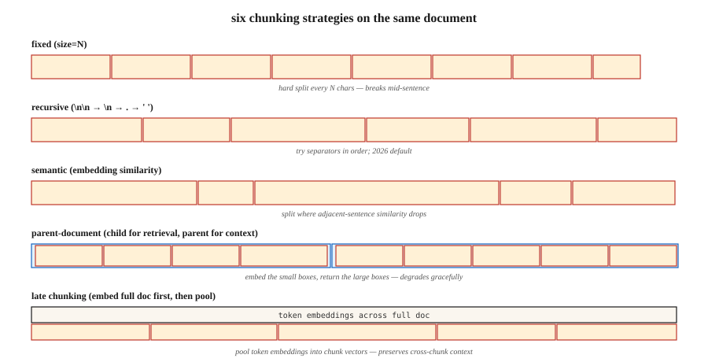

# RAG 切块策略

> 切块配置对检索质量的影响,不亚于嵌入模型的选择(Vectara,NAACL 2025)。切块切错了,重排再强也救不回来。

**类型:** 动手构建
**编程语言:** Python
**前置要求:** 第 5 阶段 · 14(信息检索),第 5 阶段 · 22(嵌入模型)
**预计耗时:** 约 60 分钟

## 问题

你把一份 50 页的合同塞进 RAG 系统。用户问:"终止条款是什么?"检索器返回了封面页。为什么?因为模型按 512 token 的块训练,而终止条款在第 20 页,被一次分页拦腰切断,块里没有任何局部关键词能把它和查询联系起来。

解法不是"买个更好的嵌入模型",而是切块。切多大?要不要重叠?在哪里下刀?要不要带上下文?

2026 年 2 月的基准测试结果出人意料:

- Vectara 的 2026 研究:递归 512-token 切块以 69% 对 54% 的准确率击败语义切块。
- SPLADE + Mistral-8B 在 Natural Questions 上:重叠没带来任何可测量的收益。
- 上下文悬崖:上下文接近 2,500 token 时,回答质量陡降。

"显然正确"的答案(语义切块、20% 重叠、1000 token)经常是错的。本课建立对六种策略的直觉,并告诉你什么时候用哪个。

## 概念



**定长切块。** 每 N 个字符或 token 切一刀。最简单的基线,会把句子拦腰砍断。压缩好,连贯差。

**递归切块。** LangChain 的 `RecursiveCharacterTextSplitter`:先试 `\n\n`,再试 `\n`,再试 `.`,最后空格。层层有兜底。2026 年的默认。

**语义切块。** 给每个句子做嵌入,算相邻句子的余弦相似度,在相似度跌破阈值的地方下刀。保持主题连贯。较慢;有时会切出 40 token 的碎块,伤害检索。

**句子切块。** 在句子边界下刀,每块一句或一个 N 句窗口。在约 5k token 以内,效果与语义切块相当,成本只是零头。

**父子文档。** 存小的子块用于检索,*同时*存大的父块用于提供上下文。按子块检索,返回父块。退化方式很优雅:子块切得再差,返回的父块也还像话。

**迟切块(2024)。** 先在 token 级对整篇文档做嵌入,再把 token 嵌入池化成块嵌入。保住跨块上下文。需要长上下文嵌入模型(BGE-M3、Jina v3),算力成本高。

**上下文检索(Anthropic,2024)。** 给每个块前面拼一段 LLM 生成的定位摘要("本块是终止条款第 3.2 节……")。Anthropic 自己的基准上检索提升 35-50%。索引成本高。

### 胜过一切默认值的法则

按查询类型匹配块大小:

| 查询类型 | 块大小 |
|------------|-----------|
| 事实型("CEO 叫什么?") | 256-512 token |
| 分析型 / 多跳 | 512-1024 token |
| 整节理解 | 1024-2048 token |

NVIDIA 的 2026 基准。块要大到能装下答案加局部上下文,又要小到让检索器 top-K 的结果聚焦在答案上,而不是淹没在上下文噪声里。

```figure
n5-chunk-cuts
```

## 动手构建

### 第 1 步:定长与递归切块

```python
def chunk_fixed(text, size=512, overlap=0):
    step = size - overlap
    return [text[i:i + size] for i in range(0, len(text), step)]


def chunk_recursive(text, size=512, seps=("\n\n", "\n", ". ", " ")):
    if len(text) <= size:
        return [text]
    for sep in seps:
        if sep not in text:
            continue
        parts = text.split(sep)
        chunks = []
        buf = ""
        for p in parts:
            if len(p) > size:
                if buf:
                    chunks.append(buf)
                    buf = ""
                chunks.extend(chunk_recursive(p, size=size, seps=seps[1:] or (" ",)))
                continue
            candidate = buf + sep + p if buf else p
            if len(candidate) <= size:
                buf = candidate
            else:
                if buf:
                    chunks.append(buf)
                buf = p
        if buf:
            chunks.append(buf)
        return [c for c in chunks if c.strip()]
    return chunk_fixed(text, size)
```

### 第 2 步:语义切块

```python
def chunk_semantic(text, encoder, threshold=0.6, min_chars=200, max_chars=2048):
    sentences = split_sentences(text)
    if not sentences:
        return []
    embs = encoder.encode(sentences, normalize_embeddings=True)
    chunks = [[sentences[0]]]
    for i in range(1, len(sentences)):
        sim = float(embs[i] @ embs[i - 1])
        current_len = sum(len(s) for s in chunks[-1])
        if sim < threshold and current_len >= min_chars:
            chunks.append([sentences[i]])
        else:
            chunks[-1].append(sentences[i])

    result = []
    for group in chunks:
        text_group = " ".join(group)
        if len(text_group) > max_chars:
            result.extend(chunk_recursive(text_group, size=max_chars))
        else:
            result.append(text_group)
    return result
```

`threshold` 在你的领域上调。太高 → 碎块;太低 → 一个巨型块。

### 第 3 步:父子文档

```python
def chunk_parent_child(text, parent_size=2048, child_size=256):
    parents = chunk_recursive(text, size=parent_size)
    mapping = []
    for p_idx, parent in enumerate(parents):
        children = chunk_recursive(parent, size=child_size)
        for child in children:
            mapping.append({"child": child, "parent_idx": p_idx, "parent": parent})
    return mapping


def retrieve_parent(child_query, mapping, encoder, top_k=3):
    child_embs = encoder.encode([m["child"] for m in mapping], normalize_embeddings=True)
    q_emb = encoder.encode([child_query], normalize_embeddings=True)[0]
    scores = child_embs @ q_emb
    top = np.argsort(-scores)[:top_k]
    seen, parents = set(), []
    for i in top:
        if mapping[i]["parent_idx"] not in seen:
            parents.append(mapping[i]["parent"])
            seen.add(mapping[i]["parent_idx"])
    return parents
```

关键洞察:父块要去重。多个子块可能映射到同一个父块,全返回会浪费上下文。

### 第 4 步:上下文检索(Anthropic 模式)

```python
def contextualize_chunks(document, chunks, llm):
    context_prompts = [
        f"""<document>{document}</document>
Here is the chunk to situate: <chunk>{c}</chunk>
Write 50-100 words placing this chunk in the document's context."""
        for c in chunks
    ]
    contexts = llm.batch(context_prompts)
    return [f"{ctx}\n\n{c}" for ctx, c in zip(contexts, chunks)]
```

索引这些带上下文的块。查询时,额外的环境信号会提升检索效果。

### 第 5 步:评估

```python
def recall_at_k(queries, corpus_chunks, encoder, k=5):
    chunk_embs = encoder.encode(corpus_chunks, normalize_embeddings=True)
    hits = 0
    for q_text, gold_idxs in queries:
        q_emb = encoder.encode([q_text], normalize_embeddings=True)[0]
        top = np.argsort(-(chunk_embs @ q_emb))[:k]
        if any(i in gold_idxs for i in top):
            hits += 1
    return hits / len(queries)
```

永远做基准测试。最适合你语料的策略,可能跟任何博客文章都对不上。

## 坑

- **只在事实型查询上评估切块。** 多跳查询会揭示完全不同的赢家。评估集要按查询类型分层。
- **语义切块不设最小尺寸。** 会切出伤害检索的 40-token 碎块。永远强制 `min_tokens`。
- **把重叠当宗教。** 2026 年的研究发现重叠经常零收益,还把索引成本翻倍。要测,别想当然。
- **不设上下限。** 5 token 的块和 5000 token 的块都会毁掉检索。要夹紧。
- **跨文档切块。** 永远不要让一个块横跨两篇文档。先按文档切,再合并。

## 投入使用

2026 年的技术栈:

| 场景 | 策略 |
|-----------|----------|
| 首次搭建、语料未知 | 递归,512 token,不重叠 |
| 事实型问答 | 递归,256-512 token |
| 分析型 / 多跳 | 递归,512-1024 token + 父子文档 |
| 交叉引用多(合同、论文) | 迟切块或上下文检索 |
| 对话语料 | 按轮切块 + 说话人元数据 |
| 短文本(推文、评论) | 一篇文档一个块 |

从递归 512 起步,在 50 个查询的评估集上测 recall@5,再往下调。

## 交付

保存为 `outputs/skill-chunker.md`:

```markdown
---
name: chunker
description: Pick a chunking strategy, size, and overlap for a given corpus and query distribution.
version: 1.0.0
phase: 5
lesson: 23
tags: [nlp, rag, chunking]
---

Given a corpus (document types, avg length, domain) and query distribution (factoid / analytical / multi-hop), output:

1. Strategy. Recursive / sentence / semantic / parent-document / late / contextual. Reason.
2. Chunk size. Token count. Reason tied to query type.
3. Overlap. Default 0; justify if >0.
4. Min/max enforcement. `min_tokens`, `max_tokens` guards.
5. Evaluation plan. Recall@5 on 50-query stratified eval set (factoid, analytical, multi-hop).

Refuse any chunking strategy without min/max chunk size enforcement. Refuse overlap above 20% without an ablation showing it helps. Flag semantic chunking recommendations without a min-token floor.
```

## 练习

1. **入门。** 用 fixed(512, 0)、recursive(512, 0)、recursive(512, 100) 三种方式切一篇 20 页的文档,对比块数和边界质量。
2. **进阶。** 在 5 篇文档上构建 30 个查询的评估集,测递归、语义、父子文档三种策略的 recall@5。谁赢了?跟博客文章说的吻合吗?
3. **挑战。** 实现上下文检索,测它相对递归基线的 MRR 提升。报告索引成本(LLM 调用量)与准确率收益的比值。

## 关键术语

| 术语 | 大家嘴里的说法 | 实际含义 |
|------|-----------------|-----------------------|
| 块(Chunk) | 文档的一截 | 被嵌入、索引、检索的子文档单元 |
| 重叠(Overlap) | 安全余量 | 相邻块共享的 N 个 token,2026 年基准里经常没用 |
| 语义切块 | "聪明的切法" | 在相邻句子嵌入相似度下跌处下刀 |
| 父子文档 | 两级检索 | 检索小子块,返回大父块 |
| 迟切块 | 先嵌入再切 | 整篇文档先做 token 级嵌入,再池化成块向量 |
| 上下文检索 | Anthropic 的把戏 | 索引前给每个块拼上 LLM 生成的定位摘要 |
| 上下文悬崖 | 2500-token 之墙 | RAG 中上下文约 2.5k token 时观察到的质量陡降(2026 年 1 月) |

## 延伸阅读

- [Yepes et al. / LangChain — Recursive Character Splitting 文档](https://python.langchain.com/docs/how_to/recursive_text_splitter/) —— 生产环境的默认
- [Vectara(2024,NAACL 2025)切块配置分析](https://arxiv.org/abs/2410.13070) —— 切块与嵌入选择同等重要
- [Jina AI — Late Chunking in Long-Context Embedding Models(2024)](https://jina.ai/news/late-chunking-in-long-context-embedding-models/) —— 迟切块论文
- [Anthropic — Contextual Retrieval](https://www.anthropic.com/news/contextual-retrieval) —— LLM 生成上下文前缀带来 35-50% 检索提升
- [NVIDIA 2026 块大小基准 —— Premai 综述](https://blog.premai.io/rag-chunking-strategies-the-2026-benchmark-guide/) —— 按查询类型选块大小
