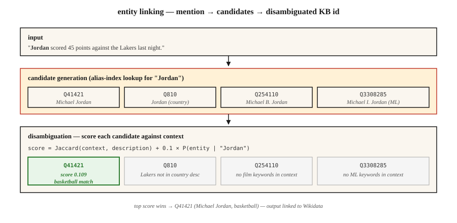

# 实体链接与消歧

> NER 找到了 "Paris"。实体链接来决定:是法国巴黎?帕丽斯·希尔顿?德州巴黎?还是特洛伊王子帕里斯?不做链接,你的知识图谱就永远含糊。

**类型:** 动手构建
**编程语言:** Python
**前置要求:** 第 5 阶段 · 06(NER),第 5 阶段 · 24(共指消解)
**预计耗时:** 约 60 分钟

## 问题

一句话写道:"Jordan beat the press." 你的 NER 把 "Jordan" 标为 PERSON。很好。但*是哪个* Jordan?

- 迈克尔·乔丹(篮球)?
- 迈克尔·B·乔丹(演员)?
- Michael I. Jordan(伯克利 ML 教授——这个混淆在 ML 论文里真实存在)?
- 约旦(国家)?
- Jordan(希伯来语人名)?

实体链接(EL)把每个提及解析到知识库里的唯一条目:Wikidata、维基百科、DBpedia,或你的领域知识库。两个子任务:

1. **候选生成。** 给定 "Jordan",哪些 KB 条目是可能的?
2. **消歧。** 给定上下文,哪个候选才是对的?

两步都是可学习的,都有基准测试。组合起来的流水线十年没变——变的是消歧器的质量。

## 概念



**候选生成。** 给定提及的表面形式("Jordan"),在别名索引里查候选。维基百科的别名词典覆盖了绝大多数命名实体:"JFK" → 约翰·F·肯尼迪、杰奎琳·肯尼迪、JFK 机场、《JFK》电影。典型索引每个提及返回 10-30 个候选。

**消歧:三条路线。**

1. **先验 + 上下文(Milne & Witten,2008)。** `P(entity | mention) × context-similarity(entity, text)`。好用、快、不用训练。
2. **嵌入式(ESS / REL / BLINK)。** 编码提及 + 上下文;编码每个候选的描述;取余弦相似度最大。2020-2024 年的默认。
3. **生成式(GENRE,2021;LLM 路线,2023+)。** 逐 token 解码出实体的规范名称。约束在一棵合法实体名的 trie 上,输出保证是合法的 KB id。

**端到端 vs 流水线。** 现代模型(ELQ、BLINK、ExtEnD、GENRE)一趟完成 NER + 候选生成 + 消歧。但生产环境仍是流水线占主导,因为组件可以替换。

### 两个要分开看的测量

- **提及召回(候选生成)。** 正确 KB 条目出现在候选列表里的黄金提及占比。整条流水线的地板。
- **消歧准确率 / F1。** 候选正确的前提下,top-1 选对的比率。

两个都要报。一个消歧 99% 但候选召回只有 80% 的系统,就是一条 80% 的流水线。

```figure
gx-entity-linking
```

## 动手构建

### 第 1 步:用维基百科重定向建别名索引

```python
alias_to_entities = {
    "jordan": ["Q41421 (Michael Jordan)", "Q810 (Jordan, country)", "Q254110 (Michael B. Jordan)"],
    "paris":  ["Q90 (Paris, France)", "Q663094 (Paris, Texas)", "Q55411 (Paris Hilton)"],
    "apple":  ["Q312 (Apple Inc.)", "Q89 (apple, fruit)"],
}
```

维基百科别名数据:约 1800 万对(别名, 实体)。从 Wikidata dump 下载,存成倒排索引。

### 第 2 步:基于上下文的消歧

```python
def disambiguate(mention, context, alias_index, entity_desc):
    candidates = alias_index.get(mention.lower(), [])
    if not candidates:
        return None, 0.0
    context_words = set(tokenize(context))
    best, best_score = None, -1
    for entity_id in candidates:
        desc_words = set(tokenize(entity_desc[entity_id]))
        union = len(context_words | desc_words)
        score = len(context_words & desc_words) / union if union else 0.0
        if score > best_score:
            best, best_score = entity_id, score
    return best, best_score
```

Jaccard 重叠是玩具版。换成嵌入上的余弦相似度(Transformer 版见 `code/main.py` 第 2 步)。

### 第 3 步:嵌入式(BLINK 风格)

```python
from sentence_transformers import SentenceTransformer
encoder = SentenceTransformer("sentence-transformers/all-MiniLM-L6-v2")

def embed_mention(text, mention_span):
    start, end = mention_span
    marked = f"{text[:start]} [MENTION] {text[start:end]} [/MENTION] {text[end:]}"
    return encoder.encode([marked], normalize_embeddings=True)[0]

def embed_entity(entity_id, description):
    return encoder.encode([f"{entity_id}: {description}"], normalize_embeddings=True)[0]
```

建索引时,把每个 KB 实体编码一次;查询时,把提及 + 上下文编码一次,和候选池做点积,取最大。

### 第 4 步:生成式实体链接(概念)

GENRE 逐字符解码出实体的维基百科标题。约束解码(见第 20 课)保证只能输出合法标题,与 KB 支持的 trie 紧密集成。现代后裔是 REL-GEN,以及用结构化输出提示 LLM 做 EL。

```python
prompt = f"""Text: {text}
Mention: {mention}
List the best Wikipedia title for this mention.
Respond with JSON: {{"title": "..."}}"""
```

配上白名单(Outlines 的 `choice`),这是 2026 年最容易上线的 EL 流水线。

### 第 5 步:在 AIDA-CoNLL 上评估

AIDA-CoNLL 是标准 EL 基准:1,393 篇路透社文章、3.4 万个提及、维基百科实体。报告库内准确率(`P@1`)和库外 NIL 检测率。

## 坑

- **NIL 处理。** 有些提及不在 KB 里(新兴实体、无名人物)。系统必须预测 NIL,而不是瞎猜一个错实体。这项要单独测量。
- **提及边界错误。** 上游 NER 切出半个片段("Bank of America" 只标出 "Bank"),EL 召回就会掉。
- **流行度偏见。** 训练出来的系统会过度预测高频实体。ML 论文里的 "Michael I. Jordan" 经常被链到篮球乔丹。
- **跨语言 EL。** 把中文文本里的提及映射到英文维基实体,需要多语言编码器或翻译一步。
- **KB 过期。** 新公司、新事件、新人物不在去年的维基 dump 里。生产流水线要有更新循环。

## 投入使用

2026 年的技术栈:

| 场景 | 选择 |
|-----------|------|
| 通用英语 + 维基百科 | BLINK 或 REL |
| 跨语言,KB 用维基 | mGENRE |
| LLM 友好、每天提及量小 | 候选列表 + 约束 JSON,提示 Claude/GPT-4 |
| 领域专属 KB(医疗、法律) | 自定义 BERT + KB 感知检索,在领域 AIDA 式数据集上微调 |
| 极低延迟 | 只用精确匹配先验(Milne-Witten 基线) |
| 研究 SOTA | GENRE / ExtEnD / 生成式 LLM-EL |

2026 年上线的生产模式:NER → 共指 → 对每个提及做 EL → 把簇折叠成每簇一个规范实体。输出:文档里每个实体一个 KB id,而不是每个提及一个。

## 交付

保存为 `outputs/skill-entity-linker.md`:

```markdown
---
name: entity-linker
description: Design an entity linking pipeline — KB, candidate generator, disambiguator, evaluation.
version: 1.0.0
phase: 5
lesson: 25
tags: [nlp, entity-linking, knowledge-graph]
---

Given a use case (domain KB, language, volume, latency budget), output:

1. Knowledge base. Wikidata / Wikipedia / custom KB. Version date. Refresh cadence.
2. Candidate generator. Alias-index, embedding, or hybrid. Target mention recall @ K.
3. Disambiguator. Prior + context, embedding-based, generative, or LLM-prompted.
4. NIL strategy. Threshold on top score, classifier, or explicit NIL candidate.
5. Evaluation. Mention recall @ 30, top-1 accuracy, NIL-detection F1 on held-out set.

Refuse any EL pipeline without a mention-recall baseline (you cannot evaluate a disambiguator without knowing candidate gen surfaced the right entity). Refuse any pipeline using LLM-prompted EL without constrained output to valid KB ids. Flag systems where popularity bias affects minority entities (e.g. name-clashes) without domain fine-tuning.
```

## 练习

1. **入门。** 在 10 个歧义提及(Paris、Jordan、Apple)上实现 `code/main.py` 的先验+上下文消歧器,手工标注正确实体,测准确率。
2. **进阶。** 用句子 Transformer 编码 50 个歧义提及,编码每个候选的描述,对比嵌入式消歧和 Jaccard 上下文重叠。
3. **挑战。** 建一个 1000 实体的领域 KB(比如你公司的员工 + 产品),端到端实现 NER + EL,在 100 个留出句子上测精确率和召回率。

## 关键术语

| 术语 | 大家嘴里的说法 | 实际含义 |
|------|-----------------|-----------------------|
| 实体链接(EL) | "链到维基" | 把一个提及映射到 KB 里的唯一条目 |
| 候选生成 | "可能是谁?" | 为一个提及返回可能的 KB 条目短名单 |
| 消歧 | "选对那个" | 用上下文给候选打分,取胜者 |
| 别名索引 | "查表的那个" | 从表面形式到候选实体的映射 |
| NIL | "库里没有" | 显式预测没有任何 KB 条目匹配 |
| KB | 知识库 | Wikidata、维基百科、DBpedia,或你的领域 KB |
| AIDA-CoNLL | "那个基准" | 1,393 篇带黄金实体链接的路透社文章 |

## 延伸阅读

- [Milne, Witten (2008). Learning to Link with Wikipedia](https://www.cs.waikato.ac.nz/~ihw/papers/08-DM-IHW-LearningToLinkWithWikipedia.pdf) —— 先验+上下文路线的奠基之作
- [Wu et al. (2020). Zero-shot Entity Linking with Dense Entity Retrieval(BLINK)](https://arxiv.org/abs/1911.03814) —— 嵌入式主力
- [De Cao et al. (2021). Autoregressive Entity Retrieval(GENRE)](https://arxiv.org/abs/2010.00904) —— 约束解码的生成式 EL
- [Hoffart et al. (2011). Robust Disambiguation of Named Entities in Text(AIDA)](https://www.aclweb.org/anthology/D11-1072.pdf) —— 基准论文
- [REL: An Entity Linker Standing on the Shoulders of Giants(2020)](https://arxiv.org/abs/2006.01969) —— 开放的生产技术栈
