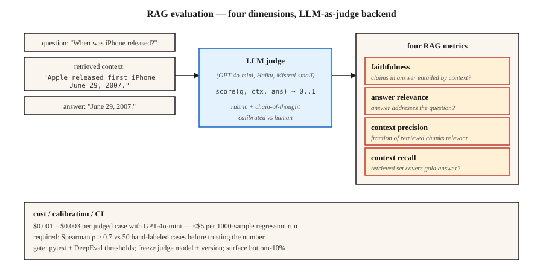

# LLM 评估 —— RAGAS、DeepEval、G-Eval

> 精确匹配和 F1 认不出语义等价,人工评审又撑不起规模。LLM 当裁判是生产环境的答案——前提是校准做到位,数字才可信。

**类型:** 动手构建
**编程语言:** Python
**前置要求:** 第 5 阶段 · 13(问答),第 5 阶段 · 14(信息检索)
**预计耗时:** 约 75 分钟

## 问题

你的 RAG 系统回答:"June 29th, 2007."
黄金参考答案是:"June 29, 2007."
精确匹配给 0 分,F1 给约 75 分,而人会打 100 分。

把这个乘以 1 万个测试用例,再乘以你对检索器、切块、提示词或模型做的每一次改动。你需要一个评估器:懂意思、跑得便宜、不会在回归上说谎、还能把正确的故障模式摆到台面上。

2026 年,三个框架统治着这个问题。

- **RAGAS。** Retrieval-Augmented Generation ASsessment。四个 RAG 指标(忠实度、答案相关性、上下文精确率、上下文召回率),后端是 NLI + LLM 裁判。有研究背书,轻量。
- **DeepEval。** LLM 界的 pytest。G-Eval、任务完成度、幻觉、偏见等指标,为 CI/CD 而生。
- **G-Eval。** 一种方法(也是 DeepEval 里的一个指标):带思维链的 LLM 裁判,自定义评分标准,打 0-1 分。

三者都建立在 LLM 裁判之上。本课建立对这个方法及其外围信任层的直觉。

## 概念



**LLM 当裁判。** 把一个 LLM 放进静态指标的位置,按评分细则给输出打分。给定 `(查询, 上下文, 答案)`,提示裁判 LLM:"按忠实度打 0-1 分。"拿回分数。

为什么有效:LLM 能以极小成本近似人类判断。GPT-4o-mini 每个用例约 $0.003,1000 个样本的回归评估跑下来不到 $5。

为什么会无声地失败:

1. **裁判偏见。** 裁判偏爱更长的答案、偏爱自己同家族模型的答案、偏爱风格匹配提示词的答案。
2. **JSON 解析失败。** 烂 JSON → NaN 分数 → 被悄悄从聚合里剔除。RAGAS 用户都懂这种痛。要用 try/except 加显式失败模式兜底。
3. **模型版本漂移。** 升级裁判模型,所有指标全变。裁判模型和版本要冻结。

**RAG 四指标。**

| 指标 | 问什么 | 后端 |
|--------|----------|---------|
| 忠实度 | 答案里的每个论断都有检索上下文支撑吗? | 基于 NLI 的蕴含 |
| 答案相关性 | 答案回应了问题吗? | 从答案反生成假想问题,与真实问题对比 |
| 上下文精确率 | 检索回来的块里,相关的占多少? | LLM 裁判 |
| 上下文召回率 | 检索把需要的东西都找齐了吗? | 对黄金答案做 LLM 裁判 |

**G-Eval。** 定义一个自定义标准:"答案引用了正确的来源吗?"框架自动把它展开成思维链评估步骤,然后打 0-1 分。适合 RAGAS 没覆盖的领域专属质量维度。

**校准。** 在拿到与人类标注的相关性之前,永远不要轻信裁判的原始分数。跑 100 条人工标注样本,画出裁判分对人分的散点,算 Spearman rho。rho < 0.7,说明你的评分细则要改。

```figure
n5-judge-gauge
```

## 动手构建

### 第 1 步:用 NLI 算忠实度(RAGAS 风格)

```python
from typing import Callable
from transformers import pipeline

nli = pipeline("text-classification",
               model="MoritzLaurer/DeBERTa-v3-large-mnli-fever-anli-ling-wanli",
               top_k=None)

# `llm` is any callable: prompt str -> generated str.
# Example: llm = lambda p: client.messages.create(model="claude-haiku-4-5", ...).content[0].text
LLM = Callable[[str], str]


def atomic_claims(answer: str, llm: LLM) -> list[str]:
    prompt = f"""Break this answer into simple factual claims (one per line):
{answer}
"""
    return llm(prompt).splitlines()


def faithfulness(answer: str, context: str, llm: LLM) -> float:
    claims = atomic_claims(answer, llm)
    if not claims:
        return 0.0
    supported = 0
    for claim in claims:
        result = nli({"text": context, "text_pair": claim})[0]
        entail = next((s for s in result if s["label"] == "entailment"), None)
        if entail and entail["score"] > 0.5:
            supported += 1
    return supported / len(claims)
```

把答案拆成原子论断,逐条对检索上下文做 NLI 检查,忠实度 = 有支撑的比例。

### 第 2 步:答案相关性

```python
import numpy as np
from sentence_transformers import SentenceTransformer

# encoder: any model implementing .encode(texts, normalize_embeddings=True) -> ndarray
# e.g., encoder = SentenceTransformer("BAAI/bge-small-en-v1.5")

def answer_relevance(question: str, answer: str, encoder, llm: LLM, n: int = 3) -> float:
    prompt = f"Write {n} questions this answer could be the answer to:\n{answer}"
    generated = [line for line in llm(prompt).splitlines() if line.strip()][:n]
    if not generated:
        return 0.0
    q_emb = np.asarray(encoder.encode([question], normalize_embeddings=True)[0])
    g_embs = np.asarray(encoder.encode(generated, normalize_embeddings=True))
    sims = [float(q_emb @ g_emb) for g_emb in g_embs]
    return sum(sims) / len(sims)
```

如果答案隐含的问题和被问的那个对不上,相关性就掉。

### 第 3 步:G-Eval 自定义指标

```python
from deepeval.metrics import GEval
from deepeval.test_case import LLMTestCaseParams, LLMTestCase

metric = GEval(
    name="Correctness",
    criteria="The answer should be factually accurate and match the expected output.",
    evaluation_steps=[
        "Read the expected output.",
        "Read the actual output.",
        "List factual claims in the actual output.",
        "For each claim, mark supported or unsupported by the expected output.",
        "Return score = fraction supported.",
    ],
    evaluation_params=[LLMTestCaseParams.INPUT, LLMTestCaseParams.ACTUAL_OUTPUT, LLMTestCaseParams.EXPECTED_OUTPUT],
)

test = LLMTestCase(input="When was the first iPhone released?",
                   actual_output="June 29th, 2007.",
                   expected_output="June 29, 2007.")
metric.measure(test)
print(metric.score, metric.reason)
```

评估步骤就是评分细则。显式的步骤,比笼统一句"打 0-1 分"的提示词稳定得多。

### 第 4 步:CI 闸门

```python
import deepeval
from deepeval.metrics import FaithfulnessMetric, ContextualRelevancyMetric


def test_rag_system():
    cases = load_regression_cases()
    faith = FaithfulnessMetric(threshold=0.85)
    rel = ContextualRelevancyMetric(threshold=0.7)
    for case in cases:
        faith.measure(case)
        assert faith.score >= 0.85, f"faithfulness regression on {case.id}"
        rel.measure(case)
        assert rel.score >= 0.7, f"relevancy regression on {case.id}"
```

写成 pytest 文件发布,每个 PR 都跑,回归就拦合并。

### 第 5 步:从零手搓玩具评估

见 `code/main.py`:纯标准库实现的忠实度近似(答案论断与上下文的重叠)和相关性近似(答案 token 与问题 token 的重叠)。不能上生产,但展示了形状。

## 坑

- **不校准。** 和人类标签相关性只有 0.3 的裁判就是噪声。上线前必须跑一轮校准。
- **自我评估。** 用同一个 LLM 既生成又当裁判,分数虚高 10-20%。裁判要用不同家族的模型。
- **成对评判时的位置偏见。** 裁判偏爱先出现的那个选项。永远随机化顺序,两个顺序都跑。
- **聚合值掩盖失败。** 均分 0.85 的背后,常常藏着 5% 的灾难性失败。永远检查底部分位数。
- **黄金数据集腐烂。** 不做版本管理的评估集会随时间漂移,毁掉纵向对比。每次改动都给数据集打标签。
- **LLM 成本。** 规模化之后,裁判调用是大头。用能满足校准门槛的最便宜模型:GPT-4o-mini、Claude Haiku、Mistral-small。

## 投入使用

2026 年的技术栈:

| 场景 | 框架 |
|---------|-----------|
| RAG 质量监控 | RAGAS(4 个指标) |
| CI/CD 回归闸门 | DeepEval + pytest |
| 自定义领域标准 | DeepEval 里的 G-Eval |
| 在线实时流量监控 | RAGAS 无参考模式 |
| 人工抽查 | LangSmith 或 Phoenix,带标注界面 |
| 红队 / 安全评估 | Promptfoo + DeepEval |

典型组合:RAGAS 管监控,DeepEval 管 CI,G-Eval 管新维度。三个都跑——它们的分歧本身就有信息量。

## 交付

保存为 `outputs/skill-eval-architect.md`:

```markdown
---
name: eval-architect
description: Design an LLM evaluation plan with calibrated judge and CI gates.
version: 1.0.0
phase: 5
lesson: 27
tags: [nlp, evaluation, rag]
---

Given a use case (RAG / agent / generative task), output:

1. Metrics. Faithfulness / relevance / context-precision / context-recall + any custom G-Eval metrics with criteria.
2. Judge model. Named model + version, rationale for cost vs accuracy.
3. Calibration. Hand-labeled set size, target Spearman rho vs human > 0.7.
4. Dataset versioning. Tag strategy, change log, stratification.
5. CI gate. Thresholds per metric, regression-window logic, bottom-quantile alert.

Refuse to rely on a judge untested against ≥50 human-labeled examples. Refuse self-evaluation (same model generates + judges). Refuse aggregate-only reporting without bottom-10% surfacing. Flag any pipeline where judge upgrade lands without parallel baseline eval.
```

## 练习

1. **入门。** 用 RAGAS 评估 10 个已知含幻觉的 RAG 样例,验证忠实度指标能抓住每一个。
2. **进阶。** 人工标注 50 个问答答案的正确性(0-1),用 G-Eval 打分,测裁判与人之间的 Spearman rho。
3. **挑战。** 用 DeepEval 搭一个 pytest CI 闸门,故意搞坏检索器,验证闸门会拦截;再对最低 10% 的用例加底部分位数告警。

## 关键术语

| 术语 | 大家嘴里的说法 | 实际含义 |
|------|-----------------|-----------------------|
| LLM 当裁判 | 用 LLM 打分 | 按评分细则提示裁判模型给输出打 0-1 分 |
| RAGAS | "那个 RAG 指标库" | 开源评估框架,带 4 个无参考 RAG 指标 |
| 忠实度 | 答案有据吗? | 答案论断中被检索上下文蕴含的比例 |
| 上下文精确率 | 检索的块相关吗? | top-K 块里真正有用的比例 |
| 上下文召回率 | 检索找齐了吗? | 黄金答案论断中被检索块支撑的比例 |
| G-Eval | 自定义 LLM 裁判 | 评分细则 + 思维链评估步骤 + 0-1 分 |
| 校准 | 信任但要验证 | 裁判分数与人类分数的 Spearman 相关 |

## 延伸阅读

- [Es et al. (2023). RAGAS: Automated Evaluation of Retrieval Augmented Generation](https://arxiv.org/abs/2309.15217) —— RAGAS 论文
- [Liu et al. (2023). G-Eval: NLG Evaluation using GPT-4 with Better Human Alignment](https://arxiv.org/abs/2303.16634) —— G-Eval 论文
- [DeepEval 文档](https://deepeval.com/docs/metrics-introduction) —— 开放的生产技术栈
- [Zheng et al. (2023). Judging LLM-as-a-Judge with MT-Bench and Chatbot Arena](https://arxiv.org/abs/2306.05685) —— 偏见、校准与局限
- [MLflow GenAI Scorer](https://mlflow.org/blog/third-party-scorers) —— 整合 RAGAS、DeepEval、Phoenix 的统一框架
