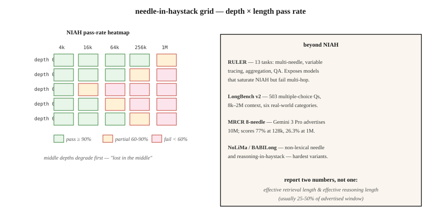

# 长上下文评测 —— NIAH、RULER、LongBench、MRCR

> Gemini 3 Pro 宣称 1000 万 token 上下文。但在 100 万 token 处,8 针 MRCR 掉到 26.3%。标称 ≠ 可用。长上下文评测告诉你:你要押注的那个模型,真实容量到底有多少。

**类型:** 学习
**编程语言:** Python
**前置要求:** 第 5 阶段 · 13(问答系统)、第 5 阶段 · 23(分块策略)
**预计耗时:** 约 60 分钟

## 问题

你有一份 200 页的合同,模型号称 100 万 token 上下文。你把合同粘进去问:"终止条款是什么?"模型回答了——但它答的是封面页上的内容,因为终止条款躺在 12 万 token 深处,已经超出了模型真正能注意到的范围。

这就是 2026 年的上下文容量落差。规格书写着 100 万、1000 万,现实是其中只有 60-70% 可用,而且"可用"还取决于任务。

- **检索(大海捞一根针):** 前沿模型在标称上限内接近满分。
- **多跳 / 聚合:** 大多数模型过了约 128k 就急剧退化。
- **对分散事实的推理:** 最先崩掉的任务。

长上下文评测度量的就是这些维度。本课点名列出各个基准、各自到底测什么,以及如何为你的领域定制一个针测试。

## 概念



**大海捞针(NIAH,2023)。** 把一个事实("魔法词是 pineapple")放在长上下文中受控的深度上,让模型检索它。扫描 深度 × 长度 的网格。这是最早的长上下文基准。如今前沿模型已经能把它刷满——它是必要基线,但远不充分。

**RULER(Nvidia,2024)。** 4 大类共 13 种任务:检索(单键 / 多键 / 多值)、多跳追踪(变量跟踪)、聚合(常见词频)、问答。上下文长度可配(4k 到 128k+)。它能揭穿那些刷满 NIAH 却栽在多跳上的模型。在 2024 年的发布中,17 个号称 32k+ 上下文的模型,只有一半在 32k 处保住了质量。

**LongBench v2(2024)。** 503 道多选题,上下文 8k-200 万词,六大任务类:单文档问答、多文档问答、长上下文学习、长对话、代码仓库、长结构化数据。这是衡量真实世界长上下文表现的生产级基准。

**MRCR(多轮指代消解)。** 大规模的多轮指代。有 8 针、24 针、100 针三种变体。它暴露的是:模型在注意力退化之前,能同时接住多少个事实。

**NoLiMa。** "非字面针"。针与查询没有任何字面上的重叠,检索需要一步语义推理。比 NIAH 更难。

**HELMET。** 把多篇文档拼接起来,就其中任意一篇提问。测的是选择性注意力。

**BABILong。** 把 bAbI 推理链埋进无关的"草堆"里。测的是草堆中的推理,而不只是检索。

### 真正该报告的指标

- **标称上下文窗口。** 规格书上的数字。
- **有效检索长度。** NIAH 在某个阈值(如 90%)下的通过长度。
- **有效推理长度。** 多跳或聚合任务在该阈值下的通过长度。
- **退化曲线。** 准确率随上下文长度变化的曲线,按任务类型分别绘制。

你的规格书上应该写两个数:检索有效长度和推理有效长度。推理有效长度通常只有标称窗口的 25-50%。

```figure
gx-niah-decay
```

## 动手构建

### 第 1 步:为你的领域定制 NIAH

见 `code/main.py`。骨架如下:

```python
def build_haystack(filler_text, needle, depth_ratio, total_tokens):
    if not (0.0 <= depth_ratio <= 1.0):
        raise ValueError(f"depth_ratio must be in [0, 1], got {depth_ratio}")
    if total_tokens <= 0:
        raise ValueError(f"total_tokens must be positive, got {total_tokens}")

    filler_tokens = tokenize(filler_text)
    needle_tokens = tokenize(needle)
    if not filler_tokens:
        raise ValueError("filler_text produced no tokens")

    # Repeat filler until long enough to fill the haystack body.
    body_len = max(total_tokens - len(needle_tokens), 0)
    while len(filler_tokens) < body_len:
        filler_tokens = filler_tokens + filler_tokens
    filler_tokens = filler_tokens[:body_len]

    insert_at = min(int(body_len * depth_ratio), body_len)
    haystack = filler_tokens[:insert_at] + needle_tokens + filler_tokens[insert_at:]
    return " ".join(haystack)


def score_niah(model, haystack, question, expected):
    answer = model.complete(f"Context: {haystack}\nQ: {question}\nA:", max_tokens=50)
    return 1 if expected.lower() in answer.lower() else 0
```

扫描 `depth_ratio` ∈ {0, 0.25, 0.5, 0.75, 1.0} × `total_tokens` ∈ {1k, 4k, 16k, 64k},画出热力图。这就是你目标模型的 NIAH 卡片。

### 第 2 步:多针变体

```python
def build_multi_needle(filler, needles, total_tokens):
    depths = [0.1, 0.4, 0.7]
    chunks = [filler[:int(total_tokens * 0.1)]]
    for depth, needle in zip(depths, needles):
        chunks.append(needle)
        next_chunk = filler[int(total_tokens * depth): int(total_tokens * (depth + 0.3))]
        chunks.append(next_chunk)
    return " ".join(chunks)
```

像"三个魔法词分别是什么?"这种问题,要求三根针全部检索到。单针的成功预测不了多针的成功。

### 第 3 步:多跳变量追踪(RULER 风格)

```python
haystack = """X1 = 42. ... (filler) ... X2 = X1 + 10. ... (filler) ... X3 = X2 * 2."""
question = "What is X3?"
```

答案需要把三次赋值串成链。前沿模型在 128k 处做这类题,准确率常常掉到 50-70%。

### 第 4 步:在你的技术栈上跑 LongBench v2

```python
from datasets import load_dataset
longbench = load_dataset("THUDM/LongBench-v2")

def eval_model_on_longbench(model, subset="single-doc-qa"):
    tasks = [x for x in longbench["test"] if x["task"] == subset]
    correct = 0
    for x in tasks:
        answer = model.complete(x["context"] + "\n\nQ: " + x["question"], max_tokens=20)
        if normalize(answer) == normalize(x["answer"]):
            correct += 1
    return correct / len(tasks)
```

按类别报告准确率。总分会把任务层面的巨大差异掩盖掉。

## 常见坑

- **只做 NIAH 评测。** 100 万 token 过了 NIAH,对多跳能力什么都说明不了。一定要跑 RULER 或自定义多跳测试。
- **均匀深度采样。** 很多实现只测 depth=0.5。要测 depth=0、0.25、0.5、0.75、1.0——"中间迷失"效应是真实存在的。
- **针与填充料字面相撞。** 如果针和填充文本共享关键词,检索就变成送分题。用 NoLiMa 式的无重叠针。
- **忽视延迟。** 100 万 token 的提示词,预填充要 30-120 秒。在准确率之外,同时测量首 token 延迟。
- **迷信厂商自报数字。** OpenAI、Google、Anthropic 都发布自己的分数。永远在你的用例上独立复测。

## 投入使用

2026 年的评测组合:

| 场景 | 基准 |
|-----------|-----------|
| 快速冒烟检查 | 自定义 NIAH,3 深度 × 3 长度 |
| 为生产环境选型 | RULER(13 个任务),跑你的目标长度 |
| 真实世界问答质量 | LongBench v2 单文档问答子集 |
| 多跳推理 | BABILong 或自定义变量追踪 |
| 对话 / 多轮 | MRCR 8 针,跑你的目标长度 |
| 模型升级回归 | 固定的内部 NIAH + RULER 测试台,每个新模型都跑一遍 |

生产环境经验法则:在你目标长度上跑过 NIAH + 1 个推理任务之前,永远不要相信任何上下文窗口数字。

## 交付

保存为 `outputs/skill-long-context-eval.md`:

```markdown
---
name: long-context-eval
description: Design a long-context evaluation battery for a given model and use case.
version: 1.0.0
phase: 5
lesson: 28
tags: [nlp, long-context, evaluation]
---

Given a target model, target context length, and use case, output:

1. Tests. NIAH depth × length grid; RULER multi-hop; custom domain task.
2. Sampling. Depths 0, 0.25, 0.5, 0.75, 1.0 at each length.
3. Metrics. Retrieval pass rate; reasoning pass rate; time-to-first-token; cost-per-query.
4. Cutoff. Effective retrieval length (90% pass) and effective reasoning length (70% pass). Report both.
5. Regression. Fixed harness, rerun on every model upgrade, surface deltas.

Refuse to trust a context window from the model card alone. Refuse NIAH-only evaluation for any multi-hop workload. Refuse vendor self-reported long-context scores as independent evidence.
```

## 练习

1. **简单。** 构建一个 3 深度(0.25、0.5、0.75)× 3 长度(1k、4k、16k)的 NIAH。在任意模型上运行,把通过率画成 3×3 热力图。
2. **中等。** 加一个 3 针变体。在每个长度上测量 3 针全部检索到的比例,与同一长度上的单针通过率对比。
3. **困难。** 构造一个变量追踪任务(X1 → X2 → X3,3 跳),埋进 64k 的填充文本。在 3 个前沿模型上测准确率,报告每个模型的有效推理长度。

## 关键术语

| 术语 | 大家口头的说法 | 实际含义 |
|------|-----------------|-----------------------|
| NIAH | 大海捞针 | 把事实埋进填充文本,让模型检索它。 |
| RULER | 加强版 NIAH | 横跨检索 / 多跳 / 聚合 / 问答的 13 种任务。 |
| 有效上下文 | 真实容量 | 准确率仍能保持在阈值以上的长度。 |
| 中间迷失 | 深度偏差 | 模型对长输入中段的内容注意力不足。 |
| 多针 | 同时塞多个事实 | 多处埋针;测的是注意力的"杂耍"能力,而非单纯检索。 |
| MRCR | 多轮指代 | 8、24 或 100 针的指代消解;暴露注意力饱和点。 |
| NoLiMa | 非字面针 | 针与查询无字面 token 重叠;需要推理。 |

## 延伸阅读

- [Kamradt (2023). Needle in a Haystack analysis](https://github.com/gkamradt/LLMTest_NeedleInAHaystack) — NIAH 原始仓库。
- [Hsieh et al. (2024). RULER: What's the Real Context Size of Your Long-Context LMs?](https://arxiv.org/abs/2404.06654) — 多任务基准。
- [Bai et al. (2024). LongBench v2](https://arxiv.org/abs/2412.15204) — 真实世界长上下文评测。
- [Modarressi et al. (2024). NoLiMa: Non-lexical needles](https://arxiv.org/abs/2404.06666) — 更难的针。
- [Kuratov et al. (2024). BABILong](https://arxiv.org/abs/2406.10149) — 草堆中的推理。
- [Liu et al. (2024). Lost in the Middle: How Language Models Use Long Contexts](https://arxiv.org/abs/2307.03172) — 深度偏差论文。
