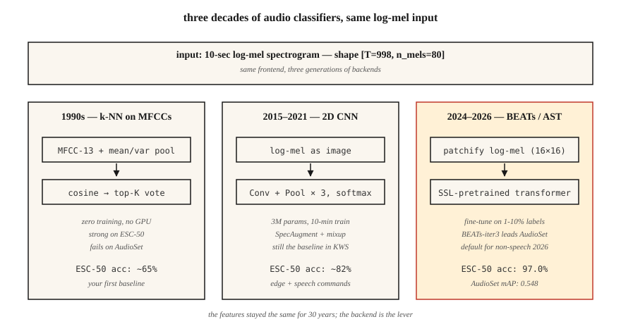

# 音频分类 —— 从 MFCC 上的 k-NN 到 AST 与 BEATs

> 从"狗叫还是警笛"到"这是哪种语言",全都是音频分类。特征是 mel,架构十年一换,评测永远是 AUC、F1 和逐类召回率。

**类型:** 动手构建
**编程语言:** Python
**前置要求:** 第 6 阶段 · 02(频谱图与 Mel)、第 3 阶段 · 06(CNN)、第 5 阶段 · 08(文本 CNN 与 RNN)
**预计耗时:** 约 75 分钟

## 问题

你拿到一段 10 秒的音频,想知道:"这是什么?"城市声音(警笛、电钻、狗叫)、语音指令(yes/no/stop)、语种识别(英/西/阿)、说话人情绪(愤怒/平静)、环境音(室内/室外、嘈杂人声)——这些全是*音频分类*。2026 年,基线架构已经成熟:log-mel → CNN 或 Transformer → softmax。

核心难点不在网络,而在数据。音频数据集类别失衡严重、域偏移明显(干净 vs 嘈杂)、标签带噪声(谁界定"城市嘈杂"和"餐厅噪声"的?)。问题的 80% 在于数据整理、增强和评测,而不是把 CNN 换成 Transformer。

## 概念



**MFCC 上的 k-NN(90 年代基线)。** 把每段音频的 MFCC 拉平,与标注库算余弦相似度,取前 K 个多数投票。在干净的小数据集(Speech Commands、ESC-50)上出人意料地强。不需要 GPU 就能跑。

**log-mel 上的 2D CNN(2015-2019)。** 把 `(T, n_mels)` 的 log-mel 当图像处理,套 ResNet-18 或 VGG 风格网络,时间轴全局平均池化,类别上 softmax。至今仍是 2026 年多数 Kaggle 比赛的基线。

**音频频谱 Transformer,AST(2021-2024)。** 把 log-mel 切成 patch(如 16×16),加位置嵌入,喂给 ViT。监督学习下 AudioSet 的 SOTA(mAP 0.485)。

**BEATs 与 WavLM-base(2024-2026)。** 在数百万小时音频上自监督预训练,再用你所需监督数据量的 1-10% 做微调。2026 年,这是非语音音频的默认起点。BEATs-iter3 在 AudioSet 上比 AST 高 1-2 个 mAP,算力只用 1/4。

**Whisper 编码器做冻结骨干(2024)。** 取 Whisper 的编码器,丢掉解码器,接一个线性分类器。零音频增强,就能在语种识别和简单事件分类上接近 SOTA。"免费的午餐"基线。

### 类别失衡才是真正的挑战

ESC-50:50 类、每类 40 段——均衡,好办。UrbanSound8K:10 类,失衡 10:1。AudioSet:632 类,长尾 100000:1。有效的技术:

- 训练时均衡采样(评测时不做)。
- Mixup:把两段音频(及标签)线性插值作为增强。
- SpecAugment:随机遮蔽时间和频率条带。简单,但至关重要。

### 评测

- 多类互斥(Speech Commands):top-1 准确率、top-5 准确率。
- 多类多标签(AudioSet、UrbanSound 风格):平均精度均值(mAP)。
- 严重失衡:逐类召回率 + 宏 F1。

2026 年你该知道的数字:

| 基准 | 基线 | 2026 SOTA | 来源 |
|-----------|----------|-----------|--------|
| ESC-50 | 82%(AST) | 97.0%(BEATs-iter3) | BEATs 论文(2024) |
| AudioSet mAP | 0.485(AST) | 0.548(BEATs-iter3) | HEAR 排行榜 2026 |
| Speech Commands v2 | 98%(CNN) | 99.0%(Audio-MAE) | HEAR v2 结果 |

```figure
mfcc-pipeline
```

## 动手构建

### 第 1 步:特征化

```python
def featurize_mfcc(signal, sr, n_mfcc=13, n_mels=40, frame_len=400, hop=160):
    mag = stft_magnitude(signal, frame_len, hop)
    fb = mel_filterbank(n_mels, frame_len, sr)
    mels = apply_filterbank(mag, fb)
    log = log_transform(mels)
    return [dct_ii(frame, n_mfcc) for frame in log]
```

### 第 2 步:定长摘要

```python
def summarize(mfcc_frames):
    n = len(mfcc_frames[0])
    mean = [sum(f[i] for f in mfcc_frames) / len(mfcc_frames) for i in range(n)]
    var = [
        sum((f[i] - mean[i]) ** 2 for f in mfcc_frames) / len(mfcc_frames) for i in range(n)
    ]
    return mean + var
```

简单但强:时间轴上的均值 + 方差,把 13 维 MFCC 变成 26 维定长嵌入。瞬间跑完。直到 2017 年还能在 ESC-50 上击败当时的 SOTA 神经网络基线。

### 第 3 步:k-NN

```python
def cosine(a, b):
    dot = sum(x * y for x, y in zip(a, b))
    na = math.sqrt(sum(x * x for x in a)) or 1e-12
    nb = math.sqrt(sum(x * x for x in b)) or 1e-12
    return dot / (na * nb)

def knn_classify(q, bank, labels, k=5):
    sims = sorted(range(len(bank)), key=lambda i: -cosine(q, bank[i]))[:k]
    votes = Counter(labels[i] for i in sims)
    return votes.most_common(1)[0][0]
```

### 第 4 步:升级到 log-mel 上的 CNN

PyTorch 写法:

```python
import torch.nn as nn

class AudioCNN(nn.Module):
    def __init__(self, n_mels=80, n_classes=50):
        super().__init__()
        self.body = nn.Sequential(
            nn.Conv2d(1, 32, 3, padding=1), nn.ReLU(), nn.MaxPool2d(2),
            nn.Conv2d(32, 64, 3, padding=1), nn.ReLU(), nn.MaxPool2d(2),
            nn.Conv2d(64, 128, 3, padding=1), nn.ReLU(),
            nn.AdaptiveAvgPool2d(1),
        )
        self.head = nn.Linear(128, n_classes)

    def forward(self, x):  # x: (B, 1, T, n_mels)
        return self.head(self.body(x).flatten(1))
```

300 万参数。单张 RTX 4090 上约 10 分钟训完 ESC-50,准确率 80%+。

### 第 5 步:2026 默认方案 —— 微调 BEATs

```python
from transformers import ASTFeatureExtractor, ASTForAudioClassification

ext = ASTFeatureExtractor.from_pretrained("MIT/ast-finetuned-audioset-10-10-0.4593")
model = ASTForAudioClassification.from_pretrained(
    "MIT/ast-finetuned-audioset-10-10-0.4593",
    num_labels=50,
    ignore_mismatched_sizes=True,
)

inputs = ext(audio, sampling_rate=16000, return_tensors="pt")
logits = model(**inputs).logits
```

BEATs 用 `microsoft/BEATs-base`,通过 `beats` 库加载;transformers API 用法形态相同。

## 投入使用

2026 年的技术栈:

| 场景 | 从这里开始 |
|-----------|-----------|
| 极小数据集(<1000 段) | MFCC 均值上的 k-NN(你的基线)+ 音频增强 |
| 中等数据集(1K–100K) | 微调 BEATs 或 AST |
| 大数据集(>100K) | 从零训练,或微调 Whisper 编码器 |
| 实时、端侧 | 40 维 MFCC CNN,int8 量化(KWS 风格) |
| 多标签(AudioSet) | BEATs-iter3 + BCE 损失 + mixup + SpecAugment |
| 语种识别 | MMS-LID、SpeechBrain VoxLingua107 基线 |

决策规则:**从冻结骨干开始,不要从零造模型**。微调一个 BEATs 分类头,几小时拿到 SOTA 的 95%,而不是几周。

## 交付

保存为 `outputs/skill-classifier-designer.md`。针对给定的音频分类任务,选定架构、增强方式、类别均衡策略和评测指标。

## 练习

1. **简单。** 运行 `code/main.py`。它在 4 类合成数据集(不同音高的纯音)上训练 k-NN MFCC 基线。报告混淆矩阵。
2. **中等。** 把 `summarize` 换成 [mean, var, skew, kurtosis]。四阶矩池化在同一个合成数据集上能胜过 mean+var 吗?
3. **困难。** 用 `torchaudio` 在 ESC-50 第 1 折上训练 2D CNN。报告 5 折交叉验证准确率。加上 SpecAugment(时间遮蔽 = 20,频率遮蔽 = 10),报告提升幅度。

## 关键术语

| 术语 | 大家口头的说法 | 实际含义 |
|------|-----------------|-----------------------|
| AudioSet | 音频界的 ImageNet | Google 的 200 万段、632 类弱标注 YouTube 数据集。 |
| ESC-50 | 小型分类基准 | 50 类 × 每类 40 段环境音。 |
| AST | 音频频谱 Transformer | log-mel patch 上的 ViT;2021 年的 SOTA。 |
| BEATs | 自监督音频模型 | 微软模型,截至 2026 年 iter3 领跑 AudioSet。 |
| Mixup | 成对增强 | `x = λ·x1 + (1-λ)·x2; y = λ·y1 + (1-λ)·y2`。 |
| SpecAugment | 遮蔽增强 | 把频谱图随机的时间、频率条带置零。 |
| mAP | 多标签主指标 | 跨类别、跨阈值的平均精度均值。 |

## 延伸阅读

- [Gong, Chung, Glass (2021). AST: Audio Spectrogram Transformer](https://arxiv.org/abs/2104.01778) — 2021–2024 年的主流架构。
- [Chen et al. (2022, rev. 2024). BEATs: Audio Pre-Training with Acoustic Tokenizers](https://arxiv.org/abs/2212.09058) — 2024 年之后的默认选择。
- [Park et al. (2019). SpecAugment](https://arxiv.org/abs/1904.08779) — 最主流的音频增强方法。
- [Piczak (2015). ESC-50 dataset](https://github.com/karolpiczak/ESC-50) — 至今仍在使用的 50 类基准。
- [Gemmeke et al. (2017). AudioSet](https://research.google.com/audioset/) — 632 类 YouTube 分类体系,仍是金标准。
