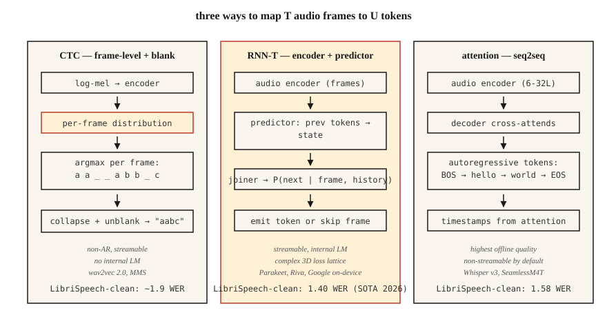

# 语音识别(ASR)—— CTC、RNN-T、注意力

> 语音识别就是在每个时间步做音频分类,再用一个懂英语、懂静音的序列模型把它们粘起来。CTC、RNN-T 和注意力是三种做法。选一个,并搞懂为什么。

**类型:** 动手构建
**编程语言:** Python
**前置要求:** 第 6 阶段 · 02(频谱图与 Mel)、第 5 阶段 · 08(文本 CNN 与 RNN)、第 5 阶段 · 10(注意力)
**预计耗时:** 约 45 分钟

## 问题

你有一段 10 秒的 16 kHz 音频,想要一个字符串:"turn on the kitchen lights"。难在结构上:音频帧与字符并非一一对应。单词 "okay" 可能占 200 ms,也可能占 1200 ms;静音穿插在话语中;有的音素比别的长。输出 token 的数量事先未知。

三种 formulation 解决这个问题:

1. **CTC(联结主义时序分类)。** 逐帧输出 token 概率,包含一个特殊的 *blank*。解码时折叠重复项和 blank。非自回归,快。wav2vec 2.0、MMS 用它。
2. **RNN-T(循环神经网络变换器)。** 联合网络根据编码器帧和已生成 token 预测下一个 token。可流式。Google 端侧 ASR、NVIDIA Parakeet 用它。
3. **注意力编码器-解码器。** 编码器把音频压缩成隐状态,解码器交叉注意力自回归地生成 token。Whisper、SeamlessM4T 用它。

2026 年,LibriSpeech test-clean 上的 SOTA WER 是 1.4%(Parakeet-TDT-1.1B,NVIDIA)和 1.58%(Whisper-Large-v3-turbo)。质量差距微乎其微,部署差距天差地别。

## 概念



**CTC 直觉。** 让编码器输出 `T` 个帧级分布,词表为 `V+1`(V 个字符 + blank)。对长度 `U < T` 的目标串 `y`,任何折叠后能得到 `y` 的帧对齐都合法。CTC 损失对所有这些对齐求和。推理:逐帧 argmax,折叠重复,删掉 blank。

优点:非自回归、可流式、零前瞻。缺点:*条件独立假设*——每帧预测相互独立,没有内部语言模型。补救:通过 beam search 或浅融合外挂一个 LM。

**RNN-T 直觉。** 增加一个*预测器*网络嵌入 token 历史,再加一个*联合器*把预测器状态与编码器帧合成 `V+1` 的联合分布(+1 是 null/不发射)。显式建模了 CTC 忽略的条件依赖。每一步只依赖过去的帧和过去的 token,所以可流式。

优点:可流式 + 自带内部 LM。缺点:训练更复杂、更吃显存(3D 损失网格);RNN-T 损失内核本身就能撑起一个库。

**注意力编码器-解码器。** 编码器(6-32 层 Transformer)处理 log-mel 帧,解码器(6-32 层 Transformer)对编码器输出做交叉注意力,自回归生成 token。没有对齐约束——注意力可以看音频的任何位置。除非限制注意力范围,否则不可流式(chunked Whisper-Streaming,2024)。

优点:离线 ASR 质量最高,用标准 seq2seq 工具链就能训练。缺点:自回归延迟与输出长度成正比;不做工程化就不能流式。

### WER:唯一的数字

**词错误率(WER)** = `(S + D + I) / N`,S=替换、D=删除、I=插入、N=参考文本词数。即词级别的 Levenshtein 编辑距离。越低越好。WER 超过 20% 基本不可用;朗读语音上低于 5% 达到人类水平。2026 年标准基准上的数字:

| 模型 | LibriSpeech test-clean | LibriSpeech test-other | 规模 |
|-------|------------------------|------------------------|------|
| Parakeet-TDT-1.1B | 1.40% | 2.78% | 1.1B 参数 |
| Whisper-Large-v3-turbo | 1.58% | 3.03% | 809M |
| Canary-1B Flash | 1.48% | 2.87% | 1B |
| Seamless M4T v2 | 1.7% | 3.5% | 2.3B |

这些都是编码器-解码器或 RNN-T 架构。纯 CTC 系统(wav2vec 2.0)在 test-clean 上大约 1.8–2.1%。

```figure
ctc-collapse
```

## 动手构建

### 第 1 步:贪心 CTC 解码

```python
def ctc_greedy(frame_logits, blank=0, vocab=None):
    # frame_logits: list of per-frame probability vectors
    preds = [max(range(len(p)), key=lambda i: p[i]) for p in frame_logits]
    out = []
    prev = -1
    for p in preds:
        if p != prev and p != blank:
            out.append(p)
        prev = p
    return "".join(vocab[i] for i in out) if vocab else out
```

两条规则:折叠连续重复,丢弃 blank。例:`a a _ _ a b b _ c` → `a a b c`。

### 第 2 步:beam-search CTC

```python
def ctc_beam(frame_logits, beam=8, blank=0):
    import math
    beams = [([], 0.0)]  # (tokens, log_prob)
    for p in frame_logits:
        log_p = [math.log(max(pi, 1e-10)) for pi in p]
        candidates = []
        for seq, lp in beams:
            for t, lpt in enumerate(log_p):
                new = seq[:] if t == blank else (seq + [t] if not seq or seq[-1] != t else seq)
                candidates.append((new, lp + lpt))
        candidates.sort(key=lambda x: -x[1])
        beams = candidates[:beam]
    return beams[0][0]
```

生产环境用带 LM 融合的前缀树 beam search;这里只是概念骨架。

### 第 3 步:WER

```python
def wer(ref, hyp):
    r, h = ref.split(), hyp.split()
    dp = [[0] * (len(h) + 1) for _ in range(len(r) + 1)]
    for i in range(len(r) + 1):
        dp[i][0] = i
    for j in range(len(h) + 1):
        dp[0][j] = j
    for i in range(1, len(r) + 1):
        for j in range(1, len(h) + 1):
            cost = 0 if r[i - 1] == h[j - 1] else 1
            dp[i][j] = min(
                dp[i - 1][j] + 1,
                dp[i][j - 1] + 1,
                dp[i - 1][j - 1] + cost,
            )
    return dp[len(r)][len(h)] / max(1, len(r))
```

### 第 4 步:用 Whisper 推理

```python
import whisper
model = whisper.load_model("large-v3-turbo")
result = model.transcribe("clip.wav")
print(result["text"])
```

一行代码,调用 2026 年最强的通用 ASR。24 GB 显卡上能以约 20 倍实时速度运行。

### 第 5 步:用 Parakeet 或 wav2vec 2.0 做流式

```python
from transformers import pipeline
asr = pipeline("automatic-speech-recognition", model="nvidia/parakeet-tdt-1.1b")
for chunk in streaming_audio():
    print(asr(chunk, return_timestamps=True))
```

流式 ASR 需要分块编码器注意力和状态延续;用支持它的库(Parakeet 用 NeMo,或 `transformers` pipeline 配 `chunk_length_s`)。

## 投入使用

2026 年的技术栈:

| 场景 | 选择 |
|-----------|------|
| 英语、离线、最高质量 | Whisper-large-v3-turbo |
| 多语言、鲁棒 | SeamlessM4T v2 |
| 流式、低延迟 | Parakeet-TDT-1.1B 或 Riva |
| 端侧、移动端、<500 ms 延迟 | 量化 Whisper-Tiny 或 Moonshine(2024) |
| 长音频 | Whisper + 基于 VAD 的分块(WhisperX) |
| 领域专用(医疗、法律) | 微调 wav2vec 2.0 + 领域 LM 融合 |

## 2026 年仍然在上线的坑

- **不做 VAD。** 让 Whisper 跑静音段会产生幻觉("感谢观看!")。永远先用 VAD 门控。
- **字符 vs 词 vs 子词 WER。** 统一在归一化(小写、去标点)之后报告词级 WER。
- **语种识别漂移。** Whisper 的自动语种识别会把嘈杂音频误判成日语或威尔士语;确定语种时强制 `language="en"`。
- **长音频不分块。** Whisper 的窗口是 30 秒。更长的音频用 `chunk_length_s=30, stride=5`。

## 交付

保存为 `outputs/skill-asr-picker.md`。针对给定的部署目标,选定模型、解码策略、分块方式和 LM 融合。

## 练习

1. **简单。** 运行 `code/main.py`。它对一份手工构造的 CTC 输出做贪心解码,并对照参考文本计算 WER。
2. **中等。** 把第 2 步的前缀树 beam search 正确实现出来(处理好 blank 合并规则)。在 10 条合成数据上与贪心对比。
3. **困难。** 用 `whisper-large-v3-turbo` 跑 [LibriSpeech test-clean](https://www.openslr.org/12),计算前 100 条语音的 WER,与公开数字对比。

## 关键术语

| 术语 | 大家口头的说法 | 实际含义 |
|------|-----------------|-----------------------|
| CTC | 带 blank 的损失 | 对所有帧-token 对齐求边缘;非自回归。 |
| RNN-T | 流式损失 | CTC + 下一 token 预测器;能处理语序。 |
| 注意力编解码 | Whisper 风格 | 编码器 + 交叉注意力解码器;离线质量最好。 |
| WER | 你要报的那个数 | 词级 `(S+D+I)/N`。 |
| Blank | 那个空白 | CTC 中的特殊 token,表示"本帧不发射"。 |
| LM 融合 | 外部语言模型 | beam search 时加权加入 LM 的对数概率。 |
| VAD | 静音闸门 | 语音活动检测器;切掉非语音段。 |

## 延伸阅读

- [Graves et al. (2006). Connectionist Temporal Classification](https://www.cs.toronto.edu/~graves/icml_2006.pdf) — CTC 论文。
- [Graves (2012). Sequence Transduction with RNNs](https://arxiv.org/abs/1211.3711) — RNN-T 论文。
- [Radford et al. / OpenAI (2022). Whisper: Robust Speech Recognition via Large-Scale Weak Supervision](https://arxiv.org/abs/2212.04356) — 2022 年权威论文;v3-turbo 为 2024 年扩展。
- [NVIDIA NeMo — Parakeet-TDT card](https://huggingface.co/nvidia/parakeet-tdt-1.1b) — 2026 年 Open ASR 排行榜榜首。
- [Hugging Face — Open ASR Leaderboard](https://huggingface.co/spaces/hf-audio/open_asr_leaderboard) — 覆盖 25+ 模型的实时基准。
