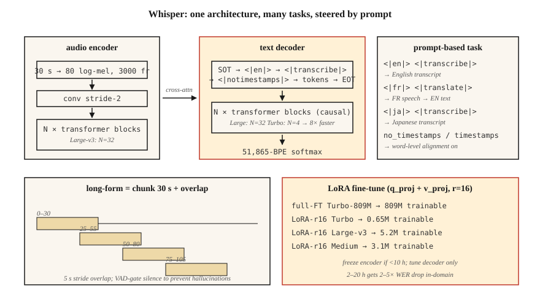

# Whisper —— 架构与微调

> Whisper 是一个 30 秒窗口的 Transformer 编码器-解码器,在 68 万小时的多语言弱监督音频-文本对上训练。一个架构,多种任务,99 种语言上都很稳健。2026 年的参考级 ASR。

**类型:** 动手构建
**编程语言:** Python
**前置要求:** 第 6 阶段 · 04(ASR)、第 5 阶段 · 10(注意力)、第 7 阶段 · 05(完整 Transformer)
**预计耗时:** 约 75 分钟

## 问题

OpenAI 在 2022 年 9 月发布的 Whisper,是第一个以日用品形态交付的 ASR 模型:贴进音频,得到文字,99 种语言,抗噪,笔记本上就能跑。到 2024 年,OpenAI 发布了 Large-v3 和 Turbo 变体;到 2026 年,Whisper 已经成为从播客转写到语音助手再到 YouTube 字幕的一切场景的默认基线。

但 Whisper 不是一条可以永远当黑盒用的流水线。域偏移会杀死它——技术术语、说话人口音、专有名词、短音频、静音。你需要知道:

1. 它内部到底是什么。
2. 如何正确地喂给它分块、流式或长音频。
3. 何时微调、怎么微调。

## 概念



**架构。** 标准的 Transformer 编码器-解码器。

- 输入:30 秒的 log-mel 频谱图,80 维 mel,10 ms 帧移 → 3000 帧。短的补零,长的分块。
- 编码器:卷积降采样(stride 2)+ `N` 个 Transformer 块。Large-v3:32 层、1280 维、20 个头。
- 解码器:`N` 个 Transformer 块,带因果自注意力 + 对编码器输出的交叉注意力。规模与编码器相同。
- 输出:51865 个 token 词表上的 BPE token。

Large-v3 有 15.5 亿参数。Turbo 把解码器砍到 4 层(从 32 层),延迟降 8 倍,WER 损失不到 1%。

**提示词格式。** Whisper 是一个多任务模型,由解码器提示词中的特殊 token 来引导:

```
<|startoftranscript|><|en|><|transcribe|><|notimestamps|> Hello world.<|endoftext|>
```

- `<|en|>` —— 语言标签;决定翻译还是转写行为。
- `<|transcribe|>` 或 `<|translate|>` —— 对任意语言输入,原样转写或译成英文输出。
- `<|notimestamps|>` —— 跳过词级时间戳(更快)。

提示词让一个模型能做多种任务。把 `<|en|>` 换成 `<|fr|>`,它就转写法语。

**30 秒窗口。** 一切都钉死在 30 秒上。更长的要分块,更短的补零。窗口原生不支持流式——这就是 WhisperX、Whisper-Streaming 和 faster-whisper 存在的原因。

**Log-mel 归一化。** `(log_mel - mean) / std`,统计量来自 Whisper 自己的训练语料。你*必须*用 Whisper 的预处理(`whisper.audio.log_mel_spectrogram`),不能用 `librosa.feature.melspectrogram`。

### 2026 年的变体

| 变体 | 参数量 | 延迟(A100) | WER(LibriSpeech-clean) |
|---------|--------|----------------|------------------------|
| Tiny | 39M | 1× 实时 | 5.4% |
| Base | 74M | 1× | 4.1% |
| Small | 244M | 1× | 3.0% |
| Medium | 769M | 1× | 2.7% |
| Large-v3 | 1.55B | 2× | 1.8% |
| Large-v3-turbo | 809M | 8× | 1.58% |
| Whisper-Streaming(2024) | 1.55B | 流式 | 2.0% |

### 微调

2026 年的标准流程:

1. 收集 10–100 小时目标领域的音频及对齐转写。
2. 用 `transformers.Seq2SeqTrainer` 加 `generate_with_loss` 回调训练。
3. 参数高效路线:在注意力层的 `q_proj`、`k_proj`、`v_proj` 上加 LoRA,显存省 4 倍,WER 代价 <0.3。
4. 数据少于 10 小时就冻结编码器,只调解码器。
5. 用 Whisper 自己的 tokenizer 和提示词格式;永远不要换 tokenizer。

社区结果:用 20 小时医疗听写微调 Medium,医疗词汇上的 WER 从 12% 降到 4.5%;用 4 小时冰岛语微调 Turbo,WER 从 18% 降到 6%。

```figure
sp-asr-attention
```

## 动手构建

### 第 1 步:开箱即用跑 Whisper

```python
import whisper
model = whisper.load_model("large-v3-turbo")
result = model.transcribe(
    "clip.wav",
    language="en",
    task="transcribe",
    temperature=0.0,
    condition_on_previous_text=False,  # prevents runaway repetition
)
print(result["text"])
for seg in result["segments"]:
    print(f"[{seg['start']:.2f}–{seg['end']:.2f}] {seg['text']}")
```

几个你应该永远覆盖的默认值:`temperature=0.0`(采样默认走 0.0 → 0.2 → 0.4 … 的回退链)、`condition_on_previous_text=False`(防止级联幻觉问题)、`no_speech_threshold=0.6`(静音检测)。

### 第 2 步:长音频分块

```python
# whisperx is the 2026 reference for long-form with word-level timestamps
import whisperx
model = whisperx.load_model("large-v3-turbo", device="cuda", compute_type="float16")
segments = model.transcribe("1hour.mp3", batch_size=16, chunk_size=30)
```

WhisperX 增加了:(1) Silero VAD 门控,(2) 通过 wav2vec 2.0 的词级对齐,(3) 通过 `pyannote.audio` 的说话人分离。2026 年生产转写的主力工具。

### 第 3 步:用 LoRA 微调

```python
from transformers import WhisperForConditionalGeneration, WhisperProcessor
from peft import LoraConfig, get_peft_model

model = WhisperForConditionalGeneration.from_pretrained("openai/whisper-large-v3-turbo")
lora = LoraConfig(
    r=16, lora_alpha=32, target_modules=["q_proj", "v_proj"],
    lora_dropout=0.1, bias="none", task_type="SEQ_2_SEQ_LM",
)
model = get_peft_model(model, lora)
# model.print_trainable_parameters()  -> ~3M trainable / 809M total
```

然后走标准的 Trainer 循环。每 1000 步存一次检查点,在留出集上用 WER 评估。

### 第 4 步:观察每一层学到了什么

```python
# Grab cross-attention weights during decode to see what the decoder attends to.
with torch.inference_mode():
    out = model.generate(
        input_features=features,
        return_dict_in_generate=True,
        output_attentions=True,
    )
# out.cross_attentions: layer × head × step × src_len
```

用热力图可视化——你会看到解码器逐步扫过编码器帧时形成的对角线对齐。那条对角线就是 Whisper 的词时间戳。

## 投入使用

2026 年的技术栈:

| 场景 | 选择 |
|-----------|------|
| 通用英语、离线 | Large-v3-turbo,走 `whisperx` |
| 移动 / 端侧 | 量化(int8)Whisper-Tiny 或 Moonshine |
| 多语言长音频 | Large-v3,走 `whisperx` + 说话人分离 |
| 低资源语言 | 用 LoRA 微调 Medium 或 Turbo |
| 流式(2 秒延迟) | Whisper-Streaming 或 Parakeet-TDT |
| 词级时间戳 | WhisperX(wav2vec 2.0 强制对齐) |

`faster-whisper`(CTranslate2 后端)是 2026 年最快的 CPU+GPU 推理运行时——比原版快 4 倍,输出完全一致。

## 2026 年仍然在上线的坑

- **静音段幻觉文本。** Whisper 的训练数据带字幕,包括"感谢观看!""快订阅!"、歌词等。调用前永远先 VAD 门控。
- **`condition_on_previous_text` 级联。** 一次幻觉会污染后续所有窗口。除非你需要跨块连贯,否则设为 `False`。
- **短音频补零。** 2 秒的音频补到 30 秒,尾部静音区会产生幻觉。用 `pad=False` 或 VAD 门控。
- **mel 统计量不对。** 用 librosa 的 mel 代替 Whisper 的,输出接近随机。用 `whisper.audio.log_mel_spectrogram`。

## 交付

保存为 `outputs/skill-whisper-tuner.md`。针对给定领域,设计一套 Whisper 微调或推理流水线。

## 练习

1. **简单。** 运行 `code/main.py`。它对一段 Whisper 风格提示词做 tokenize,计算解码形状预算,并打印 10 分钟音频的分块计划。
2. **中等。** 安装 `faster-whisper`,转写一段 10 分钟的播客,与人工转写对比 WER。试试 `language="auto"` 与强制 `language="en"` 的差别。
3. **困难。** 用 HF `datasets`,挑一种 Whisper 表现不好的语言(如乌尔都语),用 LoRA 在 2 小时数据上微调 Medium 两个 epoch,报告 WER 变化。

## 关键术语

| 术语 | 大家口头的说法 | 实际含义 |
|------|-----------------|-----------------------|
| 30 秒窗口 | Whisper 的限制 | 硬性输入上限;更长的音频要分块。 |
| SOT | 转写起点 | `<\|startoftranscript\|>` 开启解码器提示词。 |
| 时间戳 token | 时间对齐 | 每 0.02 秒偏移对应 51k 词表中的一个特殊 token。 |
| Turbo | 快速变体 | 4 层解码器,快 8 倍,WER 回退 <1%。 |
| WhisperX | 长音频封装 | VAD + Whisper + wav2vec 对齐 + 说话人分离。 |
| LoRA 微调 | 高效调参 | 给注意力加低秩适配器;只训练约 0.3% 的参数。 |
| 幻觉 | 静默的失败 | Whisper 会从噪声/静音中生成流畅的英文。 |

## 延伸阅读

- [Radford et al. (2022). Whisper paper](https://arxiv.org/abs/2212.04356) — 原始架构与训练配方。
- [OpenAI (2024). Whisper Large-v3-turbo release](https://github.com/openai/whisper/discussions/2363) — 4 层解码器,8 倍加速。
- [Bain et al. (2023). WhisperX](https://arxiv.org/abs/2303.00747) — 长音频、词级对齐、说话人分离。
- [Systran — faster-whisper repo](https://github.com/SYSTRAN/faster-whisper) — CTranslate2 后端,快 4 倍。
- [HuggingFace — Whisper fine-tune tutorial](https://huggingface.co/blog/fine-tune-whisper) — 权威的 LoRA / 全量微调教程。
