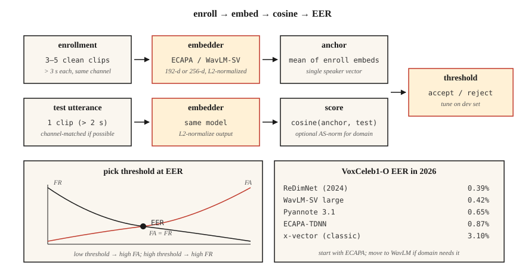

# 说话人识别与验证

> ASR 问的是"他说了什么?"说话人识别问的是"谁在说话?"数学看起来一样——嵌入加余弦——但每个生产决策都系于一个 EER 数字。

**类型:** 动手构建
**编程语言:** Python
**前置要求:** 第 6 阶段 · 02(频谱图与 Mel)、第 5 阶段 · 22(嵌入模型)
**预计耗时:** 约 45 分钟

## 问题

用户说一句口令。你想知道:这是他所声称的那个人吗(*验证*,1:1)?还是你注册库里的第一个人(*辨认*,1:N)?或者都不是——这是一个没注册过的说话人(*开集*)?

2018 年之前:GMM-UBM + i-vector。EER 尚可,但对信道变化(手机 vs 笔记本)和情绪很脆弱。2018–2022:x-vector(用角度间隔训练的 TDNN 骨干)。2022 年之后:ECAPA-TDNN 和 WavLM-large 嵌入。到 2026 年,这个领域由三个模型和一个指标统治。

这个指标是 **EER**——等错误率。把判决阈值设在误接受率 = 误拒绝率的位置,那个交点就是 EER。每篇论文、每个排行榜、每次采购谈判都用它。

## 概念



**流水线。** 注册:录目标说话人 5–30 秒,计算定维嵌入(ECAPA-TDNN 为 192 维,WavLM-large 为 256 维)。验证:取测试语音的嵌入,算余弦相似度,与阈值比较。

**ECAPA-TDNN(2020,到 2026 仍占主导)。** 强化通道注意力、传播与聚合的时延神经网络。带 squeeze-excitation 的 1D 卷积块、多头注意力池化,再接一个到 192 维的线性层。在 VoxCeleb 1+2(2700 个说话人、110 万条语音)上以加性角度间隔损失(AAM-softmax)训练。

**WavLM-SV(2022+)。** 在预训练的 WavLM-large SSL 骨干上用 AAM 损失微调。质量更高但更慢——300+ MB 对 15 MB。

**x-vector(基线)。** TDNN + 统计池化。经典;在 CPU/端侧仍然有用。

**AAM-softmax。** 标准 softmax,在角度空间里给正确类别加上间隔 `m`:`cos(θ + m)`。强制类间的角度分离。典型 `m=0.2`,缩放 `s=30`。

### 打分

- **余弦相似度**:注册嵌入与测试嵌入之间,阈值判决。
- **PLDA(概率线性判别分析)**:把嵌入投到一个隐空间,同一说话人 vs 不同说话人有闭式的似然比。叠加在余弦之上,EER 可再降 10–20%。2020 年前的标准,如今只用于闭集场景。
- **分数归一化**:`S-norm` 或 `AS-norm`:用一组冒充者的均值和标准差归一化每个分数。跨域评测的必备项。

### 你该知道的数字(2026)

| 模型 | VoxCeleb1-O EER | 参数量 | 吞吐(A100) |
|-------|-----------------|--------|-------------------|
| x-vector(经典) | 3.10% | 5 M | 400× 实时 |
| ECAPA-TDNN | 0.87% | 15 M | 200× 实时 |
| WavLM-SV large | 0.42% | 316 M | 20× 实时 |
| Pyannote 3.1 切分 + 嵌入 | 0.65% | 6 M | 100× 实时 |
| ReDimNet(2024) | 0.39% | 24 M | 100× 实时 |

### 说话人日志(Diarization)

多人音频中"谁在什么时候说话"。流水线:VAD → 切分 → 每段嵌入 → 聚类(凝聚式或谱聚类)→ 边界平滑。现代技术栈:`pyannote.audio` 3.1,把说话人切分 + 嵌入 + 聚类打包在一次调用里。2026 年 AMI 上的 SOTA DER 约 15%(2022 年是 23%)。

```figure
sp-eer-crossover
```

## 动手构建

### 第 1 步:用 MFCC 统计量做玩具嵌入

```python
def embed_mfcc_stats(signal, sr):
    frames = featurize_mfcc(signal, sr, n_mfcc=13)
    mean = [sum(f[i] for f in frames) / len(frames) for i in range(13)]
    std = [
        math.sqrt(sum((f[i] - mean[i]) ** 2 for f in frames) / len(frames))
        for i in range(13)
    ]
    return mean + std  # 26-d
```

离 SOTA 差得远——仅用于教学。`code/main.py` 用它作为合成说话人数据上的概念验证。

### 第 2 步:余弦相似度 + 阈值

```python
def cosine(a, b):
    dot = sum(x * y for x, y in zip(a, b))
    na = math.sqrt(sum(x * x for x in a))
    nb = math.sqrt(sum(x * x for x in b))
    return dot / (na * nb) if na and nb else 0.0

def verify(enroll, test, threshold=0.75):
    return cosine(enroll, test) >= threshold
```

### 第 3 步:从相似度对算 EER

```python
def eer(same_scores, diff_scores):
    thresholds = sorted(set(same_scores + diff_scores))
    best = (1.0, 1.0, 0.0)  # (fa, fr, threshold)
    for t in thresholds:
        fr = sum(1 for s in same_scores if s < t) / len(same_scores)
        fa = sum(1 for s in diff_scores if s >= t) / len(diff_scores)
        if abs(fa - fr) < abs(best[0] - best[1]):
            best = (fa, fr, t)
    return (best[0] + best[1]) / 2, best[2]
```

返回 (eer, eer 处阈值)。两个都要报告。

### 第 4 步:用 SpeechBrain 上生产

```python
from speechbrain.pretrained import EncoderClassifier

clf = EncoderClassifier.from_hparams(source="speechbrain/spkrec-ecapa-voxceleb")

# enroll: average the embeddings of 3-5 clean samples
enroll = torch.stack([clf.encode_batch(load(x)) for x in enrollment_clips]).mean(0)
# verify
score = clf.similarity(enroll, clf.encode_batch(load("test.wav"))).item()
verdict = score > 0.25   # ECAPA typical threshold; tune on your data
```

### 第 5 步:用 pyannote 做日志

```python
from pyannote.audio import Pipeline

pipe = Pipeline.from_pretrained("pyannote/speaker-diarization-3.1")
diarization = pipe("meeting.wav", num_speakers=None)
for turn, _, speaker in diarization.itertracks(yield_label=True):
    print(f"{turn.start:.1f}–{turn.end:.1f}  {speaker}")
```

## 投入使用

2026 年的技术栈:

| 场景 | 选择 |
|-----------|------|
| 闭集 1:1 验证、端侧 | ECAPA-TDNN + 余弦阈值 |
| 开集验证、云端 | WavLM-SV + AS-norm |
| 说话人日志(会议、播客) | `pyannote/speaker-diarization-3.1` |
| 反欺诈(重放/深伪检测) | AASIST 或 RawNet2 |
| 微型嵌入式(唤醒词 + 注册) | Titanet-Small(NeMo) |

## 常见坑

- **信道不匹配。** 在 VoxCeleb(网络视频)上训练的模型 ≠ 电话音频。永远在目标信道上评测。
- **短语音。** 测试音频短于 3 秒时,EER 急剧退化。
- **带噪注册。** 一条带噪注册样本会污染锚点。用 ≥3 条干净样本取平均。
- **跨条件用固定阈值。** 永远在目标领域的留出开发集上调阈值。
- **对未归一化嵌入算余弦。** 先做 L2 归一化,否则模长会主导结果。

## 交付

保存为 `outputs/skill-speaker-verifier.md`。选定模型、注册协议、阈值调优计划和防欺诈措施。

## 练习

1. **简单。** 运行 `code/main.py`。构造合成的"说话人"(不同音色配置),注册,在 100 对试验列表上计算 EER。
2. **中等。** 用 SpeechBrain ECAPA 处理 30 条 VoxCeleb1 语音(5 个说话人 × 每人 6 条)。分别用余弦和 PLDA 计算 EER。
3. **困难。** 用 `pyannote.audio` 搭完整的 注册 → 日志 → 验证 流水线。在 AMI 开发集上评测 DER。

## 关键术语

| 术语 | 大家口头的说法 | 实际含义 |
|------|-----------------|-----------------------|
| EER | 头条指标 | 误接受率 = 误拒绝率处的阈值点。 |
| 验证(Verification) | 1:1 | "这是 Alice 吗?" |
| 辨认(Identification) | 1:N | "说话的是谁?" |
| 开集 | 可能有未知人 | 测试集里可以有未注册的说话人。 |
| 注册(Enrollment) | 登记 | 计算某个说话人的参考嵌入。 |
| AAM-softmax | 那个损失 | 带加性角度间隔的 softmax;强制簇间分离。 |
| PLDA | 经典打分 | 概率 LDA;在嵌入之上做似然比打分。 |
| DER | 日志指标 | 日志错误率——漏检 + 虚警 + 混淆。 |

## 延伸阅读

- [Snyder et al. (2018). X-Vectors: Robust DNN Embeddings for Speaker Recognition](https://www.danielpovey.com/files/2018_icassp_xvectors.pdf) — 经典深度嵌入论文。
- [Desplanques et al. (2020). ECAPA-TDNN](https://arxiv.org/abs/2005.07143) — 2020–2026 的主导架构。
- [Chen et al. (2022). WavLM: Large-Scale Self-Supervised Pre-Training for Full Stack Speech Processing](https://arxiv.org/abs/2110.13900) — 说话人验证与日志的 SSL 骨干。
- [Bredin et al. (2023). pyannote.audio 3.1](https://github.com/pyannote/pyannote-audio) — 生产级日志 + 嵌入技术栈。
- [VoxCeleb leaderboard (updated 2026)](https://www.robots.ox.ac.uk/~vgg/data/voxceleb/) — 各模型最新 EER 排行。
