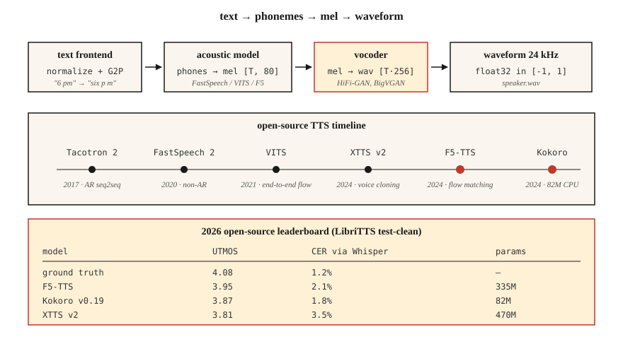

# 文本转语音(TTS)—— 从 Tacotron 到 F5 与 Kokoro

> ASR 把语音逆转成文本,TTS 把文本逆转成语音。2026 年的技术栈分三段:文本 → token,token → mel,mel → 波形。每一段都有一个笔记本就能跑动的默认模型。

**类型:** 动手构建
**编程语言:** Python
**前置要求:** 第 6 阶段 · 02(频谱图与 Mel)、第 5 阶段 · 09(Seq2Seq)、第 7 阶段 · 05(完整 Transformer)
**预计耗时:** 约 75 分钟

## 问题

你有一个字符串:"Please remind me to water the plants at 6 pm."你需要一段 3 秒的音频:听起来自然、韵律正确(停顿、重音)、"plants" 的元音发对,并且为了实时语音助手,在 CPU 上 300 ms 内跑完。你还要能换音色、处理语码混输("remind me at 6 pm, daijoubu?"),还不能把人名念砸。

现代 TTS 流水线长这样:

1. **文本前端。** 文本归一化(日期、数字、邮箱),转成音素或子词 token,预测韵律特征。
2. **声学模型。** 文本 → mel 频谱图。Tacotron 2(2017)、FastSpeech 2(2020)、VITS(2021)、F5-TTS(2024)、Kokoro(2024)。
3. **声码器。** Mel → 波形。WaveNet(2016)、WaveRNN、HiFi-GAN(2020)、BigVGAN(2022)、2024+ 的神经编解码声码器。

2026 年,端到端扩散和流匹配模型让声学模型与声码器的分界变模糊了。但三段式的心智模型在调试时依然好用。

## 概念



**Tacotron 2(2017)。** Seq2seq:字符嵌入 → BiLSTM 编码器 → 位置敏感注意力 → 自回归 LSTM 解码器逐帧输出 mel。慢(自回归),长文本上不稳。仍被引为基线。

**FastSpeech 2(2020)。** 非自回归。时长预测器输出每个音素占多少帧 mel。一次前向,比 Tacotron 快 10 倍。自然度略有损失(单调对齐),但到处都在用。

**VITS(2021)。** 用变分推断把编码器 + 基于流的时长模型 + HiFi-GAN 声码器端到端联合训练。质量高,单一模型。2022–2024 年开源 TTS 的主流。变体:YourTTS(多说话人零样本)、XTTS v2(2024,Coqui)。

**F5-TTS(2024)。** 流匹配上的扩散 Transformer。韵律自然,5 秒参考音频即可零样本克隆音色。2026 年开源 TTS 排行榜榜首。3.35 亿参数。

**Kokoro(2024)。** 小(82M),CPU 能跑,实时场景最好的英语 TTS。闭词表、仅英语,Apache-2.0 协议。

**OpenAI TTS-1-HD、ElevenLabs v2.5、Google Chirp-3。** 商业 SOTA。ElevenLabs v2.5 的情绪标签("[whispered]""[laughing]")和角色音色统治了 2026 年的有声书制作。

### 声码器演进

| 时代 | 声码器 | 延迟 | 质量 |
|-----|---------|---------|---------|
| 2016 | WaveNet | 只能离线 | 发布时 SOTA |
| 2018 | WaveRNN | ~实时 | 好 |
| 2020 | HiFi-GAN | 100× 实时 | 接近真人 |
| 2022 | BigVGAN | 50× 实时 | 跨说话人/语言泛化 |
| 2024 | SNAC、DAC(神经编解码) | 与自回归模型集成 | 离散 token,省比特 |

到 2026 年,大多数"TTS"模型已经从文本到波形端到端,mel 频谱图只是内部表示。

### 评测

- **MOS(平均意见分)。** 1–5 分制,众包打分。仍是金标准,但慢得痛苦。
- **CMOS(比较 MOS)。** A/B 偏好。同样标注量下置信区间更紧。
- **UTMOS、DNSMOS。** 无参考的神经 MOS 预测器。排行榜在用。
- **经 ASR 的 CER(字符错误率)。** 把 TTS 输出过一遍 Whisper,与输入文本算 CER。可懂度的代理指标。
- **SECS(说话人嵌入余弦相似度)。** 语音克隆质量。

LibriTTS test-clean 上的 2026 年数字:

| 模型 | UTMOS | CER(经 Whisper) | 规模 |
|-------|-------|-------------------|------|
| 真实人声 | 4.08 | 1.2% | — |
| F5-TTS | 3.95 | 2.1% | 335M |
| XTTS v2 | 3.81 | 3.5% | 470M |
| VITS | 3.62 | 3.1% | 25M |
| Kokoro v0.19 | 3.87 | 1.8% | 82M |
| Parler-TTS Large | 3.76 | 2.8% | 2.3B |

```figure
sp-tts-stack
```

## 动手构建

### 第 1 步:音素化输入

```python
from phonemizer import phonemize
ph = phonemize("Hello world", language="en-us", backend="espeak")
# 'həloʊ wɜːld'
```

音素是通用桥梁。低于 VITS 级别质量的模型,都不要喂原始文本。

### 第 2 步:跑 Kokoro(2026 年 CPU 默认)

```python
from kokoro import KPipeline
tts = KPipeline(lang_code="a")  # "a" = American English
audio, sr = tts("Please remind me to water the plants at 6 pm.", voice="af_bella")
# audio: float32 tensor, sr=24000
```

离线运行,单文件,82M 参数。

### 第 3 步:用 F5-TTS 做语音克隆

```python
from f5_tts.api import F5TTS
tts = F5TTS()
wav = tts.infer(
    ref_file="my_voice_5s.wav",
    ref_text="The quick brown fox jumps over the lazy dog.",
    gen_text="Please remind me to water the plants.",
)
```

传入 5 秒参考音频及其转写,F5 就能克隆韵律和音色。

### 第 4 步:从零写 HiFi-GAN 声码器

完整代码放不进教程脚本,但结构是这样:

```python
class HiFiGAN(nn.Module):
    def __init__(self, mel_channels=80, upsample_rates=[8, 8, 2, 2]):
        super().__init__()
        # 4 upsample blocks, total 256x to go from mel-rate to audio-rate
        ...
    def forward(self, mel):
        return self.blocks(mel)  # -> waveform
```

训练:对抗损失(短窗判别器)+ mel 频谱图重构损失 + 特征匹配损失。已经商品化——直接用 `hifi-gan` 仓库或 nvidia-NeMo 的预训练检查点。

### 第 5 步:完整流水线(伪代码)

```python
text = "Please remind me at 6 pm."
phones = phonemize(text)
mel = acoustic_model(phones, speaker=alice)      # [T, 80]
wav = vocoder(mel)                                # [T * 256]
soundfile.write("out.wav", wav, 24000)
```

## 投入使用

2026 年的技术栈:

| 场景 | 选择 |
|-----------|------|
| 实时英语语音助手 | Kokoro(CPU)或 XTTS v2(GPU) |
| 5 秒参考音频克隆 | F5-TTS |
| 商业角色音色 | ElevenLabs v2.5 |
| 有声书旁白 | ElevenLabs v2.5 或 XTTS v2 + 微调 |
| 低资源语言 | 用 5–20 小时目标语言数据训练 VITS |
| 表现力 / 情绪标签 | ElevenLabs v2.5 或微调 StyleTTS 2 |

截至 2026 年的开源领跑者:**要质量选 F5-TTS,要效率选 Kokoro**。除非你是做历史研究,否则别碰 Tacotron。

## 常见坑

- **不做文本归一化。** "Dr. Smith" 念成 "Doctor" 还是 "Drive"?"2026" 念 "twenty twenty six" 还是 "two zero two six"?在音素化*之前*归一化。
- **词表外专有名词。** "Ghumare" 会念成 "ghyu-mair" 吗?给未知 token 配一个字素-音素回退模型。
- **削波。** 声码器输出很少削波,但推理时 mel 缩放不匹配会冲出 ±1.0。永远 `np.clip(wav, -1, 1)`。
- **采样率不匹配。** Kokoro 输出 24 kHz,你的下游期望 16 kHz → 要么重采样,要么收获混叠。

## 交付

保存为 `outputs/skill-tts-designer.md`。针对给定的音色、延迟和语言目标,设计一条 TTS 流水线。

## 练习

1. **简单。** 运行 `code/main.py`。它从玩具词表构建音素词典,估计每个音素的时长,打印一份假"mel"时刻表。
2. **中等。** 安装 Kokoro,用音色 `af_bella` 和 `am_adam` 合成同一句话。对比音频时长和主观质量。
3. **困难。** 录一段 5 秒的本人参考音频,用 F5-TTS 克隆。报告参考音频与克隆输出之间的 SECS。

## 关键术语

| 术语 | 大家口头的说法 | 实际含义 |
|------|-----------------|-----------------------|
| 音素(Phoneme) | 声音单位 | 抽象的音类;英语有 39 个(ARPABet)。 |
| 时长预测器 | 每个音素念多久 | 非自回归模型的输出;每个音素的整数帧数。 |
| 声码器(Vocoder) | Mel → 波形 | 把 mel 频谱图映射到原始采样点的神经网络。 |
| HiFi-GAN | 标准声码器 | 基于 GAN;2020–2024 年占主导。 |
| MOS | 主观质量分 | 人工打分的 1–5 平均意见分。 |
| SECS | 语音克隆指标 | 目标与输出说话人嵌入之间的余弦相似度。 |
| F5-TTS | 2024 开源 SOTA | 流匹配扩散;零样本克隆。 |
| Kokoro | CPU 英语领跑者 | 82M 参数模型,Apache 2.0。 |

## 延伸阅读

- [Shen et al. (2017). Tacotron 2](https://arxiv.org/abs/1712.05884) — seq2seq 基线。
- [Kim, Kong, Son (2021). VITS](https://arxiv.org/abs/2106.06103) — 基于流的端到端。
- [Chen et al. (2024). F5-TTS](https://arxiv.org/abs/2410.06885) — 当前开源 SOTA。
- [Kong, Kim, Bae (2020). HiFi-GAN](https://arxiv.org/abs/2010.05646) — 2026 年仍在上线的声码器。
- [Kokoro-82M on HuggingFace](https://huggingface.co/hexgrad/Kokoro-82M) — 2024 年 CPU 友好的英语 TTS。
