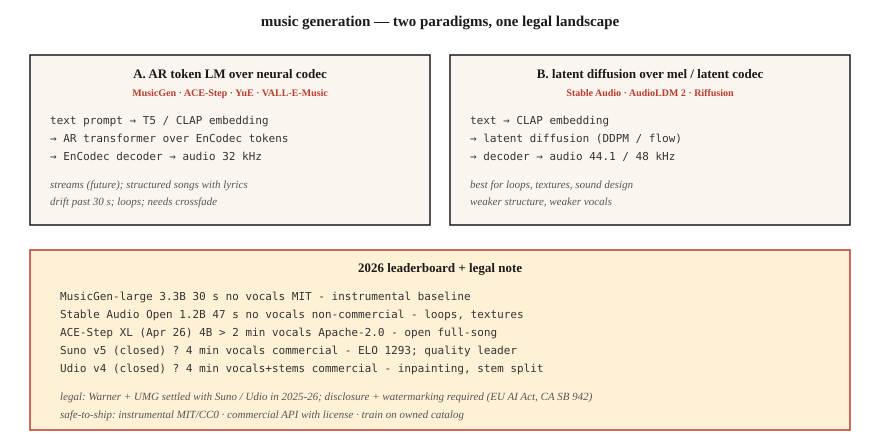

# 音乐生成 —— MusicGen、Stable Audio、Suno 与授权地震

> 2026 年的音乐生成:商业端 Suno v5 与 Udio v4 双雄称霸,开源端 MusicGen、Stable Audio Open 与 ACE-Step 领跑。技术问题基本解决了,法律问题(华纳音乐 5 亿美元和解、环球音乐和解)在 2025-2026 年重塑了整个领域。

**类型:** 动手构建
**编程语言:** Python
**前置要求:** 第 6 阶段 · 02(频谱图)、第 4 阶段 · 10(扩散模型)
**预计耗时:** 约 75 分钟

## 问题

文本 → 一段 30 秒到 4 分钟的音乐,带歌词、人声和结构。三个子问题:

1. **器乐生成。** "带温暖键盘的 lo-fi 嘻哈鼓点"这样的文本 → 音频。MusicGen、Stable Audio、AudioLDM。
2. **歌曲生成(带人声 + 歌词)。** "一首关于德州雨夜的乡村歌曲" → 完整歌曲。Suno、Udio、YuE、ACE-Step。
3. **条件式 / 可控生成。** 续写已有片段、重生成间奏、换曲风、分轨分离或局部重绘。Udio 的局部重绘 + 分轨分离是 2026 年各家追赶的功能。

## 概念



### 神经编解码 token 上的语言模型

Meta 的 **MusicGen**(2023,MIT)及众多衍生:以文本/旋律嵌入为条件,自回归预测 EnCodec token(32 kHz,4 个码本),再用 EnCodec 解码。3 亿 - 33 亿参数。强力基线;超过 30 秒就吃力。

**ACE-Step**(开源,4B XL 于 2026 年 4 月发布)把这条路扩展到歌词条件的完整歌曲生成。开源社区最接近 Suno 的东西。

### mel 或潜空间上的扩散

**Stable Audio(2023)** 与 **Stable Audio Open(2024)**:压缩音频上的潜空间扩散。擅长循环乐段、音效设计、氛围铺底。结构完整的歌曲不是强项。

**AudioLDM / AudioLDM2**:T2I 风格的潜空间扩散做文本到音频,推广到音乐、音效、语音。

### 混合架构(生产级)—— Suno、Udio、Lyria

闭源权重。大概率是自回归编解码 LM + 基于扩散的声码器,配专门的人声/鼓/旋律头。Suno v5(2026)以 ELO 1293 领跑质量榜。Udio v4 增加了局部重绘 + 分轨分离(贝斯、鼓、人声可分别下载)。

### 评测

- **FAD(Fréchet 音频距离)。** 用 VGGish 或 PANNs 特征,计算生成音频与真实音频分布在嵌入层面的距离。越低越好。MusicGen small 在 MusicCaps 上 FAD 为 4.5;SOTA 约 3.0。
- **音乐性(主观)。** 人类偏好。Suno v5 以 ELO 1293 领先。
- **文本-音频对齐。** 提示词与输出之间的 CLAP 分数。
- **音乐性瑕疵。** 节拍错位的过渡、人声乐句漂移、30 秒后结构涣散。

## 2026 年模型地图

| 模型 | 参数量 | 时长 | 人声 | 协议 |
|-------|--------|--------|--------|---------|
| MusicGen-large | 3.3B | 30 s | 无 | MIT |
| Stable Audio Open | 1.2B | 47 s | 无 | Stability 非商业 |
| ACE-Step XL(2026 年 4 月) | 4B | &gt; 2 min | 有 | Apache-2.0 |
| YuE | 7B | &gt; 2 min | 有,多语言 | Apache-2.0 |
| Suno v5(闭源) | ? | 4 min | 有,ELO 1293 | 商业 |
| Udio v4(闭源) | ? | 4 min | 有 + 分轨 | 商业 |
| Google Lyria 3(闭源) | ? | 实时 | 有 | 商业 |
| MiniMax Music 2.5 | ? | 4 min | 有 | 商业 API |

## 法律版图(2025-2026)

- **华纳音乐诉 Suno 和解。** 5 亿美元。华纳现在对 Suno 上的 AI 肖像、音乐版权和用户生成曲目拥有监督权。Udio 与环球音乐也有类似和解。
- **欧盟《AI 法案》** + **加州 SB 942**:AI 生成音乐必须披露。
- **Riffusion / MusicGen** 采用 MIT 协议,没有合规包袱,但也没有可商用的人声。

安全的交付模式:

1. 只生成器乐(MusicGen、Stable Audio Open,MIT/CC0 输出)。
2. 用商业 API(Suno、Udio、ElevenLabs Music),按生成次数授权。
3. 在自有或已授权的曲库上训练(大多数企业最终走到这步)。
4. 给生成物加水印 + 元数据标签。

```figure
sp-codec-tokens
```

## 动手构建

### 第 1 步:用 MusicGen 生成

```python
from audiocraft.models import MusicGen
import torchaudio

model = MusicGen.get_pretrained("facebook/musicgen-small")
model.set_generation_params(duration=10)
wav = model.generate(["upbeat synthwave with driving drums, 128 BPM"])
torchaudio.save("out.wav", wav[0].cpu(), 32000)
```

三个尺寸:`small`(300M,快)、`medium`(1.5B)、`large`(3.3B)。验证"想法能不能落地",small 就够。

### 第 2 步:旋律条件

```python
melody, sr = torchaudio.load("humming.wav")
wav = model.generate_with_chroma(
    ["jazz piano cover"],
    melody.squeeze(),
    sr,
)
```

MusicGen-melody 接收色度图(chromagram),保住曲调、更换音色。适合"把这段旋律给我做成弦乐四重奏"。

### 第 3 步:FAD 评测

```python
from frechet_audio_distance import FrechetAudioDistance
fad = FrechetAudioDistance()

fad.get_fad_score("generated_folder/", "reference_folder/")
```

计算 VGGish 嵌入距离。适合做曲风级的回归测试;替代不了真人听众。

### 第 4 步:接入 LLM-音乐工作流

与第 7-8 课的想法结合:

```python
prompt = "Write a 30-second jazz loop. Describe the drums, bass, and piano voicing."
description = llm.complete(prompt)
music = musicgen.generate([description], duration=30)
```

## 投入使用

| 目标 | 技术栈 |
|------|-------|
| 器乐音效设计 | Stable Audio Open |
| 游戏 / 自适应音乐 | Google Lyria RealTime(闭源) |
| 带人声完整歌曲(商业) | Suno v5 或 Udio v4,明确授权 |
| 带人声完整歌曲(开源) | ACE-Step XL 或 YuE |
| 广告短配乐 | MusicGen 旋律条件,喂一段哼唱参考 |
| 音乐视频背景 | MusicGen + Stable Video Diffusion |

## 2026 年仍然在上线的坑

- **洗版权的提示词。** "来一首 Taylor Swift 风格的歌"——商业的 Suno/Udio 现在会过滤这类提示,开源模型不会。自己加过滤清单。
- **30 秒后重复 / 漂移。** 自回归模型会绕圈。多段生成做交叉淡化,或用 ACE-Step 保证结构连贯。
- **速度漂移。** 模型会偏离 BPM。提示词里带上 BPM 标签,事后用 librosa 的 `beat_track` 过滤。
- **人声可懂度。** Suno 很出色;开源模型的吐字常常含糊。歌词重要就用商业 API 或微调。
- **单声道输出。** 开源模型生成单声道或假立体声。用正经的立体声重建升级(ezst、Cartesia 的立体声扩散)。

## 交付

保存为 `outputs/skill-music-designer.md`。针对音乐生成部署,选定模型、授权策略、时长/结构方案和披露元数据。

## 练习

1. **简单。** 运行 `code/main.py`。它以 ASCII 符号产出一段"生成式"和弦进行 + 鼓点型——音乐生成的卡通版。想听的话可以用任何 MIDI 渲染器播放。
2. **中等。** 安装 `audiocraft`,用 MusicGen-small 按 4 个曲风提示各生成 10 秒,对参考曲风集测 FAD。
3. **困难。** 用 ACE-Step(或 MusicGen-melody),为同一曲调以不同音色提示生成三个变体。计算与提示词的 CLAP 相似度,验证对齐程度。

## 关键术语

| 术语 | 大家口头的说法 | 实际含义 |
|------|-----------------|-----------------------|
| FAD | 音频版 FID | 真实与生成的嵌入分布之间的 Fréchet 距离。 |
| 色度图(Chromagram) | 音高形式的旋律 | 逐帧 12 维向量;旋律条件的输入。 |
| 分轨(Stems) | 乐器轨道 | 分离出的贝斯/鼓/人声/旋律 WAV。 |
| 局部重绘(Inpainting) | 重生成一段 | 遮住一个时间窗;模型只重生成那一段。 |
| CLAP | 文本-音频版 CLIP | 对比式音频-文本嵌入;评测文音对齐。 |
| EnCodec | 音乐编解码器 | Meta 的神经编解码器,MusicGen 在用;32 kHz,4 个码本。 |

## 延伸阅读

- [Copet et al. (2023). MusicGen](https://arxiv.org/abs/2306.05284) — 开源自回归基准。
- [Evans et al. (2024). Stable Audio Open](https://arxiv.org/abs/2407.14358) — 音效设计的默认选择。
- [ACE-Step](https://github.com/ace-step/ACE-Step) — 开源 4B 完整歌曲生成器,2026 年 4 月。
- [Suno v5 platform docs](https://suno.com) — 商业质量领跑者。
- [AudioLDM2](https://arxiv.org/abs/2308.05734) — 音乐 + 音效的潜空间扩散。
- [WMG-Suno settlement coverage](https://www.musicbusinessworldwide.com/suno-warner-music-settlement/) — 2025 年 11 月的先例。
