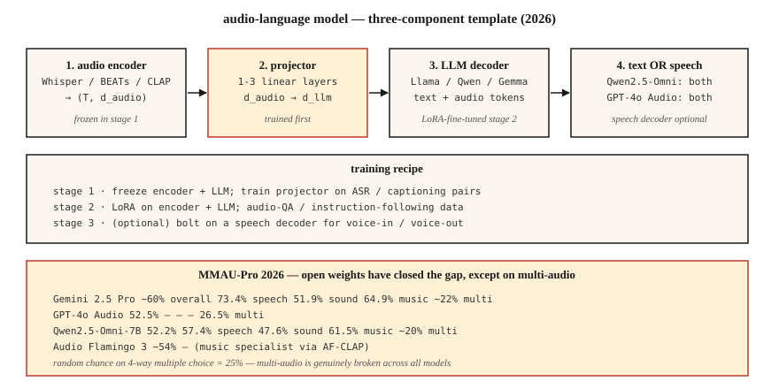

# 音频-语言模型 —— Qwen2.5-Omni、Audio Flamingo、GPT-4o Audio

> 2026 年的音频-语言模型能对语音 + 环境音 + 音乐做推理。Qwen2.5-Omni-7B 在 MMAU-Pro 上追平 GPT-4o Audio,Audio Flamingo Next 在 LongAudioBench 上击败 Gemini 2.5 Pro。开源与闭源的差距基本抹平——除了多音频任务,所有模型在那里都接近随机水平。

**类型:** 学习
**编程语言:** Python
**前置要求:** 第 6 阶段 · 04(ASR)、第 12 阶段 · 03(视觉-语言模型)、第 7 阶段 · 10(音频 Transformer)
**预计耗时:** 约 45 分钟

## 问题

你有 5 秒音频:狗叫,有人喊"停下!",然后安静了。有价值的问题横跨多个轴:

- **转写。** "说了什么?"——ASR 的地盘。
- **语义推理。** "这个人有危险吗?"——需要对狗叫 + 喊声 + 沉默的联合理解。
- **音乐推理。** "旋律是哪些乐器奏的?"
- **长音频检索。** "这段 90 分钟的讲座里,讲师在哪一段讲了梯度下降?"

一个模型、一个提示词答出所有这些问题,就是**音频-语言模型**(LALM / ALM)。它与纯 ASR 不同:LALM 产出自由形式的自然语言答案,不只是转写稿。

## 概念



### 三组件模板

每个 2026 年的 LALM 都是同一副骨架:

1. **音频编码器。** Whisper 编码器、BEATs、CLAP、WavLM,或各模型自研编码器。
2. **投影器。** 线性层或 MLP,把音频编码器特征桥接到 LLM 的 token 嵌入空间。
3. **LLM。** 基于 Llama / Qwen / Gemma 的解码器。接收文本与音频交错的 token,生成文本。

训练:

- **第 1 阶段。** 冻结编码器 + LLM,只在 ASR / 音频描述数据上训练投影器。
- **第 2 阶段。** 在指令跟随型音频任务(问答、推理、音乐理解)上做全量 / LoRA 微调。
- **第 3 阶段(可选)。** 语音进 / 语音出,再加一个语音解码器。Qwen2.5-Omni 和 AF3-Chat 就是这么做的。

### 2026 年模型地图

| 模型 | 骨干 | 音频编码器 | 输出模态 | 获取方式 |
|-------|----------|---------------|-----------------|--------|
| Qwen2.5-Omni-7B | Qwen2.5-7B | 自研 + Whisper | 文本 + 语音 | Apache-2.0 |
| Qwen3-Omni | Qwen3 | 自研 | 文本 + 语音 | Apache-2.0 |
| Audio Flamingo 3 | Qwen2 | AF-CLAP | 文本 | NVIDIA 非商业 |
| Audio Flamingo Next | Qwen2 | AF-CLAP v2 | 文本 | NVIDIA 非商业 |
| SALMONN | Vicuna | Whisper + BEATs | 文本 | Apache-2.0 |
| LTU / LTU-AS | Llama | CAV-MAE | 文本 | Apache-2.0 |
| GAMA | Llama | AST + Q-Former | 文本 | Apache-2.0 |
| Gemini 2.5 Flash/Pro(闭源) | Gemini | 专有 | 文本 + 语音 | API |
| GPT-4o Audio(闭源) | GPT-4o | 专有 | 文本 + 语音 | API |

### 基准的现实检验(2026)

**MMAU-Pro。** 1800 组问答,覆盖语音 / 环境音 / 音乐 / 混合,含多音频子集。

| 模型 | 总分 | 语音 | 环境音 | 音乐 | 多音频 |
|-------|---------|--------|-------|-------|-------------|
| Gemini 2.5 Pro | ~60% | 73.4% | 51.9% | 64.9% | ~22% |
| Gemini 2.5 Flash | ~57% | 73.4% | 50.5% | 64.9% | 21.2% |
| GPT-4o Audio | 52.5% | — | — | — | 26.5% |
| Qwen2.5-Omni-7B | 52.2% | 57.4% | 47.6% | 61.5% | ~20% |
| Audio Flamingo 3 | ~54% | — | — | — | — |
| Audio Flamingo Next | LongAudioBench SOTA | — | — | — | — |

**多音频这一列对所有模型都是打脸。** 四选一的随机基线是 25%,大多数模型就在那附近。LALM 比较两段音频的能力依然很弱。

### 2026 年 LALM 的适用场景

- **呼叫中心录音合规审计。** "坐席有没有提到规定要披露的条款?"
- **无障碍。** 为听障用户描述声音事件(不只是转写)。
- **内容审核。** 检测暴力语言 + 威胁语气 + 背景语境。
- **播客 / 会议章节化。** 语义摘要,而不只是说话人轮换。
- **音乐曲库分析。** "找出所有 B 段有转调的曲目。"

### 还不适用的场景

- 细粒度乐理(和弦级以下)。
- 长对话中的说话人归因推理(超过 10 分钟就退化)。
- 多音频比较(22-26%,只比随机高一点)。
- 实时流式推理(大多是离线批量推理)。

```figure
v4-alm-tokens
```

## 动手构建

### 第 1 步:查询 Qwen2.5-Omni

```python
from transformers import AutoModelForCausalLM, AutoProcessor

processor = AutoProcessor.from_pretrained("Qwen/Qwen2.5-Omni-7B")
model = AutoModelForCausalLM.from_pretrained("Qwen/Qwen2.5-Omni-7B", torch_dtype="auto")

audio, sr = load_wav("clip.wav", sr=16000)
messages = [{
    "role": "user",
    "content": [
        {"type": "audio", "audio": audio},
        {"type": "text", "text": "What sounds do you hear, and what's happening?"},
    ],
}]
inputs = processor.apply_chat_template(messages, tokenize=True, return_tensors="pt")
output = model.generate(**inputs, max_new_tokens=200)
print(processor.decode(output[0], skip_special_tokens=True))
```

### 第 2 步:投影器模式

```python
import torch.nn as nn

class AudioProjector(nn.Module):
    def __init__(self, audio_dim=1280, llm_dim=4096):
        super().__init__()
        self.down = nn.Linear(audio_dim, llm_dim)
        self.act = nn.GELU()
        self.up = nn.Linear(llm_dim, llm_dim)

    def forward(self, audio_features):
        return self.up(self.act(self.down(audio_features)))
```

就这些。投影器通常就是 1-3 个线性层。在 ASR 对(音频 → 转写)上训练它,就是第 1 阶段的代理任务。

### 第 3 步:跑 MMAU / LongAudioBench 基准

```python
from datasets import load_dataset
mmau = load_dataset("MMAU/MMAU-Pro")

correct = 0
for item in mmau["test"]:
    answer = call_model(item["audio"], item["question"], item["choices"])
    if answer == item["correct_choice"]:
        correct += 1
print(f"Accuracy: {correct / len(mmau['test']):.3f}")
```

按类别(语音 / 环境音 / 音乐 / 多音频)分别报告。汇总会掩盖模型在哪里翻车。

## 投入使用

| 任务 | 2026 年选择 |
|------|-----------|
| 自由形式音频问答(开源) | Qwen2.5-Omni-7B |
| 长音频最强开源 | Audio Flamingo Next |
| 最强闭源 | Gemini 2.5 Pro |
| 语音进/出的智能体 | Qwen2.5-Omni 或 GPT-4o Audio |
| 音乐推理 | Audio Flamingo 3 或 2(音乐专用 AF-CLAP) |
| 呼叫中心审计 | Gemini 2.5 Pro API,配政策文档 RAG |

## 常见坑

- **盲信多音频能力。** 如果你的任务需要"哪段音频有 X",随机水平的表现是真实存在的。
- **长音频退化。** 超过 10 分钟,大多数模型的说话人归因会崩。先做说话人日志(第 6 课),再做摘要。
- **静音幻觉。** 凡是用了 Whisper 编码器的 LALM,都继承了 Whisper 的老毛病。用 VAD 门控。
- **基准挑樱桃。** 厂商博客只展示最好看的类别。多音频子集自己跑一遍 MMAU-Pro。

## 交付

保存为 `outputs/skill-alm-picker.md`。针对给定的音频理解任务,选定 LALM + 基准子集 + 输出模态(文本 vs 语音)。

## 练习

1. **简单。** 运行 `code/main.py`,看一个玩具投影器模式 + 假 LALM 如何把(音频嵌入, 文本 token)路由到输出 token。
2. **中等。** 在 100 条 MMAU-Pro 语音题上给 Qwen2.5-Omni-7B 打分,与论文报告的数字对比。
3. **困难。** 搭一个最小的音频描述基线:BEATs 编码器 + 2 层投影器 + 冻结的 Llama-3.2-1B。只在 AudioCaps 上微调投影器,在 Clotho-AQA 上与 SALMONN 对比。

## 关键术语

| 术语 | 大家口头的说法 | 实际含义 |
|------|-----------------|-----------------------|
| LALM | 音频版 ChatGPT | 音频编码器 + 投影器 + LLM 解码器。 |
| 投影器(Projector) | 适配器 | 把音频特征映射进 LLM 嵌入空间的小 MLP。 |
| MMAU | 那个基准 | 横跨语音、环境音、音乐的 1 万组音频问答。 |
| MMAU-Pro | 更难的 MMAU | 1800 道多音频 / 重推理的问题。 |
| LongAudioBench | 长音频评测 | 多分钟音频配语义查询。 |
| 语音进/语音出 | 语音原生 | 模型直接吃进语音、吐出语音,不绕文本。 |

## 延伸阅读

- [Chu et al. (2024). Qwen2-Audio](https://arxiv.org/abs/2407.10759) — 参考架构。
- [Alibaba (2025). Qwen2.5-Omni](https://huggingface.co/Qwen/Qwen2.5-Omni-7B) — 语音进语音出。
- [NVIDIA (2025). Audio Flamingo 3](https://arxiv.org/abs/2507.08128) — 开源长音频领跑者。
- [NVIDIA (2026). Audio Flamingo Next](https://arxiv.org/abs/2604.10905) — LongAudioBench SOTA。
- [Tang et al. (2023). SALMONN](https://arxiv.org/abs/2310.13289) — 双编码器先驱。
- [MMAU-Pro leaderboard](https://mmaubenchmark.github.io/) — 2026 年实时排行。
