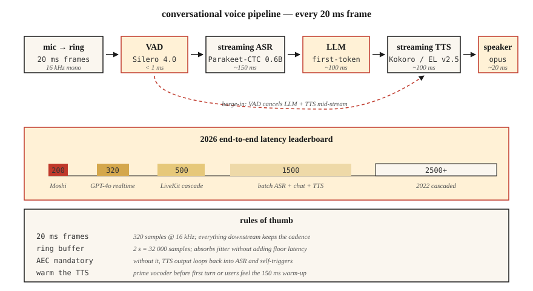

# 实时音频处理

> 批量流水线处理的是一个文件,实时流水线处理的是下 20 毫秒——在再下 20 毫秒到来之前。每个对话式 AI、广播直播间和电话机器人,生死都系于这份延迟预算。

**类型:** 动手构建
**编程语言:** Python
**前置要求:** 第 6 阶段 · 02(频谱图)、第 6 阶段 · 04(ASR)、第 6 阶段 · 07(TTS)
**预计耗时:** 约 75 分钟

## 问题

你想要一个有"活着"感觉的语音助手。人类对话的轮换延迟约 230 ms(静音到回应)。超过 500 ms 就显得机械,超过 1500 ms 就像坏了。2026 年,完整的**听 → 理解 → 回应 → 说**循环预算是:

| 阶段 | 预算 |
|-------|--------|
| 麦克风 → 缓冲 | 20 ms |
| VAD | 10 ms |
| ASR(流式) | 150 ms |
| LLM(首 token) | 100 ms |
| TTS(首个音频块) | 100 ms |
| 渲染 → 扬声器 | 20 ms |
| **总计** | **约 400 ms** |

Moshi(Kyutai,2024)做到了 200 ms 全双工;GPT-4o-realtime(2024)约 320 ms。而 2022 年的级联流水线是 2500 ms。10 倍的提升来自三项技术:(1) 全链路流式,(2) 带中间结果的异步流水线,(3) 可打断的生成。

## 概念



**帧 / 块 / 窗。** 实时音频以固定大小的块流动。常用 20 ms(16 kHz 下 320 个采样点)。下游的一切都必须跟上这个节奏。

**环形缓冲区。** 定长循环缓冲区。生产者线程写入新帧,消费者线程读取。避免在热路径上分配内存。大小 ≈ 最大延迟 × 采样率;2 秒、16 kHz 的环 = 32000 个采样点。

**VAD(语音活动检测)。** 没人说话时,把下游工作闸住。Silero VAD 4.0(2024)在 CPU 上处理 30 ms 一帧不到 1 ms。`webrtcvad` 是更早的选择。

**流式 ASR。** 音频到达时就吐出部分转写的模型。流式模式的 Parakeet-CTC-0.6B(NeMo,2024)在 320 ms 延迟下 WER 2–5%。Whisper-Streaming(Macháček 等,2023)把 Whisper 分块做到约 2 s 延迟的准流式。

**打断。** 用户在助手说话时开口,你必须 (a) 检测到插入,(b) 停掉 TTS,(c) 丢弃剩余的 LLM 输出。全程 100 ms 内完成,否则用户会觉得助手聋了。

**WebRTC Opus 传输。** 20 ms 帧、48 kHz、自适应码率 8–128 kbps。浏览器和移动端的标准。LiveKit、Daily.co、Pion 是 2026 年搭建语音应用的技术栈。

**抖动缓冲。** 网络包乱序、迟到。抖动缓冲负责重排和平滑;太小会有可闻的断顿,太大增加延迟。典型 60–80 ms。

### 常见坑

- **线程争抢。** Python 的 GIL + 重模型会饿死音频线程。用 C 回调的音频库(sounddevice、PortAudio),让 Python 远离热路径。
- **采样率转换延迟。** 流水线内部重采样增加 5–20 ms。要么提前重采样好,要么用零延迟重采样器(PolyPhase、`soxr_hq`)。
- **TTS 预热。** 即使 Kokoro 这样快的 TTS,首次请求也有 100–200 ms 预热。缓存模型,在第一个真实回合前用假请求热一遍。
- **回声消除。** 没有 AEC,TTS 的输出会回到麦克风,触发 ASR 转写机器人自己的声音。WebRTC AEC3 是开源默认。

```figure
nyquist-aliasing
```

## 动手构建

### 第 1 步:环形缓冲区

```python
import collections

class RingBuffer:
    def __init__(self, capacity):
        self.buf = collections.deque(maxlen=capacity)
    def write(self, frame):
        self.buf.extend(frame)
    def read(self, n):
        return [self.buf.popleft() for _ in range(min(n, len(self.buf)))]
    def level(self):
        return len(self.buf)
```

容量决定最大缓冲延迟。16 kHz 下 32000 个采样点 = 2 s。

### 第 2 步:VAD 门

```python
def simple_energy_vad(frame, threshold=0.01):
    return sum(x * x for x in frame) / len(frame) > threshold ** 2
```

生产环境换成 Silero VAD:

```python
import torch
vad, _ = torch.hub.load("snakers4/silero-vad", "silero_vad")
is_speech = vad(torch.tensor(frame), 16000).item() > 0.5
```

### 第 3 步:流式 ASR

```python
# Parakeet-CTC-0.6B streaming via NeMo
from nemo.collections.asr.models import EncDecCTCModelBPE
asr = EncDecCTCModelBPE.from_pretrained("nvidia/parakeet-ctc-0.6b")
# chunk_ms=320 ms, look_ahead_ms=80 ms
for chunk in audio_stream():
    partial_text = asr.transcribe_streaming(chunk)
    print(partial_text, end="\r")
```

### 第 4 步:打断处理器

```python
class Dialog:
    def __init__(self):
        self.tts_task = None

    def on_user_speech(self, frame):
        if self.tts_task and not self.tts_task.done():
            self.tts_task.cancel()   # barge-in
        # then feed to streaming ASR

    def on_final_user_utterance(self, text):
        self.tts_task = asyncio.create_task(self.reply(text))

    async def reply(self, text):
        async for tts_chunk in llm_then_tts(text):
            speaker.write(tts_chunk)
```

关键在于异步 I/O 和可取消的 TTS 流。对音轨调 WebRTC peerconnection.stop() 是标准做法。

## 投入使用

2026 年的技术栈:

| 层 | 选择 |
|-------|------|
| 传输 | LiveKit(WebRTC)或 Pion(Go) |
| VAD | Silero VAD 4.0 |
| 流式 ASR | Parakeet-CTC-0.6B 或 Whisper-Streaming |
| LLM 首 token | Groq、Cerebras、vLLM-streaming |
| 流式 TTS | Kokoro 或 ElevenLabs Turbo v2.5 |
| 回声消除 | WebRTC AEC3 |
| 端到端原生 | OpenAI Realtime API 或 Moshi |

## 常见坑

- **为保险缓冲 500 ms。** 缓冲区*就是*你的延迟地板。把它缩小。
- **不绑线程。** 音频回调跑在优先级低于 UI 的线程上 = 高负载时破音。
- **TTS 块太小。** 小于 200 ms 的块会让声码器瑕疵变得可闻。320 ms 是甜点。
- **没有抖动缓冲。** 真实网络是抖的;不平滑就会爆音。
- **错误处理只有一次机会。** 音频流水线必须防崩。一个异常就杀死整个会话。

## 交付

保存为 `outputs/skill-realtime-designer.md`。设计一条各阶段延迟预算明确的实时音频流水线。

## 练习

1. **简单。** 运行 `code/main.py`。模拟环形缓冲区 + 能量 VAD;打印一段假 10 秒音频流的各阶段延迟。
2. **中等。** 用 `sounddevice` 搭一个透传循环:以 20 ms 帧处理你的麦克风输入,逐帧打印 VAD 状态。
3. **困难。** 用 `aiortc` 搭一个全双工回声测试:浏览器 → WebRTC → Python → WebRTC → 浏览器。用 1 kHz 脉冲测量 glass-to-glass 延迟。

## 关键术语

| 术语 | 大家口头的说法 | 实际含义 |
|------|-----------------|-----------------------|
| 环形缓冲区 | 循环队列 | 定长、无锁(或单生产单消费加锁)的音频帧 FIFO。 |
| VAD | 静音闸门 | 标记语音/非语音的模型或启发式。 |
| 流式 ASR | 实时语音转文字 | 音频到达时吐出部分文本;前瞻有界。 |
| 抖动缓冲 | 网络平滑器 | 重排乱序包的队列;典型 60–80 ms。 |
| AEC | 回声消除 | 减去扬声器到麦克风的反馈路径。 |
| 打断(Barge-in) | 用户插话 | 系统在 TTS 播放中检测到用户说话;必须取消播放。 |
| 全双工 | 双向同时 | 用户和机器人可以同时说话;Moshi 就是全双工。 |

## 延伸阅读

- [Macháček et al. (2023). Whisper-Streaming](https://arxiv.org/abs/2307.14743) — 分块准流式 Whisper。
- [Kyutai (2024). Moshi](https://kyutai.org/Moshi.pdf) — 200 ms 延迟全双工。
- [LiveKit Agents framework (2024)](https://docs.livekit.io/agents/) — 生产级音频智能体编排。
- [Silero VAD repo](https://github.com/snakers4/silero-vad) — 亚毫秒 VAD,Apache 2.0。
- [WebRTC AEC3 paper](https://webrtc.googlesource.com/src/+/main/modules/audio_processing/aec3/) — 开源回声消除。
