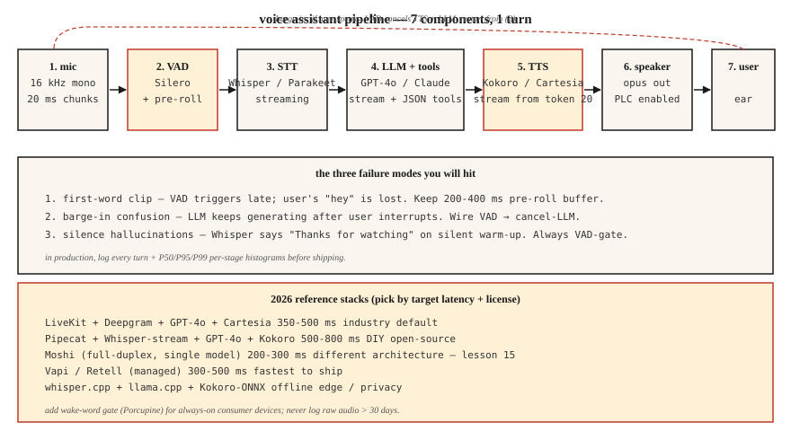

# 构建语音助手流水线 —— 第 6 阶段毕业设计

> 把第 01-11 课的一切缝在一起:构建一个能听、会想、会答的语音助手。2026 年,这是已解决的工程问题,不再是研究问题——但能不能上线,全看集成细节。

**类型:** 动手构建
**编程语言:** Python
**前置要求:** 第 6 阶段 · 04、05、06、07、11;第 11 阶段 · 09(函数调用);第 14 阶段 · 01(智能体循环)
**预计耗时:** 约 120 分钟

## 问题

构建一个端到端助手:

1. 采集麦克风输入(16 kHz 单声道)。
2. 检测用户语音的起止。
3. 流式转写。
4. 把转写交给能调用工具(计时器、天气、日历)的 LLM。
5. 把 LLM 文本流式送进 TTS。
6. 把音频播给用户。
7. 用户在回答中途插话时,立即停止。

延迟目标:笔记本 CPU 上,用户说完最后一字起 800 ms 内产出第一字节 TTS 音频。质量目标:不丢字、静音时不幻觉字幕、不泄漏音色克隆、提示词注入打不穿。

## 概念



### 七个组件

1. **音频采集。** 麦克风 → 16 kHz 单声道 → 20 ms 块。Python 里常用 `sounddevice`,生产环境用原生 AudioUnit/ALSA/WASAPI。
2. **VAD(第 11 课)。** Silero VAD,阈值 0.5,最短语音 250 ms,静音拖尾 500 ms。给出"开始"和"结束"信号。
3. **流式 STT(第 4-5 课)。** Whisper-streaming、Parakeet-TDT 或 Deepgram Nova-3(API)。部分转写 + 最终转写。
4. **带工具调用的 LLM。** GPT-4o / Claude 3.5 / Gemini 2.5 Flash。工具用 JSON schema 定义。流式吐 token。
5. **流式 TTS(第 7 课)。** Kokoro-82M(最快的开源)或 Cartesia Sonic(商业)。LLM 出 20 个 token 后就启动 TTS。
6. **播放。** 扬声器输出;低带宽网络用 opus 编码。
7. **打断处理器。** TTS 播放期间 VAD 触发时,停播放、取消 LLM、重启 STT。

### 你注定会撞上的三种翻车

1. **首词被切。** VAD 启动晚了一拍,用户的"嘿"丢了。启动阈值设 0.3,别用 0.5。
2. **中途打断混乱。** 用户插话后 LLM 还在生成,助手和用户抢话。把 VAD 接到取消 LLM 上。
3. **静音幻觉。** Whisper 在静音的预热帧上输出"感谢观看"。永远 VAD 门控。

### 2026 年生产参考栈

| 技术栈 | 延迟 | 协议 | 备注 |
|-------|---------|---------|-------|
| LiveKit + Deepgram + GPT-4o + Cartesia | 350-500 ms | 商业 API | 2026 行业默认 |
| Pipecat + Whisper-streaming + GPT-4o + Kokoro | 500-800 ms | 基本开源 | DIY 友好 |
| Moshi(全双工) | 200-300 ms | CC-BY 4.0 | 单模型;架构不同,见第 15 课 |
| Vapi / Retell(托管) | 300-500 ms | 商业 | 上线最快;定制受限 |
| Whisper.cpp + llama.cpp + Kokoro-ONNX | 离线 | 开源 | 隐私 / 端侧 |

```figure
v4-voice-latency
```

## 动手构建

### 第 1 步:分块采集麦克风(伪代码)

```python
import sounddevice as sd

def mic_stream(chunk_ms=20, sr=16000):
    q = queue.Queue()
    def cb(indata, frames, time, status):
        q.put(indata.copy().flatten())
    with sd.InputStream(channels=1, samplerate=sr, blocksize=int(sr * chunk_ms/1000), callback=cb):
        while True:
            yield q.get()
```

### 第 2 步:VAD 门控的回合捕获

```python
def capture_turn(stream, vad, pre_roll_ms=300, silence_ms=500):
    buf, pre, triggered = [], collections.deque(maxlen=pre_roll_ms // 20), False
    silent = 0
    for chunk in stream:
        pre.append(chunk)
        if vad(chunk):
            if not triggered:
                buf = list(pre)
                triggered = True
            buf.append(chunk)
            silent = 0
        elif triggered:
            silent += 20
            buf.append(chunk)
            if silent >= silence_ms:
                return b"".join(buf)
```

### 第 3 步:流式 STT → LLM → TTS

```python
async def turn(audio_bytes):
    transcript = await stt.transcribe(audio_bytes)
    async for token in llm.stream(transcript):
        async for audio in tts.stream(token):
            await speaker.play(audio)
```

### 第 4 步:LLM 循环内的工具调用

```python
tools = [
    {"name": "get_weather", "parameters": {"location": "string"}},
    {"name": "set_timer", "parameters": {"seconds": "int"}},
]

async for chunk in llm.stream(user_text, tools=tools):
    if chunk.type == "tool_call":
        result = dispatch(chunk.name, chunk.args)
        continue_streaming(result)
    if chunk.type == "text":
        await tts.stream(chunk.text)
```

### 第 5 步:打断处理

```python
tts_task = asyncio.create_task(tts_loop())
while True:
    chunk = await mic.get()
    if vad(chunk):
        tts_task.cancel()
        await speaker.stop()
        await new_turn()
        break
```

## 投入使用

`code/main.py` 里有一个可运行的模拟,用桩模型把七个组件全部接起来——没有硬件也能看清流水线的形状。真实实现时,把桩换成:

- `silero-vad`(`pip install silero-vad`)
- `deepgram-sdk` 或 `openai-whisper`
- `openai`(`gpt-4o`)或 `anthropic`
- `kokoro` 或 `cartesia`
- `sounddevice` 做 I/O

## 常见坑

- **永久留存 PII 日志。** 在多数司法辖区,完整回合音频属于个人身份信息。保留 30 天,静态加密。
- **不支持打断。** 用户一定会插话。你的助手必须会闭嘴。
- **TTS 阻塞。** 同步 TTS 会卡死事件循环。用异步或独立线程。
- **工具调用没有错误处理。** 工具会挂。LLM 必须拿到错误并重试一次,然后优雅降级。
- **幻觉过滤过度。** 滤太狠,助手只会复读"我帮不了你";滤太松,它什么都敢说。在留出集上校准。
- **没有唤醒词选项。** 永远监听是隐私负债。加一个唤醒词门(Porcupine 或 openWakeWord)。

## 交付

保存为 `outputs/skill-voice-assistant-architect.md`。给定预算 + 规模 + 语言 + 合规约束,产出一份完整的技术栈规格。

## 练习

1. **简单。** 运行 `code/main.py`。它用桩模块端到端模拟一个完整回合,打印各阶段延迟。
2. **中等。** 把 STT 桩换成真实 Whisper 模型,跑一段预录的 `.wav`。测量 WER 和端到端延迟。
3. **困难。** 加工具调用:实现 `get_weather`(任意 API)和 `set_timer`。让 LLM 走工具路由,验证用户说"设个 5 分钟计时器"时,正确的函数被触发,且语音回复确认了这一操作。

## 关键术语

| 术语 | 大家口头的说法 | 实际含义 |
|------|-----------------|-----------------------|
| 回合(Turn) | 一次用户+助手往返 | 一段 VAD 界定的用户语音 + 一次 LLM-TTS 回应。 |
| 打断(Barge-in) | 插话 | 助手说话时用户开口;助手停下。 |
| 唤醒词 | "嘿,助手" | 短关键词检测器;Porcupine、Snowboy、openWakeWord。 |
| 端点判定(End-pointing) | 回合结束 | VAD + 最短静音判定用户已说完。 |
| 预滚(Pre-roll) | 语音前缓冲 | 保留 VAD 触发前 200-400 ms 音频,防止首词被切。 |
| 工具调用 | 函数调用 | LLM 输出 JSON;运行时分发;结果回灌进循环。 |

## 延伸阅读

- [LiveKit — voice agent quickstart](https://docs.livekit.io/agents/) — 生产级参考。
- [Pipecat — voice agent examples](https://github.com/pipecat-ai/pipecat) — DIY 友好的框架。
- [OpenAI Realtime API](https://platform.openai.com/docs/guides/realtime) — 托管的语音原生路线。
- [Kyutai Moshi](https://github.com/kyutai-labs/moshi) — 全双工参考(第 15 课)。
- [Porcupine wake-word](https://picovoice.ai/products/porcupine/) — 唤醒词门控。
- [Anthropic — tool use guide](https://docs.anthropic.com/en/docs/build-with-claude/tool-use) — LLM 函数调用。
