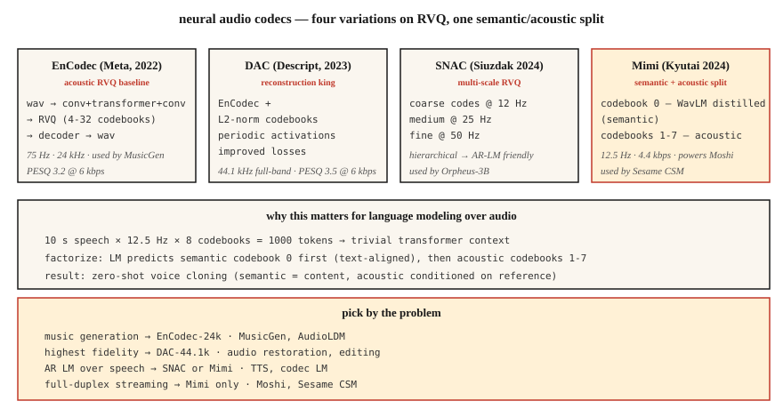

# 神经音频编解码器 —— EnCodec、SNAC、Mimi、DAC 与语义-声学之分

> 2026 年的音频生成几乎全是 token。EnCodec、SNAC、Mimi、DAC 把连续波形变成 Transformer 可以预测的离散序列。语义 token 与声学 token 之分——第 0 码本管语义,其余管声学——是自 Transformer 以来音频领域最重要的架构变革。

**类型:** 学习
**编程语言:** Python
**前置要求:** 第 6 阶段 · 02(频谱图)、第 10 阶段 · 11(量化)、第 5 阶段 · 19(子词分词)
**预计耗时:** 约 60 分钟

## 问题

语言模型处理离散 token,音频是连续的。想要一个 LLM 风格的语音/音乐模型——MusicGen、Moshi、Sesame CSM、VibeVoice、Orpheus——你首先需要一个**神经音频编解码器**:一个把音频离散成小词表 token 的学习型编码器,加一个能重建波形的配套解码器。

已经分化出两个家族:

1. **重建优先的编解码器** —— EnCodec、DAC。优化感知音质。token 是"声学"的——它们捕获一切,包括说话人身份、音色、背景噪声。
2. **语义优先的编解码器** —— Mimi(Kyutai)、SpeechTokenizer。强制第 0 码本编码语言/语音内容(通常用 WavLM 蒸馏实现),后续码本装声学细节。

2024-2026 年的关键洞察:**纯重建型编解码器,拿来做文本生成语音时会糊**。编解码 token 上的 LLM 要在同一个码本里同时学语言结构和声学结构,这不可扩展。把它们分开——第 0 码本管语义,第 1-N 码本管声学——才是 Moshi 和 Sesame CSM 得以成立的原因。

## 概念



### 核心技巧:残差向量量化(RVQ)

不用一个巨型码本(要好音质就得要几百万个码字),所有现代音频编解码器都用 **RVQ**:一串小码本级联。第一个码本量化编码器输出,第二个量化残差,依此类推。每个码本 1024 个码字。8 个码本 = 等效词表 1024^8 = 10^24。

推理时,解码器把每帧选中的码字求和来重建。

### 2026 年举足轻重的四个编解码器

**EnCodec(Meta,2022)。** 基线。波形上的编码器-解码器,RVQ 瓶颈。24 kHz,最多 32 个码本,默认 4 个码本 @ 1.5 kbps。架构为 `1D 卷积 + Transformer + 1D 卷积`。MusicGen 在用。

**DAC(Descript,2023)。** RVQ 配 L2 归一化码本、周期激活函数、改进的损失。开源编解码器中重建保真度最高——12 个码本时,有时与原声难以区分。44.1 kHz 全频带。

**SNAC(Hubert Siuzdak,2024)。** 多尺度 RVQ——粗码本的帧率低于细码本。等效于对音频分层建模:~12 Hz 的粗"草图"加 50 Hz 的细节。Orpheus-3B 选用它,正因为这种层级结构与基于 LM 的生成很搭。

**Mimi(Kyutai,2024)。** 2026 年的规则改变者。12.5 Hz 帧率(极低),8 个码本 @ 4.4 kbps。第 0 码本**从 WavLM 蒸馏**——训练目标是预测 WavLM 的语音内容特征。第 1-7 码本是声学残差。正是这个分工驱动了 Moshi(第 15 课)和 Sesame CSM。

### 帧率对语言建模至关重要

帧率越低 = 序列越短 = LM 越快。

| 编解码器 | 帧率 | 1 秒 = N 帧 | 适合 |
|-------|-----------|----------------|---------|
| EnCodec-24k | 75 Hz | 75 | 音乐、通用音频 |
| DAC-44.1k | 86 Hz | 86 | 高保真音乐 |
| SNAC-24k(粗层) | ~12 Hz | 12 | 高效 AR-LM |
| Mimi | 12.5 Hz | 12.5 | 流式语音 |

12.5 Hz 下,10 秒语音只有 125 帧编解码帧——Transformer 预测起来轻而易举。

### 语义 token vs 声学 token

```
frame_t → [semantic_token_t, acoustic_token_0_t, acoustic_token_1_t, ..., acoustic_token_6_t]
```

- **语义 token(Mimi 的第 0 码本)。** 编码说了什么——音素、词、内容。通过辅助预测损失从 WavLM 蒸馏而来。
- **声学 token(第 1-7 码本)。** 编码音色、说话人身份、韵律、背景噪声、细节。

自回归 LM 先预测语义 token(以文本为条件),再预测声学 token(以语义 + 说话人参考为条件)。正是这个分解让现代 TTS 能零样本克隆声音:语义模型管内容,声学模型管音色。

### 2026 年重建质量(码率越低越好)

| 编解码器 | 码率 | PESQ | ViSQOL |
|-------|---------|------|--------|
| Opus-20kbps | 20 kbps | 4.0 | 4.3 |
| EnCodec-6kbps | 6 kbps | 3.2 | 3.8 |
| DAC-6kbps | 6 kbps | 3.5 | 4.0 |
| SNAC-3kbps | 3 kbps | 3.3 | 3.8 |
| Mimi-4.4kbps | 4.4 kbps | 3.1 | 3.7 |

像 Opus 这样的传统编解码器,单位比特的感知质量仍然更高。神经编解码器赢在**离散 token**(Opus 产不出来)和**生成模型质量**(LM 能用这些 token 做什么)。

```figure
rvq-codec-cascade
```

## 动手构建

### 第 1 步:用 EnCodec 编码

```python
from encodec import EncodecModel
import torch

model = EncodecModel.encodec_model_24khz()
model.set_target_bandwidth(6.0)  # kbps

wav = torch.randn(1, 1, 24000)
with torch.no_grad():
    encoded = model.encode(wav)
codes, scale = encoded[0]
# codes: (1, n_codebooks, n_frames), dtype=int64
```

6 kbps 时 `n_codebooks=8`。每个码字取值 0-1023(10 比特)。

### 第 2 步:解码并测量重建误差

```python
with torch.no_grad():
    wav_recon = model.decode([(codes, scale)])

from torchaudio.functional import compute_deltas
import torch.nn.functional as F

mse = F.mse_loss(wav_recon[:, :, :wav.shape[-1]], wav).item()
```

### 第 3 步:语义-声学之分(Mimi 风格)

```python
from moshi.models import loaders
mimi = loaders.get_mimi()

with torch.no_grad():
    codes = mimi.encode(wav)  # shape (1, 8, frames@12.5Hz)

semantic = codes[:, 0]
acoustic = codes[:, 1:]
```

第 0 语义码本与 WavLM 对齐。你可以训练一个"文本 → 语义"的 Transformer——词表比直接生成音频小得多。然后另一个"声学 → 波形"解码器以说话人参考为条件。

### 第 4 步:为什么编解码 token 上的 AR LM 行得通

10 秒语音,按 Mimi 的 12.5 Hz × 8 码本:

```
N_tokens = 10 * 12.5 * 8 = 1000 tokens
```

1000 个 token 对 Transformer 来说是小菜一碟。一个 2.56 亿参数的 Transformer,在现代 GPU 上几毫秒就能生成 10 秒语音。

## 投入使用

问题 → 编解码器映射:

| 任务 | 编解码器 |
|------|-------|
| 通用音乐生成 | EnCodec-24k |
| 最高保真重建 | DAC-44.1k |
| 语音上的 AR LM(TTS) | SNAC 或 Mimi |
| 流式全双工语音 | Mimi(12.5 Hz) |
| 带文本条件的音效库 | EnCodec + T5 条件 |
| 细粒度音频编辑 | DAC + 局部重绘 |

经验法则:**做生成模型,从 Mimi 或 SNAC 开始;做压缩管线,用 Opus。**

## 常见坑

- **码本太多。** 加码本线性地提升保真度,也线性地拉长 LM 序列。停在 8-12 个。
- **帧率不匹配。** 用 12.5 Hz 的 Mimi 训练 LM,再拿 50 Hz 的 EnCodec 微调,会静默失败。
- **以为所有码本地位相同。** Mimi 里第 0 码本承载内容;丢了它,可懂度全毁。丢第 7 码本几乎无感。
- **只拿重建质量当指标。** 一个编解码器重建再好,如果语义结构差,对基于 LM 的生成也毫无用处。

## 交付

保存为 `outputs/skill-codec-picker.md`。针对给定的生成或压缩任务,选定编解码器。

## 练习

1. **简单。** 运行 `code/main.py`。它实现了一个玩具标量 + 残差量化器,测量加码本时重建误差的变化。
2. **中等。** 安装 `encodec`,在留出语音上对比 1、4、8、32 个码本。画出 PESQ 或 MSE 随码率变化的曲线。
3. **困难。** 加载 Mimi,编码一段音频。把第 0 码本换成随机整数再解码;再对第 7 码本做同样操作。对比两种破坏——第 0 码本的破坏应摧毁可懂度,第 7 码本的破坏应几乎无感。

## 关键术语

| 术语 | 大家口头的说法 | 实际含义 |
|------|-----------------|-----------------------|
| RVQ | 残差量化 | 小码本级联;每个量化上一个的残差。 |
| 帧率 | 编解码速度 | 每秒多少个 token 帧。越低,LM 越快。 |
| 语义码本 | 第 0 码本(Mimi) | 从 SSL 特征蒸馏的码本;编码内容。 |
| 声学码本 | 其余所有 | 音色、韵律、噪声、细节。 |
| PESQ / ViSQOL | 感知质量 | 与 MOS 相关的客观指标。 |
| EnCodec | Meta 编解码器 | RVQ 基线;MusicGen 在用。 |
| Mimi | Kyutai 编解码器 | 12.5 Hz 帧率;语义-声学分工;驱动 Moshi。 |

## 延伸阅读

- [Défossez et al. (2023). EnCodec](https://arxiv.org/abs/2210.13438) — RVQ 基线。
- [Kumar et al. (2023). Descript Audio Codec (DAC)](https://arxiv.org/abs/2306.06546) — 保真度最高的开源。
- [Siuzdak (2024). SNAC](https://arxiv.org/abs/2410.14411) — 多尺度 RVQ。
- [Kyutai (2024). Mimi codec](https://kyutai.org/codec-explainer) — 语义-声学分工,WavLM 蒸馏。
- [Borsos et al. (2023). AudioLM](https://arxiv.org/abs/2209.03143) — 语义/声学两阶段范式。
- [Zeghidour et al. (2021). SoundStream](https://arxiv.org/abs/2107.03312) — 最早的可流式 RVQ 编解码器。
