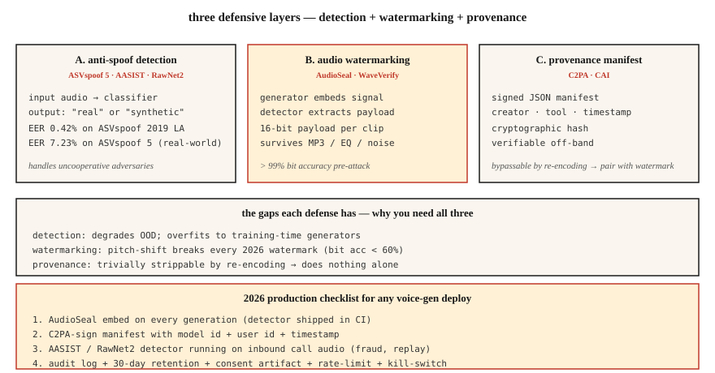

# 语音反欺诈与音频水印 —— ASVspoof 5、AudioSeal、WaveVerify

> 语音克隆上线得比防御快。2026 年的生产语音系统需要两样东西:一个能分真假的检测器(AASIST、RawNet2),和一个扛得住压缩剪辑的水印(AudioSeal)。两样都备齐,再谈交付语音克隆。

**类型:** 动手构建
**编程语言:** Python
**前置要求:** 第 6 阶段 · 06(说话人识别)、第 6 阶段 · 08(语音克隆)
**预计耗时:** 约 75 分钟

## 问题

三道相关的防线:

1. **反欺诈 / 深伪检测。** 给定一段音频,它是合成的还是真人?ASVspoof 基准(ASVspoof 2019 → 2021 → 5)是金标准。
2. **音频水印。** 在生成的音频里嵌一个不可感知的信号,事后检测器能提取出来。AudioSeal(Meta)和 WavMark 是开源选项。
3. **可验证的出处。** 音频文件的加密签名 + 元数据。C2PA / 内容真实性倡议。

检测对付不合作的攻击者,水印负责合规——AI 生成的音频应当可被识别为 AI 生成。2026 年两者缺一不可。

## 概念



### ASVspoof 5 —— 2024-2025 基准

与往届相比最大的变化:

- **众包数据**(不是录音棚干声)——真实条件。
- **约 2000 个说话人**(以前约 100 个)。
- **32 种攻击算法。** TTS + 语音转换 + 对抗扰动。
- **两条赛道。** 独立检测的反制(CM)赛道;面向生物识别系统的抗欺诈说话人验证(SASV)赛道。

ASVspoof 5 上的 SOTA:约 7.23% EER。老的 ASVspoof 2019 LA 上:0.42% EER。真实部署:野外音频上预期 5-10% EER。

### AASIST 与 RawNet2 —— 检测模型家族

**AASIST**(2021,持续更新到 2026)。频谱特征上的图注意力。当前 ASVspoof 5 反制任务的 SOTA。

**RawNet2。** 原始波形上的卷积前端 + TDNN 骨干。更简单的基线;微调后仍有竞争力。

**NeXt-TDNN + SSL 特征。** 2025 变体:ECAPA 风格 + WavLM 特征 + focal loss。在 ASVspoof 2019 LA 上拿到 0.42% EER。

### AudioSeal —— 2024 年水印默认

Meta 的 **AudioSeal**(2024 年 1 月,v0.2 于 2024 年 12 月)。关键设计:

- **本地化。** 以 16 kHz 采样分辨率(1/16000 秒)逐帧检测水印。
- **生成器 + 检测器联合训练。** 生成器学会嵌入不可闻信号,检测器学会在各种增强后找到它。
- **鲁棒。** 扛得住 MP3 / AAC 压缩、均衡、±10% 变速、+10 dB SNR 的混噪。
- **快。** 检测器 485 倍实时;比 WavMark 快 1000 倍。
- **容量。** 每段语音可嵌入 16 比特载荷(可编码模型 ID、生成时间戳、用户 ID)。

### WavMark

AudioSeal 之前的开源基线。可逆神经网络,32 比特/秒。问题:

- 同步靠暴力搜索,慢。
- 高斯噪声或 MP3 压缩即可去除。
- 对实时不友好。

### WaveVerify(2025 年 7 月)

针对 AudioSeal 的弱点——特别是时间维度的篡改(倒放、变速)。用基于 FiLM 的生成器 + 专家混合检测器。常规攻击下与 AudioSeal 相当,且能处理时间编辑。

### 攻击者钻的空子

AudioMarkBench 指出:"在音高变换下,所有水印的比特恢复准确率都低于 0.6,接近完全去除。"**音高变换是万能攻击。** 2026 年没有任何水印能完全扛住激进变调。这就是为什么检测(AASIST)必须与水印并肩部署。

### C2PA / 内容真实性倡议

不是 ML 技术,是一种清单(manifest)格式。音频文件携带关于创作工具、作者、日期的加密签名元数据。Audobox / Seamless 在用。对出处管理有用;但攻击者重编码剥掉元数据后,它就无能为力。

```figure
v4-audio-watermark
```

## 动手构建

### 第 1 步:简易频谱特征检测器(玩具)

```python
def spectral_rolloff(spec, percentile=0.85):
    cum = 0
    total = sum(spec)
    if total == 0:
        return 0
    threshold = total * percentile
    for k, v in enumerate(spec):
        cum += v
        if cum >= threshold:
            return k
    return len(spec) - 1

def is_suspicious(audio):
    spec = magnitude_spectrum(audio)
    rolloff = spectral_rolloff(spec)
    return rolloff / len(spec) > 0.92
```

合成语音的高频能量常常异常平坦。生产检测器用 AASIST,不用这个。但直觉是相通的。

### 第 2 步:AudioSeal 嵌入 + 检测

```python
from audioseal import AudioSeal
import torch

generator = AudioSeal.load_generator("audioseal_wm_16bits")
detector = AudioSeal.load_detector("audioseal_detector_16bits")

audio = load_wav("generated.wav", sr=16000)[None, None, :]
payload = torch.tensor([[1, 0, 1, 1, 0, 1, 0, 0, 1, 1, 0, 1, 0, 1, 1, 0]])
watermark = generator.get_watermark(audio, sample_rate=16000, message=payload)
watermarked = audio + watermark

result, decoded_payload = detector.detect_watermark(watermarked, sample_rate=16000)
# result: float in [0, 1] — probability of watermark presence
# decoded_payload: 16 bits; match against embedded payload
```

### 第 3 步:评测 —— EER

```python
def eer(real_scores, fake_scores):
    thresholds = sorted(set(real_scores + fake_scores))
    best = (1.0, 0.0)
    for t in thresholds:
        far = sum(1 for s in fake_scores if s >= t) / len(fake_scores)
        frr = sum(1 for s in real_scores if s < t) / len(real_scores)
        if abs(far - frr) < best[0]:
            best = (abs(far - frr), (far + frr) / 2)
    return best[1]
```

### 第 4 步:生产集成

```python
def safe_tts(text, voice, clone_reference=None):
    if clone_reference is not None:
        verify_consent(user_id, clone_reference)
    audio = tts_model.synthesize(text, voice)
    audio_with_wm = audioseal_embed(audio, payload=build_payload(user_id, model_id))
    manifest = c2pa_sign(audio_with_wm, user_id, timestamp=now())
    return audio_with_wm, manifest
```

每次生成都附带:(1) 水印,(2) 签名清单,(3) 符合留存策略的审计日志。

## 投入使用

| 用例 | 防御 |
|----------|---------|
| 交付 TTS / 语音克隆 | 每个输出嵌 AudioSeal(不容商量) |
| 生物识别语音解锁 | AASIST + ECAPA 集成;活体挑战 |
| 呼叫中心欺诈检测 | 对 20% 来电抽样跑 AASIST |
| 播客真实性 | 上传时 C2PA 签名,AI 生成则加 AudioSeal |
| 研究 / 训练检测器 | ASVspoof 5 train/dev/eval 数据集 |

## 常见坑

- **嵌了水印却从不跑检测。** 形同虚设。把检测器放进你的 CI。
- **检测不校准。** 在 ASVspoof LA 上训的 AASIST 会过拟合;真实世界准确率掉。在你的领域上校准。
- **音高变换缺口。** 激进变调能去掉大多数水印。要有检测兜底。
- **元数据剥离再托管。** 重编码就能轻松绕过 C2PA。永远把加密(签名)与感知(水印)防御一起上。
- **把活体当检测。** 让用户念一段随机文本。能防重放攻击,防不了实时克隆。

## 交付

保存为 `outputs/skill-spoof-defender.md`。针对语音生成部署,选定检测模型、水印、出处清单和运营手册。

## 练习

1. **简单。** 运行 `code/main.py`。玩具检测器 + 玩具水印的嵌入/检出,跑合成音频。
2. **中等。** 安装 `audioseal`,在一段 TTS 输出里嵌入 16 比特载荷再解出。给音频加噪,测比特恢复准确率。
3. **困难。** 在 ASVspoof 2019 LA 上微调 RawNet2 或 AASIST。测 EER。再在一组留出的 F5-TTS 生成音频上测试——观察 OOD 检测退化多少。

## 关键术语

| 术语 | 大家口头的说法 | 实际含义 |
|------|-----------------|-----------------------|
| ASVspoof | 那个基准 | 两年一届的挑战赛;2024 = ASVspoof 5。 |
| CM(反制) | 检测器 | 分类器:真实语音 vs 合成/转换。 |
| SASV | 说话人验证 + CM | 生物识别与欺诈检测一体化。 |
| AudioSeal | Meta 水印 | 本地化,16 比特载荷,比 WavMark 快 485 倍。 |
| 比特恢复准确率 | 水印存活率 | 攻击后恢复出的载荷比特比例。 |
| C2PA | 出处清单 | 关于创作/作者的加密元数据。 |
| AASIST | 检测器家族 | 基于图注意力的反欺诈 SOTA。 |

## 延伸阅读

- [Todisco et al. (2024). ASVspoof 5](https://dl.acm.org/doi/10.1016/j.csl.2025.101825) — 当前基准。
- [Defossez et al. (2024). AudioSeal](https://arxiv.org/abs/2401.17264) — 水印默认。
- [Chen et al. (2025). WaveVerify](https://arxiv.org/abs/2507.21150) — 针对时间攻击的 MoE 检测器。
- [Jung et al. (2022). AASIST](https://arxiv.org/abs/2110.01200) — SOTA 检测骨干。
- [AudioMarkBench (2024)](https://proceedings.neurips.cc/paper_files/paper/2024/file/5d9b7775296a641a1913ab6b4425d5e8-Paper-Datasets_and_Benchmarks_Track.pdf) — 鲁棒性评测。
- [C2PA specification](https://c2pa.org/specifications/specifications/) — 出处清单格式。
