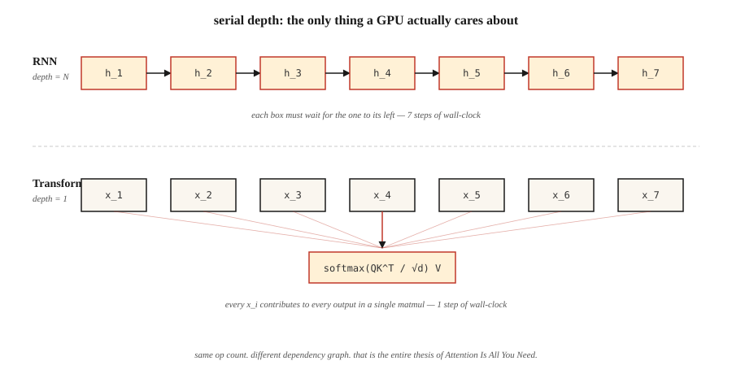

# 为什么是 Transformer——RNN 的问题

> RNN 一次处理一个 token,Transformer 一次处理所有 token。就这一个架构上的赌注,改写了 2017 年之后深度学习的一切扩展曲线。

**类型:** 学习
**编程语言:** Python
**前置要求:** 第 3 阶段(深度学习核心),第 5 阶段 · 09(序列到序列),第 5 阶段 · 10(注意力机制)
**预计耗时:** 约 45 分钟

## 问题

2017 年之前,地球上每一个顶尖的序列模型——语言、翻译、语音——都是循环神经网络。LSTM 和 GRU 在翻译基准上称霸了五年,它们是所有人手里唯一的工具。

它们有三个致命弱点。其一,顺序计算意味着你无法沿时间轴并行:第 `t+1` 个 token 需要第 `t` 个 token 的隐状态。一个 1,024 token 的序列,就是在一块每个时钟周期能跑一百万次浮点运算的 GPU 上,串行走 1,024 步。训练墙钟时间随序列长度线性增长,而硬件明明是为并行设计的。

其二,梯度消失意味着 50 个 token 之前的信息,已经被 50 层非线性反复压缩过。门控循环单元(LSTM、GRU)缓解了这种挤压,但从没根除。长程依赖——"我去年夏天在飞往京都的飞机上读的那本书是……"——经常接不上。

其三,定宽隐状态意味着编码器要把整个源序列挤进一个向量,解码器才能开工。源序列是 5 个 token 还是 500 个,瓶颈的形状都一样。

2017 年的论文《Attention Is All You Need》提出了一个激进方案:彻底抛弃循环。让每个位置并行地关注其他所有位置,用一次大矩阵乘法替代 1,024 次顺序乘法。

结果:到 2026 年,它统治了所有模态。语言(GPT-5、Claude 4、Llama 4)、视觉(ViT、DINOv2、SAM 3)、音频(Whisper)、生物(AlphaFold 3)、机器人(RT-2)。同一个模块,不同的输入。

## 概念



**循环是瓶颈。** RNN 计算 `h_t = f(h_{t-1}, x_t)`。每一步都依赖前一步,`h_4` 没算完就算不了 `h_5`。在有一万多个并行核心的现代 GPU 上,长序列意味着 99% 的硅片在闲置。

**注意力是广播。** 自注意力对所有位置对 `(i, j)` 同时计算 `output_i = sum_j(a_ij * v_j)`。整个 N×N 注意力矩阵一次批量矩阵乘法就填满,没有任何一步依赖另一步。GPU 爱死它了。

**这个加速不是常数倍。** 它是 `O(N)` 串行深度与 `O(1)` 串行深度之间的差别。实践中,N=512 时 Transformer 在同等硬件上每个 epoch 快 5–10 倍,而且序列越长差距越大——直到撞上注意力的 `O(N²)` 显存墙(后来由 Flash Attention 解决,见第 12 课)。

**Transformer 的代价。** 注意力显存按 `O(N²)` 增长。2K 上下文没问题;128K 上下文就需要滑动窗口、RoPE 外推、Flash Attention 分块,或者线性注意力变体。循环在时间和显存上都是 `O(N)`;Transformer 是用显存换时间,再靠并行把时间赢回来。

**归纳偏置的转变。** RNN 假设局部性和近期性,Transformer 什么都不假设——任意一对位置都是注意力的候选。所以 Transformer 需要更多数据才能训好,但一旦有了数据,就能扩得更远。Chinchilla(2022)把这一点形式化了:只要 token 够多,同参数量的 Transformer 永远赢 RNN。

```figure
rnn-vs-parallel
```

## 动手构建

这里不写神经网络——我们用数值模拟直观感受核心瓶颈,在你的笔记本上就能体会到差距。

### 第 1 步:度量串行深度

见 `code/main.py`。我们写两个函数:一个把序列编码成加法链(串行,像 RNN),一个编码成并行归约(广播,像注意力)。同样的数学,不同的依赖图。

```python
def rnn_style(xs):
    h = 0.0
    for x in xs:
        h = 0.9 * h + x   # can't parallelize: h depends on previous h
    return h

def attention_style(xs):
    return sum(xs) / len(xs)  # every x is independent
```

我们在最长 100,000 个元素的序列上计时。RNN 版是 O(N),只有一条 CPU 流水线。即使用纯 Python,注意力式归约在长度 ≥ 1,000 时就赢了,因为 Python 的 `sum()` 是 C 实现的,迭代时不用逐步调解释器。

### 第 2 步:数理论运算量

两个算法都做 N 次加法。差别在*依赖深度*:在下一步能开始之前,有多少运算必须顺序完成。RNN 的深度 = N;注意力用树形归约深度 = log(N),用并行扫描深度 = 1。决定 GPU 时间的是深度,不是运算量。

### 第 3 步:长序列上的实测扩展

我们打印一张计时表,让 O(N) 的差距肉眼可见。在 2026 年的 Mac 笔记本上,1,000 元素以内的序列快到测不出来;100,000 元素则呈现出干净的线性扫描。把这个比例放大到 16,384 token 的 Transformer 对比 12 层 LSTM 的等价物,你就明白 2016 年训练墙钟时间为什么是拦路虎了。

## 投入使用

2026 年仍该选 RNN 的场景:

| 场景 | 选择 |
|-----------|------|
| 流式推理,一次一个 token,内存恒定 | RNN 或状态空间模型(Mamba、RWKV) |
| 超长序列(>1M token),注意力显存爆炸 | 线性注意力、Mamba 2、Hyena |
| 没有矩阵乘法加速器的边缘设备 | 深度可分离 RNN 在 FLOPs/瓦特上仍然胜出 |
| 其他一切(训练、批量推理、128K 以内上下文) | Transformer |

像 Mamba 这样的状态空间模型(SSM),本质上是带结构化参数化的 RNN,兼得两家之长:`O(N)` 的扫描显存,又可通过选择性扫描并行训练。它们能找回 90% 的 Transformer 质量,长上下文扩展还更好。2026 年,多数前沿实验室训练的是 SSM+Transformer 混合模型(如 Jamba、Samba)——循环没有死,它成了一种组件。

## 交付

见 `outputs/skill-architecture-picker.md`。这个技能根据序列长度、吞吐和训练预算约束,为新的序列问题挑选架构。对于 1B token 以上的训练任务,它必须拒绝推荐纯 RNN,除非同时声明代价权衡。

## 练习

1. **易。** 把 `code/main.py` 里的 `rnn_style` 拿过来,把标量隐状态换成长度 64 的隐状态向量,重新计时。串行开销随隐状态维度增长多少?
2. **中。** 用纯 Python 实现并行前缀和(Hillis-Steele 扫描)。验证它在长度 1024 上与串行扫描数值一致,并数出它的深度。
3. **难。** 把注意力式归约移植到 GPU 上的 PyTorch。序列长度从 64 扫到 65,536,两边都计时。画出曲线并解释形状。

## 关键术语

| 术语 | 人们常说的 | 实际含义 |
|------|-----------------|-----------------------|
| 循环(Recurrence) | "RNN 是顺序的" | 第 `t` 步依赖第 `t-1` 步的计算,被迫沿时间轴串行执行 |
| 串行深度(Serial depth) | "图有多深" | 依赖链最长的一串运算;即使硬件无限,墙钟时间也被它锁死 |
| 注意力(Attention) | "让 token 互相看" | 加权和 `sum_j a_ij v_j`,其中 `a_ij` 来自位置 i 与 j 之间的相似度分数 |
| 上下文窗口(Context window) | "模型能看多少" | 注意力层能接收的位置数;显存的二次方开销就涨在这里 |
| 归纳偏置(Inductive bias) | "架构里烤进去的假设" | 对数据长什么样的先验;CNN 假设平移不变性,RNN 假设近期性 |
| 状态空间模型(State-space model) | "背后有代数的 RNN" | 通过结构化状态空间矩阵实现并行训练的循环结构 |
| 二次方瓶颈(Quadratic bottleneck) | "上下文为什么这么贵" | 注意力显存 = 序列长度的 `O(N²)`;Flash Attention 藏住的是常数,不是增长阶 |

## 延伸阅读

- [Vaswani et al. (2017). Attention Is All You Need](https://arxiv.org/abs/1706.03762) ——在主流 NLP 中杀死循环的那篇论文
- [Bahdanau, Cho, Bengio (2014). Neural MT by Jointly Learning to Align and Translate](https://arxiv.org/abs/1409.0473) ——注意力的诞生地,当时它是拴在 RNN 上的
- [Hochreiter, Schmidhuber (1997). Long Short-Term Memory](https://www.bioinf.jku.at/publications/older/2604.pdf) ——LSTM 原始论文,存档备查
- [Gu, Dao (2023). Mamba: Linear-Time Sequence Modeling with Selective State Spaces](https://arxiv.org/abs/2312.00752) ——循环一派对 Transformer 的现代回应
