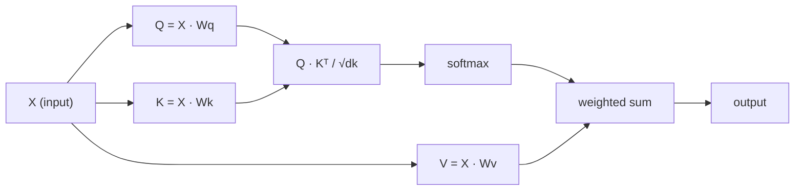

# 从零实现自注意力

> 注意力就是一张查找表:每个词都在问"谁对我重要?"——而答案是自己学出来的。

**类型:** 动手构建
**编程语言:** Python
**前置要求:** 第 3 阶段(深度学习核心),第 5 阶段第 10 课(序列到序列)
**预计耗时:** 约 90 分钟

## 学习目标

- 只用 NumPy 从零实现缩放点积自注意力,包括 query/key/value 投影和 softmax 加权和
- 构建一个多头注意力层:拆分头部、并行计算注意力、拼接结果
- 追踪注意力矩阵如何捕捉 token 间关系,并解释为什么除以 sqrt(d_k) 能防止 softmax 饱和
- 施加因果掩码,把双向注意力改造成自回归(解码器式)注意力

## 问题

RNN 一次处理一个 token。等你走到第 50 个 token,第 1 个 token 的信息已经被 50 次压缩步骤挤过一遍。长程依赖被压进一个固定维度的隐状态——这个瓶颈,再多的 LSTM 门控也无法彻底解决。

2014 年 Bahdanau 的注意力论文给出了修法:让解码器回头看每一个编码器位置,自己决定哪些位置对当前这一步重要。但它仍然拴在 RNN 上。2017 年的《Attention Is All You Need》问了一个更尖锐的问题:如果注意力是*唯一*的机制呢?不要循环,不要卷积,只要注意力。

自注意力让序列中的每个位置在一步并行计算中关注其他所有位置。这正是 Transformer 快、可扩展、并占据统治地位的原因。

## 概念

### 数据库查找的类比

把注意力想成一次软性的数据库查找:

```
Traditional database:
  Query: "capital of France"  -->  exact match  -->  "Paris"

Attention:
  Query: "capital of France"  -->  similarity to ALL keys  -->  weighted blend of ALL values
```

每个 token 生成三个向量:
- **Query(Q)**:"我在找什么?"
- **Key(K)**:"我装着什么?"
- **Value(V)**:"如果选中我,我提供什么信息?"

query 与所有 key 的点积,产生注意力分数。分数高意味着"这个 key 匹配我的 query"。这些分数再去给 value 加权。输出就是 value 的加权和。

### Q、K、V 的计算

每个 token 的嵌入(embedding)分别通过三个学出来的权重矩阵做投影:

```
Input embeddings (sequence of n tokens, each d-dimensional):

  X = [x1, x2, x3, ..., xn]       shape: (n, d)

Three weight matrices:

  Wq  shape: (d, dk)
  Wk  shape: (d, dk)
  Wv  shape: (d, dv)

Projections:

  Q = X @ Wq    shape: (n, dk)      each token's query
  K = X @ Wk    shape: (n, dk)      each token's key
  V = X @ Wv    shape: (n, dv)      each token's value
```

画出来,对单个 token:

```
             Wq
  x_i ------[*]------> q_i    "What am I looking for?"
       |
       |     Wk
       +----[*]------> k_i    "What do I contain?"
       |
       |     Wv
       +----[*]------> v_i    "What do I offer?"
```

### 注意力矩阵

拿到所有 token 的 Q、K、V 之后,注意力分数构成一个矩阵:

```
Scores = Q @ K^T    shape: (n, n)

              k1    k2    k3    k4    k5
        +-----+-----+-----+-----+-----+
   q1   | 2.1 | 0.3 | 0.1 | 0.8 | 0.2 |   <- how much q1 attends to each key
        +-----+-----+-----+-----+-----+
   q2   | 0.4 | 1.9 | 0.7 | 0.1 | 0.3 |
        +-----+-----+-----+-----+-----+
   q3   | 0.2 | 0.6 | 2.3 | 0.5 | 0.1 |
        +-----+-----+-----+-----+-----+
   q4   | 0.9 | 0.1 | 0.4 | 1.7 | 0.6 |
        +-----+-----+-----+-----+-----+
   q5   | 0.1 | 0.3 | 0.2 | 0.5 | 2.0 |
        +-----+-----+-----+-----+-----+

Each row: one token's attention over the entire sequence
```

让一个 query 依次扫过所有 key:每一行为每个 token 打分,softmax 把分数变成权重,上下文向量就是 value 按权重的混合。

```figure
attention-matrix
```

### 为什么要缩放?

点积的量级随维度 dk 增长。dk = 64 时,点积可以达到几十的量级,把 softmax 推进梯度消失的区域。修法:除以 sqrt(dk)。

```
Scaled scores = (Q @ K^T) / sqrt(dk)
```

这样取值就落在 softmax 能产生有效梯度的区间。

### Softmax 把分数变成权重

softmax 把原始分数转换成每一行上的概率分布:

```
Raw scores for q1:   [2.1, 0.3, 0.1, 0.8, 0.2]
                            |
                         softmax
                            |
Attention weights:   [0.52, 0.09, 0.07, 0.14, 0.08]   (sums to ~1.0)
```

现在,每个 token 都有一组权重,标明它该给其他每个 token 多少关注。

### Value 的加权和

每个 token 的最终输出,是所有 value 向量的加权和:

```
output_i = sum( attention_weight[i][j] * v_j  for all j )

For token 1:
  output_1 = 0.52 * v1 + 0.09 * v2 + 0.07 * v3 + 0.14 * v4 + 0.08 * v5
```

### 完整流水线



一行公式:

```
Attention(Q, K, V) = softmax( Q @ K^T / sqrt(dk) ) @ V
```

```figure
softmax-attention-scaling
```

## 动手构建

### 第 1 步:从零实现 softmax

softmax 把原始 logits 转成概率。减去最大值以保证数值稳定。

```python
import numpy as np

def softmax(x):
    shifted = x - np.max(x, axis=-1, keepdims=True)
    exp_x = np.exp(shifted)
    return exp_x / np.sum(exp_x, axis=-1, keepdims=True)

logits = np.array([2.0, 1.0, 0.1])
print(f"logits:  {logits}")
print(f"softmax: {softmax(logits)}")
print(f"sum:     {softmax(logits).sum():.4f}")
```

### 第 2 步:缩放点积注意力

核心函数。输入 Q、K、V 矩阵,返回注意力输出和权重矩阵。

```python
def scaled_dot_product_attention(Q, K, V):
    dk = Q.shape[-1]
    scores = Q @ K.T / np.sqrt(dk)
    weights = softmax(scores)
    output = weights @ V
    return output, weights
```

### 第 3 步:带学习投影的自注意力类

一个完整的自注意力模块,Wq、Wk、Wv 权重矩阵按类似 Xavier 的方式缩放初始化。

```python
class SelfAttention:
    def __init__(self, d_model, dk, dv, seed=42):
        rng = np.random.default_rng(seed)
        scale = np.sqrt(2.0 / (d_model + dk))
        self.Wq = rng.normal(0, scale, (d_model, dk))
        self.Wk = rng.normal(0, scale, (d_model, dk))
        scale_v = np.sqrt(2.0 / (d_model + dv))
        self.Wv = rng.normal(0, scale_v, (d_model, dv))
        self.dk = dk

    def forward(self, X):
        Q = X @ self.Wq
        K = X @ self.Wk
        V = X @ self.Wv
        output, weights = scaled_dot_product_attention(Q, K, V)
        return output, weights
```

### 第 4 步:在句子上跑一遍

为一个句子伪造嵌入,观察注意力权重。

```python
sentence = ["The", "cat", "sat", "on", "the", "mat"]
n_tokens = len(sentence)
d_model = 8
dk = 4
dv = 4

rng = np.random.default_rng(42)
X = rng.normal(0, 1, (n_tokens, d_model))

attn = SelfAttention(d_model, dk, dv, seed=42)
output, weights = attn.forward(X)

print("Attention weights (each row: where that token looks):\n")
print(f"{'':>6}", end="")
for token in sentence:
    print(f"{token:>6}", end="")
print()

for i, token in enumerate(sentence):
    print(f"{token:>6}", end="")
    for j in range(n_tokens):
        w = weights[i][j]
        print(f"{w:6.3f}", end="")
    print()
```

### 第 5 步:用 ASCII 热力图可视化注意力

把注意力权重映射成字符,快速看个大概。

```python
def ascii_heatmap(weights, tokens, chars=" ░▒▓█"):
    n = len(tokens)
    print(f"\n{'':>6}", end="")
    for t in tokens:
        print(f"{t:>6}", end="")
    print()

    for i in range(n):
        print(f"{tokens[i]:>6}", end="")
        for j in range(n):
            level = int(weights[i][j] * (len(chars) - 1) / weights.max())
            level = min(level, len(chars) - 1)
            print(f"{'  ' + chars[level] + '   '}", end="")
        print()

ascii_heatmap(weights, sentence)
```

## 投入使用

PyTorch 的 `nn.MultiheadAttention` 做的正是我们构建的东西,外加多头拆分和输出投影:

```python
import torch
import torch.nn as nn

d_model = 8
n_heads = 2
seq_len = 6

mha = nn.MultiheadAttention(embed_dim=d_model, num_heads=n_heads, batch_first=True)

X_torch = torch.randn(1, seq_len, d_model)

output, attn_weights = mha(X_torch, X_torch, X_torch)

print(f"Input shape:            {X_torch.shape}")
print(f"Output shape:           {output.shape}")
print(f"Attention weight shape: {attn_weights.shape}")
print(f"\nAttn weights (averaged over heads):")
print(attn_weights[0].detach().numpy().round(3))
```

关键区别:多头注意力并行运行多个注意力函数,每个头有自己 dk = d_model / n_heads 大小的 Q、K、V 投影,最后把结果拼接起来。这让模型能同时关注不同类型的关系。

## 交付

本课会产出:
- `outputs/prompt-attention-explainer.md` ——一个用数据库查找类比讲解注意力的提示词

## 练习

1. 修改 `scaled_dot_product_attention`,让它接受一个可选的掩码矩阵,在 softmax 之前把某些位置设为负无穷(这就是因果/解码器掩码的工作方式)。
2. 从零实现多头注意力:把 Q、K、V 切成 `n_heads` 份,每份独立做注意力,拼接后再过一个最终的权重矩阵 Wo。
3. 取两个等长的不同句子,送进同一个 SelfAttention 实例,比较它们的注意力模式。什么变了?什么没变?

## 关键术语

| 术语 | 人们常说的 | 实际含义 |
|------|----------------|----------------------|
| Query(Q) | "提问向量" | 输入的一种学习投影,表示这个 token 在寻找什么信息 |
| Key(K) | "标签向量" | 输入的一种学习投影,表示这个 token 含有什么信息,用来与 query 匹配 |
| Value(V) | "内容向量" | 输入的一种学习投影,携带真正会被按注意力分数聚合的信息 |
| 缩放点积注意力 | "那个注意力公式" | softmax(QK^T / sqrt(dk)) @ V——缩放防止高维下 softmax 饱和 |
| 自注意力(Self-attention) | "token 看自己和别人" | Q、K、V 来自同一个序列的注意力,让每个位置都能关注其他所有位置 |
| 注意力权重 | "关注的分量" | 由缩放后的点积经 softmax 得到的、关于各位置的概率分布 |
| 多头注意力(Multi-head attention) | "并行注意力" | 用不同的投影并行跑多个注意力函数,再拼接结果,获得更丰富的表示 |

## 延伸阅读

- [Attention Is All You Need (Vaswani et al., 2017)](https://arxiv.org/abs/1706.03762) ——Transformer 原始论文
- [The Illustrated Transformer (Jay Alammar)](https://jalammar.github.io/illustrated-transformer/) ——完整架构的最佳可视化讲解
- [The Annotated Transformer (Harvard NLP)](https://nlp.seas.harvard.edu/annotated-transformer/) ——逐行讲解的 PyTorch 实现
