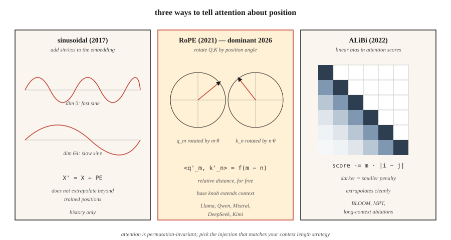

# 位置编码——正弦、RoPE、ALiBi

> 注意力是置换不变的:"The cat sat on the mat" 和 "mat the on sat cat the" 在没有位置信号时产出相同的结果。三个算法修好了它——各自对"位置"下了不同的赌注。

**类型:** 动手构建
**编程语言:** Python
**前置要求:** 第 7 阶段 · 02(自注意力),第 7 阶段 · 03(多头注意力)
**预计耗时:** 约 45 分钟

## 问题

缩放点积注意力是"顺序盲"。注意力矩阵 `softmax(Q K^T / √d) V` 由两两相似度算出。打乱 `X` 的行,输出的行也跟着同样地打乱——注意力内部没有任何东西关心位置。

对词袋模型来说这不算 bug。但对语言、代码、音频、视频——任何顺序承载意义的东西——这是致命的。

修法是把位置注入嵌入。三个时代的答案:

1. **绝对正弦编码**(Vaswani 2017)。把位置的 `sin/cos` 加进嵌入。简单,无需学习,但超出训练长度就外推不动。
2. **RoPE——旋转位置编码**(Su 2021)。把 Q 和 K 向量按与位置成正比的角度旋转。直接在点积里编码*相对*位置。2026 年的主流。
3. **ALiBi——线性偏置注意力**(Press 2022)。完全不动嵌入,按距离往注意力分数上加一个逐头的线性惩罚。长度外推极好。

截至 2026 年,几乎所有前沿开源模型都用 RoPE:Llama 2/3/4、Qwen 2/3、Mistral、Mixtral、DeepSeek-V3、Kimi。少数长上下文模型用 ALiBi 或其现代变体。绝对正弦编码已成历史。

## 概念



### 绝对正弦编码

预计算一个固定矩阵 `PE`,形状 `(max_len, d_model)`:

```
PE[pos, 2i]   = sin(pos / 10000^(2i / d_model))
PE[pos, 2i+1] = cos(pos / 10000^(2i / d_model))
```

然后在注意力之前 `X' = X + PE[:N]`。每个维度是不同频率的正弦波,模型学着从相位图案中读出位置。超过 `max_len` 就失效:模型只见过位置 0–2047,没人告诉它位置 2048 会发生什么。

### RoPE

旋转的是 Q 和 K 向量(不是嵌入)。对一对维度 `(2i, 2i+1)`:

```
[q'_2i    ]   [ cos(pos·θ_i)  -sin(pos·θ_i) ] [q_2i   ]
[q'_2i+1  ] = [ sin(pos·θ_i)   cos(pos·θ_i) ] [q_2i+1 ]

θ_i = base^(-2i / d_head),  base = 10000 by default
```

对位置 `pos_k` 的 key 施加同样的旋转。点积 `q'_m · k'_n` 变成只关于 `(m - n)` 的函数。也就是说:**注意力分数只依赖相对距离**——尽管旋转是按绝对位置施加的。漂亮的技巧。

RoPE 的扩展:`base` 可以缩放(NTK-aware、YaRN、LongRoPE),不重训就能外推到更长上下文。Llama 3 就是这样从 8K 扩到 128K 的。

### ALiBi

不碰嵌入,直接给注意力分数加偏置:

```
attn_score[i, j] = (q_i · k_j) / √d  -  m_h · |i - j|
```

`m_h` 是每个头专属的斜率(如 `1 / 2^(8·h/H)`)。近的 token 被抬升,远的被压低,训练零额外成本。论文显示,其长度外推优于正弦编码,且在原训练长度上与 RoPE 打平。

### 2026 年怎么选

| 变体 | 外推能力 | 训练成本 | 使用者 |
|---------|---------------|---------------|---------|
| 绝对正弦 | 差 | 零 | 原始 Transformer、早期 BERT |
| 学习的绝对位置 | 无 | 极小 | GPT-2、GPT-3 |
| RoPE | 配合缩放后良好 | 零 | Llama 2/3/4、Qwen 2/3、Mistral、DeepSeek-V3、Kimi |
| RoPE + YaRN | 极好 | 微调一个阶段 | Qwen2-1M、Llama 3.1 128K |
| ALiBi | 极好 | 零 | BLOOM、MPT、Baichuan |

RoPE 胜出的原因:不动架构就能插进注意力,编码的是相对位置,而且 `base` 这个超参数为长上下文微调提供了一个干净的旋钮。

```figure
rope-explorer
```

## 动手构建

### 第 1 步:正弦编码

见 `code/main.py`,四行计算:

```python
def sinusoidal(N, d):
    pe = [[0.0] * d for _ in range(N)]
    for pos in range(N):
        for i in range(d // 2):
            theta = pos / (10000 ** (2 * i / d))
            pe[pos][2 * i]     = math.sin(theta)
            pe[pos][2 * i + 1] = math.cos(theta)
    return pe
```

在第一个注意力层之前,把它加到嵌入矩阵上。

### 第 2 步:对 Q、K 施加 RoPE

RoPE 原地作用于 Q 和 K。对每一对维度:

```python
def apply_rope(x, pos, base=10000):
    d = len(x)
    out = list(x)
    for i in range(d // 2):
        theta = pos / (base ** (2 * i / d))
        c, s = math.cos(theta), math.sin(theta)
        a, b = x[2 * i], x[2 * i + 1]
        out[2 * i]     = a * c - b * s
        out[2 * i + 1] = a * s + b * c
    return out
```

关键:对位置 `m` 的 Q 和位置 `n` 的 K 施加同一个函数。它们的点积在每一对坐标上都会多出一个 `cos((m-n)·θ_i)` 因子。注意力免费学到了相对位置。

### 第 3 步:ALiBi 的斜率与偏置

```python
def alibi_bias(n_heads, seq_len):
    # slope_h = 2 ** (-8 * h / n_heads) for h = 1..n_heads
    slopes = [2 ** (-8 * (h + 1) / n_heads) for h in range(n_heads)]
    bias = []
    for m in slopes:
        row = [[-m * abs(i - j) for j in range(seq_len)] for i in range(seq_len)]
        bias.append(row)
    return bias  # add to attention scores before softmax
```

把 `bias[h]` 加到第 `h` 个头 `(seq_len, seq_len)` 的注意力分数矩阵上,再做 softmax。

### 第 4 步:验证 RoPE 的相对距离性质

取两个随机向量 `a, b`,分别按 `(pos_a, pos_b)` 旋转,再按 `(pos_a + k, pos_b + k)` 旋转。两次点积必须在浮点误差内一致。这个性质就是 RoPE 的全部意义——它对绝对偏移不变,只有相对间隔重要。

## 投入使用

PyTorch 2.5+ 在 `torch.nn.functional` 里提供了 RoPE 工具。生产代码大多用 `flash_attn` 或 `xformers`,RoPE 在注意力 kernel 内部施加。

```python
from transformers import AutoModel
model = AutoModel.from_pretrained("meta-llama/Llama-3.2-3B")
# model.config.rope_scaling → {"type": "yarn", "factor": 32.0, "original_max_position_embeddings": 8192}
```

**2026 年的长上下文技巧:**

- **NTK-aware 插值。** 从 4K 扩到 16K+ 时,把 `base` 重标为 `base * (scale_factor)^(d/(d-2))`。
- **YaRN。** 更聪明的插值,长上下文下保持注意力熵。Llama 3.1 128K 用的就是它。
- **LongRoPE。** 微软 2024 年的方法,用进化搜索挑选逐维度缩放因子。Phi-3-Long 用的就是它。
- **位置插值 + 微调。** 直接把位置按扩展倍数压缩,再微调 1–5B token。效果出奇地好。

## 交付

见 `outputs/skill-positional-encoding-picker.md`。这个技能根据目标上下文长度、外推需求和训练预算,为新模型挑选位置编码策略。

## 练习

1. **易。** 把 `max_len=512, d=128` 的正弦 `PE` 矩阵画成热力图,确认"维度索引越大条纹越宽"的图案。
2. **中。** 实现 NTK-aware RoPE 缩放。在长度 256 的序列上训练一个小语言模型,分别在有无缩放的情况下测试长度 1024,测量困惑度。
3. **难。** 在同一个注意力模块里同时实现 ALiBi 和 RoPE。在长度 512 的复制任务上训练一个 4 层 Transformer,测试时外推到 2048。比较两者的退化程度。

## 关键术语

| 术语 | 人们常说的 | 实际含义 |
|------|-----------------|-----------------------|
| 位置编码(Positional encoding) | "告诉注意力顺序" | 任何加入嵌入或注意力中、用来编码位置的信号 |
| 正弦编码(Sinusoidal) | "最初那个" | 按几何级数频率把 `sin/cos` 加进嵌入;无法外推 |
| RoPE | "旋转嵌入" | 按位置相关角度旋转 Q、K;点积天然编码相对距离 |
| ALiBi | "线性偏置技巧" | 往注意力分数上加 `-m·\|i-j\|`;无需动嵌入,外推极好 |
| base | "RoPE 的旋钮" | RoPE 中的频率缩放因子;推理时调大可以扩展上下文 |
| NTK-aware | "一种 RoPE 缩放技巧" | 重标 `base`,让上下文扩大时高频维度不被挤扁 |
| YaRN | "高级货" | 逐维度的插值加外推,保持注意力熵 |
| 外推(Extrapolation) | "超出训练长度也好使" | 位置方案能否在超过训练中见过的 `max_len` 后仍产出正确结果 |

## 延伸阅读

- [Vaswani et al. (2017). Attention Is All You Need §3.5](https://arxiv.org/abs/1706.03762) ——最初的正弦编码
- [Su et al. (2021). RoFormer: Enhanced Transformer with Rotary Position Embedding](https://arxiv.org/abs/2104.09864) ——RoPE 论文
- [Press, Smith, Lewis (2021). Train Short, Test Long: Attention with Linear Biases Enables Input Length Extrapolation](https://arxiv.org/abs/2108.12409) ——ALiBi
- [Peng et al. (2023). YaRN: Efficient Context Window Extension of Large Language Models](https://arxiv.org/abs/2309.00071) ——最先进的 RoPE 缩放
- [Chen et al. (2023). Extending Context Window of Large Language Models via Positional Interpolation](https://arxiv.org/abs/2306.15595) ——Meta 的 Llama 2 长上下文论文
- [Ding et al. (2024). LongRoPE: Extending LLM Context Window Beyond 2 Million Tokens](https://arxiv.org/abs/2402.13753) ——微软方法,Phi-3-Long 所用,即"投入使用"一节提到的那篇
- [HuggingFace Transformers — `modeling_rope_utils.py`](https://github.com/huggingface/transformers/blob/main/src/transformers/modeling_rope_utils.py) ——每种 RoPE 缩放方案(default、linear、dynamic、YaRN、LongRoPE、Llama-3)的生产级实现
