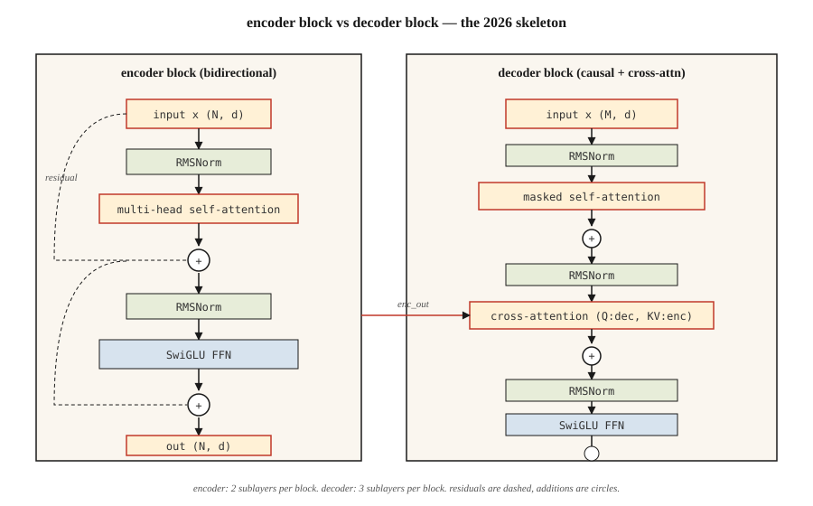

# 完整 Transformer——编码器 + 解码器

> 注意力是主角。其余一切——残差、归一化、前馈网络、交叉注意力——都是让它能深堆下去的脚手架。

**类型:** 动手构建
**编程语言:** Python
**前置要求:** 第 7 阶段 · 02(自注意力),第 7 阶段 · 03(多头注意力),第 7 阶段 · 04(位置编码)
**预计耗时:** 约 75 分钟

## 问题

单个注意力层只是一个特征提取器,还称不上模型。每层一次矩阵乘法,容量对语言来说远远不够。你需要深度——而没有正确的管线,深度会垮掉。

2017 年 Vaswani 论文打包了六个设计决策,把一层注意力变成了可堆叠的模块。此后的每一个 Transformer——纯编码器(BERT)、纯解码器(GPT)、编码器—解码器(T5)——都继承同一副骨架。到 2026 年,模块被精修过(RMSNorm、SwiGLU、pre-norm、RoPE),骨架却一模一样。

本课就讲这副骨架。接下来的课把它专门化——第 06 课讲编码器,第 07 课讲解码器,第 08 课讲编码器—解码器。

## 概念



### 六个部件

1. **嵌入 + 位置信号。** token → 向量。位置信息通过 RoPE(现代)或正弦编码(经典)注入。
2. **自注意力。** 每个位置关注其他所有位置。解码器中带掩码。
3. **前馈网络(FFN)。** 逐位置的两层 MLP:`W_2 · activation(W_1 · x)`。默认扩展比 4 倍。
4. **残差连接。** `x + sublayer(x)`。没有它,梯度过了约 6 层就会消失。
5. **层归一化。** `LayerNorm` 或 `RMSNorm`(现代)。稳住残差流。
6. **交叉注意力(仅解码器)。** query 来自解码器,key 和 value 来自编码器输出。

看一个向量流过一个模块:注意力跨位置混合信息,残差把它带向前,FFN 做变换,归一化保持流稳定。

```figure
transformer-block
```

### 编码器块(BERT、T5 编码器所用)

```
x → LN → MHA(self) → + → LN → FFN → + → out
                     ^              ^
                     |              |
                     └── residual ──┘
```

编码器是双向的。没有掩码。所有位置看得到所有位置。

### 解码器块(GPT、T5 解码器所用)

```
x → LN → MHA(masked self) → + → LN → MHA(cross to encoder) → + → LN → FFN → + → out
```

解码器每块有三个子层。中间那个——交叉注意力——是信息从编码器流向解码器的唯一通道。纯解码器架构(GPT)里,交叉注意力被省略,只剩掩码自注意力 + FFN。

### Pre-norm vs post-norm

原论文的写法与后来的变体:`x + sublayer(LN(x))` 对 `LN(x + sublayer(x))`。post-norm 大约在 2019 年失宠——没有精细的 warmup,很难训深。pre-norm(LN 放在子层*之前*)是 2026 年的默认:Llama、Qwen、GPT-3+、Mistral 全都用它。

### 2026 年的现代化模块

Vaswani 2017 出厂配置是 LayerNorm + ReLU,现代技术栈把两个都换了。生产中的模块实际长这样:

| 部件 | 2017 | 2026 |
|-----------|------|------|
| 归一化 | LayerNorm | RMSNorm |
| FFN 激活 | ReLU | SwiGLU |
| FFN 扩展比 | 4× | 2.6×(SwiGLU 用三个矩阵,总参数持平) |
| 位置 | 绝对正弦 | RoPE |
| 注意力 | 完整 MHA | GQA(或 MLA) |
| 偏置项 | 有 | 无 |

RMSNorm 去掉了 LayerNorm 的均值居中(少一次减法),省算力,实测稳定性至少相当。SwiGLU(`Swish(W1 x) ⊙ W3 x`)在 Llama、PaLM、Qwen 的论文里,一致比 ReLU/GELU 的 FFN 好约 0.5 个困惑度点。

### 参数量

一个模块,`d_model = d`,FFN 扩展比 `r`:

- MHA:`4 · d²`(Q、K、V、O 四个投影)
- FFN(SwiGLU):`3 · d · (r · d)` ≈ `3rd²`
- 归一化:可忽略

取 `d = 4096, r = 2.6, layers = 32`(大致是 Llama 3 8B),总量:`32 · (4·4096² + 3·2.6·4096²) ≈ 32 · (16 + 32) M = 每层约 1.5B × 32 ≈ 7B`(另加嵌入和输出头)。与公开数字吻合。

## 动手构建

### 第 1 步:积木

使用第 03 课的迷你 `Matrix` 类(为保持独立已拷贝到本课文件):

- `layer_norm(x, eps=1e-5)` ——减均值,除标准差。
- `rms_norm(x, eps=1e-6)` ——除以 RMS,不减均值。
- `gelu(x)` 和 `silu(x) * W3 x`(SwiGLU)。
- `ffn_swiglu(x, W1, W2, W3)`。
- `encoder_block(x, params)` 和 `decoder_block(x, enc_out, params)`。

完整接线见 `code/main.py`。

### 第 2 步:搭一个 2 层编码器和 2 层解码器

堆起来。把编码器输出喂进解码器的每个交叉注意力。输出投影前加最后一个 LN。

```python
def encode(tokens, params):
    x = embed(tokens, params.emb) + sinusoidal(len(tokens), params.d)
    for block in params.encoder_blocks:
        x = encoder_block(x, block)
    return x

def decode(target_tokens, encoder_out, params):
    x = embed(target_tokens, params.emb) + sinusoidal(len(target_tokens), params.d)
    for block in params.decoder_blocks:
        x = decoder_block(x, encoder_out, block)
    return x
```

### 第 3 步:在玩具例子上跑前向

喂一个 6 token 的源序列和一个 5 token 的目标序列,验证输出形状是 `(5, vocab)`。不训练——本课讲的是架构,不是损失。

### 第 4 步:换成 RMSNorm + SwiGLU

把 LayerNorm 和 ReLU-FFN 换成 RMSNorm 和 SwiGLU,确认形状仍然匹配。这就是 2026 年的现代化——只需要替换一个函数。

## 投入使用

PyTorch/TF 参考实现:`nn.TransformerEncoderLayer`、`nn.TransformerDecoderLayer`。但 2026 年的生产代码大多自己写模块,因为:

- Flash Attention 要在注意力内部调用,不走 `nn.MultiheadAttention`。
- 标准库参考实现里没有 GQA / MLA。
- RoPE、RMSNorm、SwiGLU 都不是 PyTorch 默认值。

HF `transformers` 里有值得细读的干净参考块:`modeling_llama.py` 是 2026 年纯解码器模块的典范,约 500 行,值得完整走读一遍。

**编码器、解码器、编码器—解码器,怎么选:**

| 需求 | 选择 | 例子 |
|------|------|---------|
| 分类、嵌入、文本问答 | 纯编码器 | BERT、DeBERTa、ModernBERT |
| 文本生成、对话、代码、推理 | 纯解码器 | GPT、Llama、Claude、Qwen |
| 结构化输入 → 结构化输出(翻译、摘要) | 编码器—解码器 | T5、BART、Whisper |

纯解码器赢下语言,是因为它扩展最干净,理解与生成都包办了。当输入有明确的"源序列"身份时(翻译、语音识别、结构化任务),编码器—解码器仍然是最佳。

## 交付

见 `outputs/skill-transformer-block-reviewer.md`。这个技能按 2026 年默认配置审查一个新的 Transformer 模块实现,标记缺失的部件(pre-norm、RoPE、RMSNorm、GQA、FFN 扩展比)。

## 练习

1. **易。** 数出在 `d_model=512, n_heads=8, ffn_expansion=4, swiglu=True` 下你的 encoder_block 参数量。实现该模块并用 `sum(p.numel() for p in block.parameters())` 验证。
2. **中。** 从 post-norm 切换到 pre-norm。两种都初始化,在随机输入上测量堆 12 层之后的激活范数。post-norm 的激活应该爆炸,pre-norm 应保持有界。
3. **难。** 在玩具复制任务(把 `x` 反转复制)上实现一个 4 层编码器—解码器,训 100 步,报告损失。换成 RMSNorm + SwiGLU + RoPE——损失降了吗?

## 关键术语

| 术语 | 人们常说的 | 实际含义 |
|------|-----------------|-----------------------|
| 块(Block) | "一层 Transformer" | 归一化 + 注意力 + 归一化 + FFN 的堆叠,外包残差连接 |
| 残差(Residual) | "跳跃连接" | 输出 `x + f(x)`;让梯度流过深层堆叠 |
| Pre-norm | "归一化放前面" | 现代写法:`x + sublayer(LN(x))`。不做 warmup 杂技也能训深 |
| RMSNorm | "不减均值的 LayerNorm" | 除以 RMS;少一次运算,实测稳定性相同 |
| SwiGLU | "大家都换过去的 FFN" | `Swish(W1 x) ⊙ W3 x → W2`。语言模型困惑度上胜过 ReLU/GELU |
| 交叉注意力(Cross-attention) | "解码器怎么看编码器" | Q 来自解码器、K/V 来自编码器输出的 MHA |
| FFN 扩展比 | "中间 MLP 有多宽" | 隐藏层宽度与 d_model 的比值,LayerNorm 体系通常 4,SwiGLU 体系 2.6 |
| 无偏置(Bias-free) | "把 +b 都扔了" | 现代技术栈在线性层里省略偏置;困惑度略好,模型更小 |

## 延伸阅读

- [Vaswani et al. (2017). Attention Is All You Need](https://arxiv.org/abs/1706.03762) ——模块的原始定义
- [Xiong et al. (2020). On Layer Normalization in the Transformer Architecture](https://arxiv.org/abs/2002.04745) ——为什么深堆叠下 pre-norm 胜过 post-norm
- [Zhang, Sennrich (2019). Root Mean Square Layer Normalization](https://arxiv.org/abs/1910.07467) ——RMSNorm
- [Shazeer (2020). GLU Variants Improve Transformer](https://arxiv.org/abs/2002.05202) ——SwiGLU 论文
- [HuggingFace `modeling_llama.py`](https://github.com/huggingface/transformers/blob/main/src/transformers/models/llama/modeling_llama.py) ——2026 年纯解码器模块的典范实现
