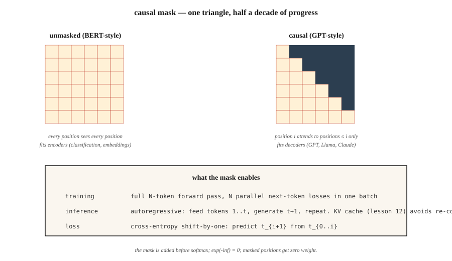

# GPT——因果语言建模

> BERT 两边都看得见,GPT 只看得到过去。那个三角掩码,是现代 AI 里影响最深远的一行代码。

**类型:** 动手构建
**编程语言:** Python
**前置要求:** 第 7 阶段 · 02(自注意力),第 7 阶段 · 05(完整 Transformer),第 7 阶段 · 06(BERT)
**预计耗时:** 约 75 分钟

## 问题

语言模型只回答一个问题:给定前 `t-1` 个 token,第 `t` 个 token 的概率分布是什么?用这个信号——下一个 token 预测——训练,你就得到一个能逐 token 生成任意文本的模型。

要在整条序列上端到端地并行训练,就必须让每个位置的预测只依赖更早的位置。否则模型会直接偷看答案作弊。

因果掩码(causal mask)干的就是这件事。它就是一个上三角为 `-inf` 的矩阵,在 softmax 之前加到注意力分数上。softmax 之后,那些位置的权重变成 0。每个位置只能关注自己和更早的位置。因为对整个序列只施加一次,一次前向就能并行得到 N 个下一 token 预测。

GPT-1(2018)、GPT-2(2019)、GPT-3(2020)、GPT-4(2023)、GPT-5(2025)、Claude、Llama、Qwen、Mistral、DeepSeek、Kimi——它们全是纯解码器因果 Transformer,核心循环相同。把它们区分开的是:数据质量、规模与架构精修,以及后训练(SFT、RLHF、DPO 及它们的后继者)。

## 概念



### 掩码

给定长度为 `N` 的序列,构造一个 `N × N` 矩阵:

```
M[i, j] = 0       if j <= i
M[i, j] = -inf    if j > i
```

在 softmax 之前把 `M` 加到原始注意力分数上。`exp(-inf) = 0`,被遮位置的权重为零。注意力矩阵的每一行,都只对之前的位置形成概率分布。

实现成本:一次 `torch.tril()` 调用。计算耗时:纳秒级。对整个领域的影响:一切。

### 三角形从何而来

掩码通常被讲成一块拴在注意力上的补丁。反着推一遍,它就不再神秘:注意力是"前缀平均"的第三次改良,而三角形就是那次平均的循环边界,写成了矩阵的样子。

**第 1 阶段——前缀平均。** 对序列最笨的因果摘要:位置 `i` 等于位置 `0…i` 的均值。写成循环是 `out[i] = X[:i+1].mean(0)`。同样的计算也可以是一次矩阵乘法:取一个下三角全 1 矩阵,每行除以该行的计数,相乘:

```python
import numpy as np

A = np.tril(np.ones((n, n)))
A = A / A.sum(axis=1, keepdims=True)
out = A @ X
```

`A` 的第 `i` 行是 `[1/(i+1), …, 1/(i+1), 0, …, 0]`。对角线上方的那些 0,就是因果性。未来不是被"遮住"了——它从来就没进过求和。

**第 2 阶段——学习的权重。** 均匀平均把过去每个 token 都当作同等重要。把 1 换成学习的分数矩阵 `S`。现在每行不再天然和为 1,所以用 softmax 归一化,而不是除以计数。softmax 永远不会输出精确的 0,这会破坏因果性——除非未来的分数以 `-inf` 进入,因为 `exp(-inf) = 0`:

```python
def softmax(x, axis):
    e = np.exp(x - np.max(x, axis=axis, keepdims=True))
    return e / e.sum(axis=axis, keepdims=True)

S = S + np.triu(np.full((n, n), -np.inf), k=1)
A = softmax(S, axis=1)
out = A @ X
```

同样的三角形,同样的行随机矩阵,同样的一次矩阵乘法。`-inf` 掩码不是新机器——它是第 1 阶段那些 0 元素,翻译到了 softmax 的输入域。

**第 3 阶段——依赖内容的权重。** 第 2 阶段里,`S` 训练完就固定:不管 token 说了什么,位置 7 给位置 3 的权重都一样。让分数依赖 token 本身:`S = Q @ K.T / sqrt(d_k)`。其他一切不变。掩码、softmax、矩阵乘法——一模一样。

三个阶段,一个不变式:一个下三角行随机矩阵乘以序列。均匀平均、学习的静态权重、依赖内容的权重。掩码从来不是加给注意力的——它是从那次平均里一路活下来的。

```figure
mask-derivation
```

### 并行训练,串行推理

训练:整条 `(N, d_model)` 序列前向一次,算出 N 个交叉熵损失(每个位置一个),求和,反传。沿序列维度并行。这就是 GPT 训练能扩展的原因——一个 batch 一百万 token,GPU 一遍过。

推理:逐 token 生成。喂 `[t1, t2, t3]`,得到 `t4`;喂 `[t1, t2, t3, t4]`,得到 `t5`;喂 `[t1, t2, t3, t4, t5]`,得到 `t6`。KV 缓存(第 12 课)保存 `t1…tn` 的隐状态,免得每步重算。但推理时的串行深度 = 输出长度。这就是自回归税,也是每一个 LLM 的延迟瓶颈所在。

### 损失——移位一格

给定 token `[t1, t2, t3, t4]`:

- 输入:`[t1, t2, t3]`
- 目标:`[t2, t3, t4]`

对每个位置 `i`,计算 `-log P(target_i | inputs[:i+1])`,求和。这就是整条序列的交叉熵。

你听过的每一个 Transformer 语言模型,都是用这个损失训练的。预训练、微调、SFT——同一个损失,不同的数据。

### 解码策略

训练完成之后,采样选择的重要性超乎多数人的想象。

| 方法 | 做什么 | 何时用 |
|--------|--------------|-------------|
| 贪心(Greedy) | 每步取 argmax | 确定性任务、代码补全 |
| 温度(Temperature) | logits 除以 T 再采样 | 创意任务,T 越大多样性越高 |
| Top-k | 只从前 k 个 token 中采样 | 砍掉低概率长尾 |
| Top-p(核采样) | 从累积概率 ≥ p 的最小集合中采样 | 2020 年后的默认;随分布形状自适应 |
| Min-p | 保留 `p > min_p * max_p` 的 token | 2024 年后;拒绝长尾比 top-p 更好 |
| 投机解码 | 草稿模型提议 N 个 token,大模型并行验证 | 同质量下延迟降 2–3 倍 |

2026 年,min-p + 温度 0.7 是开放权重模型的合理默认。投机解码是任何生产推理栈的入场券。

### "GPT 配方"为什么管用

1. **纯解码器。** 没有编码器开销。每层只有一遍注意力 + FFN。
2. **规模化。** 124M → 1.5B → 175B → 万亿级。Chinchilla 扩展定律(第 13 课)告诉你算力该怎么花。
3. **上下文学习(In-context learning)。** 大约在 6B–13B 规模涌现。模型不用微调就能照着 few-shot 示例做。
4. **RLHF。** 基于人类偏好的后训练,把原始的预训练文本变成了聊天助手。
5. **Pre-norm + RoPE + SwiGLU。** 规模化的稳定训练。

核心架构自 GPT-2 以来变化不大。所有有趣的事都发生在数据、规模和后训练上。

```figure
causal-mask
```

## 动手构建

### 第 1 步:因果掩码

见 `code/main.py`,一行:

```python
def causal_mask(n):
    return [[0.0 if j <= i else float("-inf") for j in range(n)] for i in range(n)]
```

在 softmax 之前加到注意力分数上。这就是全部机制。

### 第 2 步:一个 2 层的类 GPT 模型

堆两个解码器块(掩码自注意力 + FFN,无交叉注意力)。加 token 嵌入、位置编码,和一个解嵌入矩阵(与 token 嵌入矩阵共享权重——GPT-2 以来的标准技巧)。

### 第 3 步:端到端的下一 token 预测

在 20 词玩具词表上,产出每个位置的 logits,对移位一格的目标算交叉熵损失。不算梯度——这是前向健全性检查。

### 第 4 步:采样

实现贪心、温度、top-k、top-p、min-p。在同一个固定 prompt 上各跑一遍,比较输出。采样函数只要 10 行。

## 投入使用

PyTorch,2026 年惯用法:

```python
from transformers import AutoModelForCausalLM, AutoTokenizer
model = AutoModelForCausalLM.from_pretrained("meta-llama/Llama-3.2-3B-Instruct")
tok = AutoTokenizer.from_pretrained("meta-llama/Llama-3.2-3B-Instruct")

prompt = "Attention is all you need because"
inputs = tok(prompt, return_tensors="pt")
out = model.generate(
    **inputs,
    max_new_tokens=64,
    temperature=0.7,
    top_p=0.9,
    do_sample=True,
)
print(tok.decode(out[0]))
```

在底层,`generate()` 跑前向、取最后位置的 logits、采样下一个 token、拼接、重复。每一个生产级 LLM 推理栈(vLLM、TensorRT-LLM、llama.cpp、Ollama、MLX)实现的都是同一个循环,只是加了重重优化——批量 prefill、连续批处理、KV 缓存分页、投机解码。

**GPT vs BERT,一句话说清:** GPT 预测 `P(x_t | x_{<t})`,BERT 预测 `P(x_masked | x_unmasked)`。损失决定了模型能不能生成。

## 交付

见 `outputs/skill-sampling-tuner.md`。这个技能为新的生成任务挑选采样参数,并在需要确定性解码时给出提示。

## 练习

1. **易。** 运行 `code/main.py`,验证 softmax 之后的因果注意力矩阵是下三角的。抽查:第 3 行应该只有 0–3 列有权重。
2. **中。** 实现宽度 4 的束搜索(beam search)。在 10 个短 prompt 上比较 beam-4 与贪心的困惑度。束搜索永远赢吗?(提示:翻译任务通常赢,开放式聊天通常不赢。)
3. **难。** 实现投机解码:用一个 2 层小模型做草稿,一个 6 层模型做验证。在 100 条长度 64 的补全上测量墙钟加速比,并确认输出与验证模型的贪心结果一致。

## 关键术语

| 术语 | 人们常说的 | 实际含义 |
|------|-----------------|-----------------------|
| 因果掩码(Causal mask) | "那个三角" | 加到注意力分数上的上三角 `-inf` 矩阵,让位置 `i` 只能看到位置 `≤ i` |
| 下一 token 预测 | "那个损失" | 模型分布在每个位置上相对真实下一 token 的交叉熵 |
| 自回归(Autoregressive) | "一次生成一个" | 把输出喂回输入;只有训练时能并行,生成时不能 |
| Logits | "softmax 前的分数" | 语言模型头在 softmax 之前的原始输出;采样就在它们上面做 |
| 温度(Temperature) | "创意旋钮" | logits 除以 T;T→0 是贪心,T→∞ 是均匀 |
| Top-p | "核采样" | 把分布截断到累积和 ≥ p 的最小集合,从剩下的里采样 |
| Min-p | "比 top-p 好" | 保留 `p ≥ min_p × max_p` 的 token;截断点随分布锐度自适应 |
| 投机解码(Speculative decoding) | "草稿 + 验证" | 便宜模型提议 N 个 token,大模型并行验证 |
| Teacher forcing | "训练技巧" | 训练时喂真实的前一个 token,而不是模型的预测。每个 seq2seq 语言模型的标准做法 |

## 延伸阅读

- [Radford et al. (2018). Improving Language Understanding by Generative Pre-Training](https://cdn.openai.com/research-covers/language-unsupervised/language_understanding_paper.pdf) ——GPT-1
- [Radford et al. (2019). Language Models are Unsupervised Multitask Learners](https://cdn.openai.com/better-language-models/language_models_are_unsupervised_multitask_learners.pdf) ——GPT-2
- [Brown et al. (2020). Language Models are Few-Shot Learners](https://arxiv.org/abs/2005.14165) ——GPT-3 与上下文学习
- [Leviathan, Kalman, Matias (2023). Fast Inference from Transformers via Speculative Decoding](https://arxiv.org/abs/2211.17192) ——投机解码论文
- [HuggingFace `modeling_llama.py`](https://github.com/huggingface/transformers/blob/main/src/transformers/models/llama/modeling_llama.py) ——因果语言模型的典范参考代码
