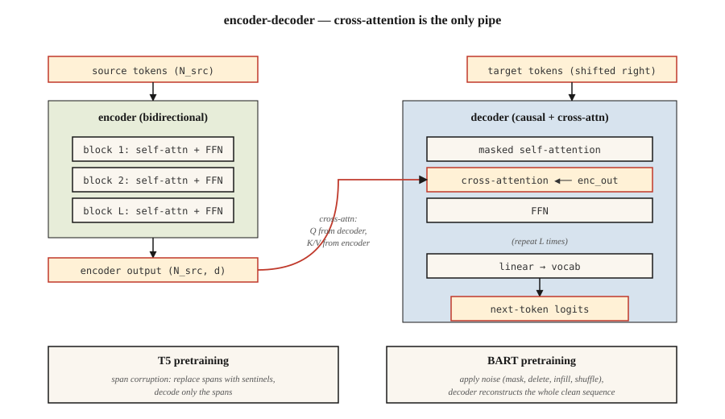

# T5、BART——编码器—解码器模型

> 编码器负责理解,解码器负责生成。把两者装回去,你就得到一个为"输入 → 输出"任务而生的模型:翻译、摘要、改写、转写。

**类型:** 学习
**编程语言:** Python
**前置要求:** 第 7 阶段 · 05(完整 Transformer),第 7 阶段 · 06(BERT),第 7 阶段 · 07(GPT)
**预计耗时:** 约 45 分钟

## 问题

纯解码器的 GPT 和纯编码器的 BERT,各自为不同目标对 2017 年的架构做了裁剪。但很多任务天然就是输入—输出型的:

- 翻译:英语 → 法语。
- 摘要:5,000 token 的文章 → 200 token 的摘要。
- 语音识别:音频 token → 文本 token。
- 结构化抽取:散文 → JSON。

对这类任务,编码器—解码器是最干净的方案。编码器产出源序列的稠密表示,解码器生成输出,每一步都对那份表示做交叉注意力。训练时在输出侧移位一格——与 GPT 同一个损失,只是条件换成了编码器输出。

两篇论文定下了现代玩法:

1. **T5**(Raffel 等人,2019)。"Text-to-Text Transfer Transformer"。把一切 NLP 任务重述为文本进、文本出。单架构、单词表、单损失。预训练用掩码跨度预测(输入中的连续片段被破坏,输出侧把它们解码出来)。
2. **BART**(Lewis 等人,2019)。"Bidirectional and Auto-Regressive Transformer"。去噪自编码器:用多种方式破坏输入(打乱、掩码、删除、旋转),让解码器重建原文。

2026 年,编码器—解码器格式活在输入结构重要的场合:

- Whisper(语音 → 文本)。
- Google 的翻译技术栈。
- 一些有明确"上下文 + 编辑"结构的代码补全 / 修复模型。
- Flan-T5 及其变体,用于结构化推理任务。

纯解码器赢得了聚光灯,但编码器—解码器从未退场。

## 概念



### 前向循环

```
source tokens ─▶ encoder ─▶ (N_src, d_model)  ──┐
                                                 │
target tokens ─▶ decoder block                   │
                 ├─▶ masked self-attention       │
                 ├─▶ cross-attention ◀───────────┘
                 └─▶ FFN
                ↓
              next-token logits
```

关键:编码器对每份输入只跑一遍。解码器自回归运行,但每一步都对*同一份*编码器输出做交叉注意力。缓存编码器输出,对长输入是白捡的加速。

### T5 预训练——跨度破坏

随机挑出输入中的连续片段(平均长度 3 个 token,占总量 15%)。每个片段替换成一个专属哨兵 token:`<extra_id_0>`、`<extra_id_1>` 等。解码器只输出被破坏的片段,带上哨兵前缀:

```
source: The quick <extra_id_0> fox jumps <extra_id_1> dog
target: <extra_id_0> brown <extra_id_1> over the lazy
```

比预测整条序列更省的训练信号。T5 论文的消融显示,它与 MLM(BERT)和 prefix-LM(UniLM)互有胜负。

### BART 预训练——多噪声去噪

BART 试了五种加噪函数:

1. token 掩码。
2. token 删除。
3. 文本填空(text infilling,遮住一个片段,解码器要插入正确长度)。
4. 句子重排。
5. 文档旋转。

文本填空 + 句子重排的组合,下游指标最好。解码器永远重建完整原文。BART 的输出是整条序列,不只是被破坏的片段——所以预训练算力比 T5 高。

### 推理

与 GPT 相同的自回归生成。贪心 / 束搜索 / top-p 采样都适用。束搜索(宽度 4–5)是翻译和摘要的标准做法,因为这类任务的输出分布比聊天窄。

### 2026 年怎么选

| 任务 | 用编码器—解码器? | 原因 |
|------|------------------|-----|
| 翻译 | 通常用 | 源序列明确;输出分布固定;束搜索效果好 |
| 语音转文本 | 用(Whisper) | 输入模态与输出不同;编码器负责塑造音频特征 |
| 聊天 / 推理 | 不用,纯解码器 | 没有固定的"输入"——对话本身就是序列 |
| 代码补全 | 通常不用 | 长上下文的纯解码器更强;Qwen 2.5 Coder 这类代码模型都是纯解码器 |
| 摘要 | 两者皆可 | BART、PEGASUS 曾胜过早期纯解码器基线;现代纯解码器 LLM 已追平 |
| 结构化抽取 | 两者皆可 | T5 很干净,"文本 → 文本"能吸收任何输出格式 |

2022 年以来的趋势:纯解码器不断接管曾属于编码器—解码器的任务,因为(a)指令微调过的纯解码器 LLM 靠提示词就能泛化到一切任务;(b)一套架构比两套更好扩展;(c)RLHF 假设的就是解码器。编码器—解码器守住的阵地是:输入模态不同(语音、图像),或者束搜索质量重要的场合。

```figure
encoder-decoder
```

## 动手构建

见 `code/main.py`。我们在玩具语料上实现 T5 式跨度破坏——这是本课最有用的一件东西,因为此后的每一个编码器—解码器预训练配方里都有它。

### 第 1 步:跨度破坏

```python
def corrupt_spans(tokens, mask_rate=0.15, mean_span=3.0, rng=None):
    """Pick spans summing to ~mask_rate of tokens. Return (corrupted_input, target)."""
    n = len(tokens)
    n_mask = max(1, int(n * mask_rate))
    n_spans = max(1, int(round(n_mask / mean_span)))
    ...
```

目标格式遵循 T5 约定:`<sent0> span0 <sent1> span1 ...`。被破坏的输入,则是未变 token 与片段位置上的哨兵 token 交错排列。

### 第 2 步:验证往返

给定被破坏的输入和目标,重建原句。如果你的破坏是可逆的,前向就是良定义的。这是健全性检查——真实训练从不做这件事,但这个测试很便宜,能抓住跨度记账里的 off-by-one bug。

### 第 3 步:BART 加噪

五个函数:`token_mask`、`token_delete`、`text_infill`、`sentence_permute`、`document_rotate`。组合其中两个,展示结果。

## 投入使用

HuggingFace 参考:

```python
from transformers import T5ForConditionalGeneration, T5Tokenizer
tok = T5Tokenizer.from_pretrained("google/flan-t5-base")
model = T5ForConditionalGeneration.from_pretrained("google/flan-t5-base")

inputs = tok("translate English to French: Attention is all you need.", return_tensors="pt")
out = model.generate(**inputs, max_new_tokens=32)
print(tok.decode(out[0], skip_special_tokens=True))
```

T5 的窍门:任务名直接写进输入文本。同一个模型能处理几十种任务,因为每种任务都是文本进、文本出。2026 年,这个模式已被指令微调的纯解码器模型发扬光大,但把它成文化的是 T5。

## 交付

见 `outputs/skill-seq2seq-picker.md`。这个技能根据输入输出结构、延迟和质量目标,为新任务在编码器—解码器与纯解码器之间做选择。

## 练习

1. **易。** 运行 `code/main.py`,对一个 30 token 的句子施加跨度破坏,验证把源序列中的非哨兵 token 与解码出的目标片段拼接,能还原原句。
2. **中。** 实现 BART 的 `text_infill` 噪声:把随机片段替换成单个 `<mask>` token,解码器必须推断正确的片段长度和内容。给出一个例子。
3. **难。** 在一个迷你的英语 → 猪拉丁语料(200 对)上微调 `flan-t5-small`,在留出的 50 对上测 BLEU。再花同样算力在同样数据上微调 `Llama-3.2-1B`,对比结果。

## 关键术语

| 术语 | 人们常说的 | 实际含义 |
|------|-----------------|-----------------------|
| 编码器—解码器(Encoder-decoder) | "seq2seq Transformer" | 两叠:双向编码器处理输入,带交叉注意力的因果解码器生成输出 |
| 交叉注意力(Cross-attention) | "源与目标对话的地方" | 解码器的 Q × 编码器的 K/V。编码器信息进入解码器的唯一通道 |
| 跨度破坏(Span corruption) | "T5 的预训练技巧" | 把随机片段换成哨兵 token;解码器输出这些片段 |
| 去噪目标(Denoising objective) | "BART 的游戏" | 对输入施加噪声函数,训练解码器重建干净序列 |
| 哨兵 token(Sentinel token) | "`<extra_id_N>` 占位符" | 在源序列中标记被破坏片段、在目标中重新标记的特殊 token |
| Flan | "指令微调版 T5" | 在 1,800 多个任务上微调过的 T5;让编码器—解码器在指令跟随上有了竞争力 |
| 束搜索(Beam search) | "解码策略" | 每一步保留前 k 条部分序列;翻译/摘要的标准做法 |
| Teacher forcing | "训练时的输入" | 训练时给解码器喂真实的上一个输出 token,而不是采样出来的 |

## 延伸阅读

- [Raffel et al. (2019). Exploring the Limits of Transfer Learning with a Unified Text-to-Text Transformer](https://arxiv.org/abs/1910.10683) ——T5
- [Lewis et al. (2019). BART: Denoising Sequence-to-Sequence Pre-training for Natural Language Generation, Translation, and Comprehension](https://arxiv.org/abs/1910.13461) ——BART
- [Chung et al. (2022). Scaling Instruction-Finetuned Language Models](https://arxiv.org/abs/2210.11416) ——Flan-T5
- [Radford et al. (2022). Robust Speech Recognition via Large-Scale Weak Supervision](https://arxiv.org/abs/2212.04356) ——Whisper,2026 年编码器—解码器的代表作
- [HuggingFace `modeling_t5.py`](https://github.com/huggingface/transformers/blob/main/src/transformers/models/t5/modeling_t5.py) ——参考实现
