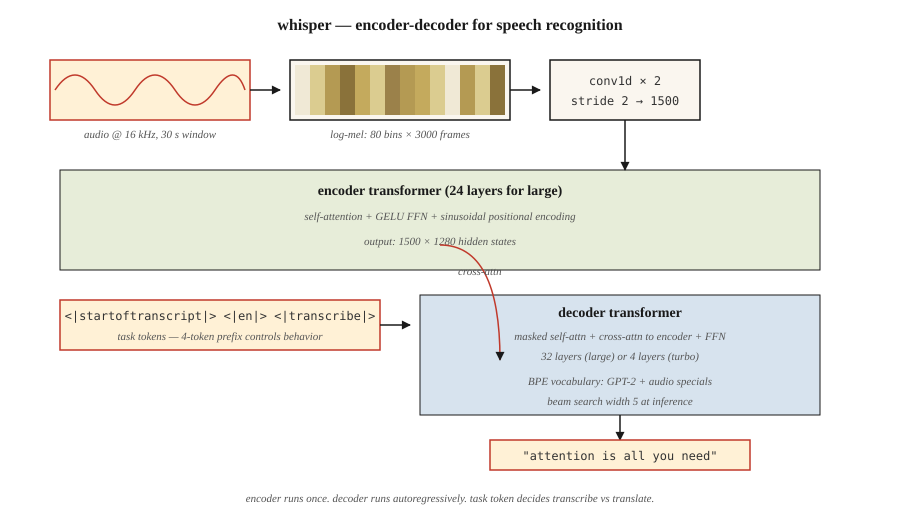

# 音频 Transformer——Whisper 架构

> 音频,就是"频率随时间变化"的一张图。Whisper 是一个吃梅尔频谱图、开口说话的 ViT。

**类型:** 学习
**编程语言:** Python
**前置要求:** 第 7 阶段 · 05(完整 Transformer),第 7 阶段 · 08(编码器—解码器),第 7 阶段 · 09(ViT)
**预计耗时:** 约 45 分钟

## 问题

Whisper 之前(OpenAI,Radford 等人,2022),最先进的自动语音识别(ASR)意味着 wav2vec 2.0 和 HuBERT——自监督特征提取器加微调头。质量高,但数据流水线昂贵,换领域就脆。多语种的语音识别,每个语系都得单独建模。

Whisper 下了三个赌注:

1. **什么都拿来训。** 从互联网抓取的 68 万小时弱标注音频,覆盖 97 种语言。不用干净的学术语料,不标音素。
2. **单模型多任务。** 一个解码器,通过任务 token 联合训练转写、翻译、语音活动检测、语种识别和时间戳。
3. **标准编码器—解码器 Transformer。** 编码器吃对数梅尔频谱图,解码器自回归地产出文本 token。没有声码器,没有 CTC,没有 HMM。

结果:Whisper large-v3 面对各种口音、噪声和零标注数据的语言都很稳健。2026 年,它是每一个开源语音助手——以及大多数商业产品——默认的语音前端。

## 概念



### 第 1 步——重采样 + 加窗

音频 16 kHz。裁剪/补齐到 30 秒。计算对数梅尔频谱图:80 个梅尔频带,10 ms 步长 → 约 3,000 帧 × 80 个特征。这就是 Whisper 看到的"输入图像"。

### 第 2 步——卷积 stem

两层核为 3、步幅为 2 的 Conv1D,把 3,000 帧压到 1,500 帧。序列长度减半,参数却没加多少。

### 第 3 步——编码器

24 层(large 版)Transformer 编码器,作用在 1,500 个时间步上。正弦位置编码、自注意力、GELU FFN。产出 1,500 × 1,280 的隐状态。

### 第 4 步——解码器

24 层 Transformer 解码器。它从一个 BPE 词表(GPT-2 词表的超集,外加几个音频专用特殊 token)中自回归地生成 token。

### 第 5 步——任务 token

解码器的 prompt 以控制 token 开头,告诉模型该做什么:

```
<|startoftranscript|>  <|en|>  <|transcribe|>  <|0.00|>
```

或者

```
<|startoftranscript|>  <|fr|>  <|translate|>   <|0.00|>
```

模型就是按这个约定训练的。靠前缀控制任务。这就是 2026 年所谓指令微调的等价物——只不过用在语音上。

### 第 6 步——输出

束搜索(宽度 5),带对数概率阈值。`<|notimestamps|>` token 缺席时,每 0.02 秒音频预测一次时间戳。

### Whisper 的型号

| 型号 | 参数量 | 层数 | d_model | 头数 | 显存(fp16) |
|-------|--------|--------|---------|-------|-------------|
| Tiny | 39M | 4 | 384 | 6 | ~1 GB |
| Base | 74M | 6 | 512 | 8 | ~1 GB |
| Small | 244M | 12 | 768 | 12 | ~2 GB |
| Medium | 769M | 24 | 1024 | 16 | ~5 GB |
| Large | 1550M | 32 | 1280 | 20 | ~10 GB |
| Large-v3 | 1550M | 32 | 1280 | 20 | ~10 GB |
| Large-v3-turbo | 809M | 32 | 1280 | 20 | ~6 GB(4 层解码器) |

Large-v3-turbo(2024)把解码器从 32 层砍到 4 层。解码快 8 倍,词错率回退不到 1 个点。正是这次解码提速,让 Whisper-turbo 成为 2026 年实时语音智能体的默认选择。

### Whisper 不做什么

- 不做说话人分离(diarization,谁在说话)。需要的话配 pyannote。
- 原生不做实时流式——30 秒窗口是固定的。现代封装(`faster-whisper`、`WhisperX`)用 VAD + 重叠窗口补上流式能力。
- 不做 30 秒以上的长上下文(需要外部分块)。实践中问题不大,因为转写人类语音很少需要长程上下文。

### 2026 年的格局

| 任务 | 模型 | 备注 |
|------|-------|-------|
| 英语 ASR | Whisper-turbo、Moonshine | Moonshine 在边缘端快 4 倍 |
| 多语种 ASR | Whisper-large-v3 | 97 种语言 |
| 流式 ASR | faster-whisper + VAD | 150 ms 延迟目标可达 |
| TTS | Piper、XTTS-v2、Kokoro | 编码器—解码器模式,但长得像 Whisper |
| 音频 + 语言 | AudioLM、SeamlessM4T | 文本 token 与音频 token 进同一个 Transformer |

```figure
n5-mel-decode
```

## 动手构建

见 `code/main.py`。我们不训练 Whisper——我们搭建对数梅尔频谱图流水线 + 任务 token prompt 生成器。这才是你在生产中真正会碰的部分。

### 第 1 步:合成音频

生成 1 秒 440 Hz 正弦波,16 kHz 采样,共 16,000 个采样点。

### 第 2 步:对数梅尔频谱图(简化版)

完整的梅尔频谱图需要 FFT。我们用简化的"分帧 + 逐帧能量"版本,不依赖 `librosa` 也能展示流水线:

```python
def frame_signal(x, frame_size=400, hop=160):
    frames = []
    for start in range(0, len(x) - frame_size + 1, hop):
        frames.append(x[start:start + frame_size])
    return frames
```

帧长 25 ms,步长 10 ms,与 Whisper 的加窗一致。逐帧能量在教学上代替梅尔频带。

### 第 3 步:补齐到 30 秒

Whisper 永远处理 30 秒的块。把频谱图补齐(或裁剪)到 3,000 帧。

### 第 4 步:构造 prompt token

```python
def whisper_prompt(lang="en", task="transcribe", timestamps=True):
    tokens = ["<|startoftranscript|>", f"<|{lang}|>", f"<|{task}|>"]
    if not timestamps:
        tokens.append("<|notimestamps|>")
    return tokens
```

这就是任务控制的全部接口——4 个 token 的前缀。

## 投入使用

```python
import whisper
model = whisper.load_model("large-v3-turbo")
result = model.transcribe("meeting.wav", language="en", task="transcribe")
print(result["text"])
print(result["segments"][0]["start"], result["segments"][0]["end"])
```

更快、兼容 OpenAI 接口:

```python
from faster_whisper import WhisperModel
model = WhisperModel("large-v3-turbo", compute_type="int8_float16")
segments, info = model.transcribe("meeting.wav", vad_filter=True)
for s in segments:
    print(f"{s.start:.2f} - {s.end:.2f}: {s.text}")
```

**2026 年什么时候选 Whisper:**

- 一个模型搞定多语种 ASR。
- 嘈杂、多样音频的稳健转写。
- 研究 / 原型 ASR——最快的起点。

**什么时候选别的:**

- 边缘端超低延迟流式——同质量下 Moonshine 胜过 Whisper。
- 需要 <200 ms 的实时对话 AI——用专门的流式 ASR。
- 说话人分离——Whisper 不做,挂上 pyannote。

## 交付

见 `outputs/skill-asr-configurator.md`。这个技能为新的语音应用挑选 ASR 模型、解码参数和预处理流水线。

## 练习

1. **易。** 运行 `code/main.py`。确认 16 kHz、10 ms 步长下,1 秒信号约 100 帧,30 秒约 3,000 帧。
2. **中。** 用 `numpy.fft` 构建完整的对数梅尔频谱图,验证 80 个梅尔频带与 `librosa.feature.melspectrogram(n_mels=80)` 在数值误差内一致。
3. **难。** 实现流式推理:把音频切成 10 秒窗口、2 秒重叠,逐块跑 Whisper,合并转写结果。在 5 分钟播客样本上,与单次通过对比词错率。

## 关键术语

| 术语 | 人们常说的 | 实际含义 |
|------|-----------------|-----------------------|
| 梅尔频谱图(Mel spectrogram) | "音频图像" | 二维表示:一轴是频带,一轴是时间帧;每格是对数能量 |
| 对数梅尔(Log-mel) | "Whisper 看到的东西" | 过了 log 的梅尔频谱图;近似人耳对响度的感知 |
| 帧(Frame) | "一个时间切片" | 25 ms 的采样窗口,按 10 ms 步长重叠 |
| 任务 token(Task token) | "语音版 prompt 前缀" | 解码器 prompt 里的特殊 token,如 `<\|transcribe\|>` / `<\|translate\|>` |
| 语音活动检测(VAD) | "找到语音" | 在 ASR 前剔除静音的门控;大幅砍成本 |
| CTC | "连接时序分类" | 经典 ASR 损失,免对齐训练;Whisper 不用它 |
| Whisper-turbo | "小解码器,完整编码器" | large-v3 编码器 + 4 层解码器;解码快 8 倍 |
| faster-whisper | "生产封装" | CTranslate2 重实现;int8 量化;比 OpenAI 参考实现快 4 倍 |

## 延伸阅读

- [Radford et al. (2022). Robust Speech Recognition via Large-Scale Weak Supervision](https://arxiv.org/abs/2212.04356) ——Whisper 论文
- [OpenAI Whisper repo](https://github.com/openai/whisper) ——参考代码 + 模型权重。读 `whisper/model.py`,约 400 行看完 Conv1D stem + 编码器 + 解码器全貌
- [OpenAI Whisper — `whisper/decoding.py`](https://github.com/openai/whisper/blob/main/whisper/decoding.py) ——第 5–6 步讲的束搜索 + 任务 token 逻辑就在这里;500 行,完全可读
- [Baevski et al. (2020). wav2vec 2.0: A Framework for Self-Supervised Learning of Speech Representations](https://arxiv.org/abs/2006.11477) ——前身;某些场景下仍是 SOTA 特征
- [SYSTRAN/faster-whisper](https://github.com/SYSTRAN/faster-whisper) ——生产封装,比参考实现快 4 倍
- [Jia et al. (2024). Moonshine: Speech Recognition for Live Transcription and Voice Commands](https://arxiv.org/abs/2410.15608) ——2024 年边缘友好的 ASR,Whisper 形状但更小
- [HuggingFace blog — "Fine-Tune Whisper For Multilingual ASR with 🤗 Transformers"](https://huggingface.co/blog/fine-tune-whisper) ——微调的标准配方,含梅尔频谱图预处理器和 token 时间戳处理
- [HuggingFace `modeling_whisper.py`](https://github.com/huggingface/transformers/blob/main/src/transformers/models/whisper/modeling_whisper.py) ——完整实现(编码器、解码器、交叉注意力、生成),与本课架构图一一对应
