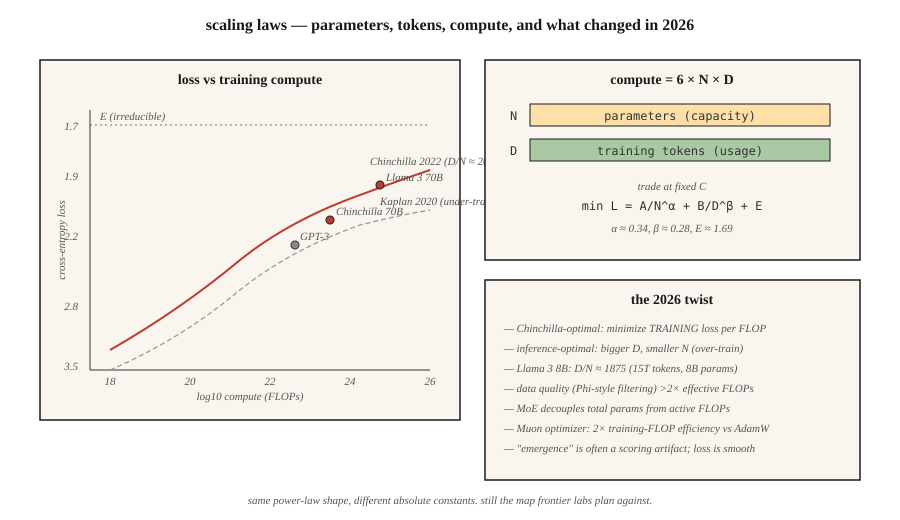

# 扩展定律

> 2020 年的 Kaplan 论文说:模型越大,损失越低。2022 年的 Hoffmann 论文说:你们都训练不足。算力要灌进两个桶——参数和 token——而这个分法,并不显然。

**类型:** 学习
**编程语言:** Python
**前置要求:** 第 7 阶段 · 05(完整 Transformer),第 7 阶段 · 07(GPT)
**预计耗时:** 约 45 分钟

## 问题

手里有 C 个 FLOPs 的训练算力,想要最好的模型,你面前有两个旋钮:

1. **多少参数(N)?** 模型越大,容量越高。
2. **多少训练 token(D)?** 数据越多,容量利用越充分。

FLOPs 约等于 `6 × N × D`。你可以把 N 推高、D 压低,或者反过来。哪个更好?

2022 年之前,答案是"猛推 N"。GPT-3(2020)是 175B 参数、约 300B token 训出来的,比例约 1.7 token/参数。Kaplan 扩展定律为这个做法背书。

Hoffmann 等人(2022)训练了一族叫 Chinchilla 的小模型,发现了不同的答案:最优比例接近 **20 token/参数**。GPT-3 欠训了 10 倍。Chinchilla(70B 参数、1.4T token)在每个基准上都击败 GPT-3(175B、300B token),推理成本还只有它的 2/5。

2026 年是 Chinchilla 的世界——但有一个重要的转折。Llama 3 8B 用了 15 万亿 token 训练,比例是 1,875 token/参数,是 Chinchilla 最优值的 94 倍。对会被大规模使用的模型来说,推理成本比训练成本更重要,所以"过训练"(超过 Chinchilla 最优)换取更小的部署体积,是 2026 年的默认策略。

## 概念



### Hoffmann 定律

来自 Chinchilla 论文,损失遵循:

```
L(N, D) = A / N^α + B / D^β + E
```

- `N` = 参数量(不含嵌入)。
- `D` = 训练 token 数。
- `α ≈ 0.34`,`β ≈ 0.28`(大致对称)。
- `E ≈ 1.69`,不可约的损失下限。
- `A ≈ 406`,`B ≈ 411`。

两项在扩展过程中此消彼长。固定算力(C = 6ND)对 `N` 求导并解出:

```
N_opt ≈ 0.6 × (C/6)^0.5
D_opt ≈ 0.6 × (C/6)^0.5
D_opt / N_opt ≈ 20
```

算力最优:20 token/参数。

### 那为什么还要过训练

Chinchilla 最优最小化的是"单位训练 FLOP 换来的训练损失"。但训练成本只付一次,推理成本要付一辈子。

对一个月服务一万亿 token 的聊天机器人来说,推理占成本大头。Llama 的做法:小模型,久训练。8B 配 15T token,是为推理深度优化过的:

- 消费级 GPU 装得下。
- 延迟是 70B Chinchilla 最优模型的零头。
- 质量对大多数任务来说足够接近。

DeepMind 2024 年的论文(《Over-training is the new optimal》)把这一点形式化了:对推理主导的工作负载,正确比例接近 100–500 token/参数,具体取决于服务量。

### 涌现 vs 平滑

一种说法:某些能力(算术、多步推理、思维链跟随)会在某个规模"突然涌现"。

Schaeffer 等人(2023)论证这是度量假象:所谓涌现指标用的是不连续打分(精确匹配、阈值准确率),掩盖了底层 logits 的平滑进步。连续指标(交叉熵)画出来的是平滑曲线。

2026 年的共识:用连续损失做预测是可靠的;基准分数的跳变常常是打分器的产物。做预算规划,要对着连续指标做。

### 2026 年的图景

扩展定律依然有效,但是:

| 因素 | 改变了什么 |
|--------|-------------|
| 数据质量 | 精选"好" token(Phi 风格)能让曲线平移,等效算力差 2 倍以上 |
| MoE | 总参数与激活 FLOPs 解耦;扩展定律要按激活 FLOPs 算 |
| 后训练 | 某些能力(指令跟随、代码)随 SFT+RLHF 的变化大于预训练 |
| 多模态 | 图像与文本 token 一起扩展;每个模态各有曲线 |
| 合成数据 | 模型自产训练数据;等效算力可以复利 |

Muon 优化器(Kimi Moonlight,2024)在同等数据下相对 AdamW 有约 2 倍的等效算力增益。2026 年的一些训练已默认使用 Muon。它改变的是扩展定律里的绝对常数,不是形状。

```figure
scaling-laws
```

## 动手构建

见 `code/main.py`。我们实现 Chinchilla 损失方程,并在若干算力预算下分别解出算力最优的 `(N, D)`。

### 第 1 步:Chinchilla 损失

```python
def chinchilla_loss(N, D, A=406.4, B=410.7, alpha=0.34, beta=0.28, E=1.69):
    return A / N ** alpha + B / D ** beta + E
```

固定 `C = 6ND`,在 `(N, D)` 平面上画 `L` 的等高线,找最小值。

### 第 2 步:算力最优前沿

对 `1e17` 到 `1e25` FLOPs 的算力预算,在 `6ND = C` 约束下找最小损失的 `(N, D)`。验证比例 `D/N ≈ 20`。

### 第 3 步:过训练的成本

计算把模型缩小 10 倍(N 取最优值的 1/10,D 取 10 倍)要多付多少损失,同时报告换来的推理 FLOPs 节省(与 N 成正比)。

### 第 4 步:与真实模型对比

代入 GPT-3、Chinchilla、Llama 3 8B、DeepSeek-V3(激活参数)的已知 `(N, D)`,比较预测损失与公布损失。

## 投入使用

你大概率不会亲手训练前沿模型。但扩展定律能告诉你:

1. **你的微调数据够不够。** 如果任务专属数据低于基座模型 20 token/参数,就等着在某个损失地板上饱和。
2. **该不该选更大的基座。** 如果预算全花在推理上,优先选更小、训得更久的模型。
3. **收益在哪里递减。** 超过 1,000 倍 Chinchilla 最优之后,对数损失的变化就是噪声了。

**2026 年的研究走向:**

- **数据受限时代。** 互联网上的高质量 token 是有限的(过滤后约 5–10 万亿英文 token)。前沿预训练正在逼近这个天花板。合成数据、多语种、多模态和 RLHF 规模化的微调,是下一批杠杆。
- **算力乘数技巧。** Muon 优化器、MoE、更好的数据精选——每一个都移动绝对常数,不动渐近线。
- **RL 的扩展定律。** 开放问题。早期证据显示它随 RL 样本量呈幂律,但指数与预训练很不一样。

## 交付

见 `outputs/skill-training-budget-estimator.md`。这个技能根据算力预算、部署约束和目标损失,为新的训练任务挑选 `(N, D, 时长, GPU)`。

## 练习

1. **易。** 运行 `code/main.py`,打印算力预算 `1e20`、`1e22`、`1e24` 下的 Chinchilla 最优 `(N, D)`,与真实模型表对比。
2. **中。** 实现 Hoffmann 的"损失随算力变化"曲线,画出算力最优前沿上损失对 `log10(C)` 的图。找出定律预测"再降 0.1 交叉熵需要 >10^28 FLOPs"的拐点。
3. **难。** 在同一数据集上训练 5 个迷你模型(100K 到 10M 参数),拟合你自己的扩展定律,估计 `α` 和 `E`。你的指数与公开值吻合得如何?

## 关键术语

| 术语 | 人们常说的 | 实际含义 |
|------|-----------------|-----------------------|
| 参数(N) | "模型大小" | 不含嵌入的权重数量;决定容量 |
| Token(D) | "训练数据" | 见过的训练 token 数;决定参数被利用得多充分 |
| 算力(C) | "花掉的 FLOPs" | 标准 Transformer 约为 `6 × N × D` |
| Chinchilla 最优 | "D/N ≈ 20" | 使单位预训练 FLOP 的损失最小的比例 |
| 过训练(Over-training) | "超过 Chinchilla" | 多付训练 FLOPs 以省推理 FLOPs;D/N 远大于 20 |
| 不可约损失(Irreducible loss) | "那个地板" | 扩展定律中的 `E` 项;数据本身的熵 |
| 涌现能力(Emergent capability) | "到了规模突然会了" | 常常是打分器的产物;连续损失是平滑的 |
| 等效算力(Effective compute) | "训练效率乘数" | 更好的数据 / 优化器 / 架构,让每个 FLOP 走得更远 |

## 延伸阅读

- [Kaplan et al. (2020). Scaling Laws for Neural Language Models](https://arxiv.org/abs/2001.08361) ——第一篇扩展定律论文;模型欠训
- [Hoffmann et al. (2022). Training Compute-Optimal Large Language Models](https://arxiv.org/abs/2203.15556) ——Chinchilla
- [Schaeffer et al. (2023). Are Emergent Abilities of Large Language Models a Mirage?](https://arxiv.org/abs/2304.15004) ——涌现即度量假象
- [Sardana, Frankle (2024). Beyond Chinchilla-Optimal: Accounting for Inference in Language Model Scaling Laws](https://arxiv.org/abs/2401.00448) ——为什么 Llama 的过训练对它的负载而言是对的
- [Jordan et al. (2024). Muon: An optimizer for hidden layers in neural networks](https://kellerjordan.github.io/posts/muon/) ——2 倍算力乘数
