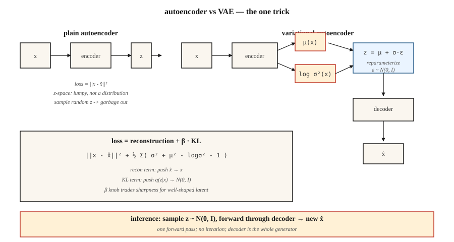

# 自编码器与变分自编码器(VAE)

> 朴素自编码器先压缩再重建。它在记忆,不在生成。加一个技巧——逼编码看起来像高斯——你就得到了一个采样器。正是这一个技巧,`z = μ + σ·ε` 的重参数化,让 2026 年你用的每一个潜在扩散和 flow matching 图像模型,输入端都立着一个 VAE。

**类型:** 动手构建
**编程语言:** Python
**前置要求:** 第 3 阶段第 02 课(反向传播)、第 3 阶段第 07 课(CNN)、第 8 阶段第 01 课(分类法)
**预计耗时:** 约 75 分钟

## 问题

把一张 784 像素的 MNIST 数字压成 16 个数的编码,再重建。朴素自编码器的重建 MSE 会很漂亮,但编码空间是一团乱麻。在编码空间里随便取一个点解码,得到的是噪声。它没有采样器,只是个披着生成外衣的压缩模型。

你真正想要的是:(a) 编码空间是一个干净、平滑、可以采样的分布——比如各向同性高斯 `N(0, I)`;(b) 解码任意样本都能得到一张像样的数字;(c) 编码器和解码器的压缩能力依然在线。三个目标,一个架构,一个损失。

Kingma 2013 年的 VAE 这样解决:训练编码器输出一个*分布* `q(z|x) = N(μ(x), σ(x)²)`,用 KL 惩罚把这个分布拉向先验 `N(0, I)`,解码前从 `q(z|x)` 中采样 `z`。推理时丢掉编码器,采 `z ~ N(0, I)`,解码。正是 KL 惩罚,逼出了编码空间的结构。

2026 年,VAE 很少单独交付——论原始图像质量它已被扩散碾压——但它是每一个潜在扩散模型(SD 1/2/XL/3、Flux、AudioCraft)的首选编码器。学会 VAE,你就看穿了你用的每条图像流水线里那个隐形的第一层。

## 概念



**自编码器。** `z = encoder(x)`,`x̂ = decoder(z)`,损失 = `||x - x̂||²`。编码空间无结构。

**VAE 编码器。** 输出两个向量:`μ(x)` 和 `log σ²(x)`。它们定义 `q(z|x) = N(μ, diag(σ²))`。

**重参数化技巧。** 从 `q(z|x)` 采样不可微。把采样改写成 `z = μ + σ·ε`,其中 `ε ~ N(0, I)`。现在 `z` 是 `(μ, σ)` 的确定性函数外加一份无参噪声——梯度可以流过 `μ` 和 `σ`。

**损失。** 证据下界(ELBO),两项:

```
loss = reconstruction + β · KL[q(z|x) || N(0, I)]
     = ||x - x̂||²  + β · Σ_i ( σ_i² + μ_i² - log σ_i² - 1 ) / 2
```

重建项把 `x̂` 推向 `x`,KL 项把 `q(z|x)` 推向先验。两者相互权衡。β 小(<1)= 样本更锐利,编码空间不那么高斯;β 大(>1)= 编码空间更干净,样本更模糊。β-VAE(Higgins 2017)让这个旋钮出了名,并开启了表征解耦(disentanglement)研究。

**采样。** 推理时:采 `z ~ N(0, I)`,过一次解码器。一次前向——不像扩散那样迭代采样。

```figure
vae-latent-grid
```

## 动手构建

`code/main.py` 实现了一个不用 numpy、不用 torch 的迷你 VAE。输入是 8 维合成数据,取自 8 维空间中的两组分高斯混合。编码器和解码器都是单隐层 MLP。我们手写 tanh 激活、前向、损失和反向传播。不为生产,为教学。

### 第 1 步:编码器前向

```python
def encode(x, enc):
    h = tanh(add(matmul(enc["W1"], x), enc["b1"]))
    mu = add(matmul(enc["W_mu"], h), enc["b_mu"])
    log_sigma2 = add(matmul(enc["W_sig"], h), enc["b_sig"])
    return mu, log_sigma2
```

用 `log σ²` 而不是 `σ`,网络输出才不受约束(对 σ 加 softplus 是个坑——σ ≈ 0 时梯度会死)。

### 第 2 步:重参数化与解码

```python
def reparameterize(mu, log_sigma2, rng):
    eps = [rng.gauss(0, 1) for _ in mu]
    sigma = [math.exp(0.5 * lv) for lv in log_sigma2]
    return [m + s * e for m, s, e in zip(mu, sigma, eps)]

def decode(z, dec):
    h = tanh(add(matmul(dec["W1"], z), dec["b1"]))
    return add(matmul(dec["W_out"], h), dec["b_out"])
```

### 第 3 步:ELBO

```python
def elbo(x, x_hat, mu, log_sigma2, beta=1.0):
    recon = sum((a - b) ** 2 for a, b in zip(x, x_hat))
    kl = 0.5 * sum(math.exp(lv) + m * m - lv - 1 for m, lv in zip(mu, log_sigma2))
    return recon + beta * kl, recon, kl
```

两边都是高斯,KL 有精确闭式解,不要数值积分。2026 年还有人交付用蒙特卡洛估计 KL 的代码——平白慢 3 倍。

### 第 4 步:生成

```python
def sample(dec, z_dim, rng):
    z = [rng.gauss(0, 1) for _ in range(z_dim)]
    return decode(z, dec)
```

这就是生成模型。五行。

## 陷阱

- **后验坍缩(posterior collapse)。** KL 项太强势,把 `q(z|x) → N(0, I)`,`z` 不再携带 `x` 的任何信息。修复:β 退火(从 β=0 缓升到 1)、free bits,或跳过不活跃维度上的 KL。
- **样本模糊。** 高斯解码似然隐含 MSE 重建,而 MSE 的贝叶斯最优是均值——一堆"像样的数字"的均值就是一张模糊的数字。修复:离散解码器(VQ-VAE、NVAE);或者只把 VAE 当编码器,在潜在表示上叠扩散(Stable Diffusion 就是这么干的)。
- **β 太大、加太早。** 见后验坍缩。从 β≈0.01 起步缓升。
- **潜在维度太小。** MNIST 用 16 维,ImageNet 256² 用 256 维,ImageNet 1024² 用 2048 维。Stable Diffusion 的 VAE 把 512×512×3 压到 64×64×4(空间面积缩 64 倍,通道 3→4)。

## 投入使用

2026 年的 VAE 选型:

| 场景 | 选择 |
|-----------|------|
| 扩散模型的图像潜在编码器 | Stable Diffusion VAE(`sd-vae-ft-ema`)或 Flux VAE |
| 音频潜在编码器 | Encodec(Meta)、SoundStream 或 DAC(Descript) |
| 视频潜在表示 | Sora 时空 patch、Latte VAE、WAN VAE |
| 解耦表示学习 | β-VAE、FactorVAE、TCVAE |
| 离散潜在(给 Transformer 建模) | VQ-VAE、RVQ(残差 VQ) |
| 连续潜在做生成 | 朴素 VAE,然后在该潜在空间上条件化一个 flow/扩散模型 |

潜在扩散模型 = 一个 VAE,编码器和解码器之间住着个扩散模型。VAE 负责粗压缩,扩散模型干重活。视频同理(VAE + 视频扩散 DiT),音频同理(Encodec + MusicGen Transformer)。

## 交付

保存 `outputs/skill-vae-trainer.md`。

技能输入:数据集画像 + 目标潜在维度 + 下游用途(重建、采样,还是作潜在扩散的输入);输出:架构选择(朴素/β/VQ/RVQ)、β 调度、潜在维度、解码器似然(高斯 vs 类别分布),以及评估方案(重建 MSE、逐维 KL、`q(z|x)` 与 `N(0, I)` 之间的 Fréchet 距离)。

## 练习

1. **易。** 把 `code/main.py` 里的 `β` 改成 `0.01`、`0.1`、`1.0`、`5.0`。记录最终重建 MSE 和 KL。对你的合成数据,哪个 β 是帕累托最优?
2. **中。** 把高斯解码似然换成 Bernoulli 似然(交叉熵损失)。在同一份合成数据的二值化版本上对比样本质量。
3. **难。** 把 `code/main.py` 扩成迷你 VQ-VAE:连续 `z` 换成在 K=32 条目的码本中做最近邻查找。对比重建 MSE,并报告有多少码本条目被用到(码本坍缩是真实存在的)。

## 关键术语

| 术语 | 人们常说的是 | 实际含义是 |
|------|-----------------|-----------------------|
| 自编码器 | "编码-解码网络" | `x → z → x̂`,学 MSE。不是生成模型。 |
| VAE | "带采样器的 AE" | 编码器输出分布,KL 惩罚塑造编码空间。 |
| ELBO | "证据下界" | `log p(x) ≥ recon - KL[q(z\|x) \|\| p(z)]`;当 `q = p(z\|x)` 时取等。 |
| 重参数化 | `z = μ + σ·ε` | 把随机节点改写成 确定性 + 纯噪声,让梯度穿过采样。 |
| 先验 | `p(z)` | 潜在表示的目标分布,通常 `N(0, I)`。 |
| 后验坍缩 | "KL 项赢了" | 编码器无视 `x`、输出先验;解码器只能靠幻觉重建。 |
| β-VAE | "可调 KL 权重" | `loss = recon + β·KL`。β 越高越解耦,但越模糊。 |
| VQ-VAE | "离散潜在" | 连续 `z` 换成最近码本向量;此后可用 Transformer 建模。 |

## 生产注记:VAE 是扩散服务器里最热的路径

在 Stable Diffusion / Flux / SD3 流水线里,VAE 每个请求被调用两次:编码一次(img2img / 局部重绘时),解码一次。1024² 分辨率下,解码前向往往是整条流水线中最大的激活内存尖峰,因为它要把 `128×128×16` 的潜在表示上采样回 `1024×1024×3`。两个实践推论:

- **切片或分块解码。** `diffusers` 提供 `pipe.vae.enable_slicing()` 和 `pipe.vae.enable_tiling()`。分块用一点接缝瑕疵,把内存从 `O(H·W)` 换成 `O(tile²)`。消费级 GPU 上跑 1024²+ 必开。
- **解码器用 bf16,最后的 resize 保持 fp32 数值。** SD 1.x 的 VAE 以 fp32 发布,1024²+ 下转成 fp16 会*悄悄产出 NaN*。SDXL 官方发布了 `madebyollin/sdxl-vae-fp16-fix`——永远优先用 fp16-fix 变体,或用 bf16。

## 延伸阅读

- [Kingma & Welling (2013). Auto-Encoding Variational Bayes](https://arxiv.org/abs/1312.6114) — VAE 论文。
- [Higgins et al. (2017). β-VAE: Learning Basic Visual Concepts with a Constrained Variational Framework](https://openreview.net/forum?id=Sy2fzU9gl) — 解耦 β-VAE。
- [van den Oord et al. (2017). Neural Discrete Representation Learning](https://arxiv.org/abs/1711.00937) — VQ-VAE。
- [Vahdat & Kautz (2021). NVAE: A Deep Hierarchical Variational Autoencoder](https://arxiv.org/abs/2007.03898) — SOTA 图像 VAE。
- [Rombach et al. (2022). High-Resolution Image Synthesis with Latent Diffusion Models](https://arxiv.org/abs/2112.10752) — Stable Diffusion;VAE 作编码器。
- [Défossez et al. (2022). High Fidelity Neural Audio Compression](https://arxiv.org/abs/2210.13438) — Encodec,音频 VAE 标准。
