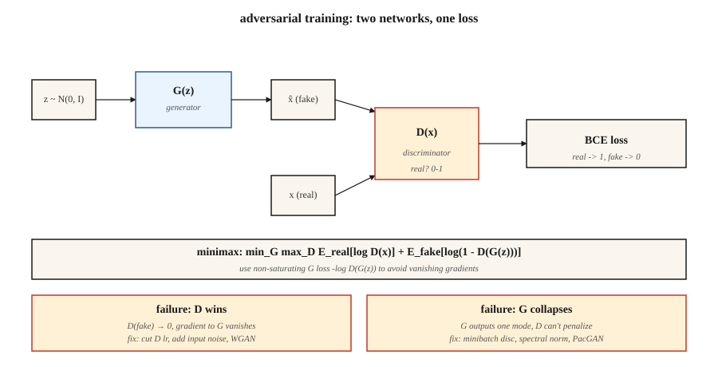

# GAN —— 生成器 vs 判别器

> Goodfellow 2014 年的戏法,是彻底绕开密度。两个网络:一个造假,一个抓假。它们互相搏斗,直到假货与真货无法区分。这按理不该有效,实际上也经常无效。但一旦有效,在窄领域上,它的样本至今是文献中最锐利的。

**类型:** 动手构建
**编程语言:** Python
**前置要求:** 第 3 阶段第 02 课(反向传播)、第 3 阶段第 08 课(优化器)、第 8 阶段第 02 课(VAE)
**预计耗时:** 约 75 分钟

## 问题

VAE 的样本模糊,因为它的 MSE 解码损失对*均值*图像是贝叶斯最优的——而一堆"像样的数字"的均值,就是一张模糊的数字。你要的是一种奖励*逼真度*的损失,而不是与某个目标逐像素的接近。"逼真"没有闭式表达,只能学出来。

Goodfellow 的想法:训一个分类器 `D(x)` 区分真图与假图,训一个生成器 `G(z)` 去骗 `D`。给 `G` 的损失信号,就是 `D` 当前认为"什么东西看起来真"的判断。这个信号随 `G` 变强而更新,是移动靶。如果两个网络都收敛,`G` 就在从没写下 `log p(x)` 的情况下学会了数据分布。

这就是对抗训练。数学上是一个极小极大博弈:

```
min_G max_D  E_real[log D(x)] + E_fake[log(1 - D(G(z)))]
```

2026 年,GAN 已不再是 SOTA 生成器(扩散和 flow matching 抢走了王座)。但 StyleGAN 2/3 仍是有史以来最锐利的人脸模型;GAN 判别器被用作扩散训练中的*感知损失*;对抗训练还驱动着让你能交付实时扩散的一步蒸馏(SDXL-Turbo、SD3-Turbo、LCM)。

## 概念



**生成器 `G(z)`。** 把噪声向量 `z ~ N(0, I)` 映射成样本 `x̂`。解码器形状的网络(全连接或转置卷积)。

**判别器 `D(x)`。** 把样本映射成标量概率(或分数)。真 → 1,假 → 0。

**损失。** 两个交替更新:

- **训 `D`:** `loss_D = -[ log D(x) + log(1 - D(G(z))) ]`。真=1、假=0 的二元交叉熵。
- **训 `G`:** `loss_G = -log D(G(z))`。这是 Goodfellow 用的*非饱和*形式(原始的 `log(1 - D(G(z)))` 在 `D` 很自信时会饱和,杀死梯度)。

**训练循环。** 一步 `D`,一步 `G`,循环往复。

**为什么有效。** 若 `G` 完美匹配 `p_data`,`D` 最多只能瞎猜,处处输出 0.5,`G` 不再收到梯度。均衡达成。

**为什么翻车。** 模式崩塌(`G` 找到一个 `D` 分不出来的众数,然后永远只产它)、梯度消失(`D` 学得太快,`log D` 饱和)、训练不稳定(学习率、批次大小、什么都能引爆)。

## 让 GAN 真正跑得起来的变体

| 年份 | 创新 | 修复了什么 |
|------|------------|-----|
| 2015 | DCGAN | 卷积/反卷积、批归一化、LeakyReLU——第一个稳定架构。 |
| 2017 | WGAN、WGAN-GP | BCE 换成 Wasserstein 距离 + 梯度惩罚。修复梯度消失。 |
| 2017 | 谱归一化 | 给判别器加上 Lipschitz 界。2026 年的判别器仍在用。 |
| 2018 | Progressive GAN | 先训低分辨率,再逐层加。第一批百万像素结果。 |
| 2019 | StyleGAN / StyleGAN2 | 映射网络 + 自适应实例归一化。固定领域照片级真实感的 SOTA。 |
| 2021 | StyleGAN3 | 抗混叠、平移等变——2026 年仍是人脸金标准。 |
| 2022 | StyleGAN-XL | 条件化、类别感知、更大规模。 |
| 2024 | R3GAN | 更强正则化的新包装;1024² 上不耍花招也能训练。 |

```figure
gan-minimax
```

## 动手构建

`code/main.py` 在 1 维数据上训练迷你 GAN:数据是两组分高斯混合,生成器和判别器都是单隐层 MLP。前向、反向和极小极大循环全部手写。目标是亲眼看到两个关键失败模式(模式崩塌 + 梯度消失)如何发生。

### 第 1 步:非饱和损失

朴素的 Goodfellow 损失 `log(1 - D(G(z)))`,在 D 以高置信度把 G 的假图判为假时趋于 0,此时 G 的梯度基本为零——G 无法改进。非饱和形式 `-log D(G(z))` 的渐近行为相反:D 越自信它越大,给 G 强信号。

```python
def g_loss(d_fake):
    # maximize log D(G(z))  <=>  minimize -log D(G(z))
    return -sum(math.log(max(p, 1e-8)) for p in d_fake) / len(d_fake)
```

### 第 2 步:一步判别器配一步生成器

```python
for step in range(steps):
    # train D
    real_batch = sample_real(batch_size)
    fake_batch = [G(z) for z in sample_noise(batch_size)]
    update_D(real_batch, fake_batch)

    # train G
    fake_batch = [G(z) for z in sample_noise(batch_size)]  # fresh fakes
    update_G(fake_batch)
```

给 G 用新鲜假图,否则梯度是陈旧的。

### 第 3 步:盯模式崩塌

```python
if step % 200 == 0:
    samples = [G(z) for z in sample_noise(500)]
    mode_a = sum(1 for s in samples if s < 0)
    mode_b = 500 - mode_a
    if min(mode_a, mode_b) < 50:
        print("  [!] mode collapse: one mode is starved")
```

经典症状:两个真实众数中有一个不再被生成。判别器也不再纠正它,因为它从没以假图身份出现过。

## 陷阱

- **判别器太强。** 把 D 的学习率降 2–5 倍,或加实例/层噪声。D 准确率超过 95%,G 就死了。
- **生成器记住一个众数。** 给 D 的输入加噪、用 minibatch 判别层,或换 WGAN-GP。
- **批归一化泄漏统计量。** 真批次和假批次流过同一个 BN 层会混合统计量。改用实例归一化或谱归一化。
- **Inception Score 刷分。** FID 和 IS 在样本少时噪声大。评估至少用 1 万样本。
- **对条件任务,"一次采样"是谎言。** 你仍然需要 CFG 强度、截断技巧和反复重采,才能拿到可用输出。

## 投入使用

2026 年的 GAN 选型:

| 场景 | 选择 |
|-----------|------|
| 固定姿态照片级人脸 | StyleGAN3(最锐利、最小) |
| 动漫 / 风格化人脸 | StyleGAN-XL 或 Stable Diffusion LoRA |
| 图到图翻译 | Pix2Pix / CycleGAN(第 8 阶段第 04 课)或 ControlNet(第 8 阶段第 08 课) |
| 一步文生图 | 扩散的对抗蒸馏(SDXL-Turbo、SD3-Turbo) |
| 扩散训练器内的感知损失 | 在图像切块上放一个小 GAN 判别器 |
| 任何多模态、开放式任务 | 别用 GAN——用扩散或 flow matching |

GAN 锐利但狭窄。领域一打开——照片、任意文本提示、视频——就换扩散。对抗戏法如今以组件形态活着(感知损失、蒸馏),不再是独立的生成器。

## 交付

保存 `outputs/skill-gan-debugger.md`。技能输入:一个失败的 GAN run(损失曲线、样本网格、数据集规模);输出:按可能性排序的原因列表、一行修复方案,以及重跑协议。

## 练习

1. **易。** 用默认配置跑 `code/main.py`,再设 `D_LR = 5 * G_LR` 重跑。G 的损失多快坍缩成常数?
2. **中。** 把 Goodfellow BCE 损失换成 WGAN 损失:`loss_D = E[D(fake)] - E[D(real)]`,`loss_G = -E[D(fake)]`,并把 D 的权重钳到 `[-0.01, 0.01]`。训练更稳了吗?对比墙钟收敛时间。
3. **难。** 把 1 维示例扩到 2 维(圆环上 8 组分高斯混合)。跟踪第 1k、5k、10k 步时生成器覆盖了 8 个众数中的几个。实现 minibatch 判别后重新测量。

## 关键术语

| 术语 | 人们常说的是 | 实际含义是 |
|------|-----------------|-----------------------|
| 生成器 | "G" | 噪声到样本的网络,`G: z → x̂`。 |
| 判别器 | "D" | 分类器 `D: x → [0, 1]`,分真假。 |
| 极小极大 | "博弈" | 联合目标上的 `min_G max_D`。 |
| 非饱和损失 | "那个修复" | G 用 `-log D(G(z))` 替代 `log(1 - D(G(z)))`。 |
| 模式崩塌 | "G 只记住一样东西" | 数据很多样,生成器却只产出寥寥几种输出。 |
| WGAN | "Wasserstein" | BCE 换成推土机距离 + 梯度惩罚;梯度更平滑。 |
| 谱归一化 | "Lipschitz 技巧" | 约束 D 的权重范数以限制其斜率;稳定训练。 |
| StyleGAN | "真正work的那个" | 映射网络 + AdaIN;人脸最强,2026 年依然是。 |

## 生产注记:一步推理是 GAN 最后的优势

GAN 在开放域生成的样本质量上已不占优,但推理成本上仍然赢。用生产推理文献的词汇说,GAN 具备:

- **没有 prefill,没有 decode。** 单次 `G(z)` 前向。TTFT ≈ 总延迟。
- **没有 KV-cache 压力。** 唯一状态是权重。批次上限由激活内存决定,不受缓存限制。
- **连续批处理 trivial。** 每个请求的 FLOPs 固定相同,按服务器目标占用率攒一个静态批次通常就是最优,不需要在途调度器。

这就是为什么 GAN 蒸馏(SDXL-Turbo、SD3-Turbo、ADD、LCM)是 2026 年快速文生图的主流技术:它把 20–50 步的扩散流水线压成 1–4 次 GAN 式前向,同时保住扩散基座的分布。对抗损失以训练期旋钮的身份活着,专门负责把慢生成器变快。

## 延伸阅读

- [Goodfellow et al. (2014). Generative Adversarial Nets](https://arxiv.org/abs/1406.2661) — GAN 原始论文。
- [Radford et al. (2015). Unsupervised Representation Learning with DCGAN](https://arxiv.org/abs/1511.06434) — 第一个稳定架构。
- [Arjovsky, Chintala, Bottou (2017). Wasserstein GAN](https://arxiv.org/abs/1701.07875) — WGAN。
- [Miyato et al. (2018). Spectral Normalization for GANs](https://arxiv.org/abs/1802.05957) — 谱归一化。
- [Karras et al. (2020). Analyzing and Improving the Image Quality of StyleGAN](https://arxiv.org/abs/1912.04958) — StyleGAN2。
- [Karras et al. (2021). Alias-Free Generative Adversarial Networks](https://arxiv.org/abs/2106.12423) — StyleGAN3。
- [Sauer et al. (2023). Adversarial Diffusion Distillation](https://arxiv.org/abs/2311.17042) — SDXL-Turbo。
