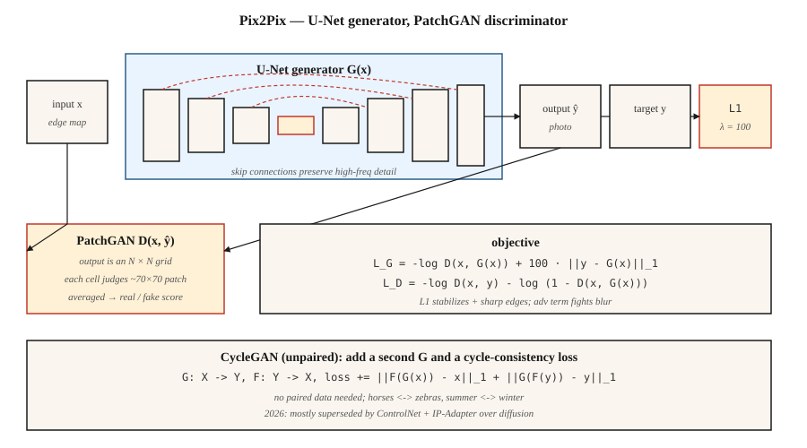

# 条件 GAN 与 Pix2Pix

> 2014–2017 年的第一个重大突破,是控制 GAN 产出的内容:附上标签、图像或句子。Pix2Pix 做的是图像版本,而在窄域图到图任务上,它至今击败每一个通用文生图模型。

**类型:** 动手构建
**编程语言:** Python
**前置要求:** 第 8 阶段第 03 课(GAN)、第 4 阶段第 06 课(U-Net)、第 3 阶段第 07 课(CNN)
**预计耗时:** 约 75 分钟

## 问题

无条件 GAN 采样出任意人脸——做演示可以,上生产没用。你要的是:*把草图变成照片*、*把地图变成航拍图*、*把白天场景变成夜晚*、*给灰度图上色*。这些任务的共同点:给定输入图像 `x`,输出一张与它有语义对应的 `y`。每个 `x` 对应许多合理的 `y`,均方误差会把它们平均成一坨浆糊;对抗损失不会,因为"看起来像真的"是个锐利的标准。

条件 GAN(Mirza & Osindero, 2014)把条件 `c` 同时作为 `G` 和 `D` 的输入。Pix2Pix(Isola et al., 2017)把它专门化:条件是一整张输入图像,生成器是 U-Net,判别器是*按 patch 打分*的分类器(PatchGAN),损失是 对抗 + L1。即使在 2026 年,这个配方在窄域图到图任务上仍胜过从零训练的文生图模型,因为它是在*成对数据*上训练的——你拥有的正是所需信号。

## 概念



**条件 G。** `G(x, z) → y`。Pix2Pix 里,`z` 是 G 内部的 dropout(不喂输入噪声——Isola 发现显式噪声会被模型无视)。

**条件 D。** `D(x, y) → [0, 1]`。输入是*(条件, 输出)*这一对。这是关键区别:D 要判断的不只是 `y` 像不像真的,还有 `y` 与 `x` 是否一致。

**U-Net 生成器。** 带跨瓶颈跳跃连接的编码器-解码器。对输入输出共享低层结构(边缘、轮廓)的任务至关重要。没有跳跃,高频细节会消失。

**PatchGAN 判别器。** D 不输出单一的真/假分数,而是输出一个 `N×N` 网格,每格评判约 70×70 像素的感受野,最后取平均。这隐含马尔可夫随机场假设:真实感是局部的。训练更快、参数更少、输出更锐利。

**损失。**

```
loss_G = -log D(x, G(x)) + λ · ||y - G(x)||_1
loss_D = -log D(x, y) - log (1 - D(x, G(x)))
```

L1 项稳定训练,并把 G 推向已知目标。L1 给的边缘比 L2 锐利(中位数而非均值)。`λ = 100` 是 Pix2Pix 默认值。

## CycleGAN —— 没有成对数据时

Pix2Pix 需要成对的 `(x, y)` 数据。CycleGAN(Zhu et al., 2017)用一个额外损失换掉了这个要求:*循环一致性*损失。两个生成器 `G: X → Y` 和 `F: Y → X`,训练它们使 `F(G(x)) ≈ x` 且 `G(F(y)) ≈ y`。不需要成对样本,就能把马翻译成斑马、夏天翻译成冬天。

2026 年,非成对图到图大多走扩散(ControlNet、IP-Adapter)而不是 CycleGAN,但循环一致性的思想,几乎活在每一篇非成对域适应论文里。

```figure
gx-patchgan
```

## 动手构建

`code/main.py` 在 1 维数据上实现迷你条件 GAN。条件 `c` 是类别标签(0 或 1),任务:对给定类别,从其条件分布中采样。

### 第 1 步:把条件拼进 G 和 D 的输入

```python
def G(z, c, params):
    return mlp(concat([z, one_hot(c)]), params)

def D(x, c, params):
    return mlp(concat([x, one_hot(c)]), params)
```

one-hot 是最简单的做法。更大的模型用可学习嵌入、FiLM 调制或交叉注意力。

### 第 2 步:条件训练

```python
for step in range(steps):
    x, c = sample_real_conditional()
    noise = sample_noise()
    update_D(x_real=x, x_fake=G(noise, c), c=c)
    update_G(noise, c)
```

生成器必须匹配*给定条件下*的真实分布,而不是边缘分布。

### 第 3 步:逐类验证输出

```python
for c in [0, 1]:
    samples = [G(noise, c) for noise in batch]
    mean_c = mean(samples)
    assert_near(mean_c, real_mean_for_class_c)
```

## 陷阱

- **条件被无视。** G 学会了边缘化,D 从不惩罚,因为条件信号太弱。修复:更激进地把条件喂给 D(靠前的层,不只是末端),或用投影判别器(Miyato & Koyama 2018)。
- **L1 权重太低。** G 漂向"像真的但不忠实"的输出。Pix2Pix 类任务从 λ≈100 起步。
- **L1 权重太高。** L1 终究是 L_p 范数,G 会产出模糊结果。训练稳定后逐步下调。
- **D 里真值泄漏方向反了。** 要把 `(x, y)` 拼起来作 D 的输入,不能只有 `y`。否则 D 无法检查一致性。
- **逐类模式崩塌。** 每个类都可能独立崩塌。要做类条件多样性检查。

## 投入使用

2026 年图到图任务现状:

| 任务 | 最佳方案 |
|------|---------------|
| 草图 → 照片,同域,有成对数据 | Pix2Pix / Pix2PixHD(依然快、依然锐利) |
| 草图 → 照片,无成对数据 | ControlNet 配 Scribble 条件模型 |
| 语义分割 → 照片 | SPADE / GauGAN2,或 SD + ControlNet-Seg |
| 风格迁移 | 扩散 + IP-Adapter 或 LoRA;GAN 方案已成历史 |
| 深度图 → 照片 | Stable Diffusion 上的 ControlNet-Depth |
| 超分辨率 | Real-ESRGAN(GAN)、ESRGAN-Plus,或 SD-Upscale(扩散) |
| 上色 | ColTran、扩散上色器,或 Pix2Pix-color |
| 白天 → 夜晚、季节、天气 | CycleGAN 或基于 ControlNet 的方案 |

满足以下三条时,Pix2Pix 仍是正确工具:(a) 你有数千对成对样本;(b) 任务窄且可复现;(c) 需要快推理。通用开放域任务,扩散胜。

## 交付

保存 `outputs/skill-img2img-chooser.md`。技能输入:任务描述、数据情况(成对与否、样本数 N)、延迟/质量预算;输出:方案(Pix2Pix、CycleGAN、ControlNet 变体、SDXL + IP-Adapter)、训练数据要求、推理成本、评估协议(LPIPS、FID、任务特定指标)。

## 练习

1. **易。** 修改 `code/main.py`,加第三个类。确认 G 仍能把每个类的噪声映射到正确的众数。
2. **中。** 在 1 维设定下,把 L1 换成感知式损失(比如用一个冻结的小 D 当特征提取器)。条件分布的锐利度有变化吗?
3. **难。** 在 1 维设定下勾画一个 CycleGAN:两个分布、两个生成器、循环损失。证明它能在无成对数据的情况下学会双向映射。

## 关键术语

| 术语 | 人们常说的是 | 实际含义是 |
|------|-----------------|-----------------------|
| 条件 GAN | "带标签的 GAN" | G(z, c)、D(x, c)。两个网络都看得见条件。 |
| Pix2Pix | "图到图 GAN" | 成对数据 cGAN:U-Net 生成器 + PatchGAN 判别器 + L1 损失。 |
| U-Net | "带跳跃的编码器-解码器" | 对称卷积网络;跳跃连接保住高频。 |
| PatchGAN | "局部真实感分类器" | D 按 patch 打分,而不是给全局一个分。 |
| CycleGAN | "非成对图像翻译" | 两个生成器 + 循环一致性损失;无需成对数据。 |
| SPADE | "GauGAN" | 用语义图对中间激活做归一化;分割图生成图像。 |
| FiLM | "逐特征线性调制" | 用条件对每个特征做仿射变换;便宜的条件化方式。 |

## 生产注记:Pix2Pix 作为延迟基线

有成对数据且任务窄(草图 → 渲染、语义图 → 照片、白天 → 夜晚)时,Pix2Pix 的一步推理在延迟上比扩散好一个数量级。生产中的典型对比:

| 路径 | 步数 | 单张 L4 上 512² 的典型延迟 |
|------|-------|----------------------------------------|
| Pix2Pix(U-Net 前向) | 1 | 约 30 ms |
| SD-Inpaint 或 SD-Img2Img | 20 | 约 1.2 s |
| SDXL-Turbo Img2Img | 1–4 | 约 0.15–0.35 s |
| ControlNet + SDXL 基座 | 20–30 | 约 3–5 s |

静态批次下 Pix2Pix 吞吐胜出(每个请求 FLOPs 相同);质量与泛化上扩散胜出。现代打法常常是:窄任务交付一个 Pix2Pix 式蒸馏模型,长尾输入回退到扩散。

## 延伸阅读

- [Mirza & Osindero (2014). Conditional Generative Adversarial Nets](https://arxiv.org/abs/1411.1784) — cGAN 论文。
- [Isola et al. (2017). Image-to-Image Translation with Conditional Adversarial Networks](https://arxiv.org/abs/1611.07004) — Pix2Pix。
- [Zhu et al. (2017). Unpaired Image-to-Image Translation using Cycle-Consistent Adversarial Networks](https://arxiv.org/abs/1703.10593) — CycleGAN。
- [Wang et al. (2018). High-Resolution Image Synthesis with Conditional GANs](https://arxiv.org/abs/1711.11585) — Pix2PixHD。
- [Park et al. (2019). Semantic Image Synthesis with Spatially-Adaptive Normalization](https://arxiv.org/abs/1903.07291) — SPADE / GauGAN。
- [Miyato & Koyama (2018). cGANs with Projection Discriminator](https://arxiv.org/abs/1802.05637) — 投影判别器。
