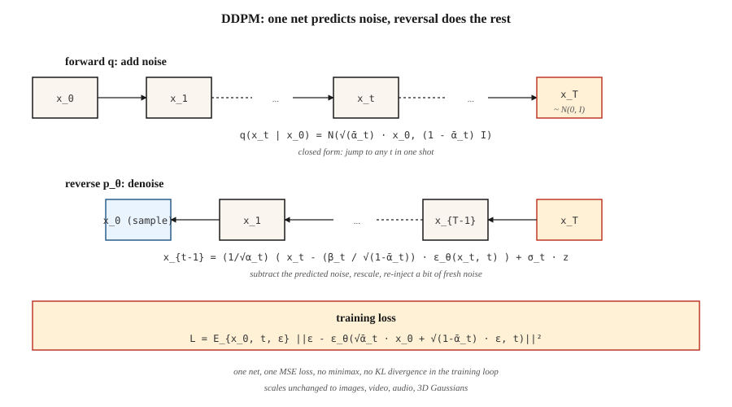

# 扩散模型 —— 从零实现 DDPM

> Ho、Jain、Abbeel(2020)给了这个领域一份戒不掉的配方:用一千小步噪声把数据毁掉,训练一个神经网络预测噪声,推理时把过程倒放。今天,所有主流图像、视频、3D 和音乐模型都跑在这个循环上——可能再叠一层 flow matching 或一致性技巧。

**类型:** 动手构建
**编程语言:** Python
**前置要求:** 第 3 阶段第 02 课(反向传播)、第 8 阶段第 02 课(VAE)
**预计耗时:** 约 75 分钟

## 问题

你要一个 `p_data(x)` 的采样器。GAN 玩的是经常发散的极小极大博弈;VAE 的高斯解码器产出模糊样本。你真正想要的训练目标是:(a) 单一稳定的损失(没有鞍点,没有极小极大);(b) `log p(x)` 的下界(这样你有似然);(c) 样本质量达到 SOTA。

Sohl-Dickstein et al.(2015)给过理论答案:定义一条马尔可夫链 `q(x_t | x_{t-1})` 逐渐加高斯噪声,训练反向链 `p_θ(x_{t-1} | x_t)` 去噪。Ho、Jain、Abbeel(2020)证明损失可以简化成一行——预测噪声——并把数学收拾干净。2020 年它还是个新奇玩意,2021 年产出 SOTA 样本,2022 年变成 Stable Diffusion,2026 年它是地基。

## 概念



**前向过程 `q`。** 分 `T` 小步加高斯噪声。闭式解——数学上可行的原因——在于累计步也是高斯:

```
q(x_t | x_0) = N( sqrt(α̅_t) · x_0,  (1 - α̅_t) · I )
```

其中 `α̅_t = ∏_{s=1..t} (1 - β_s)`,`β_t` 来自某个调度。让 `β_t` 在 T=1000 步内从 1e-4 线性涨到 0.02,`x_T` 就约等于 `N(0, I)`。

**反向过程 `p_θ`。** 学一个神经网络 `ε_θ(x_t, t)`,预测当初加入的噪声。给定 `x_t`,去噪:

```
x_{t-1} = (1 / sqrt(α_t)) · ( x_t - (β_t / sqrt(1 - α̅_t)) · ε_θ(x_t, t) )  +  σ_t · z
```

`σ_t` 取 `sqrt(β_t)` 或可学习方差。式子难看,但只是代数——由后验 `q(x_{t-1} | x_t, x_0)` 解出 `x_{t-1}`,再把 `x_0` 替换成噪声预测估计值。

**训练损失。**

```
L_simple = E_{x_0, t, ε} [ || ε - ε_θ( sqrt(α̅_t) · x_0 + sqrt(1 - α̅_t) · ε,  t ) ||² ]
```

从数据采 `x_0`,随机选 `t`,采 `ε ~ N(0, I)`,用闭式一步算出带噪 `x_t`,对噪声做回归。一个损失,没有极小极大,没有 KL,没有重参数化花招。

**采样。** 从 `x_T ~ N(0, I)` 起步,把反向步从 `t = T` 迭代到 `1`。收工。

## 为什么有效

三种直觉:

1. **去噪容易,生成难。** `t=T` 时数据是纯噪声,网络解的是 trivial 问题;`t=0` 时网络只需擦净几个像素;中间 `t` 问题难,但每个噪声水平的梯度都流过同一组权重。

2. **换皮的分数匹配。** Vincent(2011)证明,预测噪声等价于估计 `∇_x log q(x_t | x_0)`——即*分数*(score)。反向 SDE 用这个分数沿密度梯度向上走:一场被引导向高概率区域的随机游走。

3. **ELBO 化简成朴素 MSE。** 完整的变分下界每个时间步有一个 KL 项。在 DDPM 的参数化下,这些 KL 项化简成带特定系数的噪声预测 MSE;Ho 把系数扔了(称之为 "simple" 损失),质量反而*更好*。

```figure
diffusion-denoise
```

## 动手构建

`code/main.py` 实现 1 维 DDPM。数据是双峰混合,"网络"是个迷你 MLP,输入 `(x_t, t)`,输出预测噪声。训练就是那一行损失,采样迭代反向链。

### 第 1 步:前向调度(闭式)

```python
betas = [1e-4 + (0.02 - 1e-4) * t / (T - 1) for t in range(T)]
alphas = [1 - b for b in betas]
alpha_bars = []
cum = 1.0
for a in alphas:
    cum *= a
    alpha_bars.append(cum)
```

### 第 2 步:一步采出 `x_t`

```python
def forward_sample(x0, t, alpha_bars, rng):
    a_bar = alpha_bars[t]
    eps = rng.gauss(0, 1)
    x_t = math.sqrt(a_bar) * x0 + math.sqrt(1 - a_bar) * eps
    return x_t, eps
```

### 第 3 步:一个训练步

```python
def train_step(x0, model, alpha_bars, rng):
    t = rng.randrange(T)
    x_t, eps = forward_sample(x0, t, alpha_bars, rng)
    eps_hat = model_forward(model, x_t, t)
    loss = (eps - eps_hat) ** 2
    return loss, gradient_step(model, ...)
```

### 第 4 步:反向采样

```python
def sample(model, alpha_bars, T, rng):
    x = rng.gauss(0, 1)
    for t in range(T - 1, -1, -1):
        eps_hat = model_forward(model, x, t)
        beta_t = 1 - alphas[t]
        x = (x - beta_t / math.sqrt(1 - alpha_bars[t]) * eps_hat) / math.sqrt(alphas[t])
        if t > 0:
            x += math.sqrt(beta_t) * rng.gauss(0, 1)
    return x
```

1 维问题、40 个时间步、24 单元 MLP,约 200 个 epoch 就能学会双峰混合。

## 时间条件化

网络需要知道自己在给哪个时间步去噪。两种标准做法:

- **正弦嵌入。** 与 Transformer 位置编码同理。`embed(t) = [sin(t/ω_0), cos(t/ω_0), sin(t/ω_1), ...]`。过一个 MLP,广播进网络。
- **FiLM / group-norm 条件化。** 把嵌入投影成每个 block 的逐通道 scale/bias(FiLM)。

玩具代码用 正弦 → 拼接;生产 U-Net 用 FiLM。

## 陷阱

- **调度影响很大。** 线性 `β` 是 DDPM 默认,但余弦调度(Nichol & Dhariwal, 2021)同等算力下 FID 更好。质量停滞就换调度。
- **时间步嵌入很脆弱。** 把 `t` 当原始浮点传入,玩具 1 维可行,图像上必挂;永远用正经嵌入。
- **v 预测 vs ε 预测。** 在极端区间(t 很小或很大),`ε` 的信噪比很差。v 预测(`v = α·ε - σ·x`)更稳;SDXL、SD3、Flux 都用它。
- **Classifier-free guidance。** 推理时同时算条件与无条件 `ε`,然后 `ε_cfg = (1 + w) · ε_cond - w · ε_uncond`,`w ≈ 3-7`。第 08 课详讲。
- **1000 步太多。** 生产用 DDIM(20–50 步)、DPM-Solver(10–20 步)或蒸馏(1–4 步)。见第 12 课。

## 投入使用

| 角色 | 2026 年典型技术栈 |
|------|-----------------------|
| 图像像素空间扩散(小型、玩具) | DDPM + U-Net |
| 图像潜在扩散 | VAE 编码器 + U-Net 或 DiT(第 07 课) |
| 视频潜在扩散 | 时空 DiT(Sora、Veo、WAN) |
| 音频潜在扩散 | Encodec + 扩散 Transformer |
| 科学计算(分子、蛋白质、物理) | 等变扩散(EDM、RFdiffusion、AlphaFold3) |

扩散是通用的生成骨干。flow matching(第 13 课)是 2024–2026 年的竞争者,同等质量下通常在推理速度上胜出。

## 交付

保存 `outputs/skill-diffusion-trainer.md`。技能输入:数据集 + 算力预算;输出:调度(线性/余弦/sigmoid)、预测目标(ε/v/x)、步数、引导强度、采样器家族,以及评估协议。

## 练习

1. **易。** 把 `code/main.py` 里的 T 从 40 改成 10。样本质量(画输出直方图看)退化多少?T 降到多少时双峰结构塌掉?
2. **中。** 从 ε 预测换成 v 预测。重新推导反向步。对比最终样本质量。
3. **难。** 加 classifier-free guidance。以类标签 `c ∈ {0, 1}` 为条件,训练时 10% 概率丢弃它,采样时用 `ε = (1+w)·ε_cond - w·ε_uncond`。在 `w = 0, 1, 3, 7` 下测量条件众数命中率。

## 关键术语

| 术语 | 人们常说的是 | 实际含义是 |
|------|-----------------|-----------------------|
| 前向过程 | "加噪" | 毁掉数据的固定马尔可夫链 `q(x_t \| x_{t-1})`。 |
| 反向过程 | "去噪" | 重建数据的学习链 `p_θ(x_{t-1} \| x_t)`。 |
| β 调度 | "噪声阶梯" | 每步方差;线性、余弦或 sigmoid。 |
| α̅ | "alpha bar" | 连乘积 `∏(1 - β)`;给出从 `x_0` 到 `x_t` 的闭式。 |
| Simple 损失 | "对噪声做 MSE" | `\|\|ε - ε_θ(x_t, t)\|\|²`;一切变分推导最终都化简成它。 |
| ε 预测 | "预测噪声" | 输出是加入的噪声;标准 DDPM。 |
| v 预测 | "预测速度" | 输出 `α·ε - σ·x`;跨 t 数值更稳。 |
| DDPM | "那篇论文" | Ho et al. 2020;线性 β、1000 步、U-Net。 |
| DDIM | "确定性采样器" | 非马尔可夫采样器,20–50 步,训练目标相同。 |
| Classifier-free guidance | "CFG" | 混合条件与无条件噪声预测,放大条件强度。 |

## 生产注记:扩散推理是步数问题

DDPM 论文跑 T=1000 个反向步,没有人在生产里这么交付。每个真实推理栈都在三种策略中选一种——每种都能干净地映射到"延迟从哪来"的生产框架:

1. **更快采样器,模型不动。** DDIM(20–50 步)、DPM-Solver++(10–20)、UniPC(8–16)。反向循环即插即用替换,训好的 `ε_θ` 权重不碰。延迟降 20–50 倍。
2. **蒸馏。** 训一个学生用更少步数追平教师:Progressive Distillation(2 → 1)、Consistency Models(任意 → 1–4)、LCM、SDXL-Turbo、SD3-Turbo。延迟再降 5–10 倍,需要重训。
3. **缓存与编译。** `torch.compile(unet, mode="reduce-overhead")`、TensorRT-LLM 的扩散后端、`xformers`/SDPA 注意力、bf16 权重。单步延迟再降约 2 倍,可与 (1)(2) 叠加。

生产扩散服务器的预算对话,与生产文献描述 LLM 的方式相同:延迟 = `步数 × 单步成本 + VAE解码`,吞吐 = `批次大小 × (步数 × 单步成本)^-1`。TTFT 很小(一步);TPOT 的对应物就是完整响应时间,因为从用户视角,图像生成是"一次性全给"的。

## 延伸阅读

- [Sohl-Dickstein et al. (2015). Deep Unsupervised Learning using Nonequilibrium Thermodynamics](https://arxiv.org/abs/1503.03585) — 扩散论文,超前于它的时代。
- [Ho, Jain, Abbeel (2020). Denoising Diffusion Probabilistic Models](https://arxiv.org/abs/2006.11239) — DDPM。
- [Song, Meng, Ermon (2021). Denoising Diffusion Implicit Models](https://arxiv.org/abs/2010.02502) — DDIM,更少步数。
- [Nichol & Dhariwal (2021). Improved DDPM](https://arxiv.org/abs/2102.09672) — 余弦调度、可学习方差。
- [Dhariwal & Nichol (2021). Diffusion Models Beat GANs on Image Synthesis](https://arxiv.org/abs/2105.05233) — 分类器引导。
- [Ho & Salimans (2022). Classifier-Free Diffusion Guidance](https://arxiv.org/abs/2207.12598) — CFG。
- [Karras et al. (2022). Elucidating the Design Space of Diffusion-Based Generative Models (EDM)](https://arxiv.org/abs/2206.00364) — 统一记号,最干净的配方。
